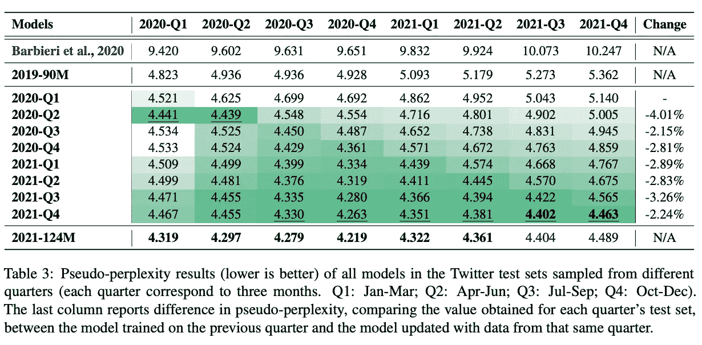
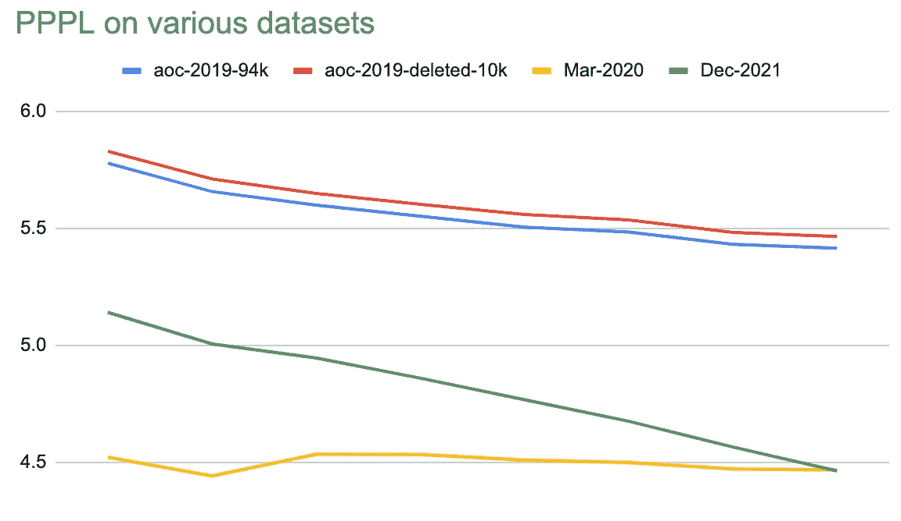

# 时序语言模型逻辑

> 原文：<https://medium.com/mlearning-ai/chronological-language-model-logic-bd590d49911f?source=collection_archive---------10----------------------->

一组研究人员最近发表了 [TimeLMs](https://arxiv.org/abs/2202.03829) ，这是一篇论文和一系列对 2020 年和 2021 年每个季度的推文进行训练的模型。这篇论文很有说服力，用一个漂亮的渐变表格说明了语言模型在训练后是如何老化的:

“最新的语言模型”是我[在 2020 年](/swlh/patching-pre-trained-language-models-28ed6ea8b0bc?source=user_profile---------52-------------------------------)写的一个话题，有类似的 covid 时代的例子，但在 2021 年未能进入 BigScience，尽管我的想法是模糊地“修补”模型。这篇论文是这个领域最好的论文之一(也值得注意:[注意差距:评估神经语言模型中的时间概括](https://arxiv.org/abs/2102.01951)和[时间对语言处理任务的预训练模型的影响](https://arxiv.org/abs/2111.12790))。

# TimeLMs 是如何持续改进的？

TimeLMs 的概念是捕捉随时间演变的语言(本文中显示的一个非 covid 示例是‘Squid Game’取代了其他的‘Game’短语)。这是最新的(12/2021) TimeLM 模型在最近的推文中胜过 03/2020 模型的原因吗？

作者表明，最新模型在 03/2020 验证集*上的表现也略好于在其他 03/2020 推文中训练的模型*。作者将此归因于:“**更新的模型也在更多时间段内根据更多数据进行训练**”。实验设计中的这一怪癖使得证明时间变化变得困难。

我分叉了 TimeLM 代码[以使用非学术 Twitter API](https://github.com/mapmeld/timelms) ，下载了一小组 02/2022 的推文，并针对每个时间顺序模型进行了测试。仅仅从这个小样本中，我很高兴地测量出每一个更接近现在的模型在伪困惑(PPPL)方面的改进。
接下来，我针对 AOC 回复的数据集运行了每个 TimeLM 模型，这些数据集是我在 2019 年 春季 ***从 Twitter 上收集的。我仍然看到每个新型号的改进——大约一半的效果，但它确实存在。***

除了论文中提到的改变语言和训练数据集的因素，我还担心推特会衰落 T2。当研究人员使用 API 下载“旧”推文时，他们只获得了今天可见的推文。季度基准测试与这个问题无关，因为训练集和验证集同样会衰减。但如果这一理论是正确的，那么旧的和新的推文流对于“旧的”TimeLM 模型来说都将非常困难，如果我们对它们进行过滤的话，就像 2019 年或当今的例子一样。

# 如果你能看到我:消失的推文

我决定测量隐藏的推文(删除、暂停、私有化等)与平均值相比，在时间上是否有更大的变化。幸运的是，AOC 回复数据集有大量有毒的、隐藏的推文和账户。

我使用一个脚本将 110 万条推文分成 95 条一批，并发送到 Twitter `/statuses/lookup.json`端点。当 API 响应缺少 id 时，我们可以将它们放在“隐藏”类别中。大约 **40%** 的推文已经无法访问，这是如此重要的一部分，以至于我担心它无法与原文区分开来。Twitter 对我进行了速率限制，在 TimeLM 重复数据删除和其他预处理之后，我留下了大约 10k 隐藏的和大约 16k 可见的推文。

the AOC datasets have a higher PPPL and less steep drop; since-deleted Tweets track the norm

*   隐藏的推文从略高于完整数据集的 PPPL 开始。**预测质量从可见到隐藏的变化类似于使用 2-3 个季度前的模型**。
*   隐藏的推文不太容易预测，但**这种差距是一致的**并且最新的(12/2021)模型没有显示出任何优势。
*   删除的或有害的推文可能在训练中代表性不足，并且被 TimeLM 模型预测不足，但是**不会**以某种方式删除导致这些模型中的时间变化。
*   我没有做太多的调查，但如果我们使用 AOC 数据集作为基线，有证据表明，最近季度模型的改进只有 1/3 到 1/2 来自于额外数据或时间的培训。

 [## Mlearning.ai 提交建议

### 如何成为 Mlearning.ai 上的作家

medium.com](/mlearning-ai/mlearning-ai-submission-suggestions-b51e2b130bfb) 

🔵 [**成为作家**](/mlearning-ai/mlearning-ai-submission-suggestions-b51e2b130bfb)