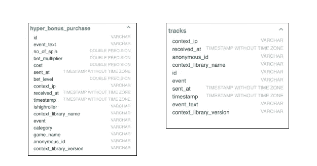
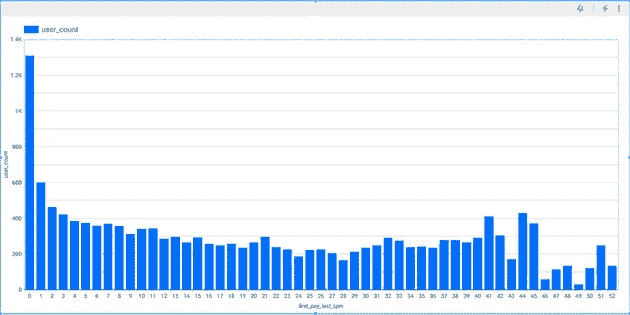
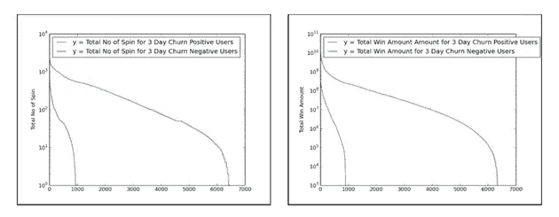
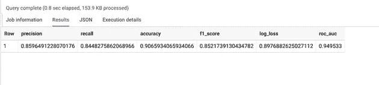
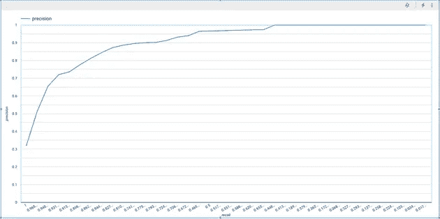
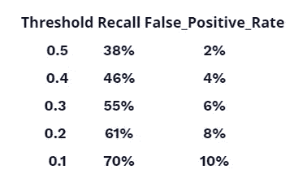

# 使用 BigQueryML 的流失预测

> 原文：<https://medium.com/mlearning-ai/churn-prediction-using-bigqueryml-8a869fa636c9?source=collection_archive---------1----------------------->


有很多博客都在使用 scikit-learn、R 或其他高级 ML 工具包来构建流失预测模型。然而，他们中的大多数都需要强大的工程和数据科学技能。也就是说，现在可以利用 SQL 和数据科学的基本知识，通过利用谷歌等公司开发的工具来实现机器学习的民主化，来创建健壮的模型。

在本帖中，我们将使用 Google 的 BigQueryML 以及使用 RudderStack 平台收集和交付的点击流数据。该数据表示与移动娱乐场游戏相关联的事件，例如老虎机旋转。这种情况下的数据量是典型的，正如我们将看到的，执行流失分析既容易访问又高效，而不必在基础架构上花费大量资金。

# 什么是客户流失，我们为什么关注它

客户流失是任何消费业务的问题，无论是电子商务还是手机游戏。它的定义很简单——每当客户停止与你的公司做生意或停止购买你的产品时，就会发生流失。失去客户的**影响**不仅仅导致**收入损失**。**获客**的**成本**可以从几块钱到几十块钱不等；因此，失去一个客户也意味着对投资回报的负面影响。

客户流失可能有多种原因，包括但不限于:

*   劣质产品质量
*   不满意的客户服务
*   消费者失去兴趣(尤其是游戏)
*   只是产品本身的性质

不可能总是识别和控制这些因素，但是跟踪和尝试理解导致客户流失的因素是很重要的。这可以为产品和整体业务战略提供信息，还可以优化客户获取和支持等流程。

> **不过，我们不会进入这场辩论。我们之所以考虑这种特殊情况，是因为数据的数量和类型是我们想要执行的分析类型的绝佳候选。此外，它使我们能够探索不同的复杂工具和技术来完成这项工作。**

出于这篇博客的目的，我们将纯粹从预测的角度分析点击流数据——根据用户的应用内行为，我们能多准确、多快地预测用户是否会流失。我们可以使用相同的设置来预测其他领域的任何类型的流失。

# 数据捕获和设置交付基础设施

对于我们的用例，手机游戏集成了 RudderStack 的 [**Unity SDK**](https://github.com/rudderlabs/rudder-sdk-unity) 用于生成事件。这些事件然后被发送到 RudderStack 的开源数据平面，从那里它们被路由到 Google BigQuery 进行进一步分析。

我们将所有由 RudderStack 路由的事件存储在 **BigQuery** 中的 **track** 表中，并将整个 JSON 有效负载作为一列。此外，我们还为每种事件类型创建单独的表，以事件属性作为列。这很重要，因为通过这种方式，如果需要的话，我们可以访问整个事件，利用 BigQuery 对半结构化数据的出色支持。我们还可以通过基于事件时间划分数据来优化 BigQuery 的使用。这允许我们优化查询执行时间和成本。

下图演示了在 BigQuery 中创建的两个表示例，一个用于特定事件类型，另一个用于所有事件:



**左:特定事件类型的 BigQuery 表< br >右:所有事件的 BigQuery 表**

如上所述，特定事件的表包含特定于该事件的属性，而第二个表包含与事件无关的信息。这两个表可以通过`id`字段链接。

RudderStack 自动进行模式管理。它基于事件结构创建表模式，并在新字段添加到事件 JSON 或现有字段的数据类型发生变化时保持表模式更新。这种方法可以最大限度地利用数据仓库，而不必担心数据管道是否损坏。它还可以确保您的仓库始终是最新的。

# 探索性数据分析和流失预测策略

构建任何 ML 模型的第一步是围绕您正在处理的数据建立直觉。BigQuery 非常适合这个目的，因为它允许您通过其控制台对数据运行任意查询，并快速浏览它们，而不必依赖复杂的外部工具。当然，如果需要更复杂的分析，可以将 BigQuery 实例连接到各种第三方工具。

为了定义客户流失率，我们使用下图——该图显示了首次付款和客户流失率之间的天数分布。虽然不可能知道是否有人真的发生了变动，但我们假设**七天不活动**是发生变动的标准。我们基于从游戏产品经理那里得到的反馈做出这个假设，同时考虑到这个特定行业对流失的更广泛理解。对于这个游戏(以及其他大部分游戏)，人们一般都很活跃，一天玩好几次。如果在某个时候他们离开游戏——虽然他们可能会回来——普遍的共识是，用户不活动的时间越长，他们回来的可能性就越小。考虑到这个因素，七天的不活动是用我们的数据调查客户流失的一个很好的起点。



**客户首次付款和最后一次旋转之间的天数分布**

正如最初观察到的，绝大多数人在第一次付款后的几天内就离开了。

# 流失预测策略

减少客户流失的最简单的方法是在几天不活动后发出要约或其他东西。然而，这种方法并不是最好的。如果我们选择太低的门槛，我们将给出太多的优惠。另一方面，如果我们等得太久，用户早就走了，甚至可能卸载了游戏。目标是以非常高的准确度预测某人是否会在之前**流失。因此，问题是，我们如何通过整合准确的客户流失预测模型来优化这种方法？**

我们将在本博客的其余部分尝试回答这个问题。我们将尝试预测某人是否会在付款后的三天内流失。这意味着，第一次购买/支付日期和最后一次登录事件日期之间的天数为**三天或更少**的人被标记为**流失阳性**。否则，它们被标记为**流失阴性**。目标是预测某人在付费的一天内是否是积极的——因为大多数用户那时仍然是活跃的，可以参与其中。

# 客户流失预测的特征工程

经过初步的探索性分析后，是时候开始构建客户流失预测模型了。为此，需要定义一组用于训练模型的数据维度或特征。特征工程介于艺术和科学之间，因为需要对数据和商业案例的直觉。在我们的案例中，我们与游戏的产品经理进行了一次“面谈”,他了解数据和问题陈述。这允许我们为我们的任务选择一组定义良好的数据特征。

在与游戏产品经理交谈后，发现以下特征与预测客户流失相关:

*   **coin_balance:** 如果有人剩下很多硬币，他们更有可能继续玩游戏。
*   **total _ bet/total _ win/total _ spins:**更活跃的人通常是更铁杆的玩家，因此不太可能流失。通过对用户所有“旋转”事件的数量/数目求和，可以确定下注/获胜或旋转的总数或计数
*   **number_of_distinct_games** :和上面类似，玩游戏多的人更有可能留下来。
*   赢得随机累积奖金的人更有可能感觉积极，从而继续下去。
*   **胜率(total_win/total_bet):** 和上面类似，赢的多的人不容易流失。
*   **signup_to_first_pay:** 注册后立即付费的人很可能是更铁杆的玩家，不太可能流失。花很长时间付款的人可能是业余爱好者，更有可能在付款后流失。

# 验证功能

为了验证这些特性的选择，我们执行了一些进一步的探索性数据分析。举例来说，下图显示了搅动器和非搅动器之间这些特征的分布。为此，我们比较了上面提到的一些功能，如总投注额、总旋转数、总赢款等。对于流失积极和流失消极的用户。

很明显，搅拌者的行为与不搅拌者大相径庭。下面生成的图表仅针对其中一种情况，即 **total_jackpot** 的数量以及流失和未流失人员之间的差异。



**流失客户和非流失客户的特征分布**

这些特性图是通过 SQL 转储数据并使用 matplotlib 绘图生成的(尽管可以使用任何其他绘图解决方案)。

一般来说，发现流失积极用户的值的范围与流失消极用户的值的范围相比在明显更窄的范围内变化。

# 使用 BigQueryML 构建客户流失预测模型

基于我们已经确定的特征，现在是时候建立客户流失预测模型了。我们将使用 Google BigQuery 来做到这一点。

# 步骤 1:创建训练集

第一步是通过生成所有要素并将它们合并到一个视图中来生成数据集。

计算特征需要以下步骤:

*   查找特定于用户的事件日期。比如他们第一次报名的时间，第一次付款的时间，最后一天的活动等等。如上所述，RudderStack 维护一个包含所有事件的跟踪表，因此映射这些活动实质上就是在**跟踪**表中查找特定事件发生的日期。 **RANK()** 函数非常方便，它让我们将一个单调递增的数字 *rank* 与每个用户的每次事件关联起来。

查询如下所示:

```
CREATE TABLE FIRST_REV_DATE_TABLE AS 
     SELECT
     anonymous_id, rev_date as first_rev_date
 FROM
     ( 
     SELECT anonymous_id,     
         DATE_TRUNC('d', sent_at) as rev_date,
         RANK() OVER (PARTITION by anonymous_id ORDER BY sent_at DESC) as rank,
     FROM
                RUDDER.track
     WHERE
               event=’revenue’         
     )
 WHERE
    rank = 1
```

其他特定于日期的表，如`SIGNUP_DATE_TABLE`(第一次活动的日期)、`LAST_SPIN_DATE_TABLE`(用户的最后一次旋转)可以类似地计算。

*   使用上面的数据表，可以计算出这些特征。例如，要找到注册和`first_rev`之间的旋转次数，必须加入`RUDDER.spin`、`SIGNUP_DATE_TABLE`和`LAST_SPIN_DATE_TABLE`。`RUDDER.spin` table 是 RudderStack 创建的事件专用表。查询如下所示:

```
CREATE TABLE NUM_OF_SPINS AS 
SELECT anonymous_id
     SUM(RUDDER.spin.no_of_spins) as no_of_spins
FROM 
     SIGNUP_DATE_TABLE, 
     FIRST_REV_DATE_TABLE,
     RUDDER.spin table
WHERE
     SIGNUP_DATE_TABLE.anonymous_id = RUDDER.spin_table.anonymous_id
     AND SIGNUP_DATE_TABLE.anonymous_id = RUDDER.spin_table.anonymous_id
     AND FIRST_REV_DATE.first_rev_date >= RUDDER.spin_table.sent_at
GROUP BY anonymous_id
```

*   下一步是计算标签列。如果`LAST_SPIN_DATE`和`FIRST_PAY_DATE`之间的差值为 **< = 3 天**和 **7 天**(流失阈值)，则用户已经流失了 3 天。这也是一个连接`FIRST_REV_DATE`和`LAST_SPIN_DATE`的简单 SQL 查询。这被添加为另一个表 3_day_churn。
*   最后，所有这些功能可以通过跨越`anonymous_id`合并成一个巨大的功能。

# 步骤 2:构建模型

现在，通过选择和生成我们需要的所有数据特征，我们已经有了最终的数据集，是时候使用 BigQuery ML 直接从我们的数据仓库中构建模型了。BigQuery ML 支持仅使用 SQL 构建机器学习模型。这大大简化了模型构建迭代和最终部署。

目前，BigQuery ML 仅支持一些基本模型，如逻辑和线性回归，但不支持 NBD/帕累托(通常对流失最有效)。然而，这里的目标是展示如何在数据仓库中使用 SQL 快速构建和操作 ML 模型。

以下查询显示了如何在 BigQueryML 中生成模型。

```
CREATE OR REPLACE MODEL `BigQueryMLModelOPTIONS (model_type='LOGISTIC_REG',auto_class_weights=TRUE,data_split_method='NO_SPLIT', input_label_cols=['within_3_days'],max_iterations = 15) AS SELECT anonymous_id,first_spin_to_first_pay,total_jackpot,total_bet,total_win,total_spins, number_of_distinct_games, event_count,coin_balance,SUM_WIN_BY_BET, within_3_daysFROM '3DAY_CHURN_MODEL_ALL_FEATURES'WHERE dataframe = 'training'
```

上面的查询使用包含所有用户的所有特征值的表中的数据创建了一个**逻辑回归**模型。该模型自动分配类权重。我们指导训练过程不要将数据分成训练和测试数据集，因为在数据准备阶段已经完成了。此外，我们只选择用于训练的数据作为模型训练过程的输入。**标签**栏的名称也已经指定。根据用户是流失积极还是流失消极，列`within_3_days`被标记为真或假。还指定了训练迭代或步骤的最大数量。

我们运行以下查询来评估我们的模型:

```
SELECT * FROM ML.EVALUATE (MODEL `BigQueryMLModel`, 
   (SELECT Anonymous_id,first_spin_to_first_pay,total_jackpot,total_bet,total_win,total_spins, number_of_distinct_games, event_count,coin_balance,SUM_WIN_BY_BET, within_3_days
    FROM `3DAY_CHURN_MODEL_ALL_FEATURES`
    WHERE dataframe = 'test’
    )
 )
```

上述查询从包含所有用户的所有功能的数据中获取测试数据集，评估模型性能。基本上，模型将考虑所有其他特征来预测`within_3_days`列的值。然后，我们将预测值与实际值进行比较，以计算模型性能统计数据。

# 分析流失预测模型的性能

我们获得了该模型的以下性能指标:



召回率对精确度的 ROC 曲线如下所示:



当我们比较模型对用户的预测时，我们的期望是模型应该预测尽可能多的用户可能的流失。换句话说——模型应该能够正确地****召回**相关用户的类。该模型实现了 84%的召回率，这是值得称赞的。这是因为导出的特征和选择的算法本质上非常简单。**

**重要的是，该模型能够识别实际上会流失的用户。同时，它不会错误地识别出不会流失的用户也很重要。这种错误的影响可能从浪费激励，从而降低投资回报率，到激怒用户。回到我们的用例，这意味着模型为测试数据集中的任一类预测的值应该在尽可能多的情况下与实际值相匹配。这个指标叫做**精度**，也比较高，接近 86%。这是相当好的，再次考虑到我们的是一个非常简单的模型。**

# **样本外测试**

**除上述之外，我们还执行样本外测试。这实质上是对不属于训练或评估过程的记录进行预测。但是，我们知道这些数据的流失状态。换句话说，它是“看不见的”数据。这种情况下的预测准确性给出了模型在生产中表现如何的合理的好主意。**

**在我们的例子中，我们检查样本外测试的假阳性/假阴性率。我们将这些数字记录在表格中，如下所示:**

****

**当一个模型进行预测时，它还会为它预测的每个类别关联一个正确的**概率**或**置信度**。对于 0.1%或 10%的阈值，以大于或等于 10%的置信度预测为特定用户的类别-召回率为 70%，假阳性率为 10%。这意味着该模型正确地将实际产生了的**用户中的 **70%** 识别为流失候选人。没有流失**的用户**中只有 **10%** 被**错误地分类为流失候选。******

# **结论**

**根据我们进行的模型构建练习，有几个关键的观察和收获:**

*   **从性能指标来看，流失预测模型作为一个初始项目表现得相当不错。模型的输出应该让产品经理满意。因此，我们肯定可以通过在生产中部署该模型来运行各种活动。**
*   **更多的数据积累将需要定期刷新模型。**
*   **执行**主成分分析**可以产生更好的结果，而不是仅仅依靠领域知识进行特征选择。**

**除了上述观察结果，我们还可以研究支持更复杂的模型构建流程的替代分析平台，包括对**自定义评估函数**的支持。**

# **免费注册并开始发送数据**

**测试我们的事件流、ELT 和反向 ETL 管道。使用我们的 HTTP 源在不到 5 分钟的时间内发送数据，或者在您的网站或应用程序中安装我们 12 个 SDK 中的一个。[入门](https://app.rudderlabs.com/signup?type=freetrial)。**

****本博客原载于**[**https://rudder stack . com/blog/churn-prediction-using-bigqueryml**](https://rudderstack.com/blog/churn-prediction-using-bigqueryml)**。****