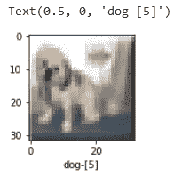
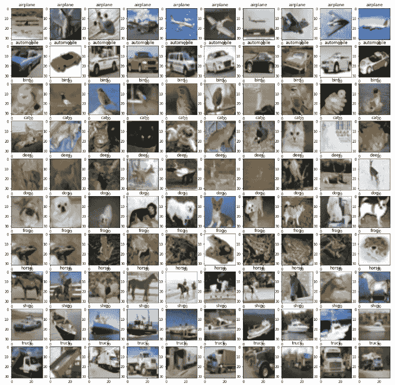
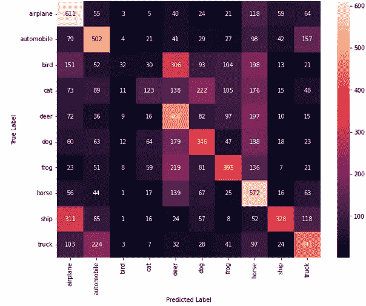
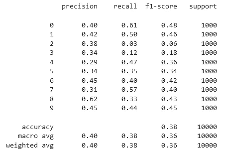
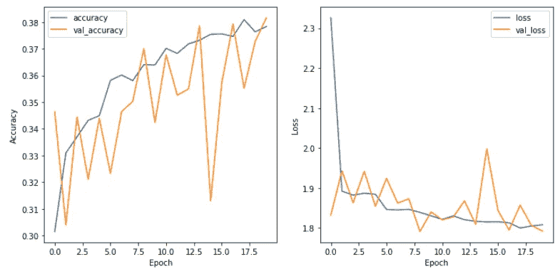
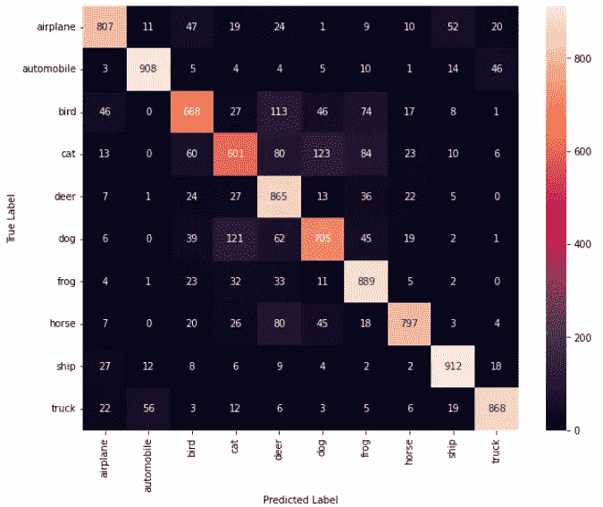
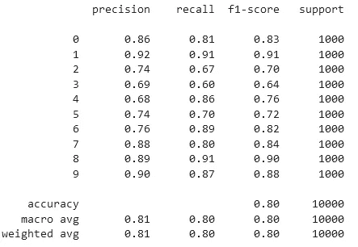
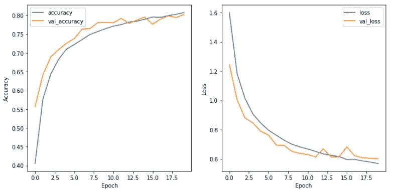

# CIFAR-10 图像分类:线性模型与 CNN

> 原文：<https://medium.com/mlearning-ai/cifar-10-image-classification-linear-model-vs-cnn-e1596ec2be26?source=collection_archive---------1----------------------->

由于跨多个平台(如 ResNet 和 MobileNet)的算法和架构的显著改进以及数据的可用性，计算机视觉应用在过去十年中一直在急剧增长。

在本文中，我想分享我使用流行的 CIFAR-10 数据集在图像多类分类任务上实现卷积神经网络(CNN)的情况。目标是仅使用 20 个历元实现良好的宏观精度(至少 80%)。还显示了与简单线性模型的比较，以帮助理解 CNN 在这种类型的机器学习中如何优越得多。

## 一.导言和数据探索

首先，CIFAR-10 包含 60000 幅 32x32 像素的 RGB 彩色图像和 10 个类别。每个类有 6000 个图像，其中 5000 个属于训练集，1000 个属于测试集。

首先，我们应该导入所有必需的库。数据集可以很容易地从 Keras 导入到我们的 Jupyter 笔记本中。

类名按以下顺序排列:

`label_names = ['airplane', 'automobile', 'bird, 'cat', 'deer', 'dog', 'frog', 'horse', 'ship', 'truck']`

我们可以通过以下代码随机检查每张图片及其标签。这次返回的图像是一只狗(标签索引= 5)



我们可以更进一步，看一看每一类中的 10 个随机图像，并将它们绘制在一个轴上。如图所示，在每一行上，显示了每一类的 10 个随机图像。



## 二。数据预处理

预处理图像数据的常用方法是将 RGB 值归一化 255。接下来是对响应变量(类标签)的一次性编码。

```
x_train = train_images/255
x_test = test_images/255
y_train_onehot = to_categorical(train_labels)
y_test_onehot = to_categorical(test_labels)
```

## 三。线性模型

首先，让我们尝试一个简单的具有 20 个时期的密集线性模型。这相当于没有指定任何非线性激活函数的密集网络。输出图层正在使用 softmax 执行多类分类任务。这里我使用任意数量的层(1000)来测试性能。我们可以使用 Keras 中的顺序 API 来实现这个架构。

下面的混淆矩阵说明了模型的性能。



此外，我们可以打印出分类报告来查看特定类别的性能，并输出每个时期的精度/损失进度。



从报告和图中可以看出，准确性相当差。鸟类(类别=2)是预测最错误的，召回率非常低(高假阴性)，其次是猫(类别= 3)。它们都经常被错误地归类为其他动物，如狗(类别= 5)、鹿(类别= 4)、马(类别 7)，导致其精确度非常低(高假阳性)。同样可以观察到许多马和鸟类被错误地归类为鹿。

这可能是因为它们属于相似的颜色(RGB 通道中接近的数字)，导致线性模型做出相似的分类。线性模型无法从边缘等其他低层特征和其他高层特征中学习，无法很好地进行分类。

## 三。美国有线新闻网；卷积神经网络

现在，让我们尝试一个 CNN 架构，看看它是否更适合这个任务。以下测试的架构受 VGG-16(替代 conv-最大池、3x3 内核、步幅 1x1“相同”填充)的启发，并通过使用以下来源的丢弃层进行了修改:

[](https://www.analyticsvidhya.com/blog/2020/02/learn-image-classification-cnn-convolutional-neural-networks-3-datasets/) [## CNN 图像分类|使用 CNN 的图像分类

### 卷积神经网络(CNN)——深度学习最近突破和发展背后的概念。CNNs

www.analyticsvidhya.com](https://www.analyticsvidhya.com/blog/2020/02/learn-image-classification-cnn-convolutional-neural-networks-3-datasets/) 

在混淆矩阵的帮助下，我们清楚地看到了巨大的改进，因为大多数对角线值更接近 1000，这意味着大多数预测的标签与实际标签非常一致。

同样，让我们更深入地看看分类报告和准确性/损失图表。



在这里，我们可以看到 CNN 模型在所有类别中都表现得很好，提高了召回率和精确度。猫-狗-鹿-鸟仍然是最混乱的类别，但是已经实现了重要的真实分类。此外，val-精度和 val-损耗曲线显示，随着运行更多的时期，有显著的改善，并且如果运行更多的时期，显示出潜在的改善(还不是平稳期)。

## 四。结论

总之，这个小项目让我更好地理解了 CNN 等现代机器学习技术如何彻底改变我们日常生活的数字世界。我希望收到反馈和评论，以改进我未来的项目。非常感谢您的阅读！

[](/mlearning-ai/mlearning-ai-submission-suggestions-b51e2b130bfb) [## Mlearning.ai 提交建议

### 如何成为 Mlearning.ai 上的作家

medium.com](/mlearning-ai/mlearning-ai-submission-suggestions-b51e2b130bfb)