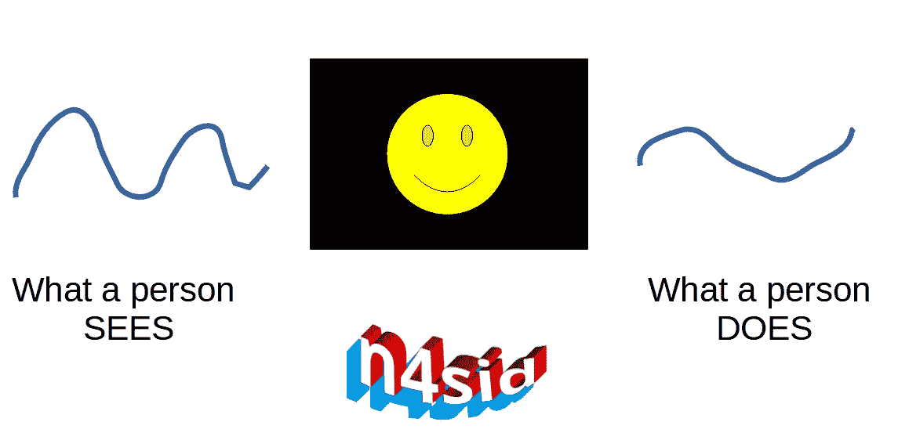
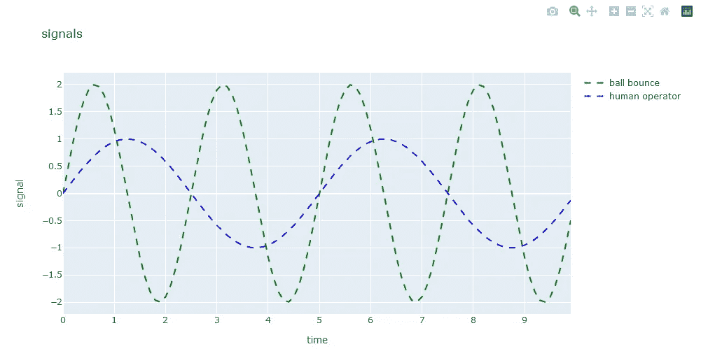
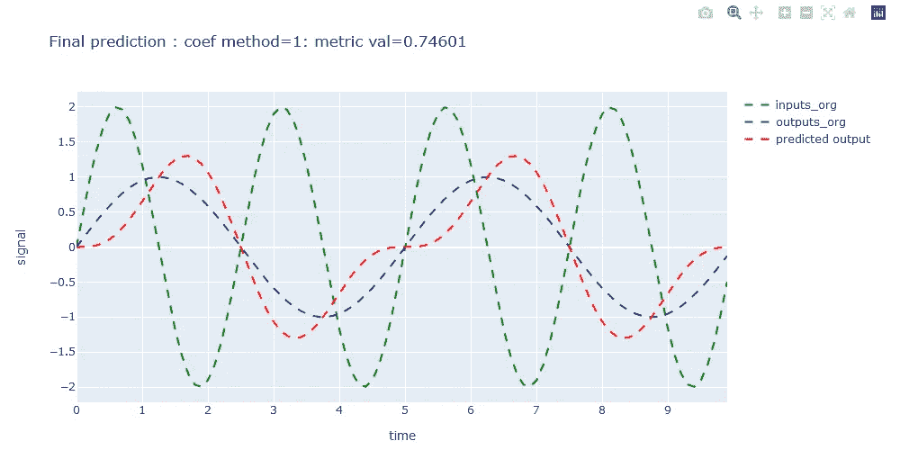

# n4sid 和机器学习的经典人在回路跟踪

> 原文：<https://medium.com/mlearning-ai/classic-human-in-the-loop-tracking-with-n4sid-and-machine-learning-7a7c2654f16b?source=collection_archive---------2----------------------->

我很少看关于系统识别和机器学习的文章。当我学习系统辨识时，它有点像控制理论中不太令人兴奋的表亲，不像最优控制理论那样令人兴奋，而是一种实用的数值工具。

经典的人在回路跟踪问题，如如何模拟操作员的行为，可以通过使用一种称为 n4sid 的“黑盒”建模算法来模拟，该算法根据操作员看到的信息和他们做的信息来预测操作员的行为。人看到的信号被认为是输入，人执行的信号被认为是输出。n4sid 将输入投影到输出，这称为传递函数矩阵，以便识别和估计重要的 ode 系数，从而创建表示人类如何使用视觉信息来产生输出的模型。

想想机器学习和 n4sid，ML 回归模型可以用来预测同样的人类操作员行为，其中的特征是人所见和所做的巧妙混合。

在这篇文章中，我将从数值和状态空间控制理论的角度概述 n4sid 模型是如何工作的。这个公式可能不会像 MATLAB 的 n4sid 函数那样给出精确的结果，因为我估计 ode 的方式，但是步骤是正确的；在 github[https://github.com/j622amilah/n4sid_prediction](https://github.com/j622amilah/n4sid_prediction)随意看看我的 n4sid 构造。n4sid 有许多不同的公式，最流行的公式是从矩阵分析和状态空间控制理论的角度(伦纳特·荣的用户系统识别理论)。

# 创建输入和输出信号

让我们说，一个人类操作员看到一个球像输入信号一样在计算机屏幕上反弹，他们试图复制相同的球反弹轨迹，并创建输出信号。然后，我们希望建立一个模型，描述人类如何根据原始球的反弹来复制反弹的球，以便我们可以测试人类是否可以复制其他球的反弹轨迹，而不必在现实生活中再次测试操作员。

在下图中，球弹跳中的绿线和蓝线是复制弹跳球的操作员。

# 步骤 1:归一化系数预测的输入和输出信号

# 步骤 2:估计投影系数

在这一步中，我们将输入点(u(s))映射到输出点(y(s))。

y(s) = g(s)u(s)
其中 g(s)= h1*s^-1+h2*s^-2+h3*s^-3+…+hn*s^-n

投影不是将先前的输入点乘以一个标量来获得未来的输出点。投影是通过一些标量来扩张/拉伸每个输入点，并将它们相加得到每个输出点。

我们使用马尔可夫参数来计算汉克尔矩阵参数，它是传递函数矩阵(g(s))的系数；以上表示为 h1，h2，…，hN，合称为 H。h 是汉克尔矩阵的第一行，它们是马尔可夫参数，汉克尔矩阵是求解 h1，h2，…，hN 投影系数的另一种方法。

# 步骤 3:将幂级数(投影系数)转换成传递函数

将系数转化为状态空间/传递函数形式，我们假设传递函数阶为二阶，我们使用已经证明的标准可控形式数值方法将幂级数转化为传递函数。有其他方法可以做到这一点，但使用规范的可控形式是直接的。

求解完
出来:[(T00，

T01，

-(T01 * T03—T02 * * 2)/(T00 * T02—T01 * * 2)，

(T00 * T03—T01 * T02)/(T00 * T02—T01 * * 2)

)]

这些是根据状态空间
b1 = T00 的二阶传递函数的系数

b2 = T01

a3 =-(T01 * T03—T02 * * 2)/(T00 * T02—T01 * * 2)

a4 =(T00 * T03—T01 * T02)/(T00 * T02—T01 * * 2)

我们将在下面看到它们！下面不是真正的工作代码，而是理解算法如何工作的重要代码片段。

# 步骤 4:调整几个参数以找到最佳拟合传递函数预测模型

# 成功:让我们看看是否合适

将所有四个步骤放入一个函数中，参见 github，我们可以测试所有可能的调谐参数组合，并找到可以使用输入信号预测输出的最佳模型。

这里我们可以看到，该函数找到了一个模型，该模型可以预测 R 平方等于 0.75 的输出，其中 R 平方=1 是完美预测。因此，模型拟合并不完美，但在预测人类操作可以做什么方面也不太差。

我认为 n4sid 可以用来寻找机器学习特征之间的因果关系。如果拟合度很差，意味着不太可能找到连接输入和输出的常微分方程。因此，输入和输出很可能由不同的过程产生，或者输入不会导致输出的发生。这就是非因果关系的定义。

经过这次讨论，希望大家和我一样享受 n4sid

 [## Mlearning.ai 提交建议

### 如何成为 Mlearning.ai 上的作家

medium.com](/mlearning-ai/mlearning-ai-submission-suggestions-b51e2b130bfb)