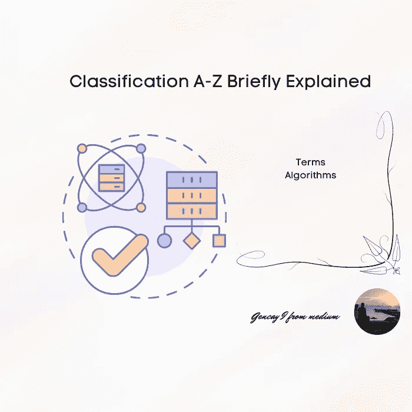

# 分类 A-Z 简要说明

> 原文：<https://medium.com/mlearning-ai/classification-a-z-briefly-explained-25ca811ab4e4?source=collection_archive---------2----------------------->

## 人工智能大三大四学生提醒备忘单



Image by Author

```
**Contents Table
·** [**Introduction**](#ff18)
  ∘ [Statistics A-Z](#70f4) 
  ∘ [Regression A-Z](#09de)
**·** [**Terms**](#e921)
  ∘ [Classification](#af8d)
  ∘ [Binary Classifier](#d32c)
  ∘ [Multiclass Classifier](#b759)
  ∘ [Ovo](#e52a)
  ∘ [Ovr](#8209)
  ∘ [Confusion Matrix](#6715)
  ∘ [Precision](#091e)
  ∘ [Recall](#445d)
  ∘ [Precision/Recall](#0c02)
  ∘ [F Score](#b692)
  ∘ [Roc Curve](#af86)
**·** [**Algorithms used for Classification**](#11b1)
  ∘ [Logistic Regression](#f603)
  ∘ [Decision](#f3be)…
```