# 分类算法 1:逻辑回归第一部分

> 原文：<https://medium.com/mlearning-ai/classification-algorithms-1-logistic-regression-part-1-a2b0dab31b5a?source=collection_archive---------9----------------------->

萨提亚·克里希南·苏雷什

**简介:**
逻辑回归是一种监督机器学习分类算法，它很简单，在分类问题上表现得非常好。它已被用于天气、疾病预测、自然语言处理中的情感分析等。这里我们试着理解一下逻辑回归。

**定义:**
在我开始谈论逻辑回归之前，理解构成逻辑回归基础的某些术语是很重要的。
**Logit 函数:**
Logit 函数是赔率的对数。让我们假设‘p’是事件发生的概率。那么有利于事件发生的几率就是“p”与“1-p”的比值。

Logit function

logit 函数接受 0–1 范围内的值，并输出一个实数值。

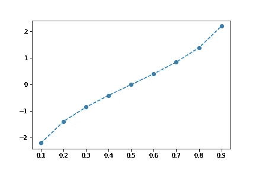

**Sigmoid 函数:** Sigmoid 函数，也叫 logistic sigmoid 函数，是构成 logistic 回归核心的函数。与其定义它，我来展示一下 sigmoid 函数的方程。

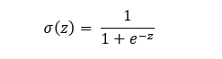

sigmoid function

sigmoid 函数接受一个实数值，并将其压缩到 0 到 1 之间。这个函数非常重要，因为它是逻辑回归的激活函数，并且它还赋予算法预测事件概率的能力，这是我们用 Adaline 或感知器无法做到的。

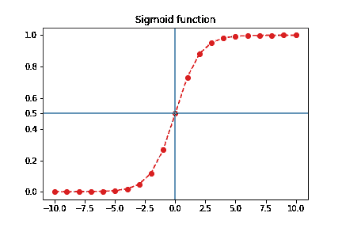

从上图可以看出，sigmoid 函数将输入压缩到 0 到 1 之间。

**最大似然函数:** 最大似然函数是逻辑回归的代价函数。这个函数的定义是高度统计性的，理解这个定义对有效地实现逻辑回归模型没有影响。让我们看看函数的方程，然后进入逻辑回归。

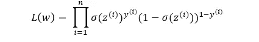

Likelihood function

**逻辑回归:** 首先让我来定义一下逻辑回归——逻辑回归是一种分类算法，它可以通过对净输入函数产生的输出应用 sigmoid 函数来预测属于某个类的概率(我在以前的文章中已经谈到过净输入函数)。

上面的定义以及本文前面给出的函数定义是实现逻辑回归所需要的。我们来一个一个的过逻辑回归的算法。

起点是净输入函数。网络输入函数接收样本向量并给出一个实数值，我们可以**将其与 logit 函数**等同，因为 logit 函数也输出一个实数值。

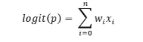

既然我们已经使 logit 函数与净输入相等，我们可以得到概率‘p’。

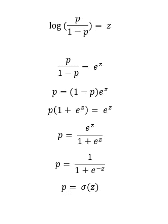

从上面的推导中，我们推断概率“p”就是净输入的 sigmoid 函数。但是 p 是什么的概率呢？“p”是类别 1 的概率。该等式通常如下所示，但为了简单起见，我省略了这一部分。

;

对于给定的“x”特征，上述等式被解读为样本向量“x”属于样本类 1(y = 1)的概率。在此基础上，我们建立了逻辑回归模型的激活函数模型。

现在我们来谈谈成本函数。成本函数是最大似然函数，但是以其原始形式使用它将在计算上是昂贵的。通过简单地对方程应用自然对数，降低了计算复杂度。

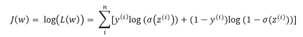

Log likelihood

上述方程被称为对数似然函数，逻辑回归模型将试图使用梯度上升优化技术使其最大化。但是因为我们已经熟悉了梯度下降，我们想在这里应用同样的技术。通过简单地将等式乘以负号，可以将上述等式修改为使用梯度下降。

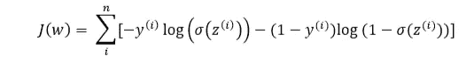

Negative log likelihood

上面给出的是逻辑回归成本函数的最终形式。现在让我们试着插入 y 的值。

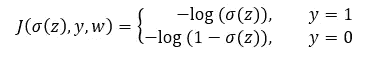

为了更清楚地理解上面的等式，让我们把它画出来。

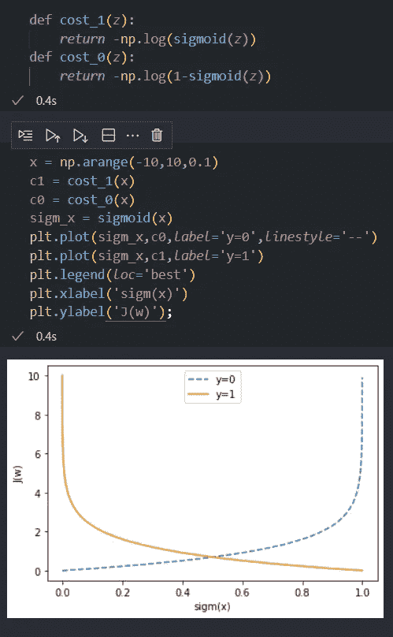

从上面的图中，需要注意的重要事情是，当属于一个类别的概率被正确预测时，成本函数具有非常低的值，但是当它被错误预测时，成本函数呈指数增长。这就是为什么逻辑回归是如此有效的算法，因为它允许你打开引擎盖，看看它的工作机制。

**逻辑回归的实现:**

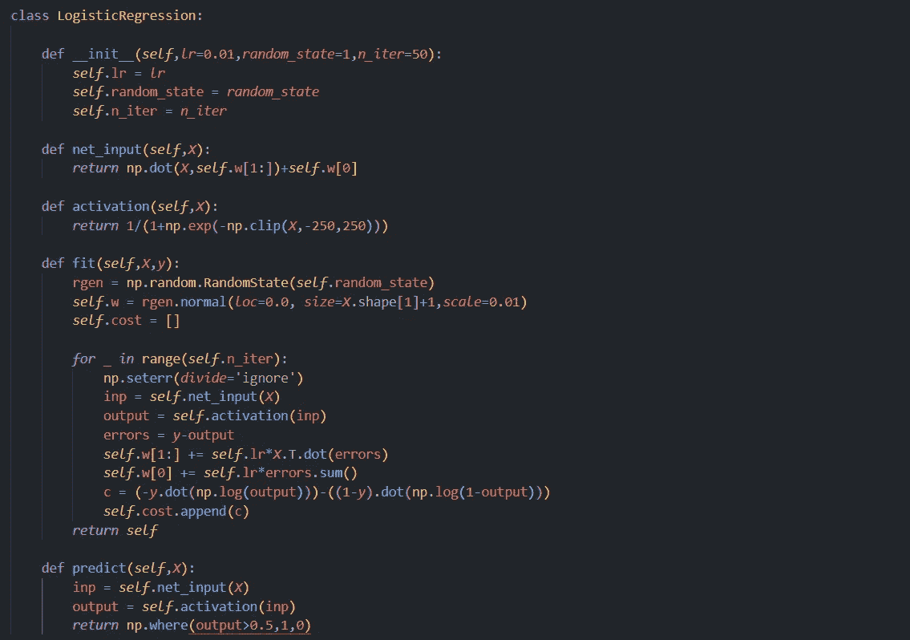

上面的逻辑回归实现包含了我在本文中讨论的所有内容。该代码与 Adaline 实现的代码非常相似，因为 Adaline 和逻辑回归仅在激活和成本函数上有所不同。上面代码中的激活函数是 sigmoid 函数，代价函数是负对数似然函数。另一个需要注意的重要事情是 predict 函数，每当激活函数的值大于或等于 0.5 时，它都返回 1。这可以从本文前面给出的 sigmoid 函数图中理解。您可以将 0.5 视为阈值，超过该阈值，特征向量将属于我们预测概率的类别。

**结论:**

在第一部分中，我们已经讨论了逻辑回归背后的理论。在第 2 部分中，我将展示逻辑回归的 scikit-learn 实现以及超参数调优。但是下一篇文章将是关于“ML 在定制网站设计中的应用”。我希望你在写这篇文章的时候和我一样开心。鼓掌，订阅，留言评论。

 [## Mlearning.ai 提交建议

### 如何成为 Mlearning.ai 上的作家

medium.com](/mlearning-ai/mlearning-ai-submission-suggestions-b51e2b130bfb)