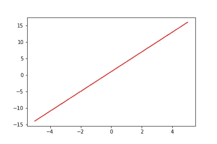
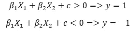
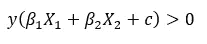
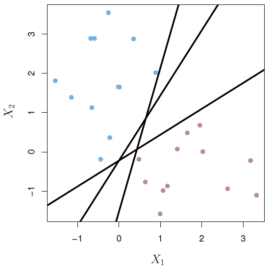
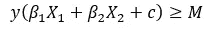
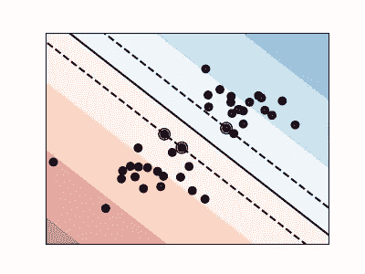
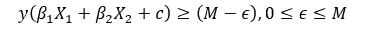
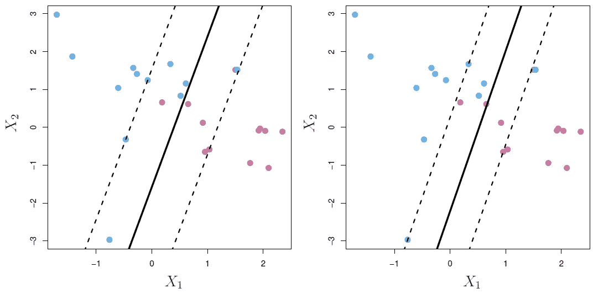
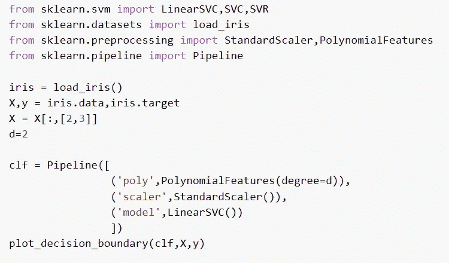
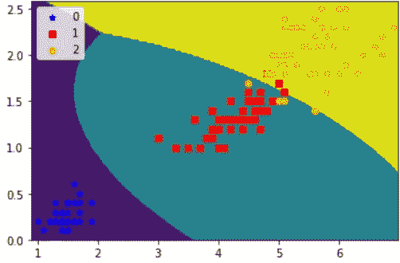

# 分类算法 2-支持向量机

> 原文：<https://medium.com/mlearning-ai/classification-algorithms-2-support-vector-machine-3fba8f1c9534?source=collection_archive---------5----------------------->

萨提亚·克里希南·苏雷什

**简介:**
支持向量机是一种流行的机器学习算法，由 Vladimir N. Vapnik 和 Alexey Ya 发明。1963 年的切尔沃嫩基斯。它在今天的工业中被大量使用，它被用于分类和回归。在本文中，我们将关注以下主题
1。超平面
2。最大间隔分类器
3。软边缘分类器
4。sci kit-learn SVM 的实现
本文仅涵盖了解 SVM 所需的基本概念。像内核和内核技巧这样更重要的话题将在我的下一篇文章中讨论。

**超平面:** 在 N 维空间中，超平面是(N-1)维平坦仿射。例如，在一维空间中，一个点是超平面，在二维空间中，一条线是超平面，等等。

上图中的红线是超平面。基本上，一个超平面将 N 维空间一分为二。

用于分类的超平面是使用以下等式构建的

这两个控制方程可以合并成一个方程。

Source: ISLRv2

超平面可以用作分类器。在上图中，可以使用三个超平面。但是，当新的看不见的数据被输入分类器时，这三种方法可能都不能很好地推广。选择一个泛化能力好的超平面的问题导致了最大间隔分类器的发展。

**最大间隔分类器:**
对于一个线性可分的数据集，可能有许多分离超平面，但我们需要一个也能很好地推广新数据的分离超平面。一个显而易见的选择是超平面，它位于两个类的分离中心。超平面与超平面两侧最近点之间的距离构成了边界。

最大间隔分类器的控制方程类似于超平面的控制方程，其中进行了小的修改以包括间隔。

上式中的‘m’是任一侧最近点与超平面之间的距离。控制方程根据最近点的距离改变超平面的方向。

Source: [Plot SVM Margin](https://scikit-learn.org/stable/auto_examples/svm/plot_svm_margin.html)

上图显示了最大间隔分类器的样子。虚线是距离“M”处的边距。分类器将不允许任何点落在边界内(可以从控制方程中推断)。位于页边距上的点被称为“支持向量”，因为它们本质上定义了页边距。

最大间隔分类器有两个问题。首先，它只适用于可线性分离的类。第二，对离群值非常敏感。假设上图中的红色数据点位于蓝色阵营，最大间隔分类器将很难对其进行分类，即使分类也不会很好地进行概括。

**软间隔分类器:**
为了克服与最大间隔分类器相关的问题，开发了软间隔分类器。顾名思义，软边界分类器允许很少的错误分类，但是这些错误分类必须在边界内。

错误分类的数量可以通过改变页边空白的宽度来控制。通过引入称为ε的新参数来控制余量的宽度。再一次，控制方程必须被修改，这一次允许错误分类。

Source: ISLRv2

根据新参数的值，页边距的宽度将发生变化。在上面的第一个图中，ε的值是 0.01，而在第二个图中，ε的值是 0.2。该参数可用于正则化模型。

**Scikit-learn 实现:** 尽管像内核技巧这样更重要的概念还没有被讨论，SVM 的实现并不需要用户了解它们。所以让我们来看看 SVM 的 [scikit-learn](https://scikit-learn.org/stable/) 实现。

代码片段的第一行导入了 SVM 的分类和回归类。然后我导入了 SVM 需要的其他类来提高性能。SVM 需要对其输入进行缩放，因此需要进口标准缩放器。为了对非线性数据使用 LinearSVC，需要将数据转换为更高次的多项式，并为此引入了多项式功能。最后到管道，流程管道已经导入。已使用虹膜数据集。上面代码片段的输出如下所示。

该图显示了 LinearSVC 如何通过显示决策边界来分类这三个类别。要了解更多关于“绘图 _ 决策 _ 边界”函数的信息，请看下面的 repo- [“低调-ML”](https://github.com/SathyaKrishnan1211/Low-key-ML)。

**结语:**
SVM 的基础知识在本文中已经有所涉及。更重要的 SVM 的数学概念将在下一篇文章中与其他文章的 scikit-learn 实现一起讨论。我希望你在写这篇文章的时候和我一样开心。鼓掌，订阅，留言评论。

 [## Mlearning.ai 提交建议

### 如何成为 Mlearning.ai 上的作家

medium.com](/mlearning-ai/mlearning-ai-submission-suggestions-b51e2b130bfb)