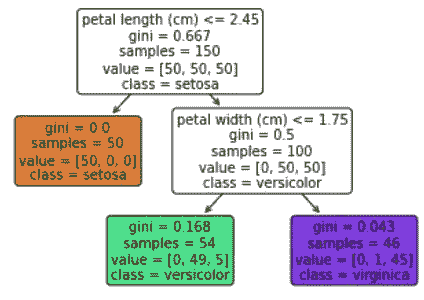
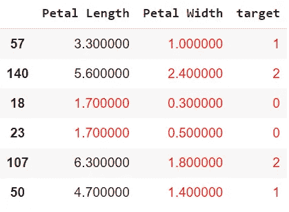
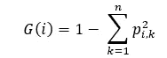
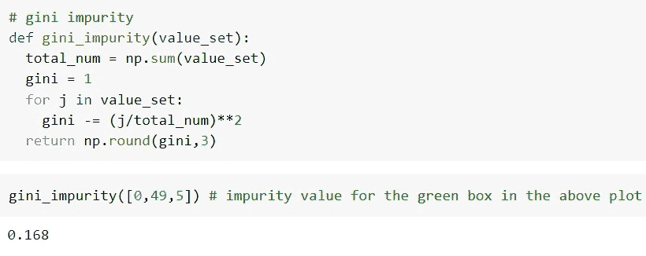
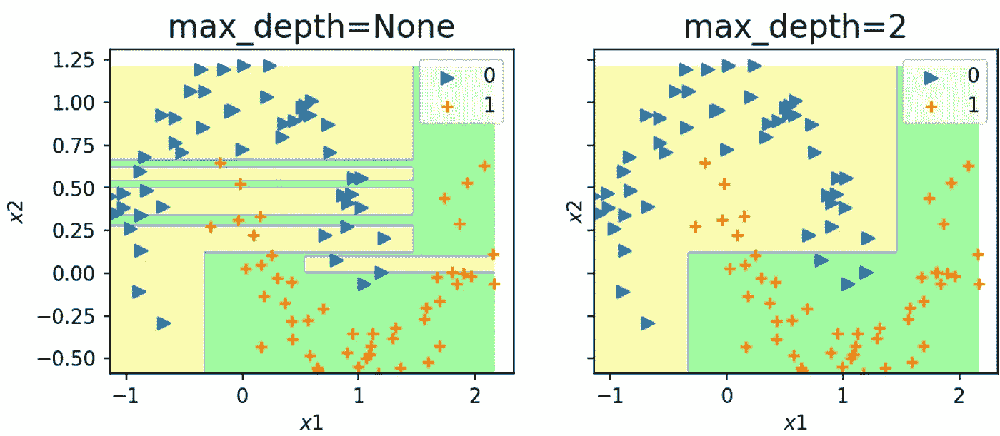
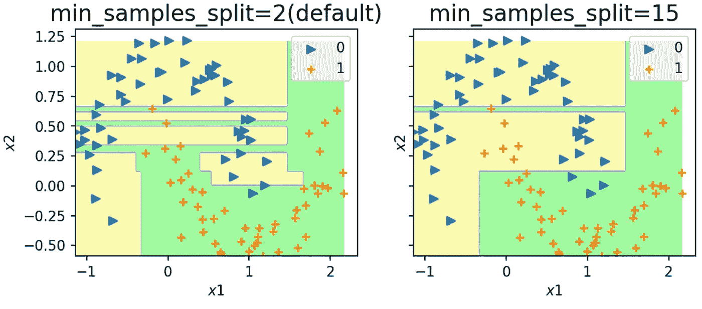
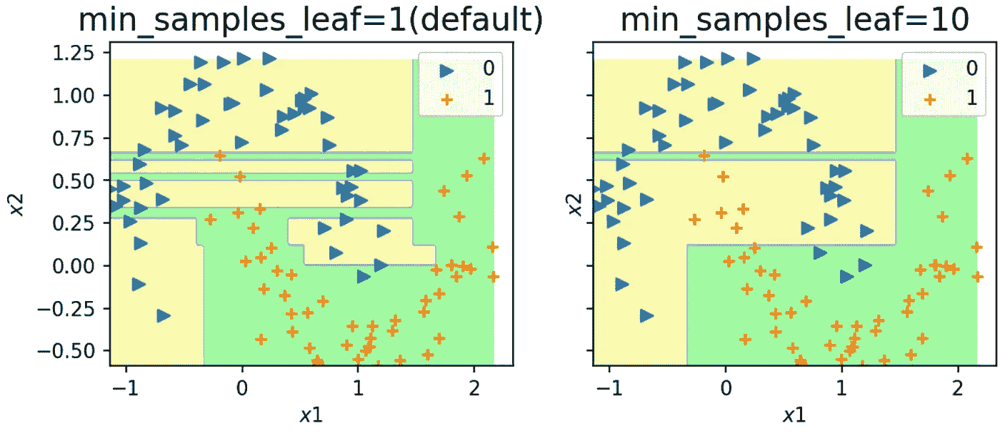

# 分类算法-3:决策树

> 原文：<https://medium.com/mlearning-ai/classification-algorithms-3-decision-tree-801d59011780?source=collection_archive---------9----------------------->

萨提亚·克里希南·苏雷什

决策树分类器是目前最流行的分类算法之一。它功能多样、直观且强大。决策树分类器最大的一个优点就是容易理解。也就是说，让我们来看看本文中决策树算法的工作原理(随文章附带的笔记本可以在这里找到)。

决策树的工作基于它从输入数据中开发或识别的决策。让我们通过一个例子来理解这一点，在这个例子中，我们使用 DT 对虹膜数据集进行分类(仅花瓣宽度和花瓣长度)。看一下下图。

DT with max_depth=2

在上图中，DT 首先根据花瓣长度应小于等于 2.45 的条件对样本进行分类。如果输入向量满足该条件，则它可能属于“setosa”类。我们可以通过查看下面的数据集来确认这一点，我们可以清楚地看到花瓣长度小于 2.45 的样本属于 0 类(setosa)

一旦它将 setosa 完全分类，它就会继续对其他两个类进行分类，但这次是基于“花瓣宽度”特征。如果没有给定 max_depth 值，则 2 DT 将寻找更多的决策边界，直到它可以将单独的组放入单独的叶子中，或者用 DT 术语来说，直到 gini 变为 0。

那么什么是基尼呢？

基尼是节点/叶的杂质的度量。它是决策树形成决策的基础。DT 首先从一个特征中随机选取一个值，这个值也是随机选取的。拾取的值将用于将数据集分成两片，一片叶子包含位于所选值下方的数据点，另一片叶子包含位于所选值上方的数据点。然后使用下面的公式计算叶子的基尼杂质

Gini impurity

上面公式中的 p’是属于该叶的数据点的概率。一旦为叶子计算了基尼值，基尼杂质的加权平均值就成为节点的基尼值。对其他随机选择的值重复上述过程，并选择基尼值最小的值。如果没有提到“max_depth”参数，则重复这个过程，直到所有的叶子只包含一个类，或者如果不能找到新的决策点。

DT 的最大问题之一是，它所形成的判定边界总是与其中一个轴正交，并且它不会形成与该轴成 90 度以外的角度的判定边界。对于可以用简单的有角度的线完成的分割，DT 采用垂直于轴的三或四条线。

DT 的另一个问题是，如果不加检查，它很容易使数据过拟合。DT 有许多正则化参数，我们将研究其中的 3 个。

**正规化:**
1。最大深度
2。最小 _ 样本 _ 分割
3。最小样本叶

1.  max_depth:
    该参数指定 DT 的深度。在 scikit-learn 中，它的缺省值是 None。如果你训练一个具有 max_depth 的 DT 为 None，那么模型将建立一个树，直到叶子包含属于一个特定类的样本，因此，导致过度拟合。要解决这个问题，您可以将 max_depth 参数调整为一个较低的值，以便模型不会过度拟合数据。下面的图比较了具有不同 max_depth 值的两个模型，您可以清楚地看到左侧的模型过拟合，它将无法很好地进行概化，而右侧的模型允许一两个错误分类，它将会很好地进行概化。

max_depth comparison

2.min_samples_split:
有时候，如果一个节点包含 10 个样本，这些样本属于一百万个样本中的两个不同的类，如果没有达到 max_depth 值，DT 仍然会尝试分割那个节点。分割该节点是没有意义的，因为它只是整个训练数据集的一小部分。为了防止这些情况，可以使用 min_samples_split 参数，该参数指定如果要进一步分割节点，节点必须具有的最小样本数。这与 max_depth 结合将大大降低过度拟合的效果。再次制作一个情节来支持上述陈述。

3.min_samples_leaf:
这个超参数来自上面讨论的 min_samples_split。min_samples_leaf 指定了一个叶子必须具有的最小样本数，从而在条件不成立时防止节点分裂。

所有这些正则化方法都被称为“修剪决策树”,因为您正在删除导致过度拟合的节点。

**结论:**
本文讨论了很多概念。看看这篇文章附带的笔记本。我希望你在写这篇文章的时候和我一样开心。鼓掌，订阅，留言评论。

 [## Mlearning.ai 提交建议

### 如何成为 Mlearning.ai 上的作家

medium.com](/mlearning-ai/mlearning-ai-submission-suggestions-b51e2b130bfb)