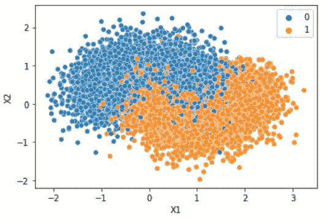
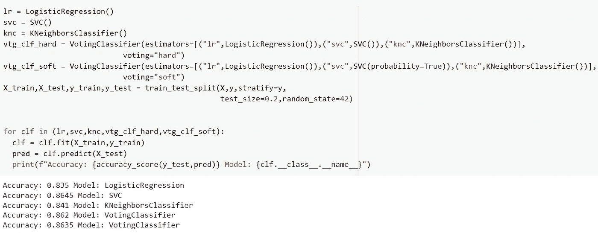
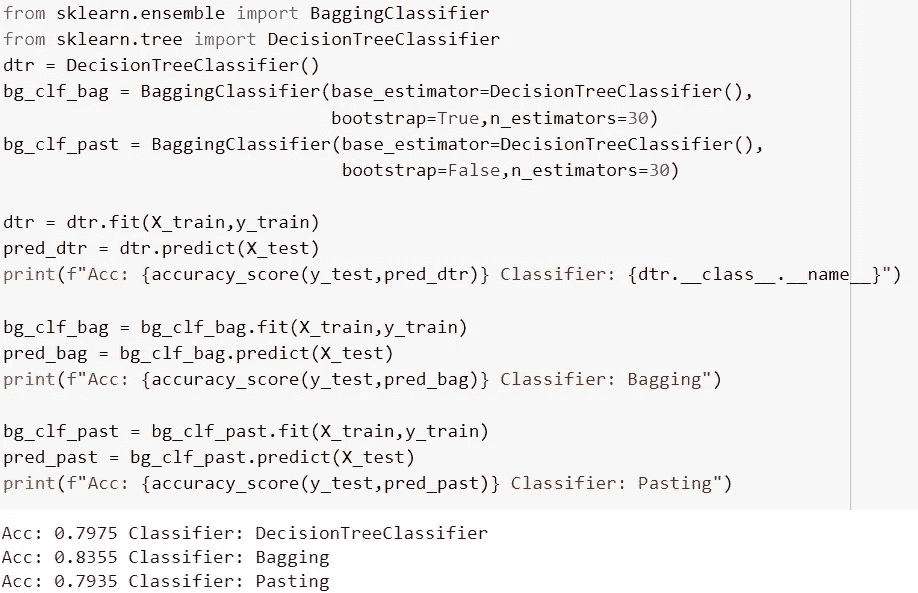
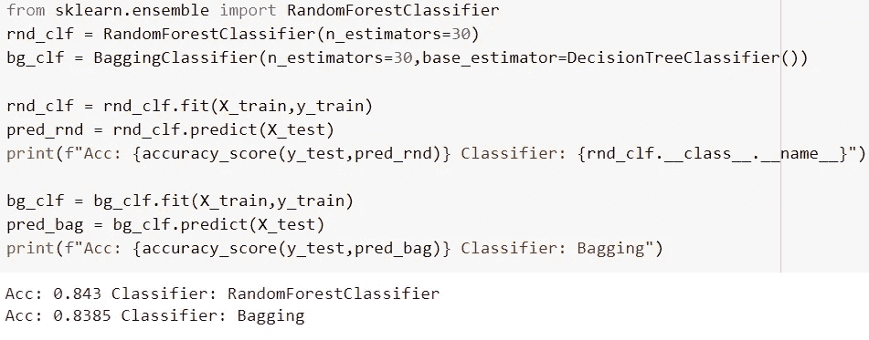
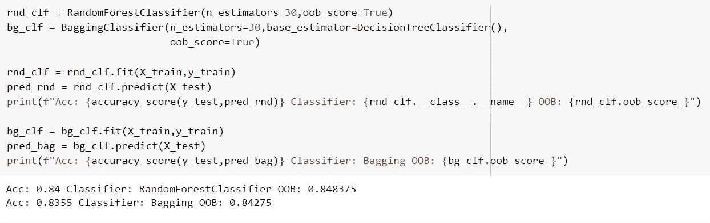

# 分类算法 4:集成模型

> 原文：<https://medium.com/mlearning-ai/classification-algorithms-4-ensemble-models-ceecd5020f19?source=collection_archive---------2----------------------->

萨提亚·克里希南·苏雷什，顺穆加普里亚

在我以前的文章中，展示的模型是独立的模型。但通常情况下，模型的组合会比单独的模型表现得更好。这是因为一种叫做*的群体智慧理论。*它说，从多个预测器获得的预测的集合比单个预测器的预测更准确。组合多个预测值并聚合其预测值的过程称为集成，在此过程中建立的模型称为集成模型。大多数 Kaggle 比赛都是由合奏模特赢得的。在这篇文章中，我们将讨论投票，打包粘贴和随机森林。这是我们将要使用的数据集。这篇文章的代码可以在[这里](https://github.com/SathyaKrishnan1211/Low-key-ML/blob/master/Notebooks/Ensemble_Models.ipynb)找到。

**投票:** 当多个预测器对相同实例进行预测时，投票是选择最常出现的预测或类别的简单过程。所做的预测也可以称为由单个预测器所做的预测的模式。投票有两种类型——硬投票和软投票。当单个模型做出的预测是离散的时，这被称为硬投票，而当做出的预测是概率时，这被称为软投票。软投票通常表现更好，因为它给予概率较高的类更多的重要性，而在硬投票中，重要性仅给予决策阈值。下图显示了如何在 scikit-learn 中实现硬投票和软投票。如你所见，两种投票分类器的性能都优于逻辑回归和 k-neighbors 模型。如前所述，软投票比硬投票表现更好。

**打包粘贴:** 在投票法中，所有的模型都是用相同的数据训练的，因此如果模型相似，它们在某些情况下必然会犯相同的错误。如果每个模型是在不同于其他模型被训练的实例的数据的随机子集上被训练的，那么由所有模型产生的共同错误是无效的。这导致了更多样化的模式。单个模型将具有高偏差但较小的方差，并且当它们被组合以形成集合模型时，得到的模型将具有相似的偏差但较小的方差。单个模型会有很大的偏差，因为它们不是在整个数据上训练的，而是在数据的子集上训练的。

当随机抽样通过替换(引导)完成时，也就是说，一个子集的数据实例可能会重复，这就叫做装袋。如果随机抽样是在没有替换的情况下进行的，则称为粘贴。装袋模型比粘贴模型具有更高的偏差，因为它们不止一次地看到一个实例。打包和粘贴使用单个预测器作为基础模型，并在相同类型的多个模型上训练随机子集。下图显示了如何在 scikit-learn 中实现打包和粘贴。

**随机森林:** 随机森林建立在一个叫做随机子空间的概念上。随机子空间是采样特征而不是采样实例的过程。为了理解为什么对特征进行采样，你必须首先理解[决策树](/mlearning-ai/classification-algorithms-3-decision-tree-801d59011780)是如何工作的。

决策树是使用贪婪算法构建的。贪婪算法的缺点之一是它找到的解是局部最优的，但不是全局最优的。这意味着，它找到了一个接近最优解的解，而不是最优解。当建立决策树时，它首先找到信息增益最高或基尼指数最低的特征和相应的特征阈值。然后对子树做同样的事情。由于决策是在本地做出的，因此不会产生最佳结果。

随机森林通过创建决策树的集合来克服这一缺点，其中每个决策树都是根据随机采样的特征而不是所有特征来训练的。由于这些树是在特征的子集上训练的，所以训练过程很快，并且训练过程也可以并行化。随机森林的实现如下图所示。正如你所看到的，它优于装袋分类器。

当涉及到装袋分类器和随机森林分类器时，不必创建单独的验证集。这是因为当使用替换完成采样时，一些实例可能没有用于训练单个模型。这些实例称为开箱(oob)实例。您可以将这些实例用作验证集，并查看模型在这些实例上的表现。请注意，每个单独的模型的 oob 实例都是不同的。下图显示了如何在 scikit-learn 中获取 oob_score。

**结论:** 在本文中，已经讨论了投票、装袋粘贴和随机森林。在下一篇文章中，我们将讨论 AdaBoost 和 GradientBoost。

 [## Mlearning.ai 提交建议

### 如何成为 Mlearning.ai 上的作家

medium.com](/mlearning-ai/mlearning-ai-submission-suggestions-b51e2b130bfb)