# 分类。

> 原文：<https://medium.com/mlearning-ai/classification-ebbec6cf2cf7?source=collection_archive---------7----------------------->

众所周知，线性回归适用于定性情景，当回答明确时，我们就进行分类。顾名思义，该过程将观察结果分类成组，以便预测定性观察结果。通常，该过程首先预测每个类别进行分类的概率，从而表现得像回归算法。

然而，这种划分并不总是正确的。最小二乘法；线性回归可用于定量反应，另一方面，我们发现逻辑回归用于 2 类定性反应。因为有一个步骤涉及确定分类概率以便进行分类，所以它被称为回归。类似地，K-NN 和 Boosting 可用于定性和定量数据。我们倾向于根据反应是定性的还是定量的来进行分析和模型选择，从而相应地选择线性回归或逻辑回归，然而预测因子的类型不太重要。

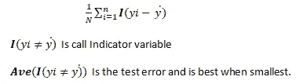

我们可以通过许多方法进行分类和预测。根据数据、最终目标和所涉及的场景，我们可以选择一个。无论我们选择哪种模型，重点都是准确预测。虽然我们仍在设计我们的模型，但确定预测准确性的唯一方法是找出训练数据集上的错误，并在测试数据集上重新验证。量化评估准确性的最常见方法是**训练错误率**，即当我们将评估应用于训练观察时所犯错误的比例。而一个模型的成功是当我们得到**最小测试误差的时候。**

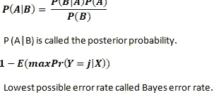

一个这样的分类器是**朴素贝叶斯分类器**。朴素贝叶斯分类器是一类简单的概率分类器，基于贝叶斯定理，特征之间具有很强的独立性。它之所以被称为天真，是因为它假设某个特征的出现独立于另一个特征的出现。当数据集大小适中或较大，并且具有多个属性时，可以使用它。主要标准是实例应该是有条件独立的。

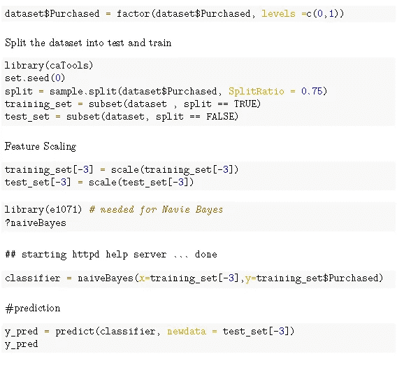

A typical R code to implement Naïve Bayes Classification

现在，执行朴素贝叶斯的步骤仍然是一样的

将数据分成列车-测试

如果需要，进行特征缩放

使朴素贝叶斯适合训练集

预测测试集

执行模型评估。

尽管**易于实现并且给出了好的结果**，但是由于变量之间的条件独立性和实际依赖性，它存在**有时不太准确的问题。**

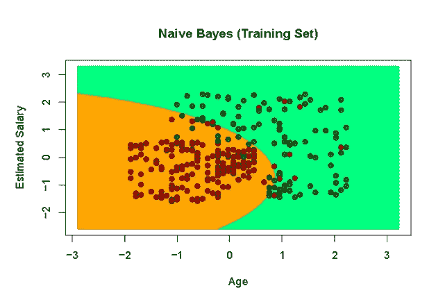

综上所述，我们可以在以下业务场景中使用朴素贝叶斯分类

情绪分析

文件分类

垃圾邮件过滤

将新闻文章分类成小组。

现在可能不总是这样，我们知道给定 X 的 Y 的条件概率，因此不能应用贝叶斯分类。在这种情况下，我们的方法可以是在给定 X 的情况下，尝试估计 Y 的条件分布，然后将给定的观察值分类到具有最高估计概率的类别。 **KNN 或 K-最近邻**正是这样做的。对于给定的整数值 K，KNN 分类器识别训练数据中最接近 x0 的 K 个点。然后我们估计该类的条件概率。因此，我们应用贝叶斯规则，将测试观察分类到具有最高概率的类中。

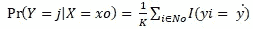

如果我们要实施 KNN 模式，我们会

1.  选择 K 个邻居的数量
2.  根据距离，最好是欧几里德距离，取未知数据点的 K 个最近邻

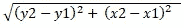

3.在所有这些 K 个邻居中，计算每个类别中的数据点的数量。

4.将新数据点分配到我们可以计算最多邻居的类别中。

显然，关键是选择 K 的**正确值。**在选择 K 的最佳值时，我们需要记住——如果 K 太小，邻域将对噪声点敏感；如果 K 太大，邻域将包含来自其他类的点。

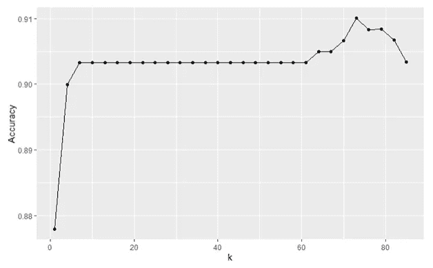

**R** 是一种强大的语言，其中 K 的最佳值可以通过几行代码来确定。对于这个特定的例子，我们看到预测的准确性随着 K 值的增加而增加，但是在 K = 73 之后，准确性再次下降。因此，对于这个特定的例子，K= 73 给出了最好的结果。然而，需要有一点尝试和错误来确定最佳的 k。

需要记住的另一点是**缩放。**可能必须对属性进行缩放，以防止距离测量受任何属性支配。为了避免这种偏差，我们应该将特征变量标准化。KNN 的整个原理基于点与点之间的距离，因此缩放在该模型中至关重要。

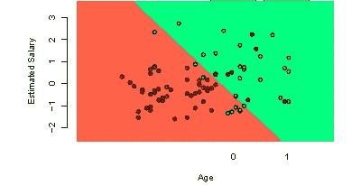

Logistic Regression

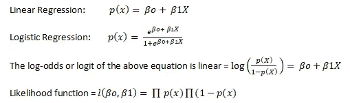

**逻辑回归**是一种非常常见的分类方法，其中我们不是对响应 Y 进行建模，而是尝试对 Y 属于特定类别的概率进行建模。不管 x 的值是多少，逻辑函数总是会产生 S 形的 S 形曲线。对于任何方程，我们都需要估计系数。回归系数是未知的，可以根据可用的训练数据进行估计，最小二乘法是一种常用的方法。然而 ***最大似然*** 是首选方法。

现在，如果类被很好地分开，那么逻辑回归的参数 e 估计结果会有点不稳定。此外，当有两个以上的响应类别时，逻辑回归并不表现最佳；如当 n 很小时的情况，并且预测值的分布在每个类别中近似为正态分布。作为另一种选择 **LDA 或线性判别分析**得到了重视。在 LDA 中，我们分别对每个响应类别中预测值的分布进行建模，然后使用贝叶斯定理将这些预测值转换为估计值。LDA 分类器产生于这样的假设，即每一类中的观察值来自正态分布，并且具有特定于类的平均值和公共方差。

像 LDA 一样，**【QDA】或二次判别分析**也假设高斯分布，但与 LDA 不同，它假设每个类别都有自己的协方差矩阵。如果有 K 个类和 p 个预测器，那么是有效的；LDA 假设所有 K 个类共享基于 p(p+1)/2 个参数的公共协方差矩阵，而 QDA 为总共 K*p(p+1)/2 个参数的每个类估计单独的协方差矩阵。所以 LDA 通过假设一个公共协方差矩阵变成线性的。因此，LDA 是比 QDA 灵活得多的分类器，并且具有较低的方差。这可能会更好地提高预测性能。如果所有 K 个类共享一个公共协方差矩阵的假设严重错误，那么 LDA 将遭受高偏差，这必然有不利的一面。这可能有助于我们假设，如果有较少的培训保守，LDA 可能是一个比 QDA 更好的选择。也就是说，更大的训练规模更适合 QDA。

值得一提的是，像逻辑回归、SVM 这样的方法是适合线性模型的测试；而对于非线性模型，我们更喜欢朴素贝叶斯、KNN、决策树、人工神经网络和随机森林等。

有点上**车型评测**；准确性并不总是模型评估的最佳衡量标准。理想情况下，我们会检查一些标准进行评估

*   AIC —碱性信息标准
*   零偏差和剩余偏差
*   混淆矩阵——准确性、敏感性、特异性
*   ROC——接收器工作特性
*   AUC —曲线下面积

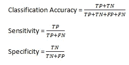

TP = True Positive, TN = True Negative, FP = False Positive, FN = False Negative

准确性本身不应该成为模型被接受的评判标准。敏感性和特异性也很重要。

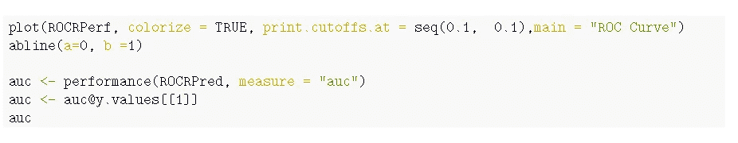

simple R code to determine AUC

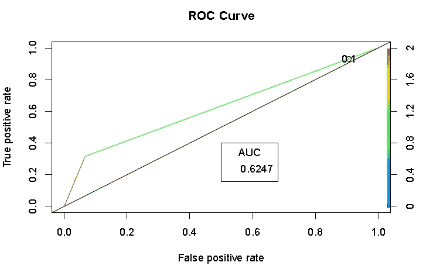

ROC 曲线是一种流行的图形，用于同时显示所有可能阈值的两种类型的误差。ROC 可能不总是给出正确的解释，因此建议查看 AUC。AUC 给出了在所有可能的阈值上总结的分类器的总体性能。AUC 越大，分类器越好。ROC 曲线对于比较不同的分类器也是有用的，因为它们考虑了所有可能的阈值。

如果我们**比较模型**

逻辑回归和 LDA 的不同之处仅在于它们的拟合过程，因此看起来这两种模型可能会给出相同的输出。LDA 假设高斯分布，每个类别中有一个公共协方差矩阵。如果不满足高斯假设，逻辑回归优于 LDA。另一方面，KNN 是一种非参数方法，对决策边界的形状没有任何假设。因此，KNN 优于 LDA 和逻辑回归的一个明显情况是当决策边界复杂和高度非线性时。另一方面，KNN 没有告诉我们重要的预测因素。通过假设二次决策边界和有限数量的训练观察，QDA 充当非参数 KNN 和线性 LDA 方法以及逻辑回归之间的中间地带。还必须记住，在每个实际场景中，没有一种方法能胜过另一种方法。当真正的决策边界是线性的时，那么 LDA 和逻辑回归方法往往表现良好。当边界是中度非线性时，QDA 将是一个更好的选择。对于更复杂的决策边界，非参数方法，如 KNN 将是最好的。