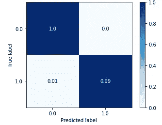
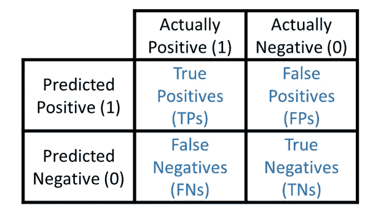
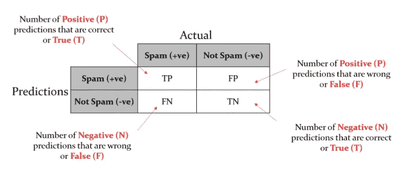
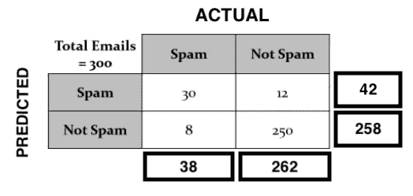
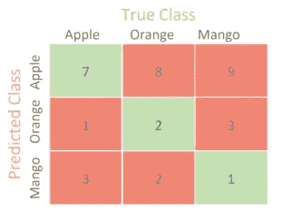
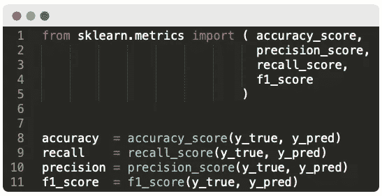
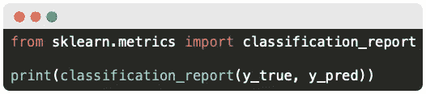
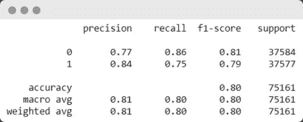

# 评估指标—分类

> 原文：<https://medium.com/mlearning-ai/classification-evaluation-metrics-7c3fe3b0119b?source=collection_archive---------4----------------------->

Years ago when I was backpacking through western Europe…

> 评估指标是让机器学习模型显示它在幕后有多邪恶的东西。

也就是说，分类的评估标准与回归的评估标准有很大的不同。
以上陈述是在牢记阅读本文的人熟悉回归评估度量的基础上做出的。

*老兄，我们很熟悉。现在，继续和我们一起浏览这个帖子，好吗？* 丫没事吧！

**概要:**

1.  什么是评估指标？
2.  为什么分类的评估标准不同于回归
3.  什么是混淆矩阵？
4.  最常用的分类标准是什么？
5.  使用 Python 的分类度量

好吧，让我们开始吧！

# 1.什么是评估指标？

顾名思义，评估指标是评估模型性能的指标。它们为我们提供了一个衡量模型性能的标准。
不同类型的问题——回归、分类、聚类等——评估指标会有所不同。

例如，当我们处理**回归**时，评估度量是我们的模型产生的 ***误差*** 。我所说的误差是指预测点和原始点之间的差异。更简单地说，这意味着我们在告诉'*嘿，这个点将给出 12.5(或其他任意值)的输出时有多准确*
现在有几种方法可以确定这种差异——*MAE、MSE、RMSE 等。，*这取决于问题的类型和计算的难易程度。

同样对于**分类**，评价指标一般是预测标签类别*的 ***准确度*** 。我说的准确性是指我们的预测在所有预测中有多准确。更简单地说，这意味着当我们告诉'*嘿，这个点属于 A 类而不是 b 类时，我们有多精确**

# 2.为什么分类的评价指标与回归的评价指标不同？

这个问题的答案很简单。

由于在回归中，我们预测一个连续值，原始值是连续的，预测也是连续的。现在，由于所有的值都是连续的，预测中的误差也将是连续的。

这么说吧，假设我的 y 预测值( *ÿ)* 是 10.5，我的 y 原始值( *y)* 是 11.7
现在我预测的误差是我的原始值和预测值之差，也就是**即*11.7–10.5 = 1.2
这个值 1.2，就是我的误差*

*嗯，在分类的情况下，由于我们需要预测测试点的类别/类/标签类型，所以预测从来不是连续的。事实上，熟悉分类的聪明读者知道，分类预测一个**离散值**，而回归预测一个**连续值**。*

*这么说吧，假设我的 y-predicted(*【ÿ】)*是 b 类(用 0 表示)，我的 y-original( *y)* 是 a 类(用 1 表示)。那么我预测的误差是***y-ÿ***= 1–0 = 1。
*有意义吗？* 不！！！*

> ***如果我们使用回归指标进行分类，那么预测离散变量(标签、类别、分类)的误差可能是完全错误的(0)或完全正确的(1)** 。不存在部分正确预测或部分错误预测(连续值)的可能性，这在回归分析中是常见的。*

*因此，用于回归的评估度量不能用于分类。*

**嘭！这是一些兴奋剂成分。* 扣起来！，还有更多来了！*

# *3.什么是混淆矩阵？*

**嗯，对于不熟悉这一部分的人来说，这是一个相当费脑筋的问题，所以去喝点咖啡，看看外面休息一下，然后系好安全带！**

*混淆矩阵是每个在学习机器时弄脏了手的人所使用的。它是最流行的性能测量工具。*

**但是，是什么呢？这是一个类似矩阵的东西，以一种非常奇特的方式显示我们的模型做出的预测，这样我们就可以在一幅图像中获得所有的评估指标。我们可以从混淆矩阵中确定的指标有**准确度、真阳性率、真阴性率、假阳性率、错误率、误分类率**等等。**

*下图是你在实践中最常看到的混淆矩阵。它随机填充了值。
大多数无聊的人都用“蓝调”作为色图。不要成为他们中的一员！*

**

***问:那么，让我们以垃圾邮件分类为例。我们必须创建一个模型，将电子邮件分类为垃圾邮件和非垃圾邮件。将**为垃圾邮件的电子邮件视为肯定(1)** ，将**为非垃圾邮件的电子邮件视为否定(0)** 。***

**

*Confusion Matrix for binary classification*

*这也可以如下图所示:*

**

*This image is copied. Well, I think education should be free…*

**我吓坏了兄弟* ~好吧，让我陈述一下使用的术语:*

*   ***TP —真阳性** —邮件是**垃圾邮件** (1)，我们预测为**垃圾邮件** (1)。这意味着，一封电子邮件实际上是垃圾邮件(1)并且被预测为垃圾邮件(1) — **真正的** S **pam** —真正的阳性— **TP** 。*
*   ***TN —真否定** —邮件为**非垃圾邮件** (0)，我们预测为**非垃圾邮件** (0)。这意味着，一封电子邮件实际上不是垃圾邮件(0)，但被预测为非垃圾邮件(0)——**真正的** **非垃圾邮件**——真正的负面——**TN**。*
*   ***FP —误报** —邮件是**不是垃圾邮件** (0)，我们预测为**垃圾邮件** (1)。这意味着，一封电子邮件实际上不是垃圾邮件(0)，而是被预测为垃圾邮件(1) — **误发垃圾邮件** —误报— **FP** 。*
*   ***FN —假阴性** —邮件是**垃圾邮件** (1)，我们预测为**非垃圾邮件** (0)。这意味着，一封电子邮件实际上是垃圾邮件(1)并且被预测为非垃圾邮件(0)——**假非垃圾邮件**——假阴性——**FN**。*

**继续前进……**

*因此，可以将垃圾邮件分类结果带入该矩阵，然后我们可以计算模型性能评估指标。请看下图:*

**

*看图，我们可以看到我们的电子邮件总数是 **300。现在让我们说，我们训练了一个花哨的模型，它预测一些电子邮件是垃圾邮件，一些不是垃圾邮件。条目被填充到矩阵中。***

*现在你可能想在某个地方写下下面的数字，以便保持一致。*

*   *查看上面的矩阵，我们可以看到该模型已经正确预测了总共 **30** 封电子邮件为垃圾邮件，正确预测了 **250** 封电子邮件为非垃圾邮件。这些分别是 **TPs** 和 **TNs** 。*
*   *我们还可以看到，该模型预测到 **12** 封电子邮件是垃圾邮件，而它们实际上不是垃圾邮件。此外，它还预测 8 封电子邮件不是垃圾邮件，而它们实际上是垃圾邮件。它们分别是 **FPs** 和 **FNs** 。*
*   *在所有预测中， **42(30+12)** 被预测为垃圾邮件， **258(8+250)** 被预测为非垃圾邮件**(预测和)**。而实际上， **38(20+8)** 是垃圾邮件， **262(12+250)** 不是垃圾邮件**(实际总和)**。*

*现在，根据这些数据，我们可以计算出我们的模型在预测垃圾邮件和非垃圾邮件方面的准确性。这就是我们模型的准确性，可以计算为:*

***准确度=正确预测总数/做出的预测总数***

> *精确度=(30+250)/(30+250+8+12)= 280/300 = 0.9333*

*我们的模型的准确率为 93.33% 。而且，这只是从混淆矩阵中计算出来的，不需要任何其他测量。像这样，我们还可以计算真阳性率(所有实际阳性中有多少是真阳性)、错误率、假阳性率等等。好了，下一节只讨论这一部分。*

****智能提示:*** 行标题与列标题相同的单元格为预测正确的单元格，其余为预测错误的单元格。*

> *或者说，只要记住这一点，对于一个 2D 混淆矩阵(二进制分类)来说，**对角线是** **真阳性和真阴性**和**反对角线是假阳性和假阴性**。*

**

*Confusion matrix for multi-class classification with random samples*

*对于大于 2 的维度，除了主对角线之外的所有东西都是模型预测错误的。看上面的小图。红色的是被错误预测的。*

*Pheww！！这在文中解释起来也有点棘手，所以祝你好运，哈哈。嗯，如果不清楚的话，再看一遍，因为下一节只是给我们在这个矩阵上做的基本数学起了个花哨的名字。*

# *4.最常用的分类评估指标有哪些？*

*下面列出了一些最常用的分类评估指标:*

1.  ***准确性—** 所有预测中正确预测的度量*
2.  ***回忆—** (真阳性率)—所有实际阳性中正确阳性预测的度量*
3.  ***精度—** 所有预测阳性中正确阳性预测的度量*
4.  ***F1 分数—** 召回率和精确度的最佳组合*

**再考虑一下这个例子。**

**

**而对于吸食大麻的人来说，‘#’的意思是‘数量’。**

## *1.准确(性)*

*准确性是衡量我们的模型预测正确程度的标准。它是对我们在所有预测中做出**多少**正确预测**的度量。由于 **TP** 和 **FN** 占了正确预测的数量，准确度的公式为:***

> ***准确度= #正确预测/所有预测***

> ***精度** =( TP+TN) / ( TP+TN+FP+FN)*

*对于上面的垃圾邮件分类，准确率得分可以由下式给出:**准确率=(30+250)/(30+250+8+12)= 280/300 = 0.9333
准确率= 0.9333 = 93.3%***

> *这意味着该模型在将阳性预测为阳性和将阴性预测为阴性方面的准确率为 93.3%*

## *2.回忆*

*召回是指**在**所有实际阳性**中正确预测阳性**的度量。它是我们从所有实际的正类中预测所有正类的正确程度的度量。由于正确的肯定预测**只有 **TP、**，而实际的肯定标签是 **TP** 和 **FN** ，因此召回的公式为:***

> ***召回= #正确的预测阳性数/ #实际阳性数***

> *召回= TP / (TP + FN)*

*回忆也可以表述为我们的积极预测对正确的积极标签的敏感程度。因此，它也被称为**灵敏度或真阳性率(TPR)——**实际阳性中的正确阳性率(TP)。*

*对于上面的垃圾邮件分类，召回率可以由:
**召回率= 30/(30+8) = 30/38 = 0.7894
精度= 0.7894= 78.94%***

> *这意味着在所有实际的阳性标记中，只有 78.94%被预测为阳性。*

## *3.精确*

*精度是对所有预测阳性中**正确预测阳性**的度量。它是我们在所有被预测为阳性的类别中预测实际阳性类别的精确程度的度量。由于正确的正**预测**只有 **TP，**所有的正预测都是 TP 和 FP(实际上是负的，但是**预测**是正的)。因此，精度公式为:*

> ***精度= #正确预测阳性数/总预测阳性数***

> *精度= TP / (TP + FP)*

*对于上面的垃圾邮件分类，召回率可以由:
**精度= 30/(30+12) = 30/42 = 0.7142
精度= 0.7142= 71.42%***

> *这意味着在所有的正面预测中，只有 71.42%的正面预测是正确的。*

## *4.f1-分数*

*F1-score 是精确度和召回率的最佳结合。对于需要同时降低 **FPs** 和 **FNs 的问题，**我们使用 f1-score，它提供了召回率和精确度之间的平衡。 **F1-score 是精确度和召回率的调和平均值(HM)。**选择调和平均值，因为与 AM(算术平均值)和 GM(几何平均值)相比，HM **在精度和召回率中的一个较低时对模型的惩罚最大。***

> ***F1-得分=精确度和召回率的调和平均值***

> *f1-得分= 2*(精确度*召回率)/(精确度+召回率)*

*对于上述垃圾邮件分类，召回率可以由: **F1-Score = 2 * 0.714 * 0.789/(0.714+0.789)= 1.126/1.503 = 0.7491
F1-Score = 0.7491 = 74.91%***

> *这意味着我们的模型具有 74.91%的平衡的精确召回率*

*对于那些混淆了精确和回忆的人，这里有一个窍门:*

> ***精确度——实际上有多少比例的肯定识别是正确的？***
> 
> ***回忆——正确识别出实际阳性的比例是多少？***

# *一些其他评估指标:*

*   ***误分类率** — **错误率** —所有预测中错误预测的总数*

> *错误率= (FP + FN) / (TP + FP + TN + FN)*

*   ***假阳性率** —实际阴性标签中不正确的阴性预测(为阴性但预测为阳性)*

> *FPR = FP / (FP + TN)*

*   ***真阴性率** — **特异性** —从实际阴性标签中纠正阴性预测*

> *TNR = TN / (TN + FP)*

*后者就其用途而言并不十分重要。前者主要用于检验模型的性能和绘制漂亮的曲线，如 AUC-ROC 曲线和精确召回曲线。*

# *5.Python 中的评估指标*

*用 Python 调用任何分类指标的代码都是简单的英语。好吧，你自己去查吧:*

**

*我们可以使用上面的代码根据我们的需要得到任何我们想要的度量。但是有一种聪明的方法可以在一行代码中显示我们结果的所有指标:*

**

*上面的代码将为我们的模型结果打印完整的分类报告，以表格形式表示对应于每个类的准确度、召回率、精确度和 f1 值，如下所示:*

**

*嗯，在 **sklearn.metrics** API 中有很多很酷的函数，我建议你查看这里的文档[。](https://scikit-learn.org/stable/modules/classes.html?highlight=sklearn.metrics#module-sklearn.metrics)*

*~ *这一条就到此为止。**

> *永远记住谢尔比可以买下你的酒吧！*

*类似的—*

* [## 支持向量机的一站式服务

### 支持向量？机器？为什么奥斯华·莫斯利没有死？

medium.com](/@priyanshsoni761/a-one-stop-for-support-vector-machine-2b9f26b3f247)  [## 逻辑回归的一站式服务

### 逻辑回归？为什么叫回归？是线性的吗？为什么这么受欢迎？对数概率是什么？

medium.com](/@priyanshsoni761/one-stop-for-logistic-regression-ee3d0d96b48f)  [## KNN 的一站

### 最近的邻居？这些邻居有多近？嗯，希望他们不要咬人！

medium.com](/@priyanshsoni761/k-nearest-neighbors-knn-1606989b7ee0)  [## 一种用于 DFU 检测的堆叠集成技术

### 为糖尿病足溃疡的早期检测开发堆叠集合模型的详细综述(DFU)

medium.com](/@priyanshsoni761/a-stacked-ensemble-technique-for-dfu-detection-3d5aa855f991)  [## Mlearning.ai 提交建议

### 如何成为 Mlearning.ai 上的作家

medium.com](/mlearning-ai/mlearning-ai-submission-suggestions-b51e2b130bfb)*