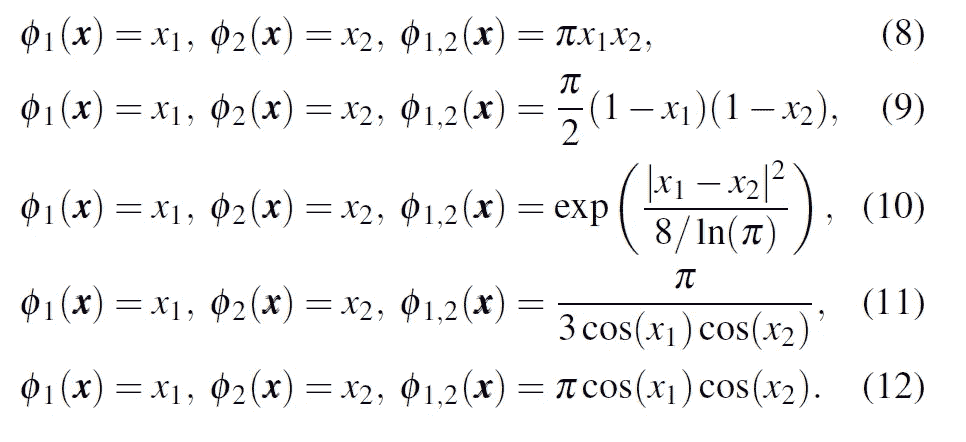
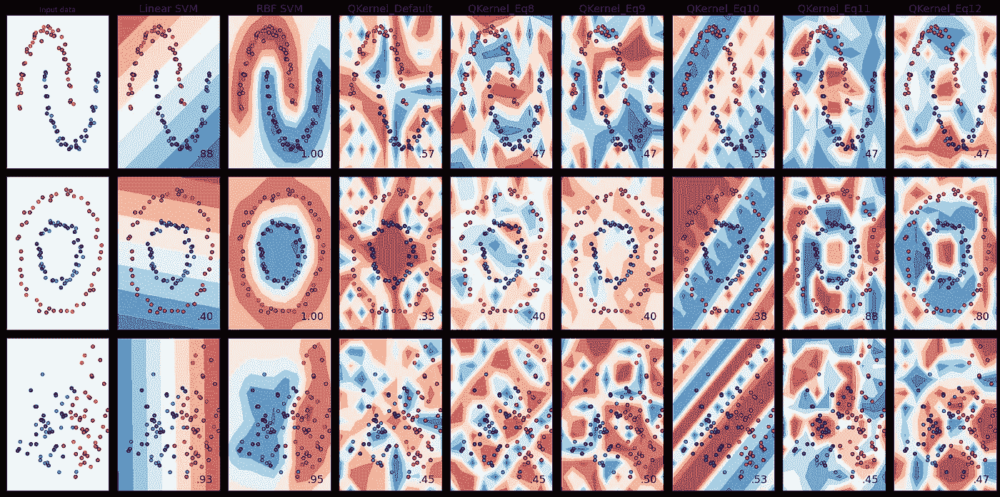

# 使用量子核分类—教程

> 原文：<https://medium.com/mlearning-ai/classification-using-quantum-kernels-tutorial-8a2f442fd188?source=collection_archive---------0----------------------->

我们使用 Qiskit 和 sklearn 在玩具数据集上执行一些分类。我们使用 qiskit_machine_learning 库来生成一个量子内核。然后将该核应用于 sklearn 中的支持向量分类。

整篇教程可以在这里作为 jupyter 笔记本获得。

本教程基于铃木等人的一篇论文。艾尔。，它本身是对先驱论文*的研究*Havlíek 等人的【1，2】*用量子增强特征空间*进行监督学习。铃木等人。在他们的论文中，研究了两个量子位的分类器。输入数据点被映射到酉算子，**

**

*The input data is mapped to a unitary operator. U(x) is the unitary gate used to form the quantum circuit.*

*编码函数如下所示*

**

*Encoding functions that transform the input data points to a higher dimensional feature space.*

## *步骤 0-导入*

*我们需要一些实用功能来处理数据和绘图。我们还需要 qiskit、qiskit_machine_learning 和 sklearn 库。*

## *步骤 1-编码特征地图*

*铃木等人。艾尔。呈现五种编码功能*

**

*The five encoding functions from Suzuki et. al.*

*此外，我们还包括 Havlíek 等人使用的编码函数。*

**

*Encoding function from Havlíček et. al., whcih is also the default encoding function for PauliFeatureMap*

*这是 qiskit-machine-learning 中 PauliFeatureMap 的默认编码函数*

*编码功能实现如下*

## *第二步——量子内核*

*输入数据点被映射到酉算子，*

**

*The input data is mapped to a unitary operator. U(x) is the unitary gate used to form the quantum circuit.*

*这是使用 PauliFeatureMaps 实现的量子电路。我们指定所使用的浇口类型，在这种情况下，如等式 6 中给出的 *ZI、*和 *ZZ* 。然后在 data_map_func 中指定编码函数。也可以指定循环次数。*

## *步骤 3 —分类*

*上面制备的量子核现在可以用在支持向量分类器中。我们还包括线性和径向基函数(RBF)分类器进行比较，并给出量子核如何操作的直觉。*

## *结果*

*实验结果如下所示*

**

*Classification of some toy datasets (Moons, Circles and Linearly Separable) using Quantum Kernel based Support Vector Classifiers (SVC). The quantum kernels used encoding functions given in refs [1,2]. The results of the quantum kernel classifiers are compared to Linear and RBF based SVM.*

*对于每个数据集，基于量子核的分类器的分数根据编码函数而变化。对于 Circles 数据集，等式 11 和 12 往往表现得更好。这当然是从它们的余弦形式来看的。通过调整电路重复、纠缠和泡利等参数，可以进一步优化性能。*

*然而，这个实验中突出的一个重要方面是编码功能。铃木等人给出的函数。艾尔。对数据是如何分布的有一种直觉。这意味着对于新的数据集，需要“学习”这些编码功能。一种可能的方法是量子世代对抗网络(qGAN)。我们将很快探索它们。*

*我在这里用 Amira Abbas 在最近一个关于量子机器学习的视频中的一个提示作为结束，“正确设定你的期望。”*

## *参考*

1.  *y .，Yano，h .，Gao，Q. *等*基于核的量子分类器的特征图分析与合成。*量子马赫。智能。* **2、** 9 (2020)。[https://doi.org/10.1007/s42484-020-00020-y](https://doi.org/10.1007/s42484-020-00020-y)*
2.  *havlíek，v .，Córcoles，A.D .，Temme，K. *等*利用量子增强特征空间的监督学习。*性质* **567，**209–212(2019)。[https://doi.org/10.1038/s41586-019-0980-2](https://doi.org/10.1038/s41586-019-0980-2)*
3.  *[arXiv:2101.11020](https://arxiv.org/abs/2101.11020)【quant-ph】*
4.  *[量子内核机器学习— Qiskit 机器学习 0.1.0 文档](https://qiskit.org/documentation/machine-learning/tutorials/03_quantum_kernel.html)*