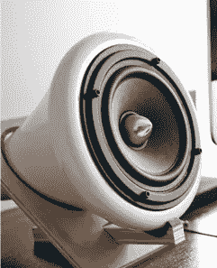
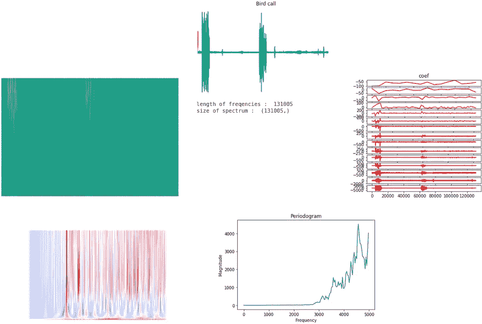
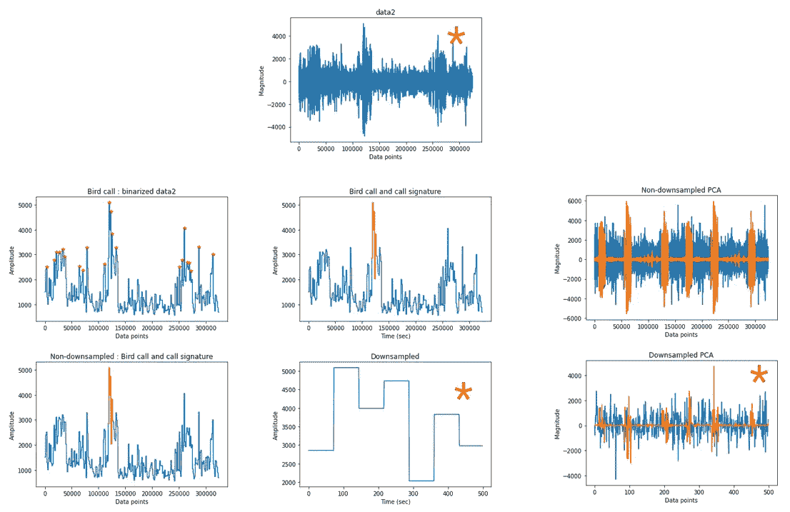
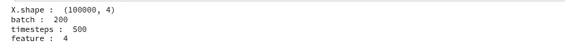
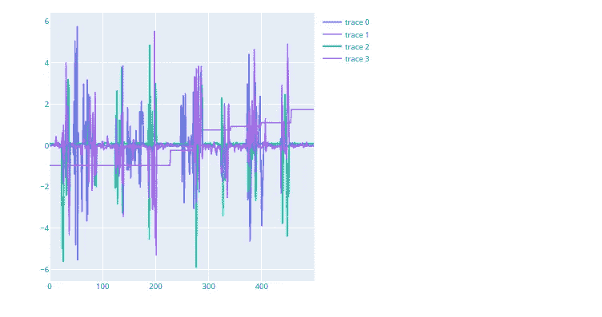
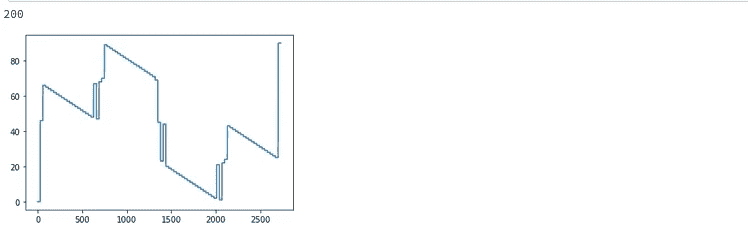
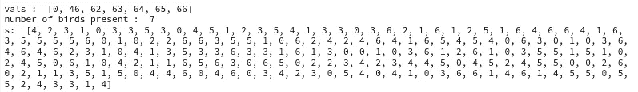
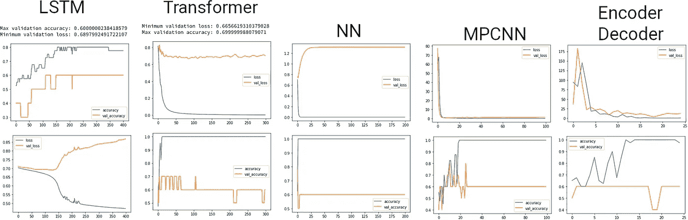
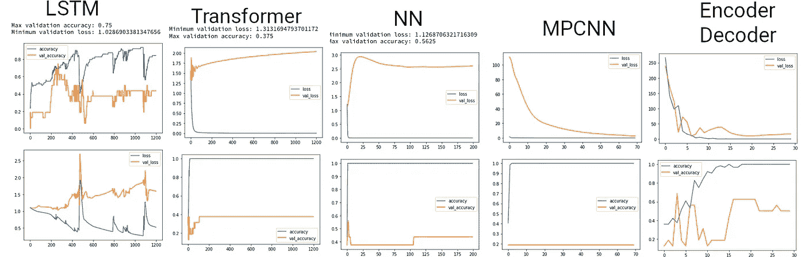

# 鸟类声音的分类:第二部分

> 原文：<https://medium.com/mlearning-ai/classifying-bird-sounds-part-2-54b45dd127c7?source=collection_archive---------5----------------------->

## 痴迷继续…并结束🐦

在以前的帖子中，我试图通过计算面元周期图来对声音进行分类，这与 Mel 频率非常相似，是一种特征。我用了一个简单的 3 层神经网络和 CNN。但是，由于采样频率非常快，音频信号非常长，我只能在合理的时间内加载 100 个. mp3 样本。

这一次我尝试了时间和频率特性，这样我就可以有多种多样的特性。我还将每个特征缩减到一定长度，以便加载更多的. mp3 样本。测试的功能有:

1.  音频时间序列下采样(时间特征)，
2.  音频签名是重复最多的音频信号的快照(时间特征)，
3.  使用 PCA(时间特征)下采样的音频信号的两个主要分量，
4.  装箱周期图(频率特征)，
5.  频谱频率(频率特征)，
6.  五个离散时间小波(频率特征)，
7.  截尾平坦短时 fft(时频特征)，
8.  截断平坦连续小波变换(时频特征)。

这些信号都被下采样，或者 2D 图像被调整大小，使得它们都是固定的受控长度，例如 500 时间步长。这样，我就有了可管理的数据量。

## 预处理

## 加载 ylabels 的 csv

# 子功能

查看 github 库，了解使用的所有子功能:[https://github.com/j622amilah/Son_des_oiseaux2/](https://github.com/j622amilah/Son_des_oiseaux2/)

# 管道

## 1.根据数据帧名称创建 y 标签

## 2.加载 mp3 文件

## 3.加载 X 矩阵

## 以下是频率特征:

## 以下是时间特征:

我将只显示由红星指示的时间特征的结果:时间序列音频下采样、重复签名下采样和两个 PCA 分量下采样。我决定只对时间序列特征进行分类，因为在尝试了频率特征之后，老实说，我没有像许多人推荐的 MFCC 那样用频率特征进行准确分类。此外，频率特征比时间序列特征需要更多的计算能力；所以我可以用额外的计算能力来加载更多的数据。

## 准备 X 和 y

## 确保 X 是正确的

## 确保 y 正确

我将只展示下面的模型架构，所以请随意查看 GitHub 上的代码并参考这个源代码。

# LSTM

# 变压器

# n 层神经网络

# 美国有线新闻网；卷积神经网络

# 结果

在研究了要解码的特性、模型和类的数量之后，我能够获得合理的结果。我发现，我尝试分类的鸟类种类越多，所有模型的预测能力就越低。以下是 2 类和 3 类所有模型的时间特性结果。

## 2 类

平均而言，对于两个类别，大多数模型预测值为 0.6 至 0.75。

## 3 类

对于 3 个类别，LSTM 在 0.75 处的表现优于 2 个类别在 0.69 处的表现。在 0.375 处，3 个等级的变压器性能最差，而在 0.69 处，2 个等级的变压器性能最差。NN、MPCCN 和编码器-解码器的最大精度分别为 0.5625、0.2 和 0.7。

六个或更多类别导致所有模型的准确度为 0.25。因此，综合分类器可能是对许多鸟类进行分类的好方法。例如，构建许多只对 3 到 4 种鸟类进行分类的模型，并连接输出，使其给出所有鸟类的结果。

希望你喜欢这个帖子！这是我分析的第一个音频数据集，起初很难找到正确的特征，但很有趣。

## 参考

1.  [https://www . ka ggle . com/code/ilyamich/MFCC-implementation-and-tutorial/notebook](https://www.kaggle.com/code/ilyamich/mfcc-implementation-and-tutorial/notebook)
2.  [https://py wavelet . readthedocs . io/en/latest/ref/dwt-discrete-wavelet-transform . html # multi level-decomposition-using-wavedec](https://pywavelets.readthedocs.io/en/latest/ref/dwt-discrete-wavelet-transform.html#multilevel-decomposition-using-wavedec)
3.  [https://ataspinar . com/2018/12/21/a-guide-for-use-the-wavelet-transform-in-machine-learning/](https://ataspinar.com/2018/12/21/a-guide-for-using-the-wavelet-transform-in-machine-learning/)
4.  萨朗，普纳尔钱德拉。"带张量流的人工神经网络 2 . "*回归神经网络，第一版。柏林施普林格*(2021):189–230。
5.  Coursera 深度学习专业化。[https://www.coursera.org/](https://www.coursera.org/)

 [## Mlearning.ai 提交建议

### 如何成为 Mlearning.ai 上的作家

medium.com](/mlearning-ai/mlearning-ai-submission-suggestions-b51e2b130bfb)