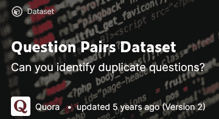
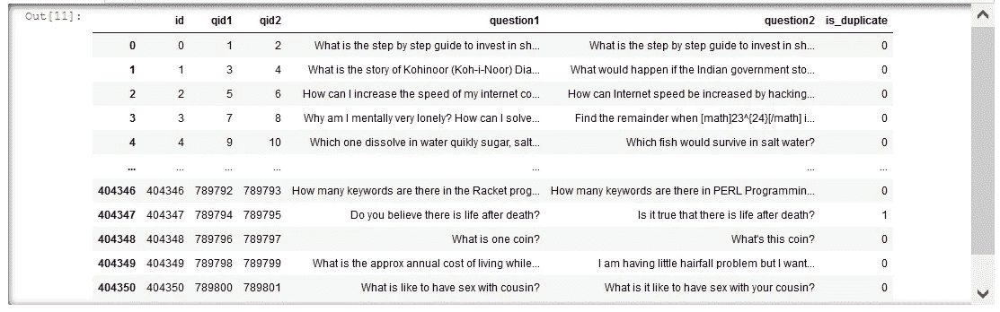
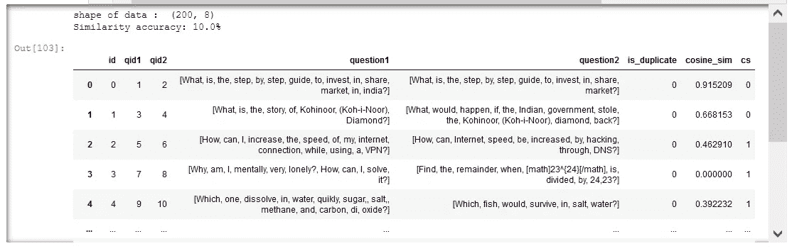
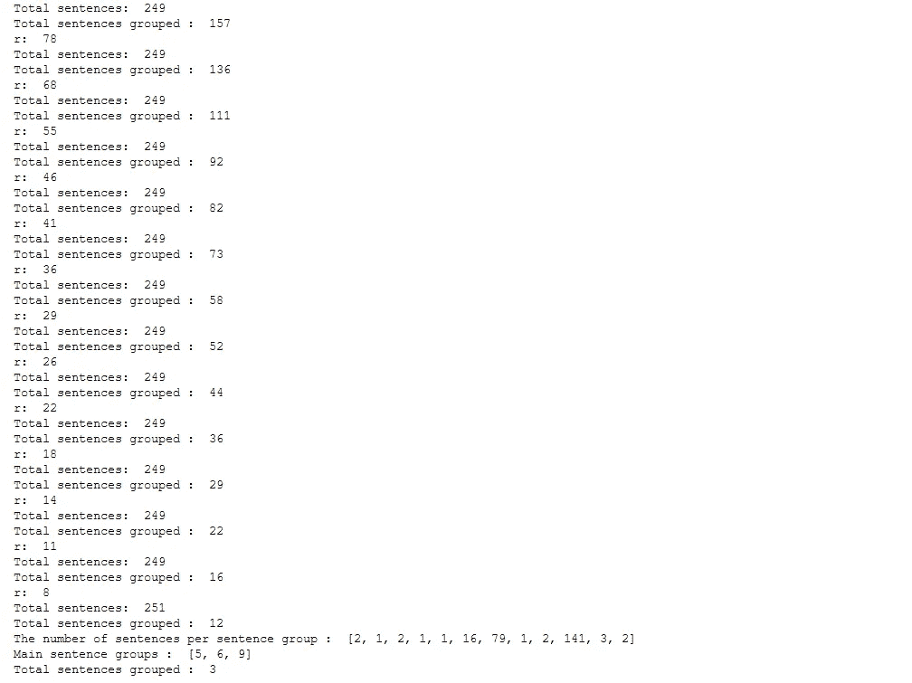
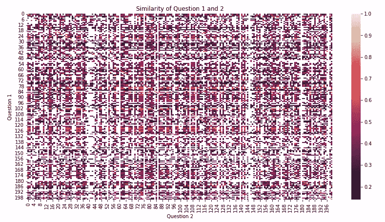
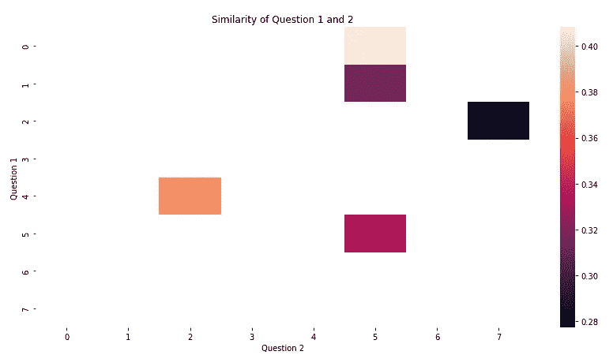
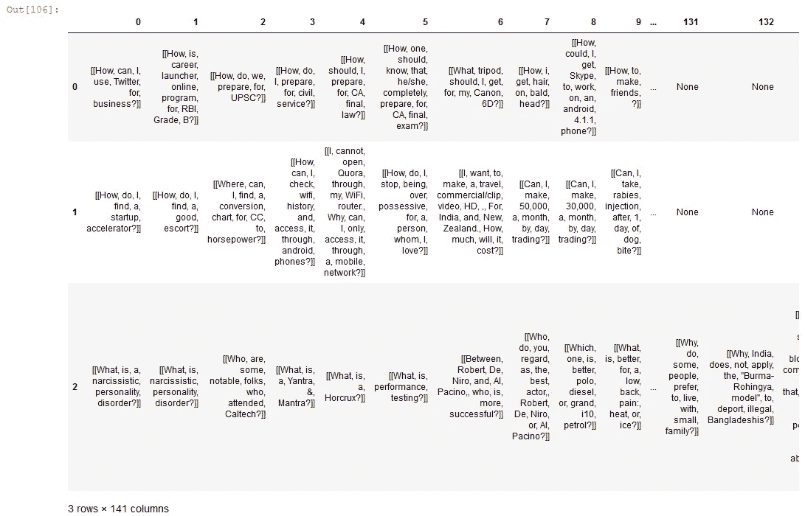

# 句子分类:第 1 部分句子聚类

> 原文：<https://medium.com/mlearning-ai/classifying-sentences-part-1-clustering-sentences-acfe49d508a7?source=collection_archive---------1----------------------->

在 chatbots 上的帖子之后，我对实践更多的文本分析技术感兴趣，比如对文本和单词嵌入进行分类。我去了 Kaggle，找到了一个问答数据集([https://www.kaggle.com/quora/question-pairs-dataset](https://www.kaggle.com/quora/question-pairs-dataset))。它包含可能相似也可能不相似的问题对。

在这篇文章中，我练习在数据集中寻找重复的问题，并对句子进行聚类。我们开始吧！

查看 github 中支持 python 的子功能:【https://github.com/j622amilah/Classify_sentences[！](https://github.com/j622amilah/Classify_sentences)

# 在 PC 上加载数据

让我们只加载整个 404350 对数据集的前 200 个问题对。

# 在数据集中查找重复的问题

将您的答案与 is_duplicate 列进行比较。

我们可以看到 is_duplicate 列与计算的余弦相似度只有 10%的相似度。并且基于人工检查，所计算的余弦相似性似乎比给定的 is_duplicate 列更准确；0 表示相似，1 表示不相似。

# 集群句

通过聚类相似的句子，可以为每个句子分配一个标签，这样我们就可以对相似的句子进行分类。我们建立句子间的相似度矩阵，并为每个矩阵条目找到最大相似度句子对。然后我们把每组中的第一句话作为‘代表组句’，重复进行相似度矩阵分析，直到所有的句子都缩减成几个大组。我不知道这种算法是否已经存在，但它似乎是对句子进行聚类的最直接的方法之一。

对句子进行分组的另一种方法可以是使用现有的单词嵌入矩阵:1)为每个句子计算每个单词的嵌入向量，2)对单词嵌入向量求和以获得句子嵌入向量，3)然后对相似的句子嵌入向量进行分组。

## 基于最大相似度将句子分成相似的组

在句子开始重复之前，最大相似性算法运行了 14 次比较句子相似性的循环。我们可以看到，第 5、6 和 9 句群中有很多句子。因此，基于这种算法结构，249 个句子可以分为 3 个主要组。

是的，我说了 249 个句子，而不是 400 个句子，我在代码开头的某个地方有一个小错误。这种代码的结构对于重组句子组、确定哪些句子组应该合并以使句子不重复来说是非常困难的。继续前进..

所有 400 个问题的相似性矩阵(上图)，以及最后一个循环的相似性矩阵(下图)。

下面是分成 3 组的最后一组句子。每组的句子主题有很大的不同，有趣的是，它将“如何”问题分为第 0 组，将“如何”、“能”问题分为第 1 组，将“什么”、“谁”、“为什么”问题分为第 2 组。

在下一篇文章中，我将使用词袋法和基于聚类句子的标签对句子进行分类。练习愉快！

 [## Mlearning.ai 提交建议

### 如何成为 Mlearning.ai 上的作家

medium.com](/mlearning-ai/mlearning-ai-submission-suggestions-b51e2b130bfb)