# 句子分类:第 2 部分句子分类

> 原文：<https://medium.com/mlearning-ai/classifying-sentences-part-2-classifying-sentences-28d3e7fabed4?source=collection_archive---------2----------------------->

在这篇文章中，我为集群句子做了一个词袋分类器。我使用的是来自 ka ggle([https://www.kaggle.com/quora/question-pairs-dataset](https://www.kaggle.com/quora/question-pairs-dataset))的问题对数据集。正如在“句子分类:第 1 部分句子聚类”中提到的，我在所有问题中使用了问题对的最大相似度。下图显示了第 1 部分句子聚类帖子中的句子是如何分组的。组主题是通过简单地对句子进行词汇分组而从数据中发现的。

在这篇文章中，我用集群句群对句子进行分类。

查看 github 中支持 python 的子功能:【https://github.com/j622amilah/Classify_sentences[！](https://github.com/j622amilah/Classify_sentences)

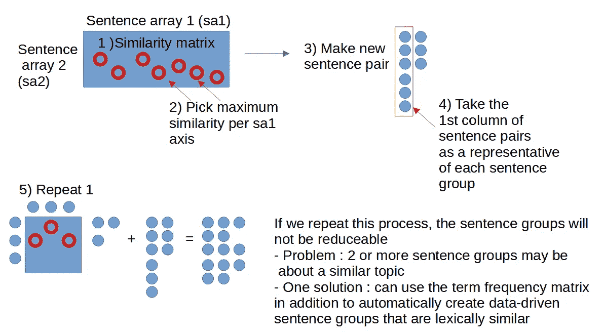

# 第二部分:句子分类

## 根据每个句子组的最高字数重新组织句子组

为了让每个组对特定紧急主题的句子进行分类，我们确保每个组都有唯一的关键字。因此，在这一步中，我们在句子组中搜索重复的关键词，然后将包含重复关键词的句子放在具有最大关键词计数的组中。

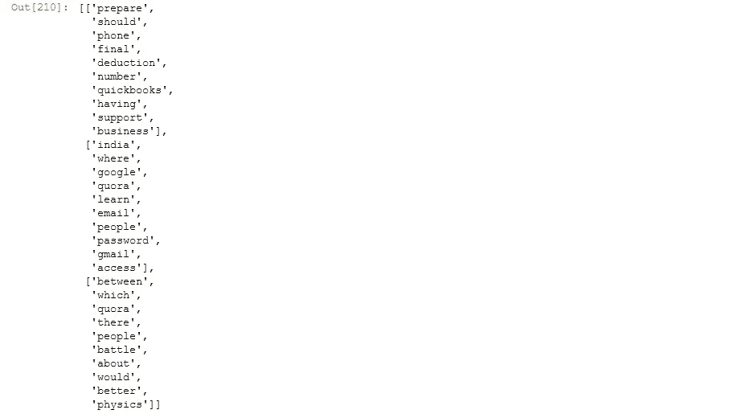

在上图中，我们可以看到“quora”和“people”分别出现在第一组和第二组句子中。这不好，因为第 1 组和第 2 组的主题是共享的，不太具体。让我们用一个特定的话题组成每个句子组。

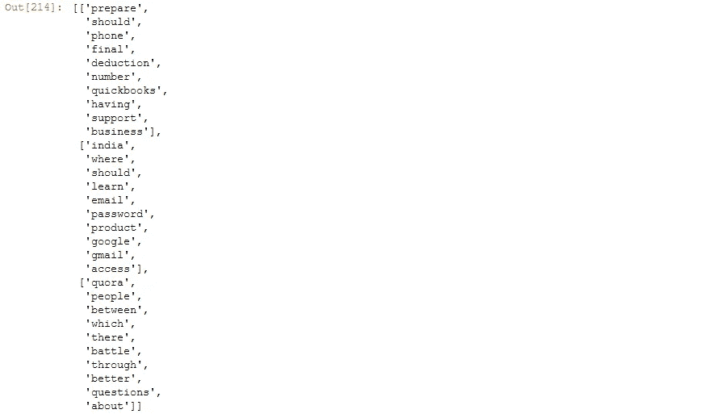

重新洗牌后我们可以看到，组 0 包含有关业务的问题，组 1 包含有关谷歌电子邮件访问的问题，组 2 包含有关使用 quora 的人的问题。既然句子组是特定的，我们可以建立一个模型来预测哪些句子属于这三个组之一。

# 创建 y 标签

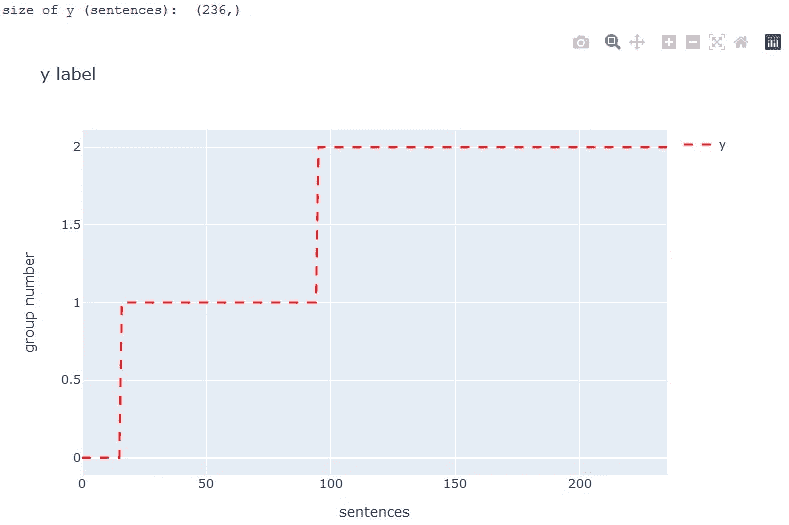

# 构建一个热词矩阵

我们可以看到“单词袋”是下面列出的所有句子中的独特单词。我们在下面列出一长串称为关键字的单词，对于句子中出现的每个关键字，我们在相应的行(对应于关键字)和列(对应于句子)中放置 1。我们获得一个大小矩阵(句子的关键字)，我们转置它获得一个大小矩阵(句子，关键字)，所以它符合 y 标签的大小(句子，1)。接下来，我们准备按照典型的步骤分类！

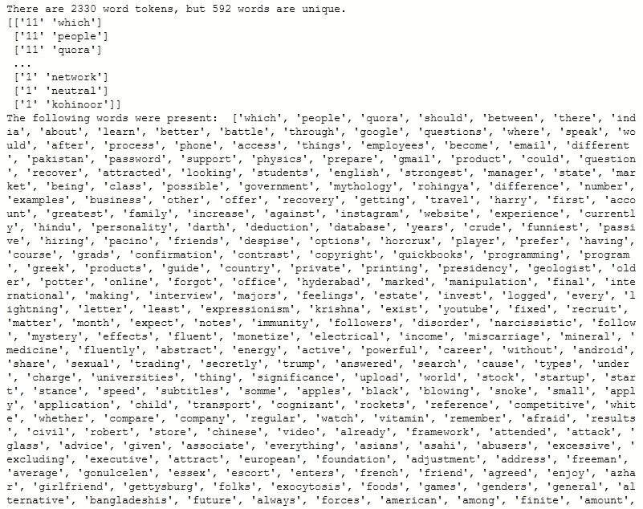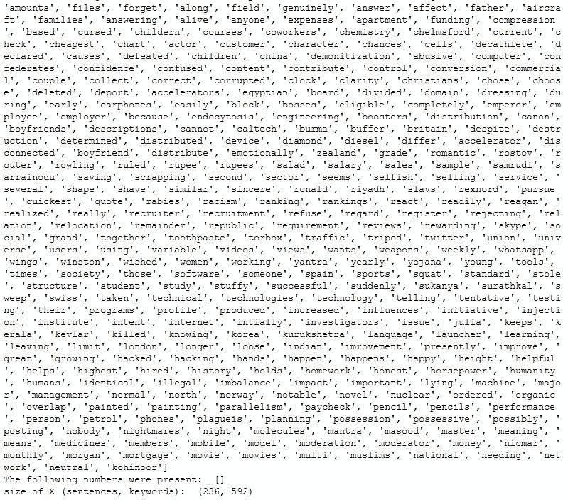

# 将数据分为训练集和测试集

# Tensorflow keras:词袋分类

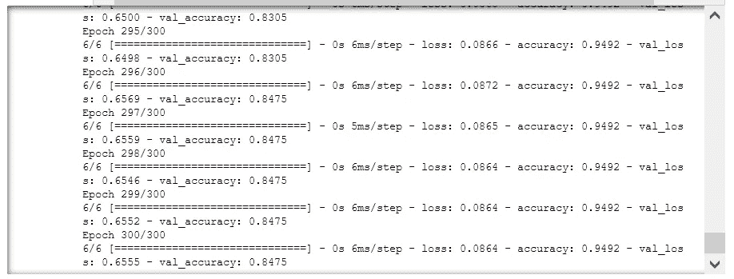

好玩的部分！让我们问这个模型一些问题，看看它属于哪个句子组。

## 关于句子组 0 主题的问题:['准备'，'应该'，'电话'，'最终'，'扣除'，'数字'，' quickbooks '，'拥有'，'支持'，'业务']

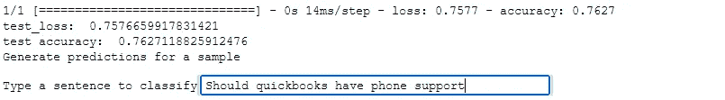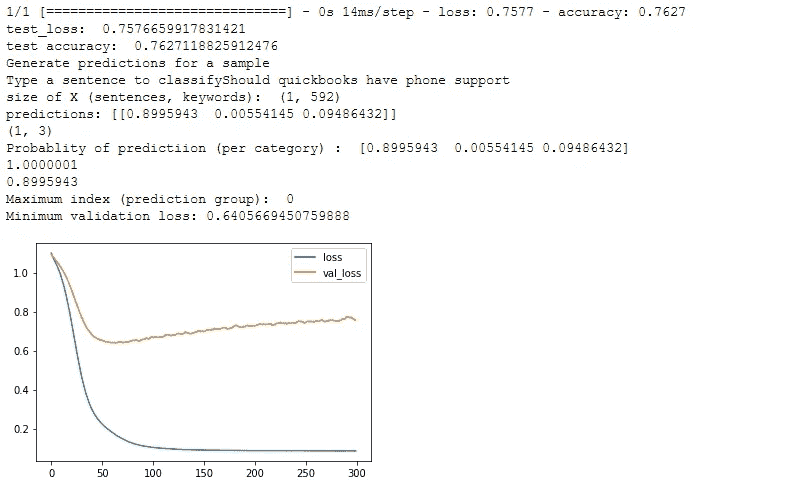

## 关于句子组 1 主题的问题:['印度'，'哪里'，'应该'，'学习'，'电子邮件'，'密码'，'产品'，'谷歌'，' gmail '，'访问']

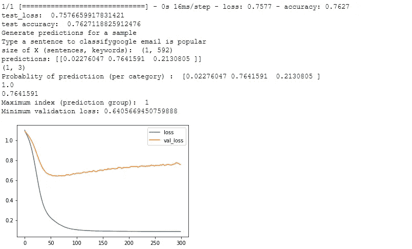

## 关于句子组 2 主题的问题:['quora '，' people '，' between '，' which '，' there '，' battle '，' through '，' better '，' questions '，' about']

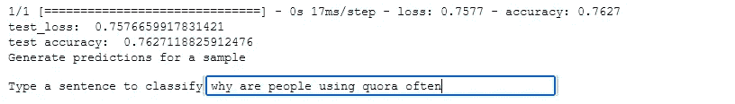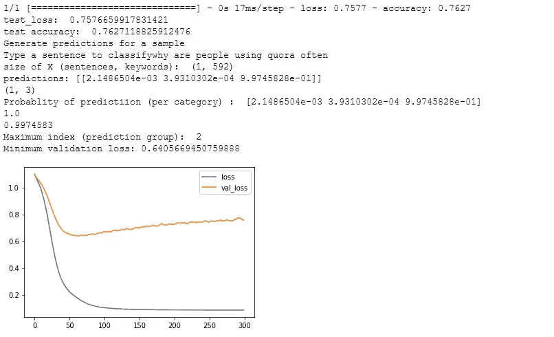

练习愉快！🙂

 [## Mlearning.ai 提交建议

### 如何成为 Mlearning.ai 上的作家

medium.com](/mlearning-ai/mlearning-ai-submission-suggestions-b51e2b130bfb)