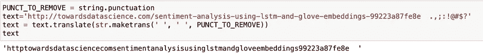
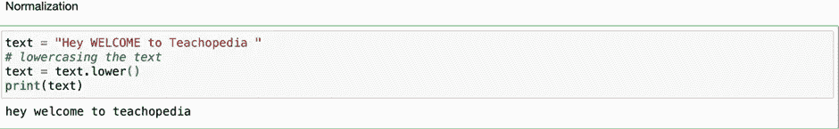
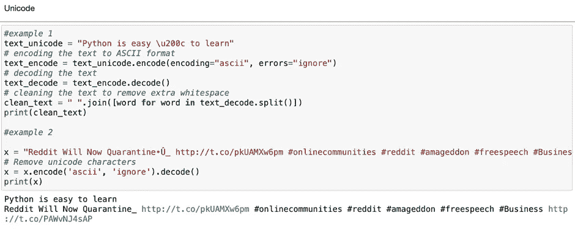
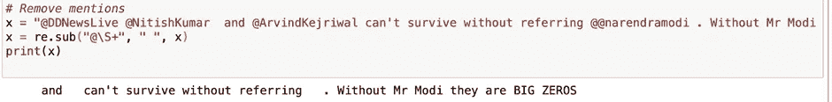
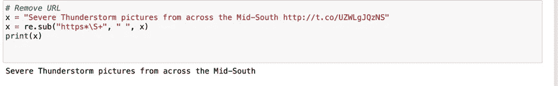
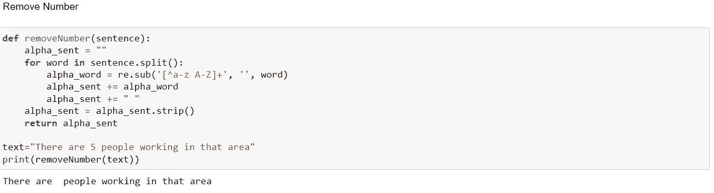
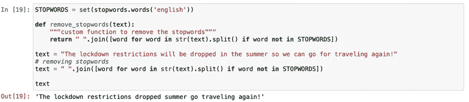
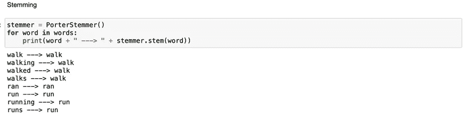
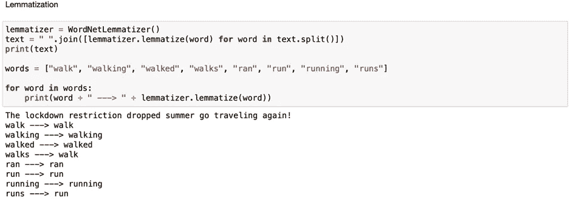

# 使用 Python 进行数据预处理

> 原文：<https://medium.com/mlearning-ai/cleaning-textual-data-using-python-abade5330e24?source=collection_archive---------4----------------------->


Photo by [Andreas Fickl](https://unsplash.com/@afafa) on [Unsplash](https://unsplash.com/?utm_source=unsplash&utm_medium=referral&utm_content=creditCopyText)

文本是非结构化数据的一种形式。根据维基百科，非结构化数据被描述为没有以预定义方式组织的*信息。我们不能给机器文本数据进行处理和分析。相反，我们将数据转换成一种格式，以便机器能够更好地理解它。我们需要应用一些技术来清理我们的文本数据，然后将其发送到机器进行进一步处理。*

*在接下来的文章中，我将分享可以轻松应用于文本数据的不同方法和技术。我们将使用 python 进行预处理。*

# ***导入库***

```
*from nltk.tokenize import word_tokenize
from nltk.corpus import stopwordsimport re
import string
import re
import nltk
from nltk.corpus import stopwords
from nltk.stem.porter import PorterStemmer
from nltk.stem import WordNetLemmatizer*
```

***1。** **去掉标点:***

*标点符号是类似**"的字符。,;:!@#$?"** 根据应用程序，如果你愿意，你可以删除它，尤其是当你在处理 Twitter 数据的时候。*

**

***2。正常化:***

*重要的是规范我们单词的大小写，这样每个单词都是相同的大小写，计算机就不会把同一个单词当作两个不同的符号来处理。*

**

***3。Unicode:***

*有时数据包含一个 unicode 字符，当我们以 ASCII 格式看到它时，它是不可读的。这些字符主要用于表情符号或非 ASCII 字符。*

**

***4。删除提及:***

**

***5。移除标签:***

**

***6。删除网址***

**

*7。移除数字*

**

*8。移除停用词*

*停用词是那些经常出现的词，如 **a/is/the/about** ，它们可能提供一些信息或在某些情况下引入不必要的干扰，因此在许多情况下需要将其删除。*

**

*9。词干*

*词干化是将屈折词缩减为词干、词根或词根形式(通常是书面形式)的过程。*

**

***10。引理化***

*词元化是将一个单词的词尾变化形式组合在一起的过程，这样它们就可以作为一个单独的项目进行分析，通过单词的词元或词典形式来识别。*

**

*这就是你在 Python 中预处理文本数据的方式。
*希望这篇文章能对你的分析之旅有所帮助。
感谢您的阅读！**

***我们来连线:***

*   *[领英](https://www.linkedin.com/in/uzair-adamjee-28768a102/)*
*   *[Instagram](https://www.instagram.com/uzairadamjee/)*
*   *[推特](https://twitter.com/UzairAdamjee)*

*[](/mlearning-ai/mlearning-ai-submission-suggestions-b51e2b130bfb) [## Mlearning.ai 提交建议

### 如何成为 Mlearning.ai 上的作家

medium.com](/mlearning-ai/mlearning-ai-submission-suggestions-b51e2b130bfb)*