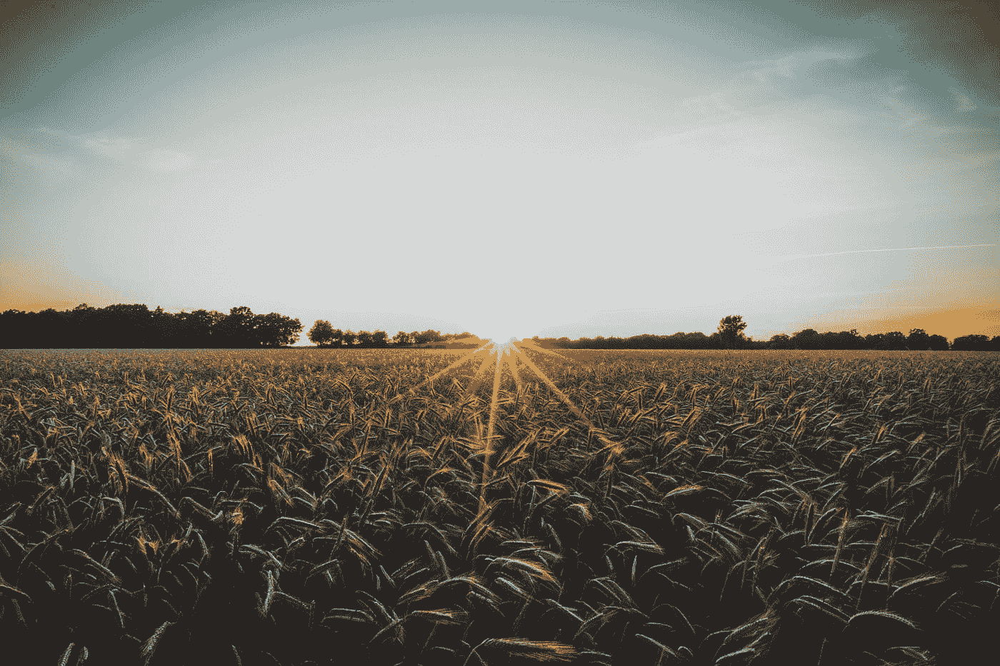

# 气候变化和农村社区

> 原文：<https://medium.com/mlearning-ai/climate-change-rural-north-carolina-cf1d74d1f9d9?source=collection_archive---------4----------------------->

Photo by [Tim Hüfner](https://unsplash.com/@huefnerdesign?utm_source=medium&utm_medium=referral) on [Unsplash](https://unsplash.com?utm_source=medium&utm_medium=referral)

气候变化影响到我们所有人，但这种影响在人群中的分布并不均匀。在北卡罗来纳州，我们看到了从海岸线侵蚀和更频繁的强风暴到洪水、干旱和气温升高的变化。

农村社区特别容易受到气候变化的影响。农村小城镇通常弹性较低，这意味着它们没有…