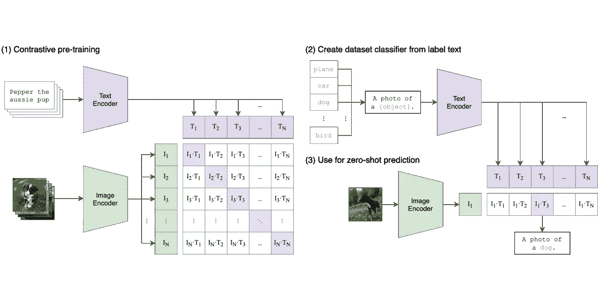
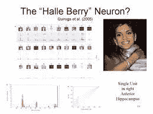

# 剪辑:用文本表现你的图像

> 原文：<https://medium.com/mlearning-ai/clip-represent-your-images-with-text-e93dc106ac15?source=collection_archive---------2----------------------->

An image of daisy correctly labelled by CLIP

# 介绍

CLIP(对比语言图像预训练)是由 OpenAI 制造的具有零触发能力的多模态神经网络。多模态神经网络能够解释模态，模态是指发生或经历的事情。

如今，典型的视觉模型是劳动密集型的，因为它们需要训练大量的参数。这里出现的另一个问题是，你训练的视觉模型是专门为特定数据集训练的。因此，它将在其他数据集上表现不佳。特定的数据集需要特定的模型。这种解决方案不太适合现实世界的问题，这就是为什么许多研究人员一直致力于零尝试学习。

零镜头学习意味着你要概括一个模型，使它能够在许多不同种类的标签上表现良好。这些标签可能是看不见的标签，因为我们的零射击模型没有在该标签的数据上训练。

# 资料组

为了使 CLIP 成为一个零镜头分类器，它已经在 4 亿张带有成对文本描述的图像上进行了训练(ImageNet 只包含 128 万张图像！).剪辑的数据是网上搜集的。数据集中有 32，678 个随机采样的文本片段。这些片段基本上描述了图像，因此有了多模态神经网络这个词。如果数据集中的类不是标题格式，则它们会被转换为标题。例如:

1.  狗→一张狗的照片
2.  苹果→苹果的照片
3.  对象→一张{对象}的照片

CLIP 执行的任务是用文本标记图像。当目标类别是短语而不是单个单词时，CLIP 将给出更好的预测，因为数据是从互联网上丢弃的，并且丢弃的图像具有描述它的短语而不仅仅是单个单词。OpenAI 的另一个著名模型，称为 DALL-E，则相反。它根据文本描述生成图像。

CLIP (courtesy: OpenAI)

# CLIP 神经网络

CLIP 执行以下操作:

图像→图像编码器(IE) →编码图像(N 个图像的 N 个表示，其中每个表示是一个向量)

文本→文本编码器(TE) →编码文本(M 个文本片段的 M 个表示，其中每个表示是一个向量)

然后，我们询问模型，对于图像“X ”, N 个文本中哪个文本是合适的。这就是为什么它被称为对比目标。对比学习是基于你可以对比/区分相似和不相似事物的直觉。我们将以这样的方式训练它，即图像最接近与其对应的文本标签，而不是任何其他文本。

该模型通过最小化正确图像-文本对(N 个真实对)之间的余弦距离，同时最大化不正确对(N -N)之间的余弦距离来训练。当两个向量之间的余弦距离减小时，两个向量之间的相似性增加。CLIP 就是这样被训练出来的。

两个编码器都是变压器。图像编码器是 ResNet50 或视觉转换器。Vision Transformer 的计算效率是标准 ResNet 的 3 倍。表现最好的剪辑模型在 256GPUs 上训练了 2 周。

# 零射击分类

在包括 ImageNet 在内的 16 个数据集上，Zero-Shot CLIP 在 ResNet50 上的性能优于线性探针。仔细想想，零拍剪辑是个很美的东西。它已经在如此大的数据(从互联网上收集的)上接受了训练，以至于它的性能超过了许多最先进的卷积神经网络，并且它记住，它可能从未见过它正在测试的数据。

当在不同的 ImageNet 数据集上使用零镜头剪辑时，性能差异非常小，但是当我们使用专门为 ImageNet 训练的分类器，但在 ImageNet 的其他版本上使用时，性能会下降很多。这向我们展示了 CLIP 的灵活性，因为它可以用作许多数据集的通用解决方案。

要使用零镜头剪辑，您只需将目标标签作为标题传递到模型中，它将为您提供预测。它在大多数大型图像数据集上运行良好，但有时，它可能不会执行得那么好。对于某些数据集，您会更喜欢经典的卷积神经网络或转换器，而不是 CLIP。

但是你可以使用线性探头提高零杆剪辑的得分。在带有线性探测的剪辑中，您可以更改分类图层，以便它更好地适应您想要预测的数据。

# 多模态神经元的存在性

Halle Berry Neuron

CLIP 最有趣的发现之一是“蜘蛛侠”神经元的存在。像生物学上的“哈莉·贝瑞”神经元一样，在 clip 中存在一个“蜘蛛侠”神经元，它对一个蜘蛛的图像、一个文本蜘蛛的图像和著名的超级英雄蜘蛛侠做出反应。

这一发现向我们展示了神经网络和我们的生物神经系统之间的重要联系。研究人员进一步发现，CLIP 的最高层将图像组织为思想的松散语义集合，这为模型的多功能性提供了简单的解释。

# 局限性和结论

就像我说的，CLIP 是灵活和通用的，但它在某些数据集上表现不佳。这种任务的一些例子是计算图像中对象的数量、分类花、飞机的变体、汽车模型等。它在 MNIST 这个非常基本的深度学习任务上表现不佳。CLIP 在不需要真实文本的情况下检测仇恨迷因方面也很有竞争力。

CLIP 是一个非常棒的神经网络，一定会让你开心不已。它也被用于 DALL-E，这是另一个令人惊叹的网络，但是的，这需要进一步的研究，我相信有一天，通用人工智能将在更多数据和更多创新的帮助下存在。

# 参考

[1]亚历克·拉德福德，琼·金旭，克里斯·哈拉西，阿迪蒂亚·拉梅什，加布里埃尔·高，桑迪尼·阿加瓦尔，吉里什·萨斯特里，阿曼达·阿斯克尔，帕梅拉·米什金，杰克·克拉克，格雷琴·克鲁格，伊利亚·苏茨基弗，[从自然语言监督中学习可转移的视觉模型(2021)](https://arxiv.org/abs/2103.00020) ，夹研究论文

[2] Gabriel Goh，Chelsea Voss，Daniela Amodei，Shan Carter，Michael Petrov，Justin 王杰，Nick Cammarata，Chris Olah，[人工神经网络中的多模态神经元(2021)](https://openai.com/blog/multimodal-neurons/) ，CLIP Multi-Modal Neurons 博客

如果你喜欢这篇文章，请鼓掌！

 [## Mlearning.ai 提交建议

### 如何成为 Mlearning.ai 上的作家

medium.com](/mlearning-ai/mlearning-ai-submission-suggestions-b51e2b130bfb)