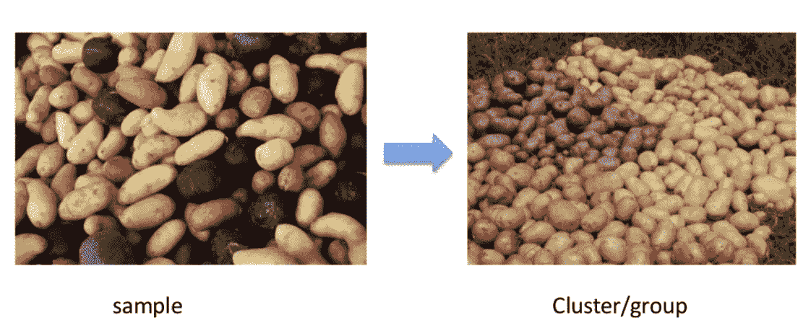
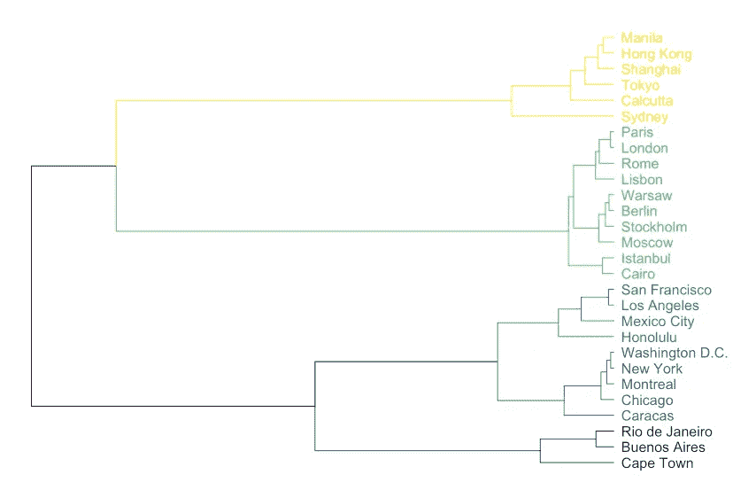
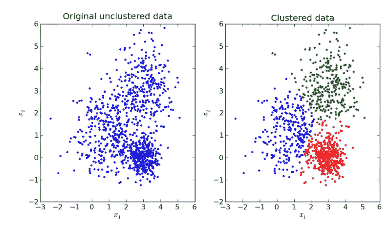
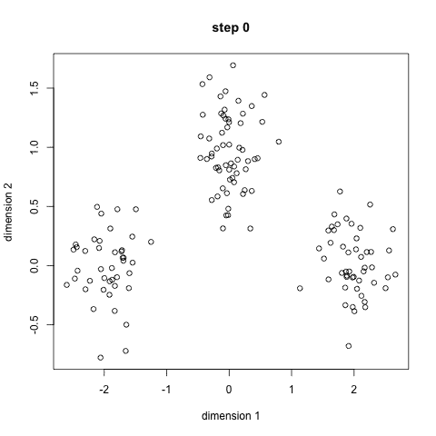
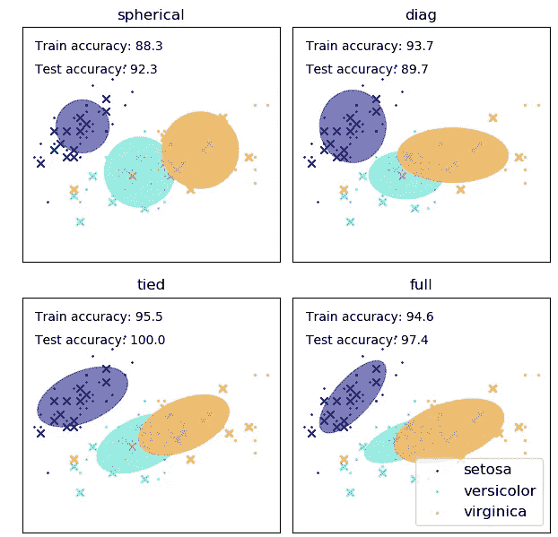
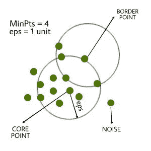
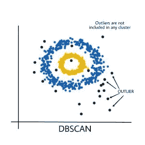
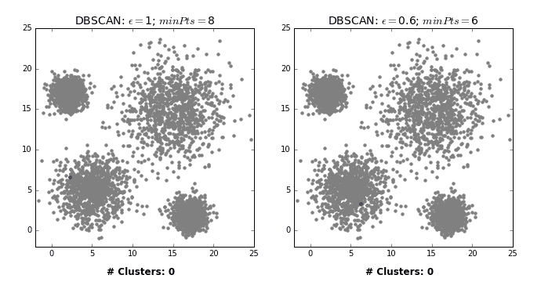

# 机器学习中的聚类分析

> 原文：<https://medium.com/mlearning-ai/cluster-analysis-6757d6c6acc9?source=collection_archive---------0----------------------->

Image source: Canva

聚类是一种用于监督学习的统计分类方法。**聚类分析**或**聚类**是对一组对象进行分组的任务，使得同一组中的对象(称为**聚类**)彼此之间比其他组(聚类)中的对象更加相似。

它是探索性数据挖掘的主要任务，也是统计数据分析的常用技术，应用于机器学习、模式识别、图像分析和数据压缩等领域。

聚类可以通过各种算法来实现，这些算法在理解什么构成一个聚类以及如何有效地找到它们方面有很大的不同。群集的流行概念包括群集成员之间距离小的组、数据空间的密集区域、间隔或特定的统计分布。

# 无监督机器学习的应用

无监督机器学习技术的一些应用是:

*   聚类自动根据相似性将数据集分成不同的组
*   异常检测可以发现数据集中的异常数据点。这有助于发现欺诈交易
*   关联挖掘识别在数据集中经常一起出现的项目集
*   潜在变量模型广泛用于数据预处理。例如减少数据集中的要素数量或将数据集分解为多个组件

# 无监督学习的缺点

*   您无法获得关于数据排序的精确信息，并且在无监督学习中使用的输出数据被标记并且未知
*   结果的准确性较低是因为输入数据是未知的，并且没有被人们提前标记。这意味着机器需要自己完成这项工作。
*   光谱类并不总是对应于信息类。
*   用户需要花时间解释和标记遵循该分类的类别。
*   类别的光谱属性也会随着时间的推移而变化，因此在从一幅图像移动到另一幅图像时，您无法获得相同的类别信息。

不同的算法所发现的聚类的概念在性质上有很大的不同。理解这些“集群模型”是理解各种算法之间差异的关键。典型的集群模型包括:

*   *连通性模型(*层次**聚类)**:聚类基于距离连通性构建模型。
*   *质心模型* : k-means 算法用单个均值向量表示每个聚类。
*   *分布模型*:使用统计分布，如多元正态分布，对聚类进行建模。
*   *密度模型* : DBSCAN 和 OPTICS 将集群定义为数据空间中相连的密集区域。
*   *子空间模型*:用集群成员和相关属性对集群进行建模。
*   *分组模型*:一些算法没有为它们的结果提供精确的模型，只提供分组信息。
*   *基于图的模型*:团，即图中节点的子集，使得子集中的每两个节点由一条边连接，可以被认为是集群的原型形式。完全连通性要求的放松(一部分边可以丢失)被称为准集团。
*   *符号图模型*:符号图中的每条路径都有一个符号，它来自边上符号的乘积。较弱的“聚类能力公理”产生具有两个以上聚类的结果，或者只有正边的子图。
*   *神经模型*:最广为人知的无监督神经网络是自组织映射，这些模型通常可以被描述为类似于一个或多个上述模型，并且当神经网络实现一种形式的主成分分析或独立成分分析时，包括子空间模型。

“聚类”本质上是一组这样的聚类，通常包含数据集中的所有对象。此外，它可以指定集群彼此之间的关系，例如，彼此嵌入的集群的层次结构。聚类可以大致分为:

*   *硬聚类*:每个对象是否属于一个聚类
*   *软聚类*(也称:模糊聚类):每个对象在一定程度上属于每个聚类(例如，属于该聚类的一种可能性)。

还可能有更细微的区别，例如:

*   *严格划分聚类*:每个对象恰好属于一个聚类。
*   *有离群点的严格划分聚类*:对象也可以不属于任何聚类，被认为是离群点。
*   *重叠聚类*(也有:*交替聚类*、*多视图聚类*):对象可能属于一个以上的聚类；通常涉及硬团簇。
*   *层次聚类*:属于子聚类的对象也属于父聚类。
*   *子空间聚类*:当重叠聚类时，在唯一定义的子空间内，聚类不会重叠。

# 1.基于连通性的聚类(层次聚类)

基于连接的聚类，也称为层次聚类，其核心思想是对象与附近的对象比与更远的对象更相关。这些算法将“对象”连接起来，根据它们的距离形成“簇”。一个集群很大程度上可以用连接集群各部分所需的最大距离来描述。在不同的距离上，会形成不同的聚类，可以用树状图来表示，这就解释了俗称“层次聚类”的由来:这些算法并不提供数据集的单一划分，而是提供了一个广泛的聚类层次，这些聚类在一定的距离上相互融合。

这些方法不会产生数据集的唯一划分，但会产生一个层次结构，用户仍需要从中选择适当的聚类。它们对离群值不是很健壮，离群值要么显示为附加的聚类，要么甚至导致其他聚类合并。

层次聚类依赖于使用这些聚类技术来寻找聚类的层次结构，其中该层次结构类似于树结构，称为树状图。*“层次聚类是基于组相似性对数据进行层次分解”*

Hierarchical clustering based on continents

# 查找分层聚类

有两种顶级方法可以找到这些层次聚类:

*   **聚集**聚类使用*自下而上*的方法，其中每个数据点从自己的聚类开始。然后，通过将两个最相似的聚类放在一起并合并，贪婪地将这些聚类结合在一起。
*   **分裂式**聚类使用一种*自顶向下*的方法，其中所有数据点都在同一个聚类中开始。然后，您可以使用 K-Means 之类的参数聚类算法将该分类分成两个分类。对于每个集群，您进一步将它分成两个集群，直到达到所需的集群数量。

这两种方法都依赖于在所有数据点之间构建相似性矩阵，这通常通过余弦或 Jaccard 距离来计算。

# 2.**质心模型(k 均值):**

在基于质心的聚类中，聚类由一个中心向量表示，该向量不一定是数据集的成员。当聚类的数目固定为 *k* 时，k-means 聚类给出了一个优化问题的正式定义:找到 *k* 个聚类中心，并将对象分配到最近的聚类中心，使得离聚类的平方距离最小。

众所周知，优化问题本身是 NP 难的，因此通常的方法是只寻找近似解。一种特别众所周知的近似方法是劳埃德算法，通常简称为“ *k 均值算法*”。然而，它只找到一个 [l](https://en.wikipedia.org/wiki/Local_optimum) 局部最优，并且通常以不同的随机初始化运行多次。*k*-均值的变化通常包括这样的优化，如选择多个运行中的最佳运行，但也将质心限制到数据集的成员(*k*-均值)，选择中值(*k*-中值聚类)，选择不太随机的初始中心(*k*-均值++)或允许模糊聚类分配(模糊 c 均值)。

大多数 *k* -means-type 算法需要预先指定聚类的数量——*k*——这被认为是这些算法的最大缺点之一。此外，这些算法更喜欢大小近似的聚类，因为它们总是将对象分配到最近的质心。这通常会导致错误地切割聚类的边界(这并不奇怪，因为该算法优化的是聚类中心，而不是聚类边界)。

K-means 有许多有趣的理论性质。首先，它将数据空间划分成一个称为 Voronoi 图的结构。其次，它在概念上接近最近邻分类，因此在机器学习中很受欢迎。第三，它可以被看作是基于模型的聚类的变体，而劳埃德算法可以被看作是下面讨论的该模型的期望最大化算法的变体。

Kmeans clustering

K means clustering with different steps

# **3。*配送车型***

与统计学关系最密切的聚类模型是基于分布模型。然后可以很容易地将群集定义为最有可能属于同一分布的对象。这种方法的一个便利特性是，它非常类似于人工数据集的生成方式:从分布中随机抽取对象。

虽然这些方法的理论基础很好，但是它们受到一个称为过拟合的关键问题的困扰，除非对模型复杂性加以限制。更复杂的模型通常能够更好地解释数据，这使得选择合适的模型复杂性本身就很困难。

一种著名的方法被称为高斯混合模型(使用期望最大化算法)。这里，数据集通常用固定数量(以避免过拟合)的高斯分布来建模，这些高斯分布被随机初始化，并且其参数被迭代优化以更好地拟合数据集。这将收敛到局部最优，因此多次运行可能会产生不同的结果。为了获得硬聚类，对象通常被分配给它们最可能属于的高斯分布；对于软集群，这是不必要的。

基于分布的聚类分析为可以捕获属性之间的相关性和依赖性的聚类分析生成复杂的模型。然而，这些算法给用户带来了额外的负担:对于许多真实数据集，可能没有简明定义的数学模型(例如，假设高斯分布是对数据的相当强的假设)。

Different types of Gaussian distribution mixture models — Source: scikit-learn.org

# **4。*密度型号***

在基于密度的聚类中，聚类被定义为比数据集的其余部分密度更高的区域。这些稀疏区域中的对象(需要分离聚类)通常被认为是噪声和边界点。

最流行的基于密度的聚类方法是 [DBSCAN](https://en.wikipedia.org/wiki/DBSCAN) 。与许多较新的方法相比，它具有一个定义良好的集群模型，称为“密度-可达性”。类似于基于链接的聚类，它基于在特定距离阈值内的连接点。但是，它仅连接满足密度标准的点，在原始变量中，密度标准定义为该半径内其他对象的最小数量。簇由所有密度连接的对象(与许多其他方法相比，它可以形成任意形状的簇)以及这些对象范围内的所有对象组成。DBSCAN 的另一个有趣的特性是其复杂性相当低——它需要对数据库进行线性数量的范围查询——并且它将在每次运行中发现本质上相同的结果(对于核心点和噪声点是[确定性的](https://en.wikipedia.org/wiki/Deterministic_algorithm),但对于边界点不是),因此不需要运行多次。OPTICS 是 DBSCAN 的推广，它消除了为范围参数选择适当值的需要，并产生与连锁聚类相关的分级结果。DeLi-Clu，Density-Link-Clustering 结合了单连接群集和光学的思想，完全消除了参数，并通过使用 R 树索引提供了优于光学的性能改进。

DBSCAN 和 OPTICS 的主要缺点是，它们希望通过某种密度下降来检测星团边界。例如，在具有重叠高斯分布(人工数据中的常见用例)的数据集上，这些算法产生的聚类边界通常看起来是任意的，因为聚类密度不断降低。在由混合高斯分布组成的数据集上，这些算法几乎总是优于 EM 聚类等能够精确建模这类数据的方法。

均值漂移是一种聚类方法，根据[核密度估计](https://en.wikipedia.org/wiki/Kernel_density_estimation)，将每个对象移动到其附近最密集的区域。最终，物体会聚到局部密度的最大值。类似于 k-means 聚类，这些“密度吸引子”可以作为数据集的代表，但 mean-shift 可以检测类似于 DBSCAN 的任意形状的聚类。由于昂贵的迭代过程和密度估计，mean-shift 通常比 DBSCAN 或 k-Means 慢。此外，均值漂移算法对多维数据的适用性受到核密度估计的不平滑行为的阻碍，这导致聚类尾部的过度分割。

**DBSCAN 算法需要两个参数—**

1.  **eps** :定义数据点周围的邻域，即如果两点之间的距离小于或等于“eps”，则认为它们是邻居。如果 eps 值选得太小，那么大部分数据将被视为异常值。如果选择得非常大，则聚类将合并，并且大多数数据点将在相同的聚类中。找到 eps 值的一种方法是基于 ***k 距离图*** 。
2.  **min pts**:EPS 半径内邻居(数据点)的最小数量。数据集越大，必须选择越大的 MinPts 值。作为一般规则，最小 MinPts 可以从数据集中的维数 D 导出为，`MinPts >= D+1`。MinPts 的最小值必须至少选择为 3。

**在该算法中，我们有 3 种类型的数据点。**

*   **核心点**:如果一个点在 eps 内有超过 MinPts 个点，则该点为核心点。
    **边界点**:一个在 eps 内的分点数少于分点数，但在核心点附近的点。
    **噪声或离群点**:不是核心点或边界点的点。

DB Scan Parameters

DBSCAN Cluster

DBScan

DB Scan Search

# 5.基于网格的聚类

基于网格的技术用于多维数据集。[【16】](https://en.wikipedia.org/wiki/Cluster_analysis#cite_note-16)在这项技术中，我们创建了一个网格结构，并且在网格(也称为单元)上执行比较。基于网格的技术速度快，计算复杂度低。有两种基于网格的聚类方法:STING 和 CLIQUE。

基于网格的聚类方法不同于传统的聚类算法，因为它不关心数据点，而是关心数据点周围的值空间。一般来说，一个典型的基于网格的聚类算法包括以下五个基本步骤(格拉布斯特和博里索夫，2002 年):

1.创建网格结构，即将数据空间划分成有限数量的单元。

2.计算每个细胞的细胞密度。

3.根据细胞密度对其进行分类。

4.识别聚类中心。

5.邻居单元的遍历。

# 聚类算法应用

1.  **识别癌变数据的聚类算法:**聚类算法可用于识别癌变数据集。最初，我们获取癌症和非癌症数据集的已知样本。标记两个样本数据集。然后，我们随机混合两个样本，并将不同的聚类算法应用于混合样本数据集(这被称为聚类算法的学习阶段)，并相应地检查有多少数据集得到了正确的结果(因为这是已知样本，我们已经预先知道了结果)，因此我们可以计算得到的正确结果的百分比。现在，对于一些任意样本数据集，如果我们应用相同的算法，我们可以预期结果的正确率与我们在特定算法的学习阶段获得的结果相同。在此基础上，我们可以为我们的数据样本搜索最合适的聚类算法。
2.  **搜索引擎中的聚类算法:**聚类算法是搜索引擎背后的中坚力量。搜索引擎试图将相似的对象分组在一个簇中，而将彼此远离的不相似的对象分组。它根据聚集在要搜索的数据周围的最近的相似对象为搜索的数据提供结果。使用的聚类算法越好，在首页获得所需结果的机会就越大。因此，**相似对象**的定义在获取搜索结果中起着至关重要的作用，相似对象的定义越好，结果越好。大多数头脑风暴活动都需要定义用于类似对象的标准。
3.  **学术中的聚类算法:**监控学生学习成绩进展的能力一直是高等教育学术团体的关键问题。聚类算法可以用来监控学生的学习成绩。根据学生的分数，他们被分成不同的组(使用 k 均值、模糊 c 均值等)，每个组代表不同的表现水平。通过知道每个聚类中的学生数量，我们可以知道整个班级的平均表现。
4.  **无线传感器网络基础应用中的分簇算法:**分簇算法可以有效地应用于无线传感器网络的基础应用中。它的一个应用是地雷探测。聚类算法的作用是找到收集其各自簇中所有数据的簇头(或簇中心)。

**5。客户细分**:聚类最常见的应用之一就是客户细分。这不仅仅局限于银行业。这一战略是跨职能部门的，包括电信、电子商务、体育、广告、销售等。

# **结论**

聚类是从旧数据中学习新事物的好方法。有时你会对得到的集群感到惊讶，它可能会帮助你理解问题。

使用聚类进行无监督学习最酷的事情之一是，您可以在有监督的学习问题中使用结果。

聚类可能是您在完全不同的数据集上使用的新功能！你可以在任何无监督的机器学习问题上使用聚类，但要确保你知道如何分析结果的准确性。

通过 [Linkedin](https://www.linkedin.com/in/sureshhp/) 和 [Medium](https://hpsuresh12345.medium.com/about) 与我联系，获取新文章和博客。

— — — * — — — * — — — * — — — * — — — * — — — * — — — * —

*“培养学习的热情。如果你这样做了，你将永远不会停止成长*

— — — * — — — * — — — * — — — * — — — * — — — * — — — * —