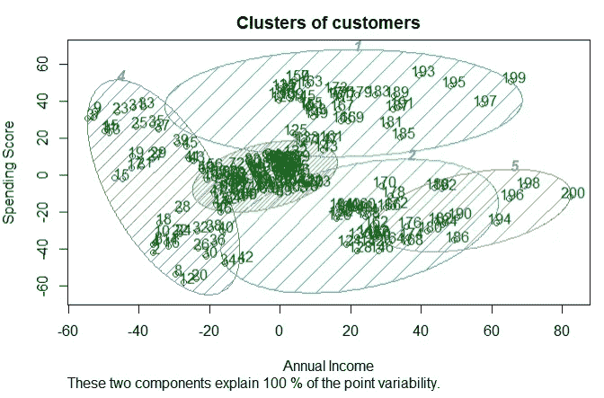
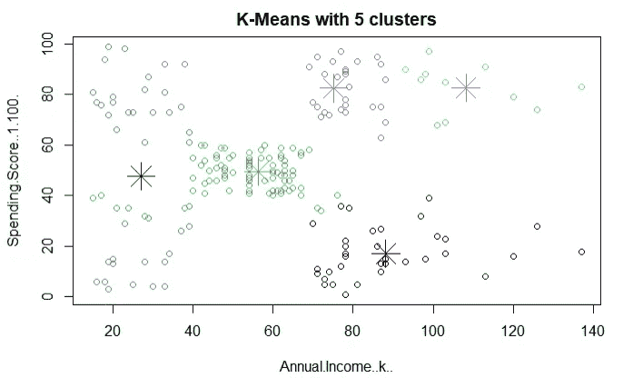
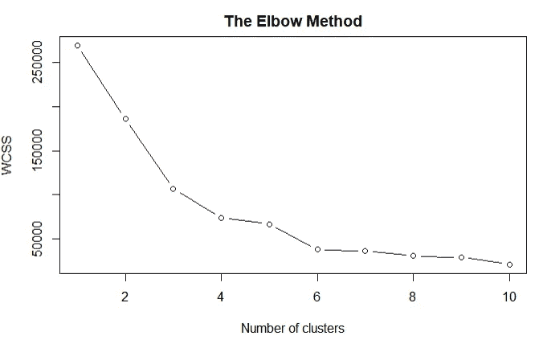
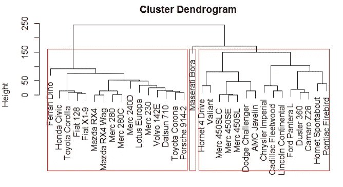
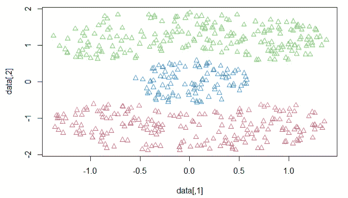

# 使聚集

> 原文：<https://medium.com/mlearning-ai/clustering-79338eeb3bb0?source=collection_archive---------2----------------------->

聚类通常是在给定数据集中查找子组或聚类的技术。当我们对数据集的观察值进行聚类时，我们的目标是将数据划分到不同的组中，使得每个组中的观察值或多或少彼此相似，而不同组中的观察值彼此差异很大。聚类被认为是**无监督学习**的一部分，因为这里的目标是隔离，形成子群，而不是像监督学习那样预测。像 [PCA](https://sen-aby.medium.com/pca-principal-component-analysis-e0cbc7a63f6b) 这样的聚类试图用小摘要来简化数据；尽管值得一提的是，两者使用的方法是不同的。聚类的工作是找到同质的子群。为了识别子群，我们试图找到特征并使用它们来形成子群。在下文中，为了简单起见，我们将讨论聚类观察。

数据聚类在各种行业中非常有用，如银行业(客户细分、异常检测)，在医疗保健中用于对 MRI 数据进行分类，在零售业中用于根据过去的购买情况推荐产品；也可以用在新闻文章分组到站点的几个例子。

聚类模型的一些例子是

*   k 均值
*   分层聚类
*   基于密度的带噪声应用空间聚类(DBSCAN)聚类

在 **K-means** 聚类中，我们试图将观察值划分为预先指定数量的非重叠聚类，使得聚类内的变化尽可能小。

K 均值聚类是如何工作的！

1.  选择群集的数量。
2.  随机选择 k 个点，即质心。
3.  将每个数据点分配给形成 k 个聚类的最近质心。
4.  计算并放置每个簇的新质心。
5.  将每个数据点重新分配给新的最近质心，直到聚类分配停止变化。
6.  这将给出最终的集群。

因为我们发现的是局部最优而不是全局最优，所以获得的结果将取决于我们对每个观察值的初始(随机)聚类分配。因此，从不同的随机初始配置多次运行该算法是非常重要的。

**我们如何选择合适的 K 数？**

最佳结果基于聚类平方和内的总数(WCSS)。

模型质量随着聚类数量的变化而变化

理想的图将有一个**弯头**，在此处，质量度量随着群集数量的增加而提高得更慢。如果我们观察该图，它表明随着模型复杂性(聚类数量)的增加，模型的质量不再显著提高。换句话说，肘形表示数据中固有的聚类数。

为了执行 K 均值聚类，我们在 R 包中使用 K 均值函数。该函数的两个重要特征是 n start(用于降低算法对初始聚类/聚类均值的随机选择的敏感性的参数。)和聚类标签(标签从一次运行到另一次运行是变化的。)

虽然 K-均值聚类有一些优点，如

*   易于实现和高速性能。
*   方法是可伸缩的，对于大型数据集非常有效。
*   总会收敛

也有一些挑战！

*   需要预先指定集群的数量。
*   聚类对质心的初始分配很敏感。
*   算法对异常值过于敏感。因为具有极大值的对象可能会严重扭曲数据的分布。

**层次聚类**

在**层次聚类**中，我们事先并不知道我们想要多少个聚类，事实上，我们最终得到了一个类似观察结果的树状可视化表示，称为树状图，它允许我们立即查看每个可能数量的聚类所获得的聚类。

1.  使每个数据点成为形成 N 个聚类的单个点聚类
2.  取两个最近的数据点并使它们成为一个聚类，这形成 N-1 个聚类
3.  取两个最近的聚类，使它们成为一个聚类，形成 N-2 个聚类
4.  重复上述步骤，直到我们只有一个集群

我们可以用各种方法来测量距离

*   选项 1:最近点
*   选项 2:最远的点
*   选项 3:平均距离
*   选项 4:质心之间的距离

所有这些距离当转换成高度时，我们形成了**树状图。**

*   同一集群中的单元由一条水平线连接。
*   底部的叶子代表单个单元。
*   它们很有用，因为它们提供了集群的可视化表示。
*   通过画一条垂直线给出不与任何水平线相交的最大垂直距离，可以确定最佳聚类数。

算法有两种类型

*   凝聚算法:这是一种自下而上的方法，我们从单个叶子开始，然后将簇合并在一起(Agnes)
*   分裂:这是另一种方法，我们从顶部开始向下移动(DIANA)，从根开始递归分裂集群。

第三种方法是查看密度而不是距离，即 **DBScan** 聚类。一个簇被定义为密集连接的点的最大集合。该方法发现了具有一些噪声的空间距离中的任意形状的聚类。

1.  所以随机选择一个点 *p* 。
2.  然后检索关于 Eps(最大)从 *p* 可到达的所有点。邻域半径)和 min pts(Eps 邻域内的最小点数)。
3.  如果邻域中的点数大于 MinPts，则 p 是核心点。
4.  对于 *p* 核心点，形成一个聚类。
5.  如果 p 不是一个核心点，让它成为一个噪声，然后移动到下一个点。
6.  继续，直到覆盖所有的点。

— — — — — — — — — — — — — @— — — — — — — — — — — — — — — — —