# 使用人工智能和分析引擎在 15 分钟内聚类神奇宝贝

> 原文：<https://medium.com/mlearning-ai/clustering-pok%C3%A9mon-in-15-minutes-using-the-ai-analytics-engine-dcbcd9665d62?source=collection_archive---------5----------------------->

机器学习中特征选择的痛苦与治愈

> 在处理高维数据集时，您是否发现特征选择是一项具有挑战性的任务？

未标记数据的聚类是许多领域的常见做法。

在这篇博客中，我们使用 [PI 演示了集群特性。交易所的人工智能&分析引擎](https://www.pi.exchange/?utm_source=medium&utm_medium=organic&utm_campaign=free+trial)，应用于神奇宝贝人物统计数据库。

# 介绍

> 团队试图通过这个(特性/行动)为其潜在客户或客户解决的困境，以及如何解决的简要描述。

在数据集中寻找自然出现的相似项目组是许多领域中的常见问题。例如，在医学领域，它被应用于从基因表达数据中发现肿瘤组，或者在零售领域，它被用于客户细分以及其他用途。这个问题可以用机器学习来解决。然而，与预测性机器学习不同，没有与每个项目或数据点相关联的标签可供利用。

例如，假设我们有一个零售商店的客户数据库，其中包含有关他们购买行为的信息。该信息可以是:

*   每位顾客购买的产品。
*   顾客多久购买一次。(周刊？每月？等等。).
*   每个时间段的平均花费。
*   等等。

我们希望将客户划分为在某种意义上“相似”的群体，然后为每个群体应用特定的营销活动，因为这应该比一般的营销活动更有效。

聚类过程的应用包括许多障碍:使用哪种聚类算法？我的数据有多少个集群？我如何在大型数据集上高效运行它？我如何理解生成的集群？我如何可视化结果？等等。

甚至相关的编码技能等技术知识也可能无法帮助您克服这些障碍。

[人工智能&分析引擎](https://www.pi.exchange/)为用户克服了这些问题，让聚类变得简单。内部应用程序可以帮助解决许多类型的问题。在引擎上，用户只需上传他们的数据，在应用程序创建期间选择“聚类”，并指定哪些列是相关的。该引擎将在聚类应用程序下自动生成结果。除了健壮性和易用性之外，它还提供了对聚类结果的自动分析，增强了可解释性，因此用户可以在几分钟内从数据到见解。

# 寻找神奇宝贝的自然组合

> 为什么这是一个问题？考虑一下:传统方法是劳动密集型的吗？或者，不执行此操作/步骤的影响。

为了演示引擎上的聚类过程，让我们使用来自 [Kaggle](https://www.kaggle.com/) 的 [*神奇宝贝统计*](https://www.kaggle.com/datasets/abcsds/pokemon?datasetId=121&sortBy=voteCount) 数据集。我们使用该数据是因为它简单并且非常适合演示引擎的聚类功能的关键方面。

对于那些不熟悉的人:[神奇宝贝](https://en.wikipedia.org/wiki/Pok%C3%A9mon)是日本[媒体特许经营](https://en.wikipedia.org/wiki/Media_franchise)由[神奇宝贝公司](https://en.wikipedia.org/wiki/The_Pok%C3%A9mon_Company)管理，该公司由[任天堂](https://en.wikipedia.org/wiki/Nintendo)、[游戏狂](https://en.wikipedia.org/wiki/Game_Freak)和[生物](https://en.wikipedia.org/wiki/Creatures_(company))创立。有数百种神奇宝贝，每一种都有自己的属性。

Pikachu — a well known Pokémon (Photo from [Zerochan](https://www.zerochan.net/849843))

该数据集包含 800 种神奇宝贝及其属性的列表。我们希望使用神奇宝贝的属性来“发现”它们的群体。传统上，为了深入了解数据，用户需要对数据集手动应用统计分析工具来查找“组”，并且通常会花费大量时间来分析结果。

以下是数据集的属性:

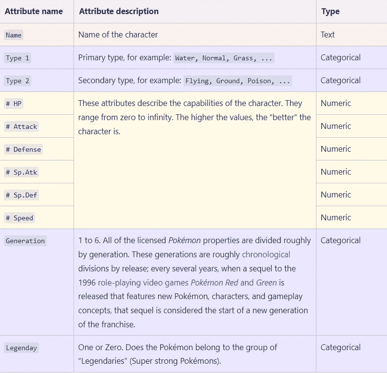

Image by Author

# 初步见解

在深入研究解决方案之前，我们通常会尝试更好地理解数据。第一步是上传数据并观察分析:

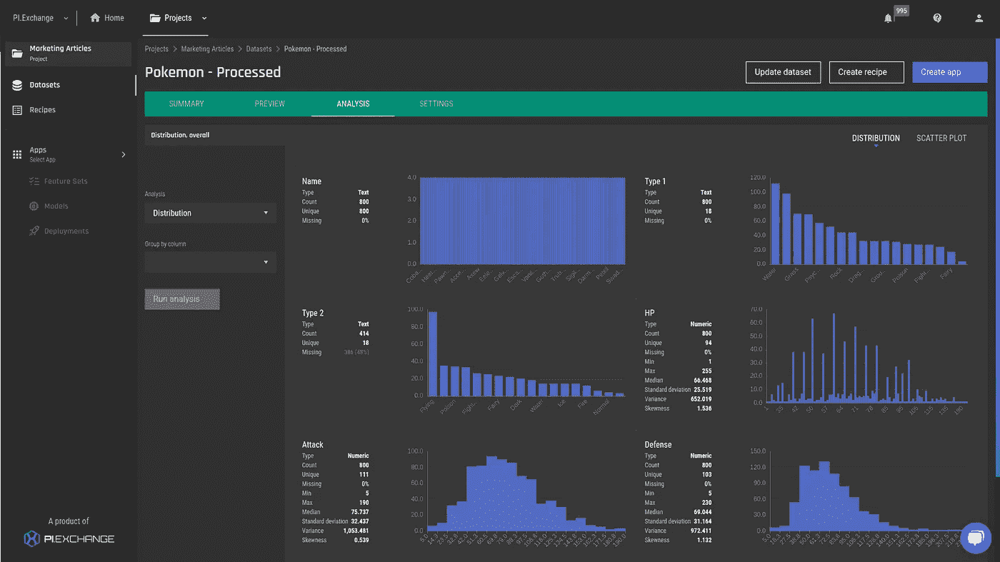

Fig 1 — Sample of the initial Pokémon dataset analysis on the AI & Analytics Engine (Image by Author)

使用该图，我们可以了解特征的分布情况。通过分析，我们可以根据具体特征进行分组，并对各组之间的差异进行定性评估。

示例:按`generation`特征分组:

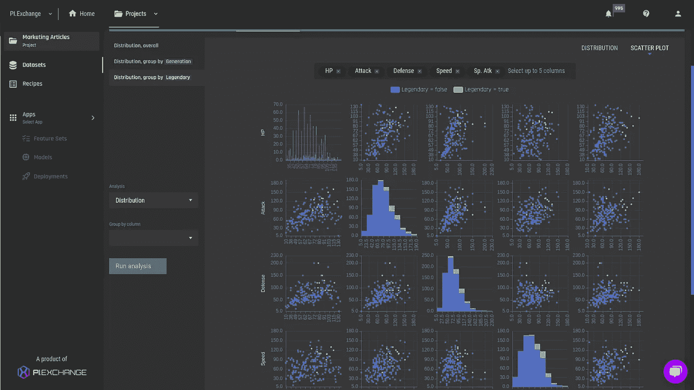

Fig 2 — Features analysis grouped by the `generation` feature on the AI & Analytics Engine (Image by Author)

似乎每一代神奇宝贝都有相当相似的特性分布。因此，我们可以推断出`generations`并不是一个真正重要的特性。

我们可以尝试使用神奇宝贝的物理属性(速度、攻击等)找到自然的分组。).配对图可能有所帮助:

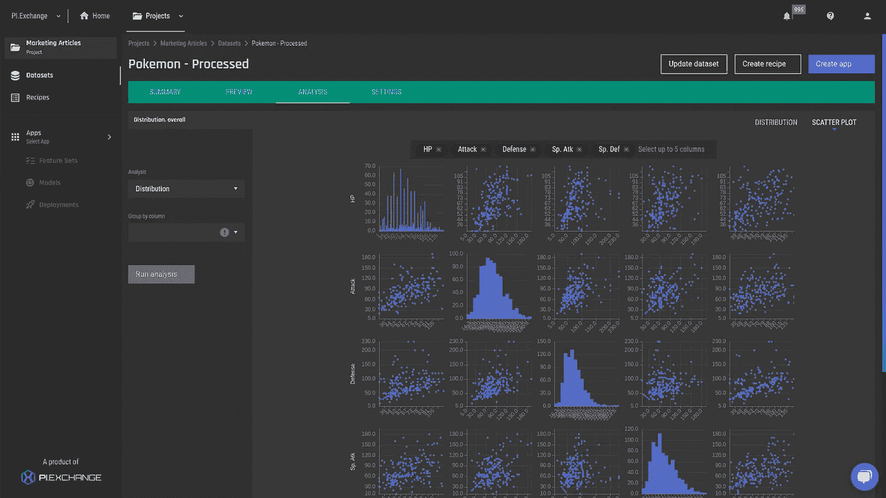

Fig 3 — Pair plot (zoomed in) — physical attributes on the AI & Analytics Engine (Image by Author)

我们肯定可以看到相关性(例如，`Defense`与`Attack`正相关，这意味着它们一起往往更高)，但很难找到任何分组，更不用说使用这种类型的图表和给定的数据来解释它们了。我们开始明白我们需要别的东西。

# 聚类应用程序—制定问题

> 特征/行为如何解决问题，解释特征或行为——简单的语言是最好的。

正如我们之前看到的，标准的数据分析工具对于寻找*自然*分组可能没有用，并且需要费力的手动分析。在我们的例子中，我们希望自动化这个过程，为此，我们可以使用集群应用程序。

我们的目标是使用*物理*神奇宝贝属性，例如:`HP, Attack, Defense, Sp. Atk, Sp. Def`和`Speed`来发现自然群体。然而，作为一个**健全检查，**我们将开始使用所有的物理属性加上一个额外的功能:`Legendary`，因为我们有理由相信传说中的神奇宝贝应该与其他的非常不同。毕竟，他们是传奇！

Fig 3.1 — Dialga — a legendary Pokémon (Photo from [Bulbagarden](https://bulbapedia.bulbagarden.net/wiki/Dialga_(Pok%C3%A9mon)))

传说中的神奇宝贝是“最强壮”的，因此，它们应该表现出高端的身体特征。通过数据分析，我们很容易看出这一点:

Fig 4 — Pair plot (zoomed in) — physical attributes grouped by the `Legendary` feature. The green dots represent the feature values for legendary Pokémon, and we can easily see that their physical attribute values are much higher compared to the non-legendary Pokémon (Image by Author)

我们希望 [AI &分析引擎](https://www.pi.exchange/)在使用这组功能时至少能找到两个不同的组。稍后，我们将**放弃**这个特性，让聚类应用程序尝试在没有它的情况下找到自然分组。**手动操作要困难得多！**

# 集群应用程序—实施

> 功能操作的作用-演示功能的使用。
> 
> 1)用截图走出来。
> 
> 2)记录在数据集上使用该特征的过程。

## 场景 1:使用`Legendary`列进行聚类

对于第一个场景，我们将详细介绍如何实现集群应用的所有阶段，以及如何理解生成的分析。我们首先创建一个新的应用程序:

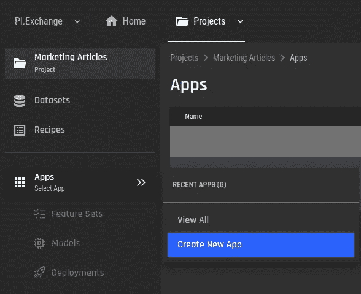

Fig 5 — New app creation on the AI & Analytics Engine (Image by Author)

然后，我们选择使用聚类应用程序，并选择要处理的数据集:

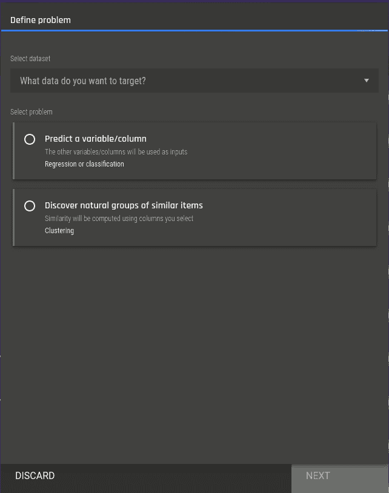

Fig 6 — Selecting the clustering app on the AI & Analytics Engine (Image by Author)

我们继续为集群选择所需的列。这一步是必需的，因为在确定两个神奇宝贝是否相似时，用户必须决定应该考虑哪些列。注意，为了帮助用户，我们提供了列分布的视图。

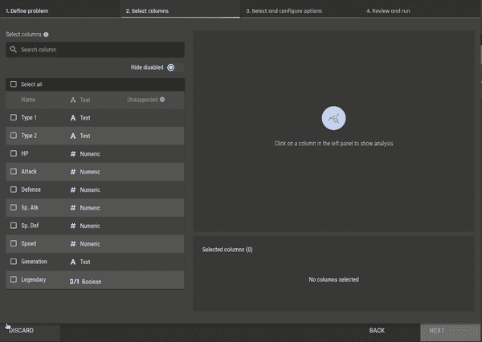

Fig 7 — Selecting features for clustering on the AI & Analytics Engine (Image by Author)

现在，我们需要选择聚类算法。我们将从选择一个“经典”算法开始:[高斯混合模型](https://brilliant.org/wiki/gaussian-mixture-model/) (GMM)。这个算法的细节已经超出了这篇博客的范围。我们事先不知道要找到多少个集群，所以我们只使用默认设置，它会搜索一系列选项，并自动选择最适合我们的一个:

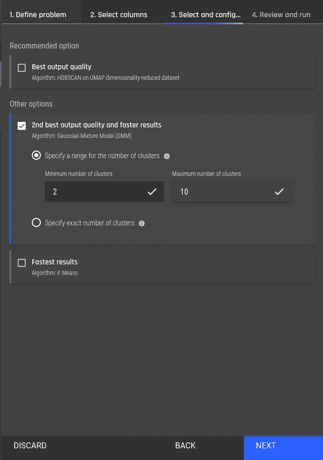

Fig 8 — Selecting a clustering algorithm on the AI & Analytics Engine (Image by Author)

最后，我们查看应用配置，并继续进行集群:

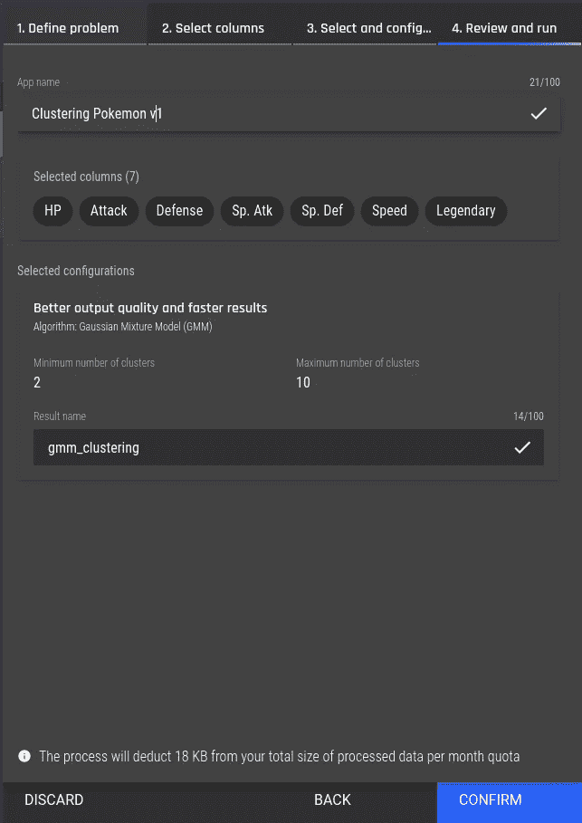

Fig 9 — Review the clustering configuration on the AI & Analytics Engine (Image by Author)

然后，我们进入集群应用程序窗口。我们可以看到重要的信息，例如数据集的大小、创建它的用户、为聚类分析选择的列以及训练聚类分析模型的当前进度。以及完成训练的模特。

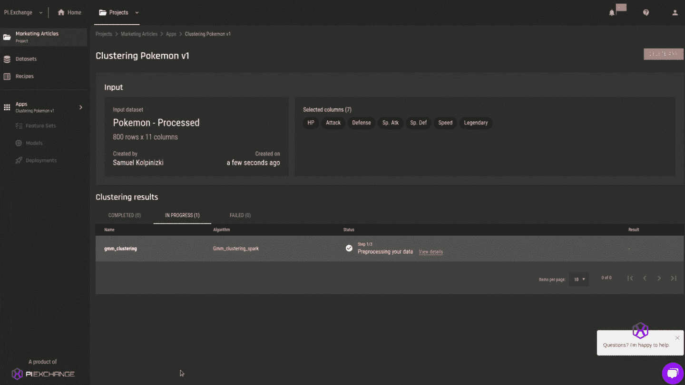

Fig 10 — Waiting for the clustering to finish on the AI & Analytics Engine (GIF by Author)

训练结束后，我们可以查看分析结果，并“理解”我们的集群和导出结果。我们有很多信息，所以下面的视频片段只是一个概述。在下面的概述中，我们将立即深入研究这些结果:

## 聚类分析概述视频:

[https://www . pi . exchange/hub fs/Video % 20 links % 20 for % 20 publications/04 _ clustering _ results _ overview . MP4](https://www.pi.exchange/hubfs/Video%20links%20for%20publications/04_clustering_results_overview.mp4)

# 聚类分析概述演练

首先，我们看到了分析的摘要。关键信息是 GMM 发现了 2 个集群，正如我们在查看按`Legendary`特征分组的数据分析时所怀疑的那样。此外，GMM 设法收集了所有可用的数据记录。

## 分析摘要

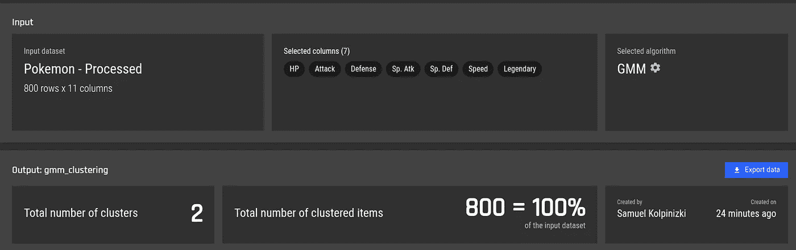

Fig 12 — Summary of GMM clustering result on the AI & Analytics Engine (Image by Author)

接下来，我们可以查看数据的低维(2D)表示，其中神奇宝贝特征的每个记录(7D 向量)都映射到该表示中的一个点:

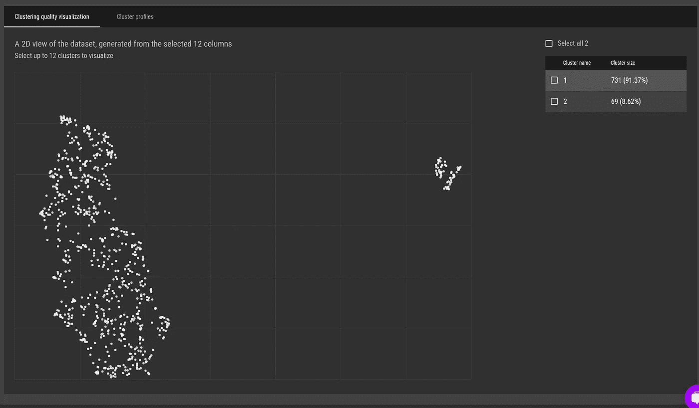

Fig 13–2D representation of Pokémon clusters on the AI & Analytics Engine (Image by Author)

此外，我们可以突出集群分配。我们看到它几乎完全匹配所呈现的结构，即，基本上代表两个集群的两个点滴。

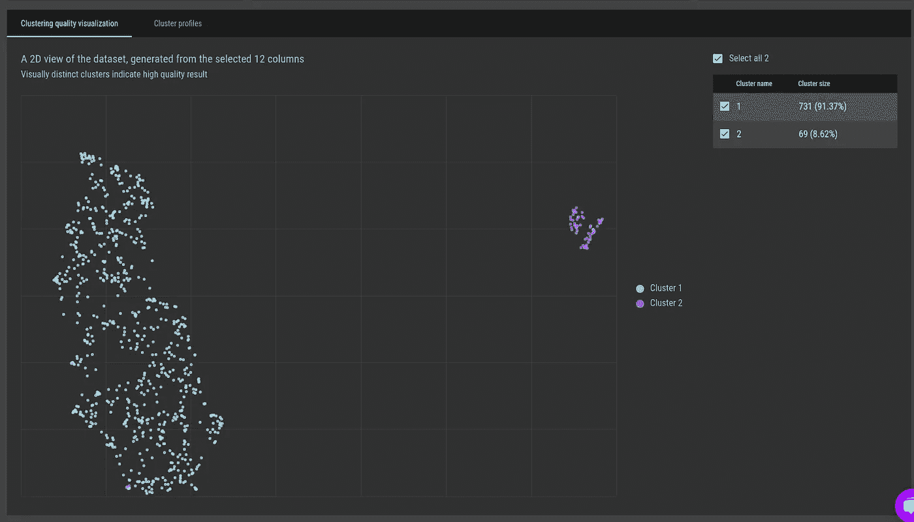

Fig 14 — representation of Pokémon clusters with GMM clustering assignments on the AI & Analytics Engine (Image by Author)

在我们深入解释之前，我们已经可以使用“Cluster profiles”选项卡对集群之间的差异有所了解。

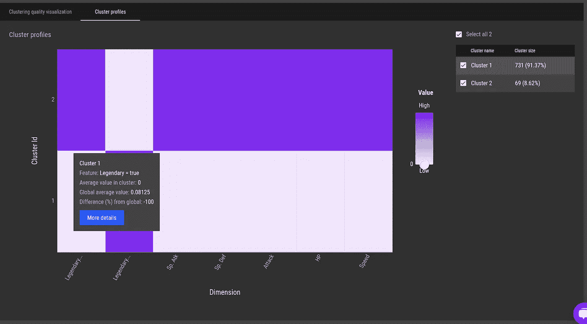

Fig 15 — Clustering profiles. A high-level overview of the differences between the clusters on the AI & Analytics Engine (Image by Author)

在 y 轴上，我们看到两个集群。

在 x 轴上，我们有最重要的特征(在这种情况下，是所有的特征)来帮助分类。每个像元的颜色表示特定分类和要素的要素平均值(与所有分类中该要素的平均值相比)。换句话说，如果我们在聚类之间对一个特征有很强的颜色差异，这意味着平均特征值在聚类之间有很大的不同，因此是一个很好的“分离”特征。

例如，我们可以看到，对于聚类 1(较大的聚类，包含 731 个点)，`Legendary_true`特征(它是分成它所包含的类别的原始`Legendary`特征，或者是`true`或者是`false`)是零！这比平均值低 100%,并且表明该群集中的所有神奇宝贝都不是传说中的神奇宝贝。

另一方面，我们在第二组中看到该特征的高值(高于平均值),这意味着相反的情况。即较小的集群是传奇神奇宝贝的集群。

此外，我们还可以看到，平均而言，传说中的神奇宝贝(集群 2)的物理属性往往具有更高的值，这与我们在按`Legendary`功能分组的分析中看到的结果一致。

接下来，我们希望得到一些“规则”，告诉我们如何准确地分离这些集群。我们可以通过对星团的“详细描述”来得到它们。

让我们深入研究第二组:

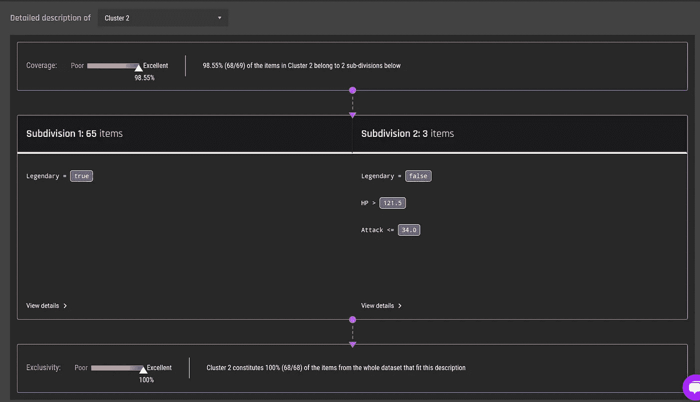

Fig 16 — Detailed description for cluster 2 on the AI & Analytics Engine (Image by Author)

首先，我们观察该集群的**覆盖率**。覆盖范围显示群中所生成说明适用的物料的百分比。我们还有**exclusive，**它显示了描述所适用的项目是否主要属于所选择的集群。

我们的覆盖率和排他性非常好，我们可以看到我们的描述解释了集群中除了一个以外的所有记录(神奇宝贝)。

规则也很简单。首先，我们看到，我们可以通过两个简单的规则集(称为“细分”)来描述集群中 69 个总点中的 68 个。

大多数被分配到聚类 2 (65 个项目)的记录有一个简单的规则:`Legendary == True`。

对于其余的 4 个记录，我们有 3 个可以在子部分 2 中描述。具体来说，他们不是`Legendary`，但仍然有很高的生命值(HP)，即`> 121.5,`，而`Attack`的生命值较低，为`< 34`。

如果用户有兴趣更深入地了解某个细分领域，可以点击附录中描述的细分领域中的“查看详情”。

## 场景 2:没有`Legendary`列的集群

在这一部分，我们将跳过全部细节，直接进入目标问题的核心。仅给定`['HP', 'Attack', 'Defense', 'Speed', 'Sp. Atk', 'Sp. Def']`的物理属性，我们能找到自然分组吗？

由于我们在上一节中介绍了完整的步骤，现在我们将跳过它们。我们在应用程序创建过程中要做的唯一改变是，在创建应用程序时的算法选择阶段，选择推荐的算法(UMAP + HDBSCAN，相对于我们在场景 1 中使用的 GMM，它被认为更健壮)。

在配置应用程序和运行培训后，我们得到了分析结果。我将简要介绍我们在观察结果后可以推断出的主要结论:

**总结**

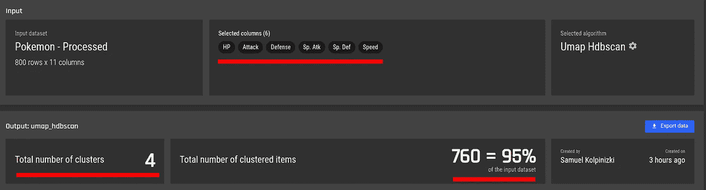

Fig 17 — Summary of UMAP + HDBSCAN clustering over (only) the physical attributes of Pokémon (Image by Author)

**关键信息:**

*   我们只对神奇宝贝的**物理属性**应用了算法。
*   我们发现了 4 个星团。
*   其中一个聚类表示实际上不属于任何聚类的“噪声点”。我们还可以看到，该算法未能将一个聚类分配给 5%的记录(40 个神奇宝贝)。

接下来，我们希望获得集群的一些可视化表示:

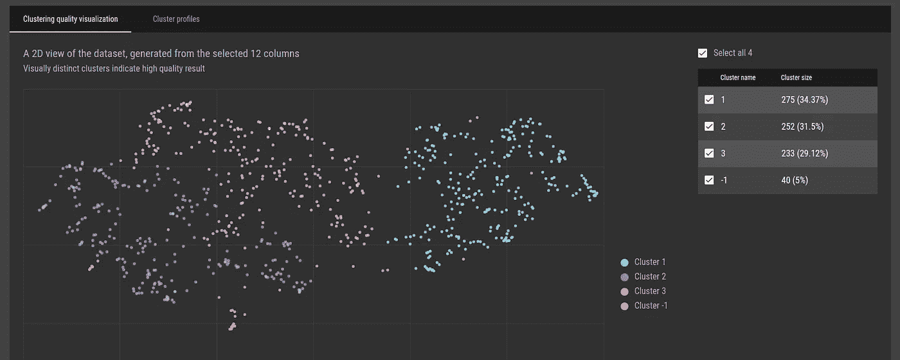

Fig 18 — Low dimensionality representation of records (Image by Author)

**关键信息:**

*   从视觉上看，似乎有人可以说实际上有两个不同的群体，而不是 T21，但这是有争议的。无论如何，点的接近，至少在`Cluster 2`和`Cluster 3`之间，表明这些组可能没有太大的不同。
*   一些噪声记录是明显的，并且均匀分布。

接下来，我们将查看集群配置文件，以获得对集群之间差异的高级理解:

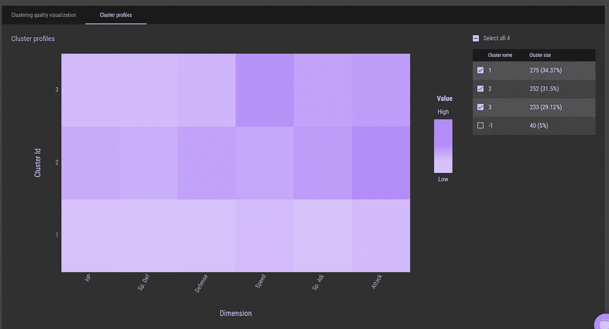

Fig 19 — Cluster profiles on the AI & Analytics Engine (Image by Author)

*   聚类之间的主要区别在于，`cluster 1`的特征的平均值低于它们在所有聚类中的平均值，而`cluster 2`和`cluster 3`的特征的平均值似乎高于它们在所有聚类中的平均值。
*   `Cluster 2`和`cluster 3`挺像的。似乎`cluster 2`的`Attack`和`cluster 3`的值较高，但`cluster 3`的`Speed`的值较高(平均)

在这一点上，我们已经对神奇宝贝的不同分组有所了解。如果我们组合`cluster 2`和`cluster 3`，我们基本上可以得到:

*   强神奇宝贝。
*   弱神奇宝贝。

这并不奇怪。此外，我们可以将强大的神奇宝贝分成另外两个组:

*   通常最先攻击的神奇宝贝。(更高`Speed`)。
*   更强的神奇宝贝(更高`Attack`)

如果我们对这个解释满意，我们可以将数据和集群 id 列一起导出到平台中，或者作为一个可下载的文件。

Fig 20 — Exporting results as a CSV file on the AI & Analytics Engine (GIF by Author)

如果需要进一步的信息，我们可以像以前一样继续这个流程，并获得详细的分析。例如，让我们试着描述一下`cluster 3`:

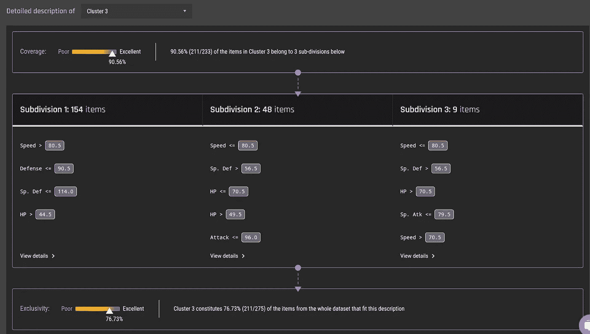

Fig 21 — Detailed description for ‘cluster 3’ on the AI & Analytics Engine (Image by Author)

我们首先需要考虑这样一个事实，对于这个集群，覆盖率与上一节相比要低一些。不过，还是不错的。因此，下面的细分解释适用于该组中的大多数项目。

我们已经预计这个集群一般会有很强的神奇宝贝，平均有更高的`Speed`，我们看到最大的细分确实有`Speed > 80.5`(很高)。

这一次，我们不会深入研究所有集群的所有细分。

最后一点，对于`cluster 3`，描述的排他性是好的，但不是伟大的。基本上就是说`cluster 3`中也有(相当多的)其他点**不是**，但是你还是可以用同样的规则来描述。

# 总结:(结果——重申好处)

*思考:结果是什么，结果是否比传统方法或编码更快/步骤更少？*

我们从一个神奇宝贝角色的数据集开始，问了一个问题:

> 我们能在这个数据集中找到自然群体吗？

我们看到，即使我们可以使用数据分析和按某些特征分组来找到一些清晰的分离，如果我们试图只根据神奇宝贝的物理属性来找到分组，也很难执行。

然后，我们演示了如何使用 [AI &分析引擎](https://www.pi.exchange/)的聚类应用程序自动执行这样的分析。

在很短的时间内(大约 15 分钟)，我们不仅成功地获得了一个可以下载或集成回引擎的聚类结果，还获得了一个详细的分析，该分析从聚类之间差异的高层次角度出发，将聚类决策分解到分隔每个聚类的确切规则和数值。

## 附录:细分细节

**提醒:**在场景 1 中，我们有 3 个细分。为了演示细分细节，让我们使用细分 2，它只有 3 个项目:

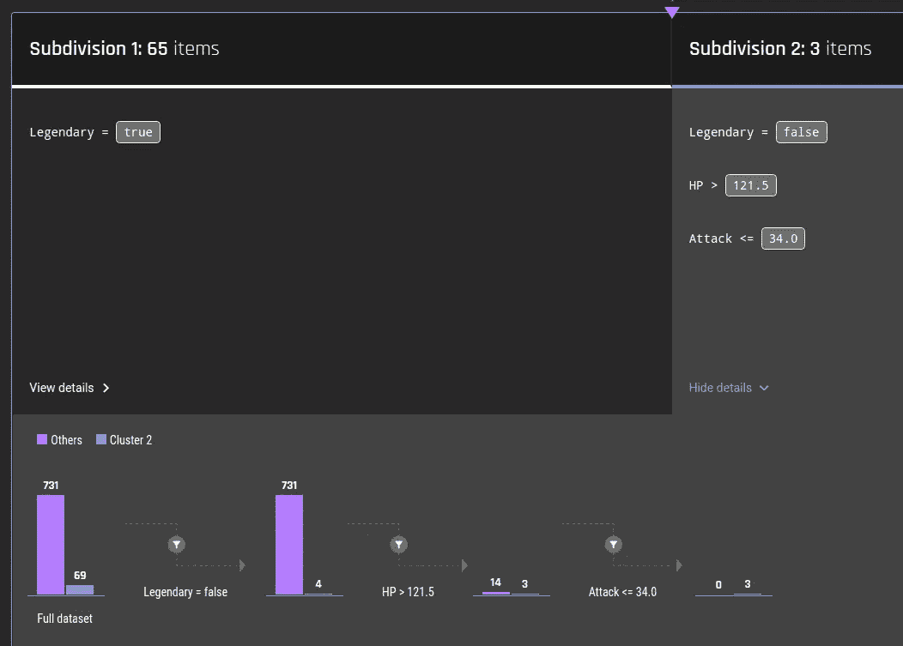

Fig 22 — Details of subdivision 2 for cluster 2 on the AI & Analytics Engine (Image by Author)

我们从左边开始阅读；

完整数据集包含:

*   69 条记录属于聚类 2。
*   属于所有其他聚类的 731 个记录。

我们使用细分规则进行过滤:`Legendary = false`。“其他人”仍然有 731 分(我们知道聚类 1 实际上包含所有非传奇的神奇宝贝)，但在聚类 2 中，我们现在只有 4 个非传奇的项目。

我们进一步检查有多少有`HP > 121.5`。(相对较高的值)

*   第一组 731 人中的 14 人。
*   第 2 组的 4 个中的 3 个。

最后，我们检查过滤后的集群中有多少具有`Attack <= 34`:

*   簇 1 中 14 个中的 0 个。
*   第 2 组的 3 个中的 3 个。

这就完成了感兴趣的细分中每个规则的记录数量的整个细分。

好吧，好吧，你可能不需要很快集群神奇宝贝，但我们保证跨领域有大量的用例。可以在**营销**中使用聚类来发现客户群；**流媒体服务**根据主题和信息对内容进行聚类，以及**保险提供商**对以特定方式使用保险的消费者进行聚类——仅举几例！

[人工智能&分析引擎](https://www.pi.exchange/)提供了[为期两周的免费试用](https://aiaengine.com/auth/register)——您可以亲自体验集群，试试吧！

 [## Mlearning.ai 提交建议

### 如何成为 Mlearning.ai 上的作家

medium.com](/mlearning-ai/mlearning-ai-submission-suggestions-b51e2b130bfb)