# 聚类 Python 中的简单解释和实现。

> 原文：<https://medium.com/mlearning-ai/clustering-simple-explanation-and-implementation-in-python-3b68ca83bfc?source=collection_archive---------0----------------------->

在本文中，我详细解释了两种流行的聚类算法，K-Means 聚类和层次聚类，以及它们在 Python 中的实现。

Photo credits — [Shlomo Shalev](https://unsplash.com/@shlomo99) on Unsplash

无监督算法是一种不使用带有标签的过去数据来进行预测的算法。

聚类是一种流行的无监督机器学习算法。这里，具有相似性的观察值被分组在一起，形成一个**簇**。聚类的基本思想包括对数据进行分段，这样，具有相似性的观察值被分组在一起。如此形成的片段应该是稳定的；这意味着两组不能包含相同的观察值或相同的数据点。

我们将看到聚类如何工作，它的类型(K 表示聚类算法和层次聚类算法)以及它如何帮助得出有用的结论，进一步，借助一个非政府组织的数据集。

# k 表示聚类

我们先来了解一些重要的概念。

## 欧几里得距离

观察结果之间的相似性是通过一种叫做**欧几里德距离的度量来衡量的。**

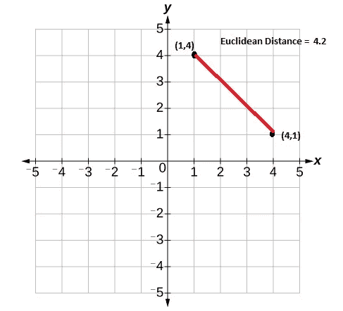

Euclidean Distance between 2 points in a 2-D Cartesian system

两点(x1，y1)和(x2，y2)之间的欧几里德距离计算如下:

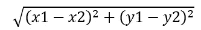

所以在上图中，两点(1，4)和(4，1)之间的欧氏距离为:

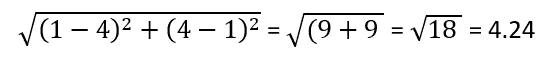

## 图心

一个星团的中心叫做**质心。**通过取一个聚类中所有数据点的坐标的平均值来计算。例如，假设我们在一个集群中有 3 个数据点，(x1，y1)，(x2，y2)，(x3，y3)。质心(X，Y)的坐标计算如下:

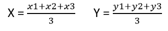

现在，假设您有一组数据点要分成两个组。 **K 均值聚类**算法工作如下:

1.  为给定的点集任意选择两个质心，因为我们想要两个聚类。
2.  将每个数据点分配给每个质心，这意味着计算每个数据点到每个质心的欧几里德距离。这一步叫做**赋值**。
3.  现在，根据欧几里德距离，每个点属于聚类 1 或聚类 2。基于这个分组，用上面提到的质心公式计算新的质心。这个步骤被称为**优化**。
4.  基于上述质心坐标重新形成聚类。

**分配**和**优化**步骤重复进行(称为迭代),直到质心坐标保持不变或算法收敛。

## k 均值++算法

在 K-Means 算法中，我们根据想要形成的簇的数量任意选择初始质心。K-Means++算法是决定这些初始质心的一个更聪明的方法。涉及的步骤如下:

1.  决定要形成的聚类的期望数量(假设 3 个)，并选择数据点集中的任意点作为第一个质心。
2.  从第一个质心开始计算每个数据点的欧几里德距离，并将它们平方。
3.  根据获得的值，选择最远的数据点作为第二质心。
4.  重复步骤 2 中的过程，这一次对两个质心，并决定最远的点作为第三个质心。

K Means++算法有助于 K Means 算法更快地收敛，即与随机确定初始质心相比，获得最终质心所需的迭代次数更少。

使用 K 均值算法时要考虑的一些缺点是:

1.  要形成的集群的数量应该在一开始就决定。
2.  所选的初始质心定义了最终将如何形成簇。
3.  此外，由于 K 均值算法对离群值敏感，直观上，离群值将抑制最佳聚类的形成。

## 肘法和剪影评分法

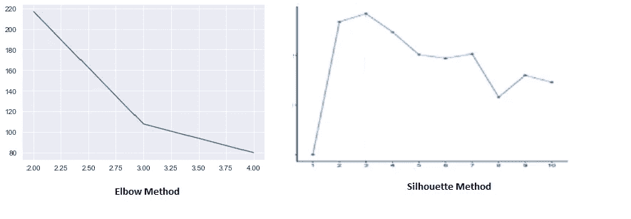

仅仅通过查看数据来决定集群的数量有时很困难。为了找到 K 均值聚类的最优聚类数，有两种方法派上了用场:肘形法和剪影评分法。根据我们的数据，这两种方法都给出了可以形成的簇的数量。

**肘图**是从每个点到其指定中心的 SSD(距离的平方和)和集群数量之间的图形。它是一个臂状图，在特定的簇数值处弯曲。该值应该是 K 均值聚类中要考虑的初始聚类数的最佳估计值。

**轮廓分数**显示了一个聚类中的每个点与相邻聚类中的点的接近程度。基本上，它衡量所形成的集群的好坏。如果有 2 个聚类，理想地，两个聚类的数据点之间的**聚类间**距离应该高，而一个聚类内的数据点之间的**聚类内**距离应该低。使用以下公式计算轮廓分数:

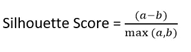

其中:

**a** 是数据点到该数据点不属于的最近聚类中的点的平均距离。

**b** 是到其自身聚类中所有点的平均聚类内距离。

所以理想情况下， **a** 应该最大， **b** 应该最小。

轮廓得分范围的值介于-1 到 1 之间。分数越接近 1，表示该数据点与聚类中的其他数据点非常相似。接近-1 的分数表示该数据点与其聚类中的数据点不相似。

# 分层聚类

我们看到，在 K 均值聚类算法中，要形成的聚类的数量必须在开始时自己决定。在分层聚类中，情况并非如此。这里有一系列数据点的合并或划分，这取决于我们所遵循的层次聚类的类型。有两种类型的层次聚类:**凝聚型**和**分裂型。**

系统聚类的输出称为**树状图。**凝聚法是自下而上的方法，而分裂法是自上而下的方法。

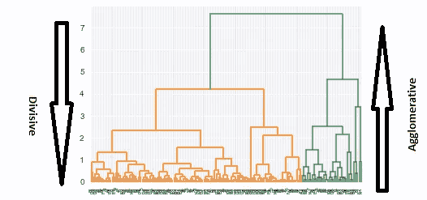

Dendrogram in Hierarchical Clustering

让我们详细讨论一下凝聚法。分裂方法与凝聚方法正好相反。

假设我们有 **N** 个数据点。凝聚层次聚类的步骤如下:

1.  最初，每个点本身都被视为一个簇。所以我们有 N 个集群。
2.  计算每个点与其他点之间的距离，并形成 **NxN** 矩阵。
3.  具有最小距离的两个点被组合在一起。
4.  然后合并两个具有最小距离的聚类。
5.  重复步骤 4，直到形成一个包含所有数据点的大聚类。

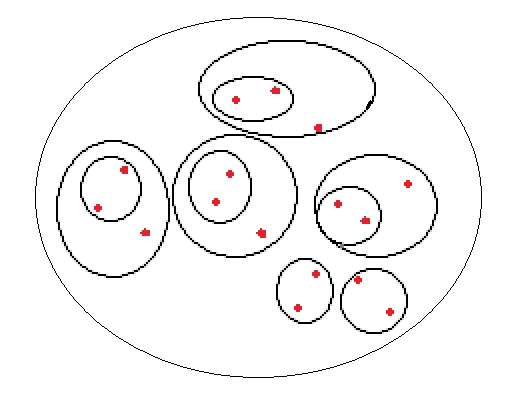

Agglomerative Hierarchical Clustering

这种群集的合并取决于所遵循的链接类型。有 3 种类型的链接:

1.  **单个链接:**根据两个聚类中的点之间的最短距离来合并两个聚类。
2.  **完全链接:**根据两个聚类中的点之间的最长距离来合并两个聚类。
3.  **平均链接:**根据一个聚类的每个点到另一个聚类的每个其他点之间的平均距离来合并两个聚类。

一旦形成了树状图，下一步就是在适当的层次上切割树状图。这条切割线与树状图相交的点的数量给出了形成的簇的数量。

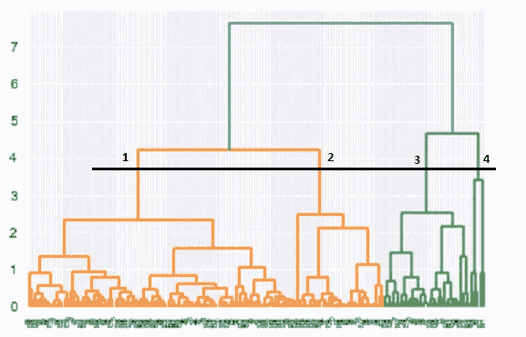

Cutting Line intersecting Dendrogram forming 4 clusters

这里我们可以看到切割线与树状图相交于 4 个点，所以我们有 4 个聚类。如果我们在第 5 行或以上的位置切割树状图，我们将得到 2 个聚类。

层次聚类的主要优点是我们不必一开始就决定聚类的数量。缺点是，它既复杂又耗时。

# K 均值聚类和层次聚类的 Python 实现。

我们有一个非政府组织的数据集。这个非政府组织已经筹集了一些资金，并打算捐给那些急需援助的国家。我们需要使用一些决定国家整体发展的社会经济和健康因素对国家进行分类，并找出最需要帮助的 5 个国家。我的 GitHub 个人资料上有完整的 Python 代码和图表，文章末尾有链接。

我们的目标是使用 K-Means 和层次聚类算法建立聚类模型，找出最需要援助的 5 个国家。

我们从导入必要的库开始。

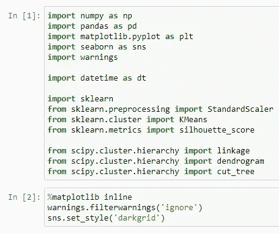

我们将数据加载到熊猫数据框中，并将其命名为“ngo”。我们将此数据框架用于 EDA(探索性数据分析)。

基本分析显示数据帧有 167 行和 10 列。此外，数据是干净的，没有丢失的值。

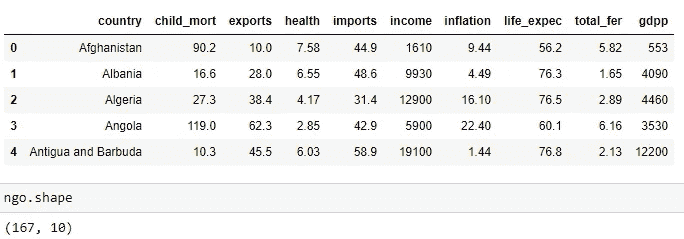

离群值分析显示 child_mort、gdpp 和 income 列存在离群值。我们剔除异常值。

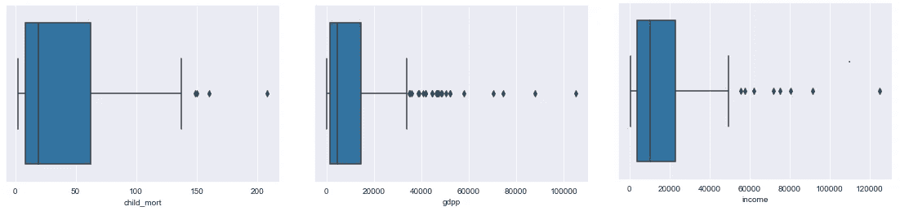

我们执行单变量、双变量和多变量分析，如图所示。

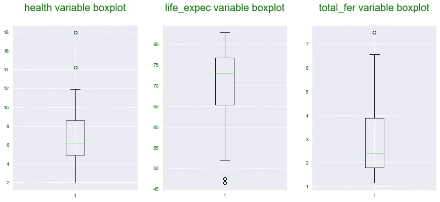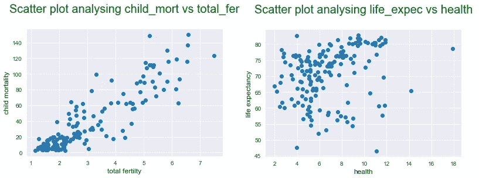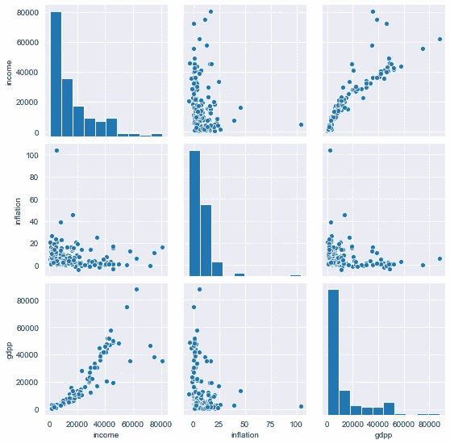

## 构建聚类模型

我们需要通过比较每个国家集群的变量——**国内生产总值**、**儿童死亡率**和**收入**如何变化来形成集群，以识别和区分发达国家集群和不发达国家集群。

我们通过过滤掉上面提到的列来形成新的数据帧 new_df。此外，使用 sklearn 包中的**标准缩放器**对该数据帧进行缩放。

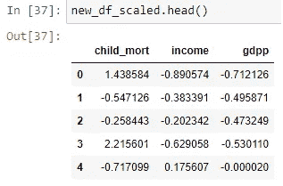

对于构建任何聚类模型，首先重要的是检查是否可以利用现有的数据形成有效的聚类。这是通过使用**霍普金的分数**确定的。分数越高，在数据中形成聚类的趋势越好。对于我们的数据，霍普金的得分为 91%或 0.91%。所以这些数据可以用来形成好的聚类。

1.  **K 表示聚类**

我们需要在一开始就决定要形成的星系团的数量。我们使用肘法和剪影评分法来确定相同。

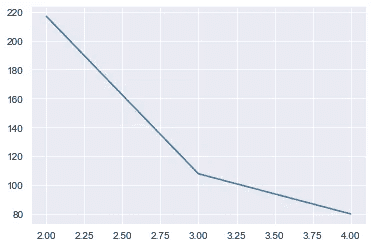

Elbow curve shows optimal clusters value as 3

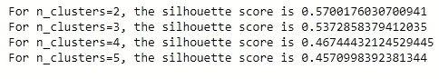

根据这两种方法，我们决定使用 **3** 作为最佳聚类数。

根据 K 均值算法，我们得到以下 3 个聚类:

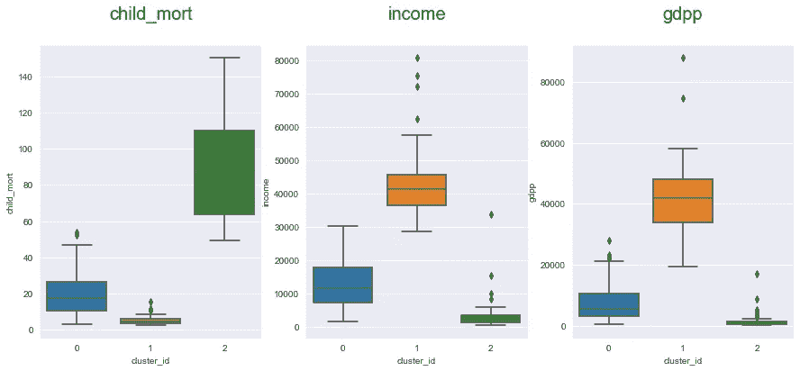

3 clusters given by K Means algorithm

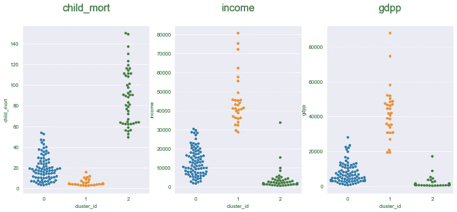

Swarm plot showing 3 clusters data

如此形成的集群如下:

*   第 0 组:中等儿童死亡率，中等收入，中等国内生产总值。
*   第一组:低儿童死亡率、高收入、高 GDP。
*   第二组:高儿童死亡率、低收入、低 GDP。

第二组将给我们想要的结果。

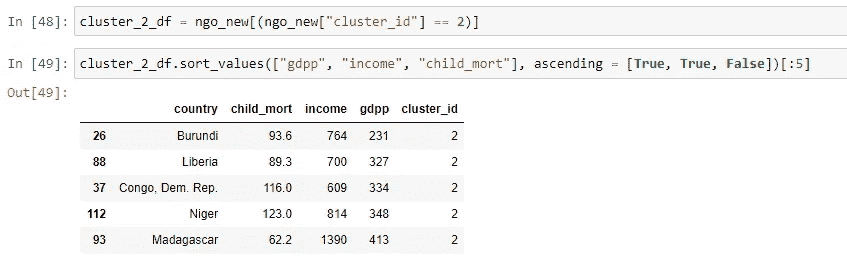

所以急需援助的国家是:

*   布隆迪
*   利比里亚
*   刚果民主共和国。代表
*   尼日尔
*   马达加斯加

现在让我们看看使用层次聚类会得到什么结果。

**2。层次聚类**

我们在 new_df_scaled 中已经有了缩放后的数据。利用完全连锁我们生成了树状图。

我们在第 4 行切割树状图，得到 **4** 作为最佳聚类值。我们得到以下集群:

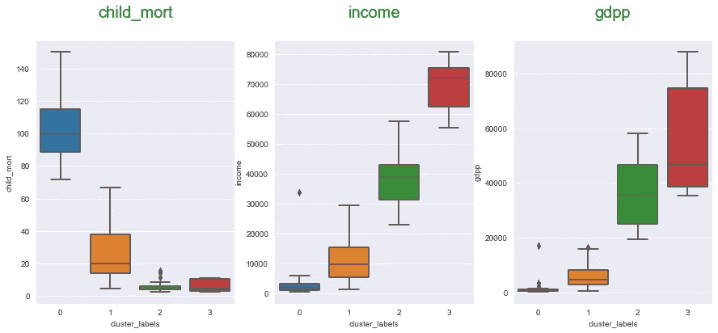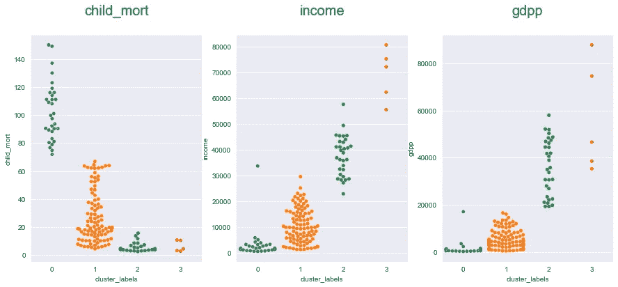

这样形成的四个集群是:

*   第 0 组:儿童死亡率高，收入范围最低，国内生产总值范围最低。
*   第 1 组:中等儿童死亡率，中低收入范围，中低国内生产总值范围。
*   第二组:低儿童死亡率，中等收入范围，中等国内生产总值
*   第 3 组:最低的儿童死亡率范围，非常高的收入范围，非常高的国内生产总值

第 0 组将给出我们想要的结果。

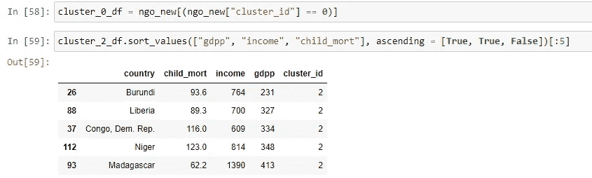

因此，最需要援助的 5 个国家是:

*   布隆迪
*   利比里亚
*   刚果民主共和国。代表
*   尼日尔
*   马达加斯加

***结论:我们可以看到，虽然 K-Means 聚类和层次聚类形成的聚类数目不同，但两种算法给出的结果是相同的。***

*希望这篇文章内容翔实，易于理解。我也希望你喜欢分析中的彩色图表。*

请随时评论并给出您的反馈。

***可以在 LinkedIn 上联系我:***[***https://www.linkedin.com/in/pathakpuja/***](https://www.linkedin.com/in/pathakpuja/)

***请访问我的 GitHub 简介获取 python 代码:***[***https://github.com/pujappathak***](https://github.com/pujappathak)