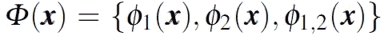
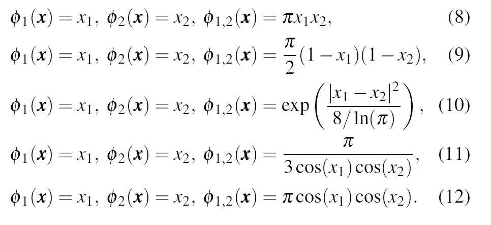
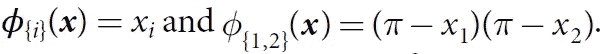
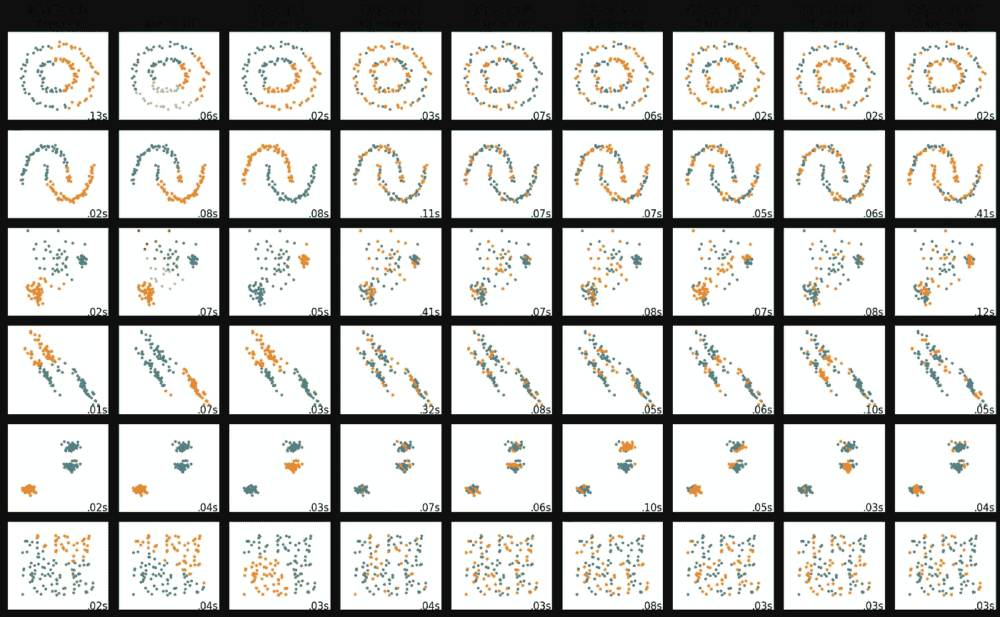

# 使用量子核的聚类—教程

> 原文：<https://medium.com/mlearning-ai/clustering-using-quantum-kernels-tutorial-dcd90bf6440c?source=collection_archive---------0----------------------->

我们使用 Qiskit 和 sklearn 在玩具数据集上执行一些聚类。我们使用 qiskit_machine_learning 库来生成一个量子内核。然后在 sklearn 中将该核应用于谱聚类。

整篇教程可以在这里作为 jupyter 笔记本获得。

本教程基于铃木等人的一篇论文。艾尔。，它本身是对先驱论文*的研究*Havlíek 等人的【1，2】*用量子增强特征空间*进行监督学习。铃木等人。在他们的论文中，研究了两个量子位的分类器。输入数据点被映射到酉算子，**

**

*输入数据被映射到酉算子。U(x)是用于形成量子电路的幺正门。*

*编码函数如下所示*

**

*将输入数据点转换到更高维特征空间的编码函数。*

# *步骤 0-导入*

*我们需要一些实用功能来处理数据和绘图。我们还需要 qiskit、qiskit_machine_learning 和 sklearn 库。*

# *步骤 1-编码特征地图*

*铃木等人。艾尔。呈现五种编码功能*

**

*铃木等人的五个编码函数。艾尔。*

*此外，我们还包括 Havlíek 等人使用的编码函数。*

**

*Havlíek 等人的编码函数。艾尔。，whcih 也是 PauliFeatureMap 的默认编码函数*

*这是 qiskit-machine-learning 中 PauliFeatureMap 的默认编码函数*

*编码功能实现如下*

# *第二步——量子内核*

*输入数据点被映射到酉算子，*

**

*输入数据被映射到酉算子。U(x)是用于形成量子电路的幺正门。*

*这是使用 PauliFeatureMaps 实现的量子电路。我们指定所使用的浇口类型，在这种情况下，如等式 6 中给出的 *ZI、*和 *ZZ* 。然后在 data_map_func 中指定编码函数。也可以指定循环次数。*

# *步骤 3 —聚类*

*上面制备的量子核现在可以用于谱聚类。我们还包括 KMeans 和均值漂移聚类进行比较，并给出量子内核如何操作的直觉。*

# *结果*

*实验结果如下所示*

**

*Clustering of some toy datasets (Moons, Circles and Linearly Separable) using Quantum Kernel based Spectral Clustering. The quantum kernels used encoding functions given in refs [1,2]. The results of the quantum kernel classifiers are compared to KMeans and Means Shift.*

*对于每个数据集，基于量子核的聚类根据编码函数而变化。对于 Circles 数据集，等式 11 和 12 往往表现得更好。这当然是从它们的余弦形式来看的。通过调整电路重复、纠缠和泡利等参数，可以进一步优化性能。*

*然而，这个实验中突出的一个重要方面是编码功能。铃木等人给出的函数。艾尔。对数据是如何分布的有一种直觉。这意味着对于新的数据集，需要“学习”这些编码功能。一种可能的方法是量子世代对抗网络(qGAN)。我们将很快探索它们。*

*我在这里用 Amira Abbas 在最近一个关于量子机器学习的视频中的一个提示作为结束，“正确设定你的期望。”*

# *参考*

1.  *、y、矢野、h、高、Q. *等*基于核的量子分类器的特征图分析与合成。*量子马赫。智能。* **2、** 9 (2020)。[https://doi.org/10.1007/s42484-020-00020-y](https://doi.org/10.1007/s42484-020-00020-y)*
2.  *havlíek，v .，Córcoles，A.D .，Temme，K. *等*利用量子增强特征空间的监督学习。*性质* **567，**209–212(2019)。[https://doi.org/10.1038/s41586-019-0980-2](https://doi.org/10.1038/s41586-019-0980-2)*
3.  *[arXiv:2101.11020](https://arxiv.org/abs/2101.11020)T20【quant-ph】*
4.  *[量子内核机器学习— Qiskit 机器学习 0.1.0 文档](https://qiskit.org/documentation/machine-learning/tutorials/03_quantum_kernel.html)*