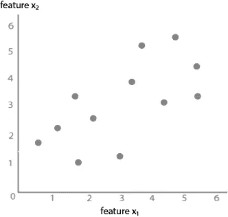
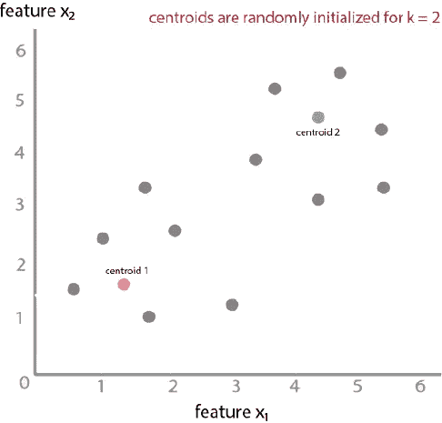
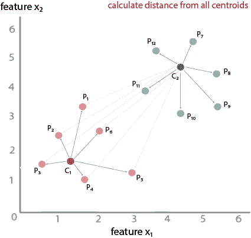
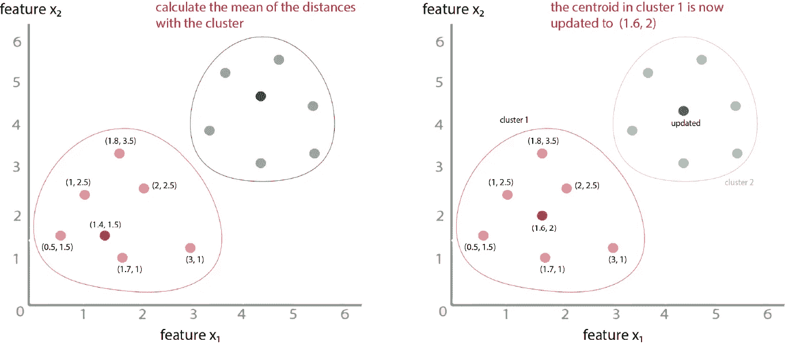
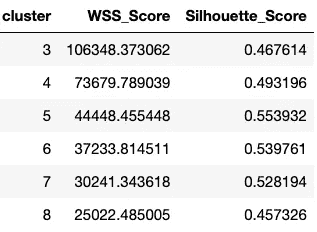
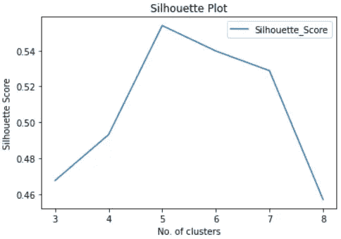
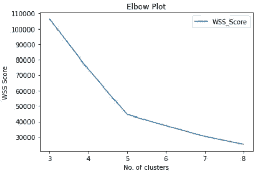

# K-Means 简化版:K-Means 算法初学者指南

> 原文：<https://medium.com/mlearning-ai/clustering-with-k-means-c967ef5c292a?source=collection_archive---------4----------------------->

## 数据科学|机器学习|算法

## 学习最简单的无监督聚类算法之一的逐步方法

Credits: [https://unsplash.com/](https://unsplash.com/)

K-means 聚类属于无监督学习算法家族。它旨在将相似的对象分组以形成集群。K-means 聚类中的 K 指的是您确定的所需聚类数。

当数据集包含一些要素和标注时，可以使用监督学习算法，如逻辑回归、支持向量机等。这些算法学习将输入要素映射到标注的函数。但是在有**无** **标签的情况下，**我们就不能用监督学习了。这就是分组和聚类概念派上用场的地方。处理无标注数据集的一个简单方法是在数据中找到彼此相似的观察值，并将它们组合在一起形成聚类。

现在我们对 K-Means 和聚类有了一些基本的了解，让我们看看 K-Means 聚类中涉及的步骤。

让我们用一个例子来理解这一点:

图 1 显示了二维绘制的原始数据。

Fig 1: Original dataset — Image created by the author

**第一步:**选择聚类数 K(你决定)。对于这个例子，我们将选择 k = 2。

步骤 2: 该算法随机初始化质心。对于 k =2，两个质心将被随机初始化。

Fig 2: Centroid Initialization — Image created by the author

**步骤 3:** 通过计算质心和数据点之间的欧几里德距离，将每个数据点分配到最近的质心。

**二维空间中两点(X₁，Y₁)和(X₂，Y₂)之间的欧氏距离**计算为√(X₂-X₁) + (Y₂-Y₁)

Fig 3: Cluster Formation — Image created by the author

C1 和(P1、P2、P3、P4)之间的距离。。。P12)、C2 和(P1、P2、P3、P4、。。。P12 ),并且与任一质心具有相对较短欧几里得距离的那些点将被分配给该特定质心。例如，如果 C1-P1 距离是 10 个单位，C2-P1 距离是 15 个单位，P1 将被分配给质心 1。计算完所有距离后，将形成两个集群，如下图 4 所示。

注意:与其他基于距离的算法一样，标准化数据点总是更好，因为不同的变量可能有不同的标度，从而影响误差平方和。

**步骤 4:** 通过取聚类的平均值来更新质心。

Fig 4: Centroids Updated — Image created by the author

一旦这些点与它们最近的质心相关联，该算法就计算聚类的平均值。例如，聚类 1 的平均值将是(1.8 + 2 + 3 + 1.7 + 0.5 + 1 ) / 6，(3.5 + 2.5 + 1 + 1 + 1.5 + 2.5 )/6，这是近似值。 **( 1.6，2 )** 。因此，聚类 1 中的质心更新为(1.6，2)。对于所有集群，此过程并行发生。

**步骤 5:** 重复步骤 3 和 4，直到质心位置没有变化。

除非数据点成为新聚类的一部分，否则由于质心和欧几里德距离的更新，聚类的平均值不会改变，质心也不会进一步更新。

关于这个算法的详细实现，请访问我的 Github 知识库，这里:【https://github.com/swapnilin/K-Means-Clustering 

**评估指标**

正如您在上面注意到的，对于 K-means 聚类，第一步是决定 K 的值，该值应该在训练模型之前已知。它是一个超参数，而不是模型参数。我们可以用侧影测量法或肘法来找出 k 的最佳值。

“**剪影**值是一个**度量值**，用于衡量一个对象与其自己的聚类(内聚)相比与其他聚类(分离)有多相似。轮廓**的范围**从 1 到+1。接近+1 的轮廓系数表明样本远离相邻的聚类。值为 0 表示样本位于或非常接近两个相邻聚类之间的判定边界，负值表示这些样本可能被分配到错误的聚类。— *维基百科*

表 1 显示了不同 k 值下获得的侧影得分和平方和(WSS)得分。根据获得的侧影值，您可以绘制侧影图来确定聚类数。在这种情况下，k = 5 将是聚类的最佳值。

Table 1: WSS and Silhouette Scores — [https://github.com/swapnilin/K-Means-Clustering](https://github.com/swapnilin/K-Means-Clustering)

Fig 5: Silhouette Plot — [https://github.com/swapnilin/K-Means-Clustering](https://github.com/swapnilin/K-Means-Clustering)

“肘形法**包括绘制解释的变化作为聚类数的函数，并选择曲线的肘形作为要使用的聚类数。”— *维基百科***

图 3 显示了通过使用表 1 中的 WSS 分数绘制的肘图。正如我们所看到的，弯头是在 k = 5 时创建的，因此我们将选择 k 的最佳值为 5。

Fig 6: Elbow Plot — [https://github.com/swapnilin/K-Means-Clustering](https://github.com/swapnilin/K-Means-Clustering)

对于使用 Python 的 K-Means 集群的**实现**，我建议检查我的 [GitHub](https://github.com/swapnilin/K-Means-Clustering) 库上的代码。

感谢您的阅读。如果您有更多问题，请通过 LinkedIn 联系。

 [## Swapnil Kangralkar

### Swapnil Kangralkar。我是加拿大渥太华的一名数据科学家。

swapnilin.github.io](https://swapnilin.github.io/)  [## Mlearning.ai 提交建议

### 如何成为 Mlearning.ai 上的作家

medium.com](/mlearning-ai/mlearning-ai-submission-suggestions-b51e2b130bfb)