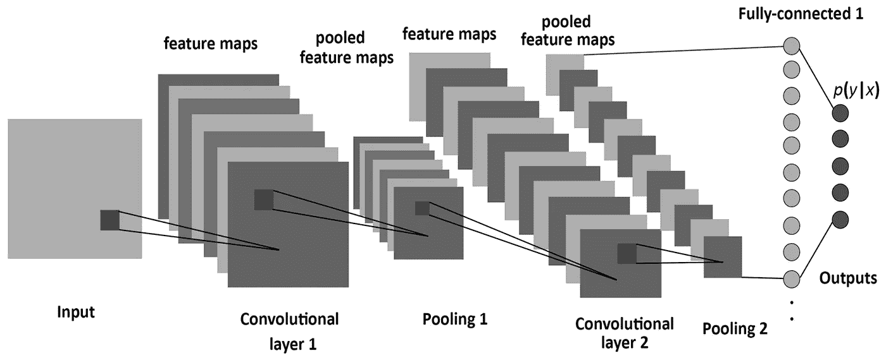
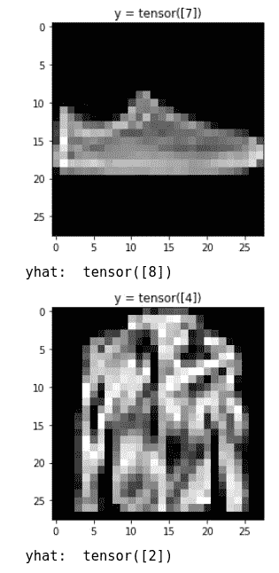

# 带 PyTorch 的 CNN

> 原文：<https://medium.com/mlearning-ai/cnns-with-pytorch-6cf7ed114af7?source=collection_archive---------5----------------------->

## 基于时尚 MNIST 数据集的两层卷积神经网络


Photo by [Lum3n](https://www.pexels.com/@lum3n-44775) from [Pexels](https://www.pexels.com/)

# 数据集处理

在这个项目中，我们将使用 [MNIST 时尚数据集](https://github.com/zalandoresearch/fashion-mnist)，这是一个众所周知的数据集，恰好作为 PyTorch 库中的一个玩具示例出现。

时尚-MNIST 数据集被提议作为 MNIST 更具挑战性的替代数据集。它是一个数据集，由 10 种服装的 60，000 个小正方形 28×28 像素灰度图像组成，如鞋子、t 恤、连衣裙等。

你可以在这里找到这篇文章的[回购](https://github.com/augustodn/pytorch_FashionMNIST)，如果你想跟随代码旁边的评论。简单地说，数据集图像不会被重新缩放，因为我们希望以更高的训练率为代价来提高预测性能。因此，发生的唯一变换将是把图像作为张量对象(矩阵)处理所需的变换。

# 构建模型

众所周知，卷积神经网络(CNN)是计算机视觉中最常用的架构之一。这种架构通常可以在 90%的准确度范围内获得令人印象深刻的结果。不仅如此，这些模型倾向于[很好地概括](https://developers.google.com/machine-learning/crash-course/generalization/video-lecture)。

CNN 由包括卷积和激活的几个变换组成。几个层可以连接在一起，以增强特征提取(是的，我知道你在想什么，我们向模型提供原始数据)。一般来说，我们使用卷积来减少要处理的信息量，同时保持特征完整。这有助于我们减少最后一层的输入(和神经元)数量。如果你想要更深入的解释，这里有一个很好的资源。对于这种特殊情况，我们将使用内核大小为 5 的卷积和大小为 2 的最大池激活。

如果你是卷积的新手，这里也有一个很好的视频，在最初的几分钟里，展示了卷积是如何发生的。这是一个很好的动画，它帮助我们形象化[的概念以及流程如何工作](https://www.youtube.com/watch?v=8rrHTtUzyZA)。此外，如果你想知道更多关于最大池激活，这里有另一个[视频](https://www.youtube.com/watch?v=ZjM_XQa5s6s)的额外细节。同样重要的是，卷积核(或滤波器)权重(参数)将在训练期间学习，以便优化模型。

设计模型时最困难的部分之一是确定矩阵的维数，这需要作为卷积和最后完全连接的线性层的输入参数。最后一层帮助我们确定预测的类别或标签，在这种情况下，这些是不同的服装类别。



Convolutional Neural Network architecture implemented

我们将创建一个 2 层 CNN，其中最大池激活函数通过管道传输到卷积结果。因为我们不想失去图像的边缘，我们将在卷积发生之前添加填充。在整个项目中，我们将使用 m=n(行等于列)的方阵。我们将矩阵输入维度称为`I`，在这种特殊情况下，原始图像为`I = 28`。同样，输出矩阵的维数将用字母`O.`表示

# 卷积参数

```
kernel = 5
padding = 2
stride = 1
dilation = 1
```

给定这些参数，卷积处理后的新矩阵维数为:

`O = I + 2 p - k + 1`

`O = I`

其中:

*   填充
*   k:内核大小
*   I:输入矩阵大小
*   o:输出矩阵大小

# 最大池激活参数

对于 MaxPool 激活，默认情况下 stride 是内核的大小。参数包括:

```
kernel = 2
padding = 0
stride = 0
dilation = 1
```

在这种情况下，最大池激活后的新矩阵维数为:

`O = (I - k)/s + 1`

`O = (I - 2)/2 + 1`

`O = I/2`

如果你对在几个过滤过程后确定矩阵维数感兴趣，你也可以看看这个: [CNN Cheatsheet CS 230](https://stanford.edu/~shervine/teaching/cs-230/cheatsheet-convolutional-neural-networks)

# 实际项目矩阵维度

经过前面的讨论，在这种特殊情况下，项目矩阵的维度如下

*   在第一次卷积之后，创建了 16 个 28×28 像素的输出矩阵。
*   最大池激活后矩阵的尺寸为 14x14 像素。
*   第二次卷积后的 32 个结果矩阵具有与第一次卷积相同的内核和填充，其维数为 14x14 px。
*   最后，在最后一次最大池激活后，生成的矩阵具有 7x7 px 的维度。

最后一次最大池激活后的 32 个通道(每个通道有 7x7 px)在展平通道后总计 1568 个输入到完全连接的最终层。

下面的类显示了`forward`方法，在这里我们定义了如何在模型中组织操作。这是，这是我们设计神经网络架构的地方。PyTorch 提供了一种替代方式，称为`Sequential`模式。这里可以了解更多[。正如您可能注意到的，第一个转换是一个卷积，接着是一个](https://pytorch.org/docs/stable/generated/torch.nn.Sequential.html) [Relu](https://towardsdatascience.com/understanding-relu-the-most-popular-activation-function-in-5-minutes-459e3a2124f) 激活，然后是一个 MaxPool 激活/转换。如前所述，卷积充当特征提取过程，其中预测器被保留，并且信息被压缩。这样，我们可以在不丢失输入数据的情况下更快地训练网络。

# 确定优化器和数据加载器

在对我们的神经网络建模之后，我们必须确定损失函数和优化参数。因此，我们将选择交叉熵策略作为损失函数。该函数通常选择非二进制分类变量。这里有一篇很棒的文章可以让你了解更多。为了确定最小成本，我们将使用随机梯度下降策略，这几乎是在我们的数据不适合内存的情况下的普通风格。使用 SGD，使用批次和几个步骤，运行损失函数以寻找至少一个局部最小值。为此，我们将创建`train_loader`和`validation_loader`迭代器。

# 训练模型

如前所述，我们将通过数据运行一些训练迭代(历元)，这将分几批完成。然后，我们将使用验证数据检查模型的准确性，最后我们将重复这一过程。值得注意的是`optimizer.step()`为下一次迭代调整模型权重，这是为了最小化真实函数 y 的误差

最后，我们将追加每个历元的成本和精度值，并绘制最终结果。分析剧情。我们将看到，随着模型调整权重并从训练数据中“学习”，成本如何下降，准确度如何提高。

# 分析结果

下面你会看到这个模型的成本和准确性的图表。正如预期的那样，当训练微调核和全连接层权重时，成本降低并且准确度增加。换句话说，模型通过迭代学习。


Cost and Accuracy results | Image by Author

# 检查分类

下图描述了时尚 MNIST 数据集中的不同类别。


Fashion MNIST Categories

最后，我们将检查模型没有正确分类的一些样本。正如你可能看到的，有时在如此低分辨率的图片下区分凉鞋或运动鞋并不容易，即使对于人眼来说也是如此。请注意第一张图片，模型预测的是一个包，但实际上是一双运动鞋。它看起来有点像一个包，不是吗？。这位模特也很难区分套头衫和外套，但就这张照片而言，说实话，这并不容易分辨。



Prediction failures | Image by author

# 包装它

一个 2 层的 CNN 在从时尚 MNIST 数据集中预测图像方面做了出色的工作，在 6 个训练时期之后，总体准确度几乎达到 90%。这并不奇怪，因为这种神经网络结构取得了很好结果。

当然，精度可以通过减少卷积核的大小来提高，以便每次迭代丢失更少的数据，代价是训练时间更长。此外，可以在每次卷积之后以及在最终完全连接的层中实现归一化。这有助于在更少的时期内获得更高的精度。你可以尝试一下，并在这里留下一些评论。有一篇关于[批处理规范化](https://towardsdatascience.com/batch-normalization-and-dropout-in-neural-networks-explained-with-pytorch-47d7a8459bcd)的好文章，你可以深入阅读。

你可以在 github [回购](https://github.com/augustodn/pytorch_FashionMNIST)中查看该笔记本。别忘了在[推特上关注我。感谢来到这里，特别感谢 Jorge 和 Franco 对这篇文章的修改。](https://twitter.com/augusto_dn)