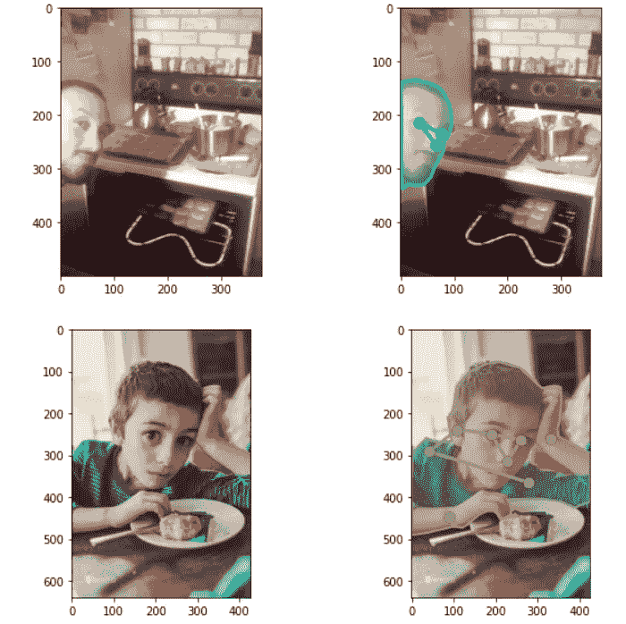
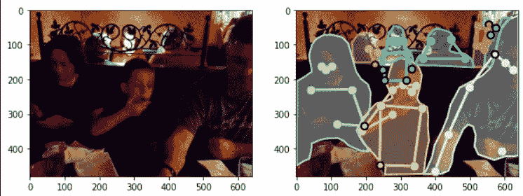
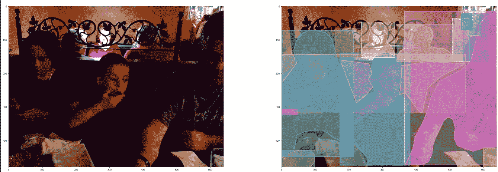

# Coco 数据集，是什么？我们如何使用它？

> 原文：<https://medium.com/mlearning-ai/coco-dataset-what-is-it-and-how-can-we-use-it-e34a5b0c6ecd?source=collection_archive---------0----------------------->


# COCO 格式是什么？

COCO 是一个大型图像数据集，设计用于对象检测、分割、人物关键点检测、内容分割和字幕生成。它以 JSON 格式存储注释，描述对象类、边界框和位掩码。

为了存储和使用为 COCO 开发的工具，我们必须创建像 COCO 这样的数据集，我们可以将它转换为 COCO 格式，也可以自己创建一个

# 可可的结构

```
{
    "info": {
        "year": "2021",
        "version": "1.0",
        "description": "Exported from FiftyOne",
        "contributor": "Voxel51",
        "url": "https://fiftyone.ai",
        "date_created": "2021-01-19T09:48:27"
    },
    "licenses": [
        {
          "url": "http://creativecommons.org/licenses/by-nc-sa/2.0/",
          "id": 1,
          "name": "Attribution-NonCommercial-ShareAlike License"
        },
        ...   
    ],
    "categories": [
        ...
        {
            "id": 2,
            "name": "cat",
            "supercategory": "animal"
        },
        ...
    ],
    "images": [
        {
            "id": 0,
            "license": 1,
            "file_name": "<filename0>.<ext>",
            "height": 480,
            "width": 640,
            "date_captured": null
        },
        ...
    ],
    "annotations": [
        {
            "id": 0,
            "image_id": 0,
            "category_id": 2,
            "bbox": [260, 177, 231, 199],
            "segmentation": [...],
            "area": 45969,
            "iscrowd": 0
        },
        ...
    ]
}
```

信息:这部分结构给出了关于数据集、版本、时间、创建日期、作者等信息

**许可证**:这部分给出了关于我们数据集的许可证的信息

**类别**:它给出了检测到的注释和对象的 id 以及名称，我们还可以确定其中的子类别

**图像**:存储图像、文件名、高度宽度、拍摄时间等

**注释**:对于我们拥有的图像 id，它包含边界框、分割坐标区域，此处边界框是检测到的对象的 x1、y1、x2、y2 坐标，而分割是对象轮廓`iscrowd`它是一个二进制参数，告诉我们在标尺上是否有多个对象，我们无法真正分割它们中的每一个，我们可以将它们转换成一个大框，并用`iscrowd`参数指示

# 加载和可视化 COCO 格式数据集

为此，我们将使用 COCO 2017 数据集



在 COCO 格式上有一些预建的操作函数

我们将使用`pycocotools`库对 coco 数据集进行操作

# 导入我们需要的库

```
!pip install pycocotools
import pandas as pd 
import os
from pycocotools.coco import COCO
import skimage.io as io
import matplotlib.pyplot as plt
from pathlib import Path
```

# 读取数据集

```
dataDir=Path('../input/coco-2017-dataset/coco2017/val2017')
annFile = Path('../input/coco-2017-dataset/coco2017/annotations/person_keypoints_val2017.json')
coco = COCO(annFile)
imgIds = coco.getImgIds()
imgs = coco.loadImgs(imgIds[-3:])
```

这里我们使用 COCO 来读取注释，我已经读取了验证数据注释，我们可以使用`coco.info()`方法来获取数据集的信息

`coco`在这里返回数据集的字典，我们可以用`coco.getImgIds()`函数获取图像的 id。获取图像 id 后，我们必须加载那些图像，以便加载我们可以使用的图像`coco.loadImgs()`

# 可视化我们的图像

```
imgs = coco.loadImgs(imgIds[-3:])
_,axs = plt.subplots(len(imgs),2,figsize=(10,5 * len(imgs)))
for img, ax in zip(imgs, axs):
    I = io.imread(dataDir/img['file_name'])
    annIds = coco.getAnnIds(imgIds=[img['id']])
    anns = coco.loadAnns(annIds)
    ax[0].imshow(I)
    ax[1].imshow(I)
    plt.sca(ax[1])
    coco.showAnns(anns, draw_bbox=False)
```



为了可视化数据集，我们在这里使用 matplotlib，我们将使用 3 幅图像进行演示

首先，我们显示我们的基本图像，我们可以使用 img['file_name']，从 coco 加载的数据集中获取 image_filename(注意，我们已经通过传递图像的 id，使用`coco.loadImgs()`加载了图像)

为了加载注释，我们必须获得注释 id，我们正在使用 coco 字典的`getAnnIds()`方法

获取 id 后，我们加载了`coco.loadAnns(annIds)`用于在图像上绘制 id，我们必须改变图像的轴，我们正在使用`plt.sca()`方法，这种方法选择当前轴进行编辑，最后我们使用`coco.showAnns()`方法绘制注释，我们可以选择是否要使用 draw_bbox 参数绘制边界框。



我们将在另一篇文章中讨论如何用 CSV 文件创建 COCO 数据集:)

# 笔记本链接

[kaggle.com/somesh88/coco-dataset-representa..](https://www.kaggle.com/somesh88/coco-dataset-representation)

> 谢谢你阅读我的博客:)关注更多的评论向我问好它鼓励我写更多的博客:)祝你有一个愉快的一天:)