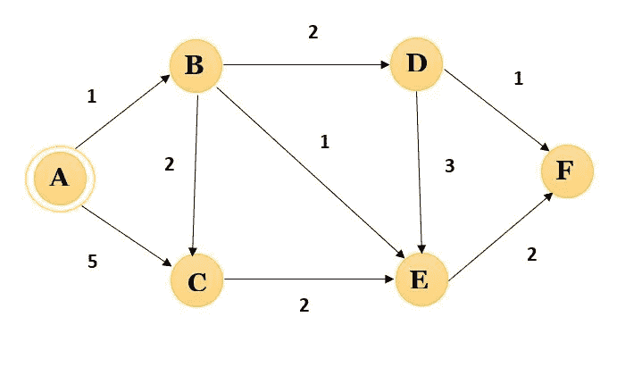
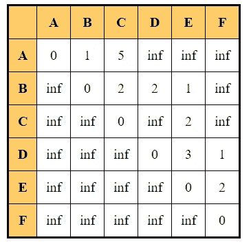
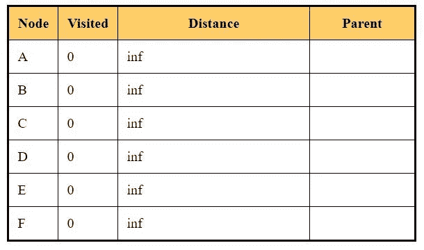

# 编码 Dijkstra 算法

> 原文：<https://medium.com/mlearning-ai/coding-dijkstras-algorithm-97cc6f2fbd50?source=collection_archive---------4----------------------->

在本文中，我们将讨论如何编写 Dijkstra 算法的代码。查看我之前关于 Dijkstra 算法的[文章](/@riya.tendulkar16/solving-single-source-shortest-path-using-dijkstras-algorithm-c2348eea3183)了解算法。就时间复杂度而言，我不会说这是最有效的代码，但它非常容易理解，所以如果你是编码新手，那么这段代码就是为你准备的！

# 邻接矩阵

在我们编写算法之前，我们需要理解什么是邻接矩阵。邻接矩阵是用来表示有限图的方阵。该矩阵表示两个节点是否相邻，即两个节点之间是否有具有某种权重的边。如果节点不相邻，那么对于这些节点，矩阵将具有无穷大的值。

让我们看一个例子:



A directed weighted graph

对于此图，邻接矩阵将为:



Adjacency Matrix for the above graph.

正如我们所看到的，对角线的值为 0，这是因为对角线代表节点本身之间的距离，这将是 0(例如，从 A 到 A 的距离将是 0)。凡是有“inf”的地方，表示各个节点之间没有边，不相邻。

要查找两个节点之间的距离，只需检查节点所在行和列中的值。例如，如果我们想知道从 C 到 E 的距离，那么在 C 行中检查 E 列，也就是 2。要找出从 E 到 C 的距离，在 E 行检查 C 列，因为 C 列是无穷大，所以没有边连接它们。

# 编码 Dijkstra 的

现在让我们开始编码算法。我们将做的事情和我在上一篇文章中解释的完全一样。代码是用 C++写的。

正如我们在算法中看到的，我们维护一个表来跟踪最短距离和父节点。



Initial table for Dijkstra’s algorithm

我们将在代码中做同样的事情，我们维护一个**二维数组**，其中数组的行对应于节点，索引是节点号，列对应于访问过的节点、当前最短距离和父节点。

## 接受输入

我们需要输入顶点和邻接矩阵。在获取邻接矩阵的边值时，我们需要确保用户不会输入负值。

正如我们所知，当两个节点之间没有边时，它们之间的距离是无穷大。为了在代码中表示无穷大，我使用了数字 2147483647。原因是 C++ 中的[最大整数值基本上是无穷大。但是我们不能要求用户每次都输入这么长的数字，所以我要求用户输入-1 表示没有边，稍后我会将它转换为无穷大(2147483647)。](https://docs.microsoft.com/en-us/cpp/c-language/cpp-integer-limits?view=msvc-160)

下面的代码片段接受用户输入的顶点和邻接矩阵，并检查输入的权重是否正确。

```
 int n; //n stores the number of vertices 
 cout<<”Enter the number of vertices in the graph: “;
 cin>>n; char vertices[n]; //to store the vertices names int adjacency[n][n]; //adjacency matrix  int vertex; //storing the source node 

 //Inputing the vertices
 cout<<”Enter the vertrices names: “<<endl;
 for(int i=0;i<n;i++)
 {
     cin>>vertices[i];
 }

 //Inputing adajency matrix
 cout<<”Enter the adjacency matrix(distance between vertices)(Enter -1 for no link-inf): “<<endl;
 for(int i=0;i<n;i++)
 {
     int input;
     for(int j=0;j<n;j++)
     {
        cout<<”Distance between “<<vertices[i]<<” and “<<vertices[j]
         <<” : “; 
        cin>>input;

         //As in dijkstras , the graph can have only positive 
           weight, we check if the input is correct
          if (input<-1)
          {
             cout<<”Distance can not be negative! Enter
             again”<<endl;
             j=j-1;
          }
          else if(i==j&&input!=0)
         {
            cout<<”Distance between the node and the node itself
            will always be 0! Changing the value to 0.”<<endl;
            input=0;
         } 
         else
         {
           adjacency[i][j]=input;
           //Changing the value of -1 to infinity 
           if (adjacency[i][j]==-1)
           {
              adjacency[i][j]=2147483647;
           }
         } 
      }
   }
```

现在我们还需要询问用户哪个节点将是源节点，这是下一步。我写了一个函数来查找源节点。代码将检查用户给定的源节点是否出现在代码中，否则将显示一条错误消息。用户将给出顶点的名称，所以我们需要找到源节点的索引。

```
do 
 {
  vertex=sourceNode(vertices,n);
  if(vertex==-1)
  {
  cout<<"Source node not available!"<<endl;
  }
 }while(vertex==-1);
```

查找源节点的函数是:

```
int sourceNode(char vertices[],int n)
{
     //Inputing the source node 
     char vertexNode;
     cout<<”Enter the source node: “;
     cin>>vertexNode;

     //Finding the index value of the source node
     for(int i=0;i<n;i++)
     {
       if (vertices[i]==vertexNode)
       {
          return i;
       }
     }
     return -1;
}
```

如果不想接受用户的输入，可以跳过上面的代码片段，直接给出硬编码的输入。我使用了上面显示的图表作为例子。

```
int adjacency[6][6]={{0,1,5,2147483647,2147483647,2147483647},
 {2147483647,0,2,2,1,2147483647},
 {2147483647,2147483647,0,2147483647,2,2147483647},
 {2147483647,2147483647,2147483647,0,3,1},
 {2147483647,2147483647,2147483647,2147483647,0,2},
 {2147483647,2147483647,2147483647,2147483647,2147483647,0}};
 char vertices[6]={‘A’,’B’,’C’,’D’,’E’,’F’};
 int n=6;
 int vertex=0;
```

在硬编码输入中，你不需要问源代码。在这个例子中，我将源节点命名为“A ”,其索引号为 0(见顶点数组)。

为了对算法进行编码，我们将使用一个表示表格的二维数组。数组 *dijkstraMatrix* 的行数=节点数，列数=3。第一列是*访问过的*列，其初始值为 0。第二列是*距离*列，其初始值为无穷大。最后一列的父列*最初被设置为 0。如您所见，该矩阵与上表相似。*

```
//Initializing the dijkstras matrix: visited=0, distance=inifinty, parent=0
 for(int i=0;i<n;i++)
 {
       dijkstraMatrix[i][0]=0;
       dijkstraMatrix[i][1]=2147483647;
       dijkstraMatrix[i][2]=0;
 }
```

尽管我们已经为所有节点设置了相同的初始条件，但我们知道对于源节点，距离将为 0，因此我们进行了更改。

```
//Making the distance for the source node as 0 
 dijkstraMatrix[vertex][1]=0;
```

现在，我们需要做的下一件事是遍历邻接矩阵，并检查每个节点的当前最短距离。

```
for(int i=0;i<n;i++)
 {
     int min=2147483647;
     for(int j=0;j<n;j++)
     {
        if (dijkstraMatrix[j][0]==0)
        {
           if(dijkstraMatrix[j][1]<=min)
           {
               min=dijkstraMatrix[j][1];
               vertex=j;
           }
        }
     }

     dijkstraMatrix[vertex][0]=1;
     for (int k=0;k<n;k++)
     {
       if(dijkstraMatrix[k][0]==0) //checking for visited
       {
          if(adjacency[vertex][k]!=2147483647&&adjacency[vertex][k]+
             dijkstraMatrix[vertex][1]<=dijkstraMatrix[k][1]        
         {
            dijkstraMatrix[k][1]=adjacency[vertex][k]
            +dijkstraMatrix[vertex][1]; //alloting the distance 
            dijkstraMatrix[k][2]=vertex; //alloting the parent 
         }
       }
     }
 }
```

让我们详细看看上面的代码片段。在算法中，为了考虑下一个顶点，我们在表的距离列中取未被访问的并且具有最短距离值的顶点。

第一个 *for* 循环(代码的第 2 行)遍历 n 个节点的整个邻接矩阵。然后，我们首先检查节点是否未被访问(第 4 行)，即 Dijkstra 表的第一列(第 0 列)是否为 0。如果它是零，那么我们将它与当前的最小值进行比较，如果它小于当前的最小值，那么这个顶点将成为下一个最小值。如此进行比较，直到检查完所有未访问的节点。

```
 int min=2147483647;
     for(int j=0;j<n;j++)
     {
        if (dijkstraMatrix[j][0]==0)
        {
           if(dijkstraMatrix[j][1]<=min)
           {
               min=dijkstraMatrix[j][1];
               vertex=j;
           }
        }
     }
```

在这个 *for* 循环终止后，我们将得到一个顶点，它将是我们考虑的下一个顶点。所以我们把这个顶点的访问次数改为 1。

```
dijkstraMatrix[vertex][0]=1;
```

现在我们检查顶点的所有相邻的未访问节点。为此，我们首先遍历 dijkstraMatrix 并检查未访问的节点。如果一个节点未被访问，我们检查它是否与当前选择的顶点相邻，即在邻接矩阵中顶点和节点之间是否有距离值(不等于无穷大)。如果节点和顶点是相邻的，那么我们检查表中顶点的距离值和节点与顶点之间的距离之和是否小于表中节点的当前距离值。如果小于这个值，我们就更新这个表，改变这个节点的距离值，同时更新作为顶点的父值。

```
for (int k=0;k<n;k++)
{
   if(dijkstraMatrix[k][0]==0) //checking for unvisited nodes
   { /* checking if there is an edge between the node and the vertex 
        and if the (distance value of vertex + edge (vertex, node))
        < distance value of node*/ if(adjacency[vertex][k]!=2147483647&&adjacency[vertex][k]+
         dijkstraMatrix[vertex][1]<=dijkstraMatrix[k][1]        
     {
         //Updating the distance and parent value for the node
         dijkstraMatrix[k][1]=adjacency[vertex][k]
         +dijkstraMatrix[vertex][1]; //allocating the distance                    
         dijkstraMatrix[k][2]=vertex; //allocating the parent 
     }
   }
}
```

对图中的所有节点重复上述步骤，然后我们将得到最终的矩阵。

您可以使用此代码打印 Dijkstra 表:

```
cout<<”Dijkstra’s Table: “<<endl;
 cout<<”___________________________________________________________”<<endl;
 cout<<”Vertex”<<”\t\t”<<”Visited”<<”\t\t”<<”Distance”<<”\t”<<”Parent”<<endl;
 cout<<”___________________________________________________________”<<endl;
 int minimumDistance=0;
 for(int i=0;i<n;i++)
{
   cout<<vertices[i]<<”\t\t”<<dijkstraMatrix[i][0]<<”\t\t”;
   if(dijkstraMatrix[i][1]==2147483647)
   {
     cout<<”inf”;
   }
   else
   {
     cout<<dijkstraMatrix[i][1];
   }
 cout<<”\t\t”<<vertices[dijkstraMatrix[i][2]]<<”\t”<<endl;
}
```

以下是最终的组合代码:

```
#include<iostream>
using namespace std;//Function to print the table
void printTable(int dijkstraMatrix[][3],int n,char vertices[])
{
 cout<<”Dijkstra’s Table: “<<endl;
 cout<<”___________________________________________________________”<<endl;
 cout<<”Vertex”<<”\t\t”<<”Visited”<<”\t\t”<<”Distance”<<”\t”<<”Parent”<<endl;
 cout<<”___________________________________________________________”<<endl;
 int minimumDistance=0;
 for(int i=0;i<n;i++)
 {
   cout<<vertices[i]<<”\t\t”<<dijkstraMatrix[i][0]<<”\t\t”;
   if(dijkstraMatrix[i][1]==2147483647)
   {
      cout<<”inf”;
   }
   else
   {
     cout<<dijkstraMatrix[i][1];
   }
   cout<<”\t\t”<<vertices[dijkstraMatrix[i][2]]<<”\t”<<endl;
  }
}int sourceNode(char vertices[],int n)
{
 //Inputing the source node 
 char vertexNode;
 cout<<”Enter the source node: “;
 cin>>vertexNode;

 //Finding the index value of the source node
 for(int i=0;i<n;i++)
 {
   if (vertices[i]==vertexNode)
   {
      return i;
   }
 }
 return -1;
}
int main()
{
 int n; //n stores the number of vertices 
 cout<<”Enter the number of vertices in the graph: “;
 cin>>n;
 char vertices[n]; //to store the vertices names 
 int adjacency[n][n]; //adjacency matrix 
 int vertex=0; //storing the source node 

 //Inputing the vertices
 cout<<”Enter the vertrices names: “<<endl;
 for(int i=0;i<n;i++)
 {
   cin>>vertices[i];
 }

 //Inputing adajency matrix
 cout<<”Enter the adjacency matrix(distance between vertices)(Enter -1 for no link-inf): “<<endl;
 for(int i=0;i<n;i++)
 {
   int input;
   for(int j=0;j<n;j++)
   {
      cout<<”Distance between “<<vertices[i]<<” and “<<vertices[j]<<” : “; 
      cin>>input;

      //As in dijkstras , the graph can have only positive weight, 
       we check if the input is correct
      if (input<-1)
      {
         cout<<”Distance can not be negative! Enter again”<<endl;
         j=j-1;
      }
      else if(i==j&&input!=0)
     {
        cout<<”Distance between the node and the node itself will
        always be 0! Changing the value to 0.”<<endl;
        input=0;
     } 
     else
     {
       adjacency[i][j]=input;
       //Changing the value of -1 to infinity 
       if (adjacency[i][j]==-1)
       {
          adjacency[i][j]=2147483647;
       }
     } 
   }
   cout<<endl;
 }

 do 
 {
 vertex=sourceNode(vertices,n);
 if(vertex==-1)
 {
 cout<<”Source node not available!”<<endl;
 }
 }while(vertex==-1);

 /*
 If you want to skip the user input and hardcode the value, you can use this code snippet(comment the earlier part). Here I have used the graph shown in the example.
 int adjacency[6][6]={{0,1,5,2147483647,2147483647,2147483647},
 {2147483647,0,2,2,1,2147483647},
 {2147483647,2147483647,0,2147483647,2,2147483647},
 {2147483647,2147483647,2147483647,0,3,1},
 {2147483647,2147483647,2147483647,2147483647,0,2},
 {2147483647,2147483647,2147483647,2147483647,2147483647,0}};
 char vertices[6]={‘A’,’B’,’C’,’D’,’E’,’F’};
 int n=6;
 int vertex=0;
 */

 /*
 The dijkstra’s array will have row=number of nodes and 3 columns. The columns will be similiar to the table we have used in the example
 column 0 -> visited value
 column 1 -> distance value
 column 2 -> parent
 */

 int dijkstraMatrix[n][3];

 //Initializing the dijkstras matrix: visited=0, distance=inifinty, parent=0
 for(int i=0;i<n;i++)
 {
 dijkstraMatrix[i][0]=0;
 dijkstraMatrix[i][1]=2147483647;
 dijkstraMatrix[i][2]=0;
 }
 cout<<endl;

 //Making the distacnce for the source node as 0 
 dijkstraMatrix[vertex][1]=0;

 //finding the minimum distance among the the non visited vertices
 for(int i=0;i<n;i++)
 {
 int min=2147483647;
 for(int j=0;j<n;j++)
 {
 if (dijkstraMatrix[j][0]==0)
 {
 if(dijkstraMatrix[j][1]<=min)
 {
 min=dijkstraMatrix[j][1];
 vertex=j;
 }
 }
 }

 //Changing the visited of the current vertex as 1
 dijkstraMatrix[vertex][0]=1;

 //checking for the adjacent unvisited nodes of the current vertex
 for (int k=0;k<n;k++)
 {
 if(dijkstraMatrix[k][0]==0) //checking for visited
 {

 /* checking if there is an edge between the node and the vertex 
 and if the (distance value of vertex + edge (vertex, node))< distance value of node*/
 if(adjacency[vertex][k]!=2147483647&&adjacency[vertex][k]+dijkstraMatrix[vertex][1]<=dijkstraMatrix[k][1])
 {
 dijkstraMatrix[k][1]=adjacency[vertex][k]+dijkstraMatrix[vertex][1]; //allocating the distance 
 dijkstraMatrix[k][2]=vertex; //allocating the parent 
 }
 }
 }

 //The next two lines are for printing the table after every node, if you don’t want that you can just comment the next 2 lines
 cout<<”For vertex: “<<vertices[vertex]<<endl;
 printTable(dijkstraMatrix,n,vertices); 
 cout<<endl; 
 }

 //Printing the final table
 cout<<”***SOLUTION**”<<endl;
 printTable(dijkstraMatrix,n,vertices);

}
```

你可以在我的 GitHub 链接上查看代码-[https://github.com/riya1620/Dijkstra-s-Algorithm](https://github.com/riya1620/Dijkstra-s-Algorithm)