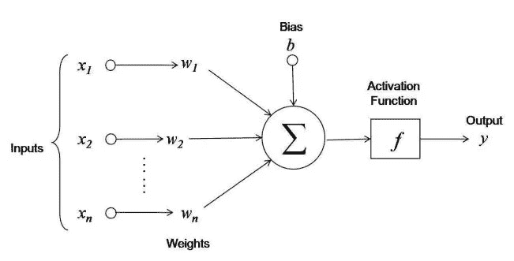
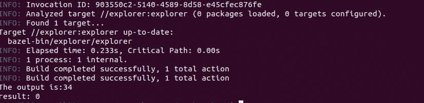

# 用碳编码神经网络:第 1 部分

> 原文：<https://medium.com/mlearning-ai/coding-neural-networks-in-carbon-part-1-44e865fe750d?source=collection_archive---------3----------------------->

## 新语言，新的可能性


Photo by [Markus Spiske](https://unsplash.com/@markusspiske?utm_source=medium&utm_medium=referral) on [Unsplash](https://unsplash.com?utm_source=medium&utm_medium=referral)

谷歌最近一直吹捧它的新语言是 C++的继承者。它甚至迈出了巨大的步伐，以确保该语言可以在其他功能的基础上轻松地与 C++集成。

可悲的是，根据我与维护 Github 库的人的交流，这种语言还没有准备好为生产构建任何东西。但这不足以阻止我。我探索得越多，我就越能为这门语言的进步做出贡献。你也可以。

所以，我决定尝试手动编写一个神经网络。我知道有一些图书馆可以做到这一点，其他人可能会认为这是一项乏味且毫无成果的活动。我想强调的是，这个练习的本质是增长你对神经网络的知识，并发展对所讨论的语言及其特征的直觉。

现在。我们编码吧。确保您的系统已经启动并运行了 carbon-lang。下面是我的教程:

[](https://freddynjagi.medium.com/setting-up-your-linux-machine-for-googles-carbon-programming-language-bf5e10c083ed) [## 为谷歌的 Carbon 编程语言设置你的 Linux 机器

### 和打印“你好，世界”

freddynjagi.medium.com](https://freddynjagi.medium.com/setting-up-your-linux-machine-for-googles-carbon-programming-language-bf5e10c083ed) 

第一步是创建一个新的文件和目录，我们将在其中完成 Carbon 目录中的所有工作。(在 Linux 中，默认情况下将位于主目录中)。

```
$ cd carbon-lang/explorer/testdata
```

打开这个目录后，我们创建一个新的文件夹，在这里我们可以构建我们的神经网络:

```
$ mkdir neural_nets
```

然后，我们继续下一步，创建一个文件，我们将在其中编写代码。

```
$ cd neural_nets
$ touch basic_neural_net.carbon
```

这将生成我们想要的文件，现在我们可以导航到该文件并用任何文本编辑器打开它。

# 直觉

> y = mx + c

上面的方程式可以说是最普遍的方程式之一。但这和我们的工作有什么关系？

这可能是一个巨大的过度简化，但神经网络接受数据(用 x 表示)，并将该数据乘以给定的权重(m)，然后将其添加到偏差(c)。结果是输出(y)。



A neuron by [Cornell University](https://blogs.cornell.edu/info2040/files/2015/09/VqOpE-1c4xc4y.jpg)

神经网络的表现异常出色，因为有一些等式可以通过学习输入(x)来自动调整权重和偏差，从而提供最佳输出。

这是一个很大的简化，但我的意图是慢慢建立。

```
package ExplorerTest api;
```

为了让代码能够在 Carbon 提供的浏览器中运行，这是我们应该写的第一行。

然后我们将构建两个数组。一个包含输入，另一个包含权重。它们将包含相同数量的元素，因为权重的数量对应于输入的数量，如上图所示。但是只有一个偏差，因为它们都通过同一点。

```
package ExplorerTest api;//declare a function called Main that returns an int value
fn Main() -> i32 {
   var inputs: [i32; 3] = (1, 2, 3);
   var weights: [i32; 3] = (3, 2, 8);
   var bias: i32 = 3;
}
```

我们已经声明了两个大小为 3 的接受 int 元素的数组，因为这是我们正在尝试执行的操作当前唯一支持的数据类型。

然后，我们将每个输入乘以下面相应的权重，并将它们累加在一起，然后加上偏差。

```
//the complete code should look like this
package ExplorerTest api;fn Main() -> i32 {
   var inputs: [i32; 3] = (1, 2, 3);
   var weights: [i32; 3] = (3, 2, 8);
   var bias: i32 = 3;

   var output: i32 =  inputs[0] * weights[0] +
                      inputs[1] * weights[1] +
                      inputs[2] * weights[2] + bias;
   Print("The output is:{0}", output);
   return 0;}
```

下一步是通过转到 carbon 目录并运行以下命令来运行它:

```
$ cd carbon-lang
$ bazel run //explorer -- ./explorer/testdata/neural_nets/basic_neural_net.carbon
```



Image from the author

根据我们输入的值，我们希望它给出的答案是 34。输入您自己的值，并检查计算是否符合预期。

在这里，我们展示了一个非常简单的想法，但它是对引擎盖下发生的事情的描述。Carbon 对其他数据类型(如 floats)没有适当的支持，但我相信它们会在以后被集成。

当我们试图用这种新的编程语言建立一个神经网络时，请不要走开。

[](/mlearning-ai/mlearning-ai-submission-suggestions-b51e2b130bfb) [## Mlearning.ai 提交建议

### 如何成为 Mlearning.ai 上的作家

medium.com](/mlearning-ai/mlearning-ai-submission-suggestions-b51e2b130bfb)