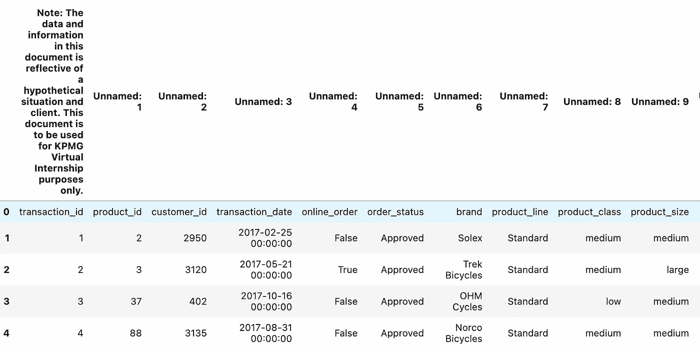
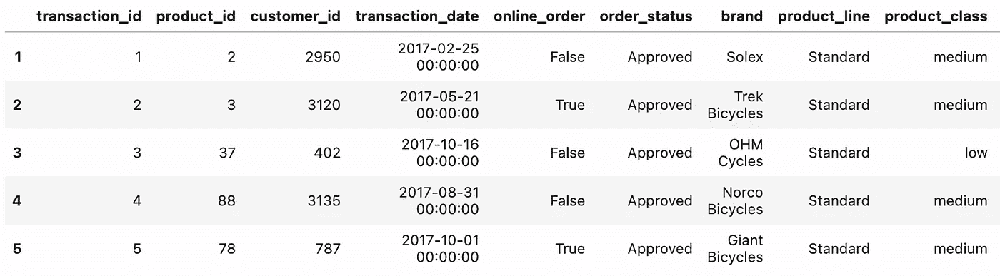
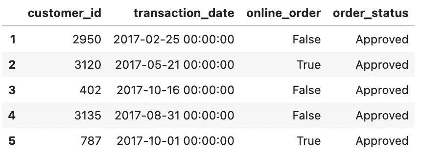
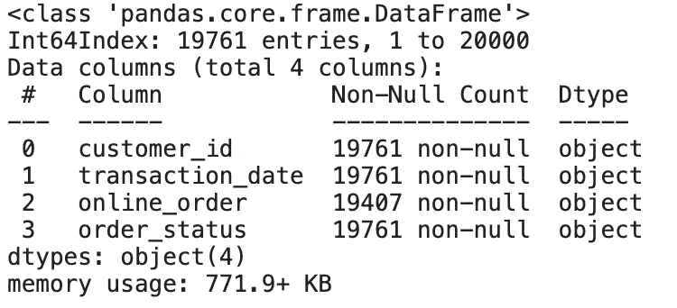
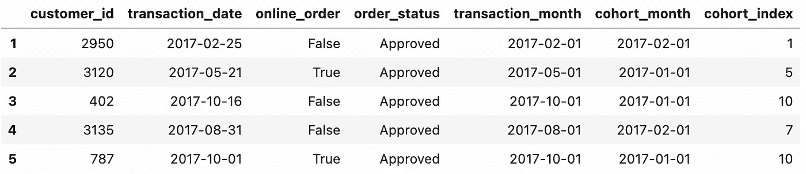
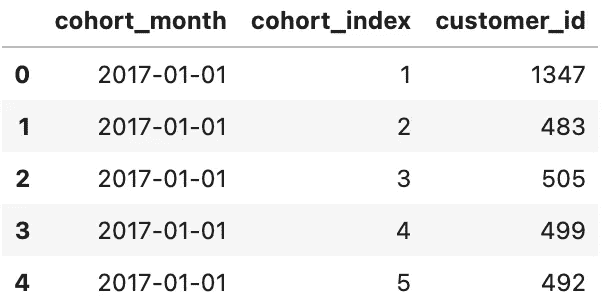
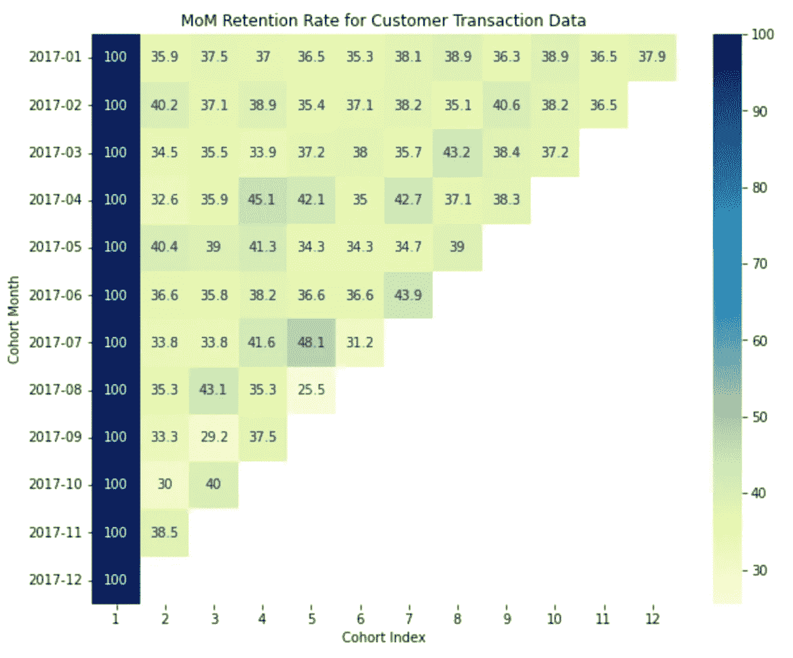

# 客户交易数据的群组分析

> 原文：<https://medium.com/mlearning-ai/cohort-analysis-in-python-abcc103917f0?source=collection_archive---------0----------------------->


Image by [pixabay](https://pixabay.com/photos/ecommerce-selling-online-2140604/)

数字营销是当今在线生态系统中最受欢迎的角色，我相信在这个领域工作的每一个人都将用户保持率作为主要的 KPI 之一。

但是有了丰富的数据，Excel 文件在分析活动结果时就没那么有效了。

因此，在本文中，我将展示您的数据/BI 分析师或者营销团队的人员如何利用 Python 来衡量用户保留率。

指导方针:

1.  数据清理和数据操作
2.  创建群组月份和索引
3.  生成用户保留汇总表
4.  想象结果
5.  **数据清理和操作**

```
!pip install openpyxldf = pd.read_excel('/kaggle/input/customer-transaction-dataset/KPMG_VI_New_raw_data_update_final.xlsx', sheet_name = 'Transactions')df.head()
```



Snapshot of Dataframe

正如你们所看到的，从上面的数据中，索引 0 处的第一行是列名，我们希望用第一行替换当前列。

```
df.columns = df.iloc[0]
df.drop(df.index[0],inplace=True, axis = 0)df.head()
```



Snapshot After Replacing Columns

现在，该表看起来就像我们熟悉的一样，接下来，我们将从上面的数据中选择几列，用于群组分析。

```
#Get the necessary columns for Cohort Analysisdf_final = df[['customer_id','transaction_date','online_order','order_status']]
df_final.head()
```



由于我们希望衡量成功完成交易的用户的用户保持率，因此我们将过滤具有“批准”状态的数据，并删除重复值(如果有)。

```
df_final = df_final[df_final['order_status'] == 'Approved']
df_final = df_final[~df_final.duplicated()]
df_final.info()
```



一切就绪，现在我们将在计算用户保持率之前创建我们的群组月份和指数。

**2。创建群组月份和索引**

```
#Get Transaction Month for the dataframe
import datetime as dtdef get_month(x) :
    return dt.datetime(x.year, x.month,1)df_final['transaction_date'] = pd.to_datetime(df['transaction_date'])
df_final['transaction_month'] = df['transaction_date'].apply(get_month)#Create Cohort Month per Rowsgroup = df_final.groupby('customer_id')['transaction_month']
df_final['cohort_month'] = group.transform('min')#Calculate Cohort Index for Each Rowsdef get_date_int(df, column) :
    year = df[column].dt.year
    month = df[column].dt.month
    day = df[column].dt.day

    return year, month, daytransaction_year, transaction_month, transaction_day = get_date_int(df_final, 'transaction_month')
cohort_year, cohort_month, cohort_day = get_date_int(df_final,'cohort_month')#Calculate Year Differences
years_diff = transaction_year - cohort_year#Calculate Month Differences
months_diff = transaction_month - cohort_monthdf_final['cohort_index'] = years_diff*12 + months_diff + 1df_final.head()
```



因此，下面是来自上述代码的逐步方法:

1.  从每个 transaction_date 数据中获取“月”值，并创建一个名为“transaction_month”的新列
2.  基于第一个交易月的每个客户 id 生成“群组 _ 月份”列
3.  计算“transaction_month”和“cohort_month”之间的差异，并将这些值存储到“cohort_index”中(使用+1 表示交易的第一个月，而不是使用 0)

群组分析所需的所有数据点都已完成，下一步是计算每个群组指数的保留率。

**3。生成用户留存汇总表**

```
#Final Grouping to Calculate Total Unique Users in Each Cohort
cohort_group = df_final.groupby(['cohort_month','cohort_index'])cohort_data = cohort_group['customer_id'].apply(pd.Series.nunique)
cohort_data = cohort_data.reset_index()cohort_counts = cohort_data.pivot_table(index = 'cohort_month',
                                        columns = 'cohort_index',
                                        values = 'customer_id'   
                                       )cohort_data.head()
```



**4。将结果可视化**

```
#Calculate Retention rate per Month Indexcohort_size = cohort_counts.iloc[:,0]retention = cohort_counts.divide(cohort_size, axis = 0)retention = retention.round(3)*100retention.index = retention.index.strftime('%Y-%m')#Plotting Heatmap for Retention Tableimport matplotlib.pyplot as plt
import seaborn as snsplt.figure(figsize = (16,10))plt.title('MoM Retention Rate for Customer Transaction Data')sns.heatmap(retention, annot = True, cmap="YlGnBu", fmt='g')plt.xlabel('Cohort Index')
plt.ylabel('Cohort Month')
plt.yticks(rotation = '360')plt.show()
```



以下是基于上述代码的流程:

1.  根据首次交易日期和每月指数计算独立用户总数
2.  从计算表生成数据透视表，并根据第一个群组月的用户总数划分所有值
3.  最后，使用热图可视化最终表格，以便更好地理解数据。

这是这篇文章的结尾，我希望你们能够真正利用上述代码进行营销活动。

群组分析已经被许多科技公司用来判断活动是否成功。

再次感谢你给我支持，为我鼓掌，并把我的故事保存到你的个人阅读中。

请随时联系我或在下面给出评论，这样我就可以更好地理解你们想要阅读的内容。

谢谢大家！

[](https://www.kaggle.com/code/kelvinprawtama/customer-transaction-cohort-analysis/notebook) [## 客户交易-群组分析

### 使用 Kaggle 笔记本探索和运行机器学习代码|使用来自 Customer_transaction_dataset 的数据

www.kaggle.com](https://www.kaggle.com/code/kelvinprawtama/customer-transaction-cohort-analysis/notebook) [](/mlearning-ai/mlearning-ai-submission-suggestions-b51e2b130bfb) [## Mlearning.ai 提交建议

### 如何成为 Mlearning.ai 上的作家

medium.com](/mlearning-ai/mlearning-ai-submission-suggestions-b51e2b130bfb)