# R 中时间序列的协整

> 原文：<https://medium.com/mlearning-ai/cointegration-of-time-series-in-r-a6543dacf66e?source=collection_archive---------2----------------------->

## 使用疫苗接种率和超额死亡率之间的可能关系作为展示案例。

这篇文章不是为了证明新冠肺炎疫苗(加强系列)和超额死亡率之间的因果关系。它将展示如何使用时间序列方法(如协整)来分析这些数据。尽管这个话题很沉重，但这不是我第一次，也不会是我最后一次发布关于[疫苗和超额死亡率](https://blog.devgenius.io/causal-inference-on-time-series-covid-19-data-3cbba9ec35f3)、[新冠肺炎和死亡率](/@marc.jacobs012/predicting-covid-19-mortality-using-logistic-regression-in-sas-5453d3532cd7)、[伊维菌素和死亡率](/mlearning-ai/ivermectin-covid-19-and-death-355114059c41)、[疫苗和死产](/mlearning-ai/confidence-vs-prediction-intervals-576d3047f4c)、[变异](https://pub.towardsai.net/animating-covid-19-progress-and-variants-over-time-2250b9ef1a87)和[封锁措施和重要流行病学结果](https://blog.devgenius.io/the-effect-of-covid-measures-on-covid-outcomes-a-vector-autoregressive-moving-average-exogenous-dd7fa6c3774f)的分析。我确信我不是唯一的一个。

此外，这不是我第一篇关于时间序列的文章，也不是关于协整的文章，但我会更深入地研究这个特殊的案例，因为这是一个具有挑战性的案例。因为有很多好的和好的案例，给你一些好的技巧的例子，如果也有足够多的脏案例是最好的。数据科学、建模和统计并不总是做它应该做的事情。

因此，让我们来看看如何通过协整方法将两个时间序列，疫苗接种率和超额死亡率联系起来。

首先，我们加载库。

```
rm(list = ls())
library(readxl)
library(ggplot2)
library(lattice)
library(tidyverse)
library(lubridate)
library(stringr)
library(xts)
library(urca)
library(dynlm)
library(tseries)
library(quantmod)
library(lmtest)
library(sandwich)
library(vars)
```

然后我们加载数据，就像这样。

```
oversterfte <- read_excel("OVERSTERFTE MARC JACOBS AUG 2022.xlsx")
oversterfte%>%print(n=40)# A tibble: 27 x 4
    Year  Week    VAX Death
   <dbl> <dbl>  <dbl> <dbl>
 1  2022     7      0   -81
 2  2022     8      0   -86
 3  2022     9  20880  -168
 4  2022    10 104770    23
 5  2022    11 196340   302
 6  2022    12 250430   411
 7  2022    13 271740   416
 8  2022    14 251170   505
 9  2022    15 174670   515
10  2022    16 138460   279
11  2022    17  81470   231
12  2022    18  53040   245
13  2022    19  42050   262
14  2022    20  45300   218
15  2022    21  42050   112
16  2022    22  12820   169
17  2022    23  29230   166
18  2022    24  39390   230
19  2022    25  71770   370
20  2022    26  66660   330
21  2022    27  51750   204
22  2022    28  81440   326
23  2022    29  71770   408
24  2022    30  42050   365
25  2022    31  58220   199
26  2022    32   4520   218
27  2022    33  37530   441
```

为了使它成为一个成熟的时间序列，我们需要添加一个日期变量，所以让我们这样做。

```
oversterfte_tbl <- oversterfte %>% 
  mutate(beg = ymd(str_c(Year, "-01-01")),
         date_var = beg + weeks(Week))
```

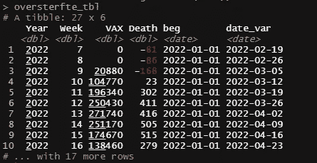

Now we have a time-series.

由于数据在不同的尺度上运行，而 GGplot 以一种荒谬的方式展示了两个 y 尺度，我将转向[点阵包](https://www.statmethods.net/advgraphs/trellis.html)并在一个中绘制两个时间序列。接下来，我将绘制两个系列之间的简单相关图。现在，对已经相关的数据做简单的关联有很多批评，但它确实提供了一些帮助。最后，你可以在 x 轴和 y 轴上绘制数据点。

```
VAX <- xyplot(VAX~ date_var,
               data = oversterfte_tbl, type = "l")
Death<- xyplot(Death~ date_var,
              data = oversterfte_tbl, type = "l")
latticeExtra::doubleYScale(VAX,Death,style1 = 0, style2 = 3, add.ylab2 = TRUE)ggplot(oversterfte, 
       aes(x=VAX, 
           y=Death))+
  geom_point()+
  geom_smooth(fill="blue", alpha=0.1)+
  geom_smooth(method='lm', formula= y~x, se=FALSE, col="red",lty=2)+
  theme_bw()
```

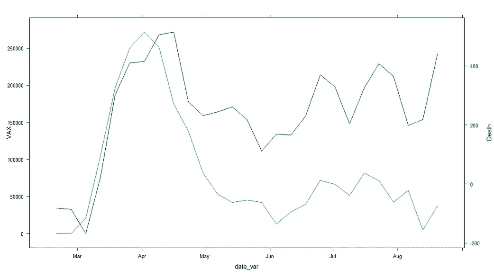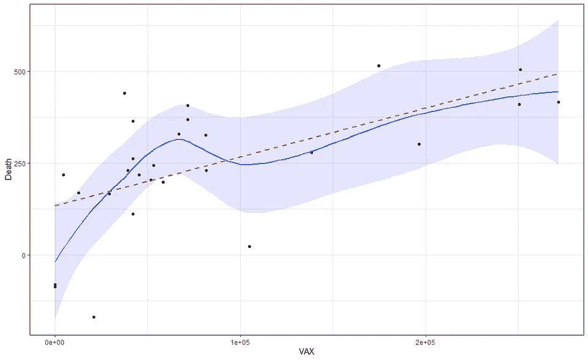

The left plot is the most informative and it does show some heavy mirroring, which seems to disintegrate at the end. We will later see why the end is making this analysis so difficult, and thus also so interesting.

现在，时间序列是所有关于发现模式和解开数据。这一切都是为了确保数据是稳定的，这意味着数据的平均值不依赖于时间。

> [*平稳时间序列是指其性质不依赖于观察时间的序列*](https://otexts.com/fpp2/stationarity.html) 。

它的基本意思是，你的数据没有显示趋势，或季节性(但周期是可以的)。就我个人而言，我从来没有真正喜欢过这个，但是我也不喜欢正常化、居中、缩放和任何形式的转换。然而，在时间序列中，平稳性的假设真的不能被忽略，因为它会影响你的预测，尽管你看到越来越多的机器学习算法被部署在不关心假设的时间序列数据上。

因此，我们需要检查的第一件事是数据是否平稳，这也与[协整](https://en.wikipedia.org/wiki/Cointegration)的定义有关。协整意味着时间序列基本上是相关的。如果一个上升，另一个也会上升，就像两条小船在海浪中航行，但有一条看不见的绳子将它们连接在一起。

正式地说，如果两个数列 A 和 B 之间的差是固定的，那么它们就是协整的。也就是说每个系列都不是，它表现出一种趋势。如果序列不是协整的，差异是非平稳的(因此显示趋势或季节性)。这是一个可以用单位根检验来检验的假设，我们将在下面进行检验。

现在，有不止一种方法来测试协同集成，我们将探索这些方法，但首先让我们使用上面使用的定义。因此，我们寻找的是两个非平稳序列，它们的差是平稳的。

检查非平稳数据的最简单方法是检查自相关，这意味着一个时间值取决于前一个时间值。通常，删除这种自相关的方法是求差，所以我会这样做，并添加自相关图。**请注意，平稳并不意味着没有自相关**。[对于平稳序列，自相关下降很快，对于非平稳序列下降很慢。](https://statisticsbyjim.com/time-series/autocorrelation-partial-autocorrelation/#:~:text=data%20are%20random.-,Stationarity,a%20non%2Dstationary%20time%20series.)

```
par(mfrow = c(3, 4))
VAXts<-oversterfte_tbl%>%
  dplyr::select(VAX)%>%
  ts(., start=c(2022, 7), 
     end=c(2022, 33), frequency=52)
plot(VAXts)
acf(VAXts)
plot(diff(VAXts))
acf(diff(VAXts))
Deathts<-oversterfte_tbl%>%
  dplyr::select(Death)%>%
  ts(., start=c(2022, 7), 
     end=c(2022, 33), frequency=52)
plot(Deathts)
acf(Deathts)
plot(diff(Deathts))
acf(diff(Deathts))
VECM_ECT <- Deathts - VAXts
plot(VECM_ECT)
acf(VECM_ECT)
plot(diff(VECM_ECT))
acf(diff(VECM_ECT))
```

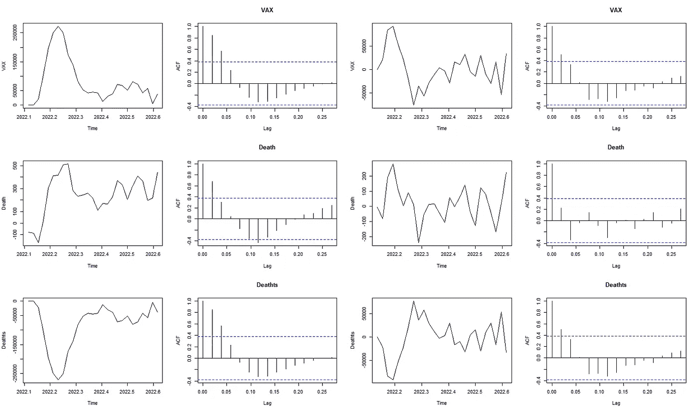

First column shows the original time-series of the death, vax, and difference(death-vax). Second column shows the auto-correlation for each of the time-series. Third and fourth column of graphics shows the differenced time-series and the auto-correlation plot that goes with it.

从上面已经可以看出，协整的第一个定义在这里是不够的。虽然两者都明确显示了一种趋势，但它们的差异也是如此。这种类型的自相关性甚至在差分之后仍然存在，这实际上是因为奇怪的第一次凸起和随后的衰减，这将导致稍后的分析相当困难。我可以做的另一件事是，我之前用图形表示过，看看相关性和互相关函数。

```
cor(VAXts, Deathts)
ccfvalues<-ccf(as.numeric(VAXts), as.numeric(Deathts)); ccfvalues
```

如你所见，相关性不是很高， [ccf](https://www.rdocumentation.org/packages/tseries/versions/0.1-2/topics/ccf) 值由 lag 完成。它们在非常近的地方最强，但也很快消失，如果你再次看原始图形，你可能会想到这一点。最后，通过回顾多步来预测一步是非常困难的。

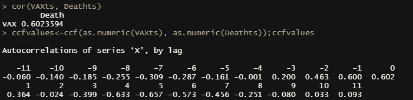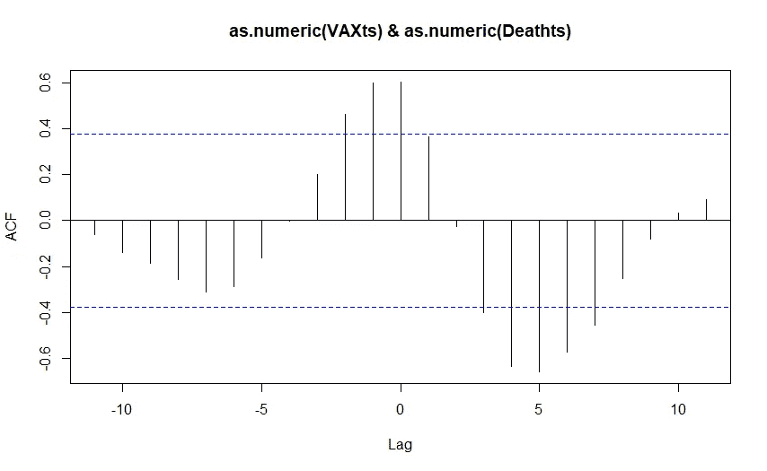

Clearly shows that the majority of the auto-correlation happens in the vicinity of the value itself. Then, there are some things happening 5 lags apart, but that does not really show from the graph. It would mean that a value now is dependent on five values back.

当然，绘制互相关数据有多种方法，在 [astsa](https://cran.r-project.org/web/packages/astsa/index.html) 包中，我们找到了另一种方法。

```
astsa::lag2.plot (as.numeric(VAXts), 
                  as.numeric(Deathts), 10)
astsa::lag2.plot (as.numeric(Deathts), 
                  as.numeric(VAXts), 10)
```

下面你可以看到，在死亡或 VAX 时间序列中的一个值和另一个序列中的一个滞后值之间的两种相互关系。

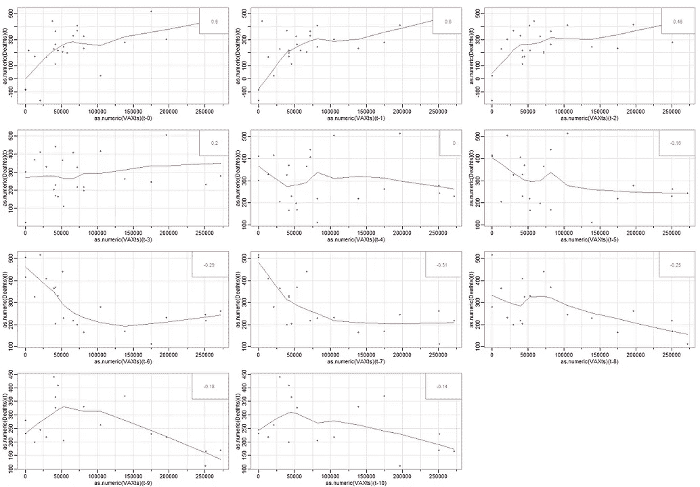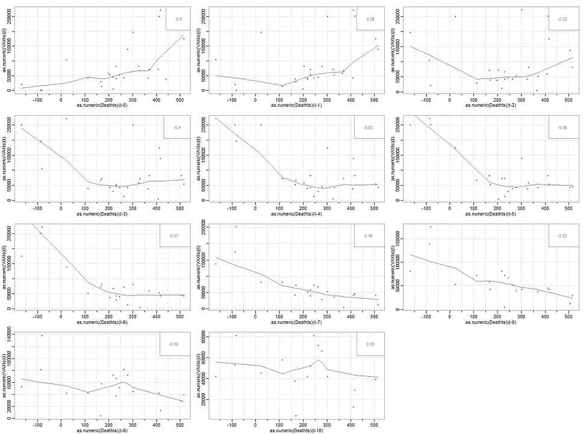

Correlation is highest the closed the lag value is. Further away, it does not really amount to anything.

现在是时候使用臭名昭著的 Dickey-Fuller 测试和许多其他测试来寻找[单位根](https://en.wikipedia.org/wiki/Unit_root)了。单位根的意思是，如果一个时间序列有这样一个东西，它就不是平稳的，需要差分。迪基-富勒测试，或这里的[增强迪基-富勒测试](https://en.wikipedia.org/wiki/Augmented_Dickey%E2%80%93Fuller_test)，是检验这一点的首选测试。零假设是存在单位根，这意味着如果 p 值低于给定的阈值，比如 0.05，则数据是平稳的或趋势平稳的。后者意味着一旦趋势被移除，一个序列就变得稳定。因此，可以用多种方式进行测试，不删除任何东西，不删除一个常数，也不删除一个趋势。我们将移除趋势以测试平稳性。

使用了 [*ur.df*](https://kevinkotze.github.io/ts-6-tut/) 函数，我将基于之前的 acf 图计算滞后数，尽管自动选择功能也是可用的。

```
ADF_VAXts<-ur.df(VAXts, 
      lags = 2, 
      selectlags = "AIC", 
      type = "trend")      
summary(ADF_VAXts)
plot.ts(ADF_VAXts@res, ylab = "Residuals")
abline(h = 0, col = "red")
tsm::ac(ADF_VAXts@res, max.lag = 20)
```

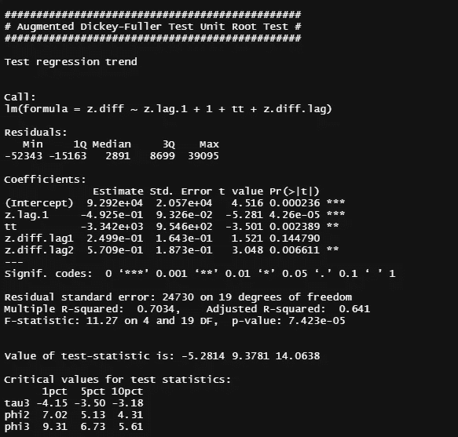

The summary coming from the **ur.df** function.

现在，上面显示的，是对单位根的扩展的 Dickey Fuller 测试。三个测试统计值分别是-5.28、9.37 和 14.06。这些是 tau3、phi2 和 phi3 各自的测试统计，它们是*趋势*、*漂移*和*无*的各自值。你能看到的是，三者都与临界值有显著差异，这意味着数据是平稳的(记住，我们假设的是非平稳数据)。观察到这三个都很重要意味着我们有正确的测试，并且我们有一个固定的数据集。这与早先的观察结果一致，即 VAX 时间序列的自相关性迅速下降。

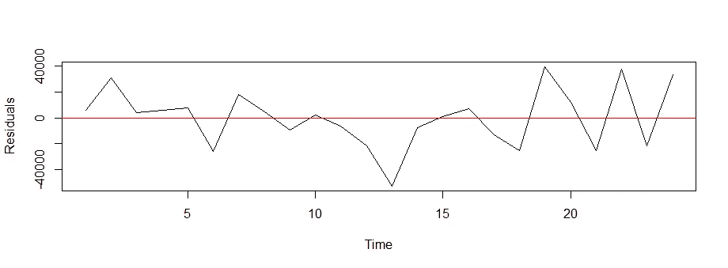

The residuals coming from the test.

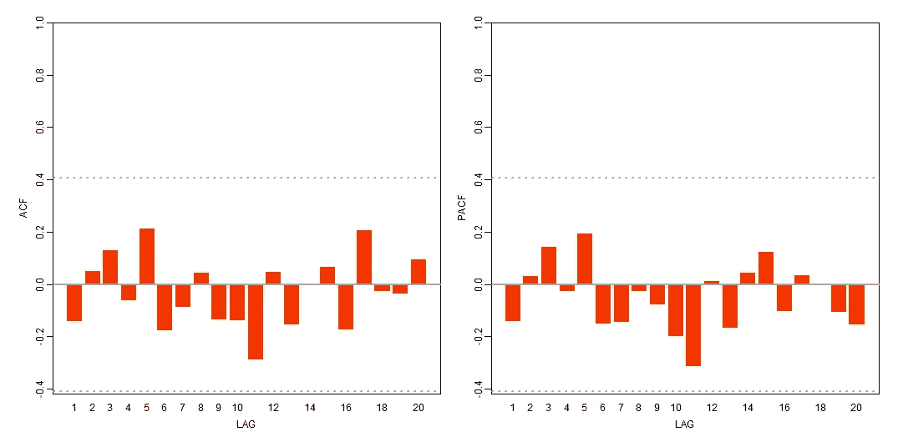

Autocorrelation of residuals coming from the test. No remaining auto-correlation to be detected.

当然，有多种方法来测试单位根，我们也将应用这种方法。这里，临界值低于 1%水平的检验统计量，所以这里的检验也暗示了平稳数据。

```
summary(ur.ers(VAXts,
       model = "trend", 
       lag.max = 2)) 
```

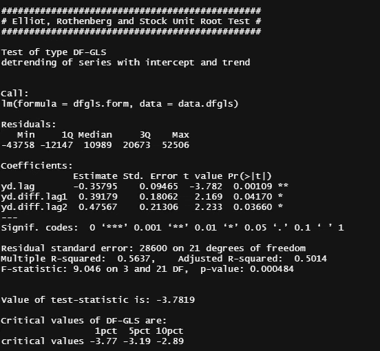

当然，还有很多测试可以应用。因为这是 R，所以您可以测试和做很多事情。就我个人而言，我更喜欢图形而不是统计测试，但是因为这应该是一个信息丰富的博客，所以我将向你们展示两者。

```
tseries::adf.test(VAXts)     
tseries::kpss.test(VAXts, null="Trend")
Box.test(VAXts, lag=2, 
         type="Ljung-Box")
```

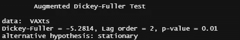

The null-hypothesis of a unit-root at lag 2 has been beaten.

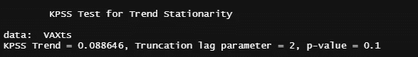

[**KPSS**](https://www.statology.org/kpss-test-in-r/): using this test statistic, the p value is greater than 0.1, which is in agreement with the rest, because the null-hypothesis assumes a stationary series. So, here, H0 means trend stationary. Using the ADF, H0 means unit root and so non-stationary. They do not make this easy on you.

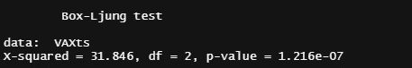

[**Box-L jung**](https://en.wikipedia.org/wiki/Ljung%E2%80%93Box_test): This test statistic looks at the presence of auto-correlation. A low p-value means that the data are not idd — not independently distributed. There is serial correlation.

所以，现在我们知道如何做了，让我们把它也应用到其他地方。

```
ADF_Deathts<-ur.df(Deathts, 
                 lags = 2, 
                 selectlags = "AIC", 
                 type = "trend")      
summary(ADF_Deathts)
plot(ADF_Deathts)
tsm::ac(ADF_Deathts@res, max.lag = 20)
tsm::gts_ur(ADF_Deathts)
summary(ur.ers(Deathts,
               model = "trend", 
               lag.max = 2))         # lag at 2
tseries::adf.test(Deathts)     
tseries::kpss.test(Deathts, null="Trend")
Box.test(Deathts, lag=2, 
         type="Ljung-Box")
```

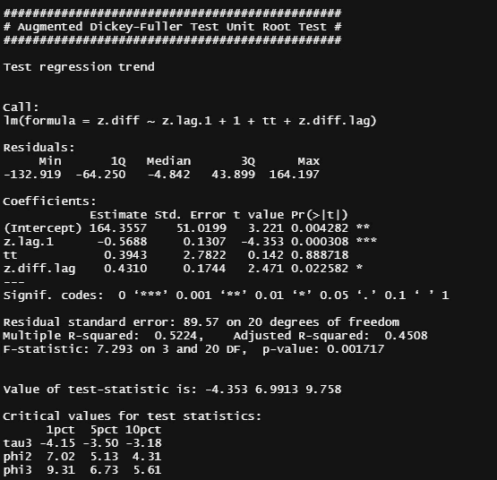

Test statistic exceed critical values at the 5% at least.

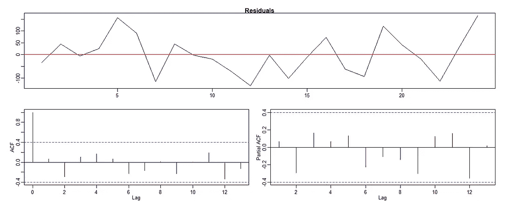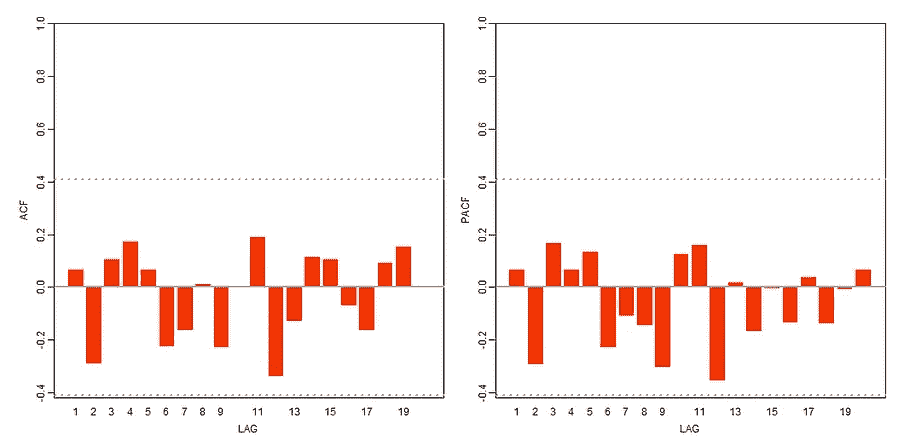

Residuals show no auto-or partial auto-correlation. `

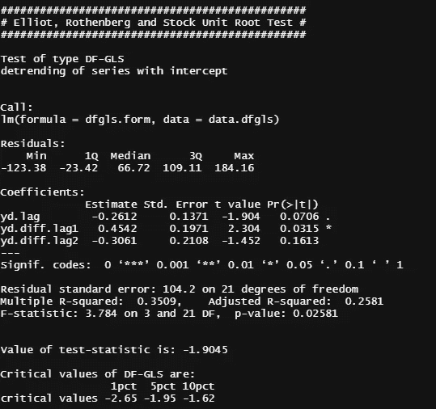

Test statistic not exceed at the 5% level meaning that the data is non-stationary.

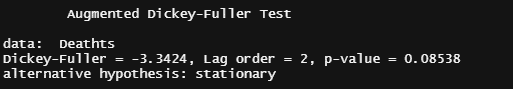

The null-hypothesis is not rejected, so non-stationary.

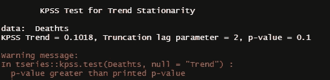

The null hypothesis is not rejected, so stationary.

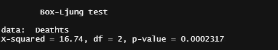

And there is serial correlation.

现在，这个时间序列，死亡是很难解释的。自相关是肯定存在的，它下降得很快，差分抵消了任何自相关。因此，有人会说数据是不稳定的，必须差分才能如此，但不是所有的测试都同意。当然，统计测试依赖于样本大小，这个时间序列真的不是很长，而且很奇怪。

因此，接下来要做的是检查和评估两个单变量时间序列之间的差异。现在，我确实知道它们在规模上有很大的不同，但这不一定有关系。重要的是差异。

```
VECM_ECT<-Deathts - VAXts
ADF_DeathtsVAX<-ur.df(VECM_ECT, 
      lags = 2, 
      selectlags = "AIC", 
      type = "trend")
summary(ADF_DeathtsVAX)
plot(ADF_DeathtsVAX)
tsm::ac(ADF_DeathtsVAX@res, max.lag = 20)
tsm::gts_ur(ADF_DeathtsVAX)
summary(ur.ers(Deathts - VAXts, 
       type="DF-GLS",
       model = "trend", 
       lag.max=2))         
adf.test(VECM_ECT, k=6)  
adf.test(VECM_ECT, k=2)   
Box.test(VECM_ECT, lag=6, 
         type="Ljung-Box")
```

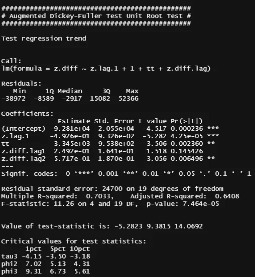

Test statistics beat all the critical values — this is a time-series which is stationary with a constant and a trend.

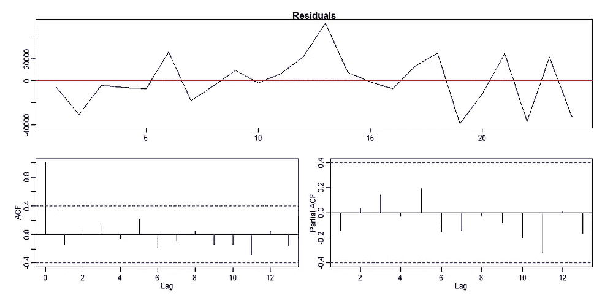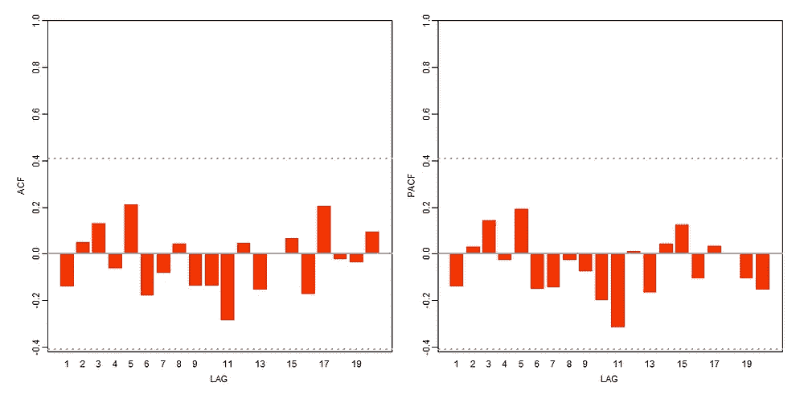

No auto-correlation anymore with such a model, meaning it is stationary after including the constant and the trend.

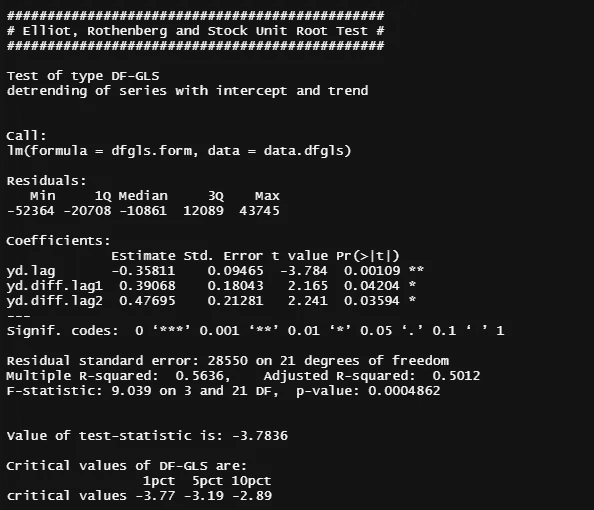

Time-series is stationary.

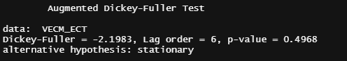

At lag six non-stationary.


However, at lag 2 it is. So, it really depends on what kind of lags you test on and I chose my lags based on the acf plots shown way above, the ones of the raw time-series.

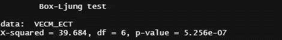

The data is serial correlated, which is to be expected looking at the plots.

因此，协整的第一个检验表明，如果两个非平稳数据进行协整，它们会有一个平稳的差异。这并没有发生。然而，看这个图，在开始时肯定有一些共同整合，在结束时也有一些，但是很快就变得模糊了。幸运的是，有多种方法来测试协整，其中之一是动态回归。如果你想了解更多关于协整的内容，请看看这本[优秀的书](https://www.pearson.com/en-us/subject-catalog/p/introduction-to-econometrics/P200000006421?view=educator)。它谈到了三种共同整合的方法，第一种我们刚刚做了。另一个博客谈论同样的三种方式，实际上使用了书中的数据，可以在这里找到。快速比较一下就会发现，我确实借用了这个博客的代码。

现在，我们来看第二种方法，它涉及到动态线性回归。如果两个单变量时间序列是协整的，那么协整回归中系数的 OLS 估计是一致的。由于时间序列的固有属性，OLS 是不够的，人们必须回到动态 OLS，其中滞后和领先可以被纳入。

因此，让我们回到 [**dynlm**](https://cran.r-project.org/web/packages/dynlm/dynlm.pdf) 包，并尝试共同整合 VAX 和死亡时间序列。下面你可以看到一个简单的动态回归的例子，不包括滞后和误差。误差本身是特别令人感兴趣的，尤其是如果它们符合平稳过程的特性，这正是我们所期望的。

```
VAX_Death <- dynlm(Deathts ~ VAXts)
summary(VAX_Death)
par(mfrow = c(2, 2))
plot(VAX_Death)
z_hat <- resid(VAX_Death)
dev.off();plot(z_hat)
acf(z_hat)
```

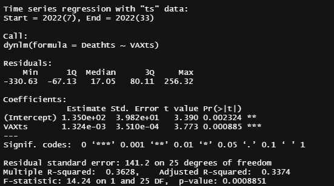

The summary coming from the time-series regression.

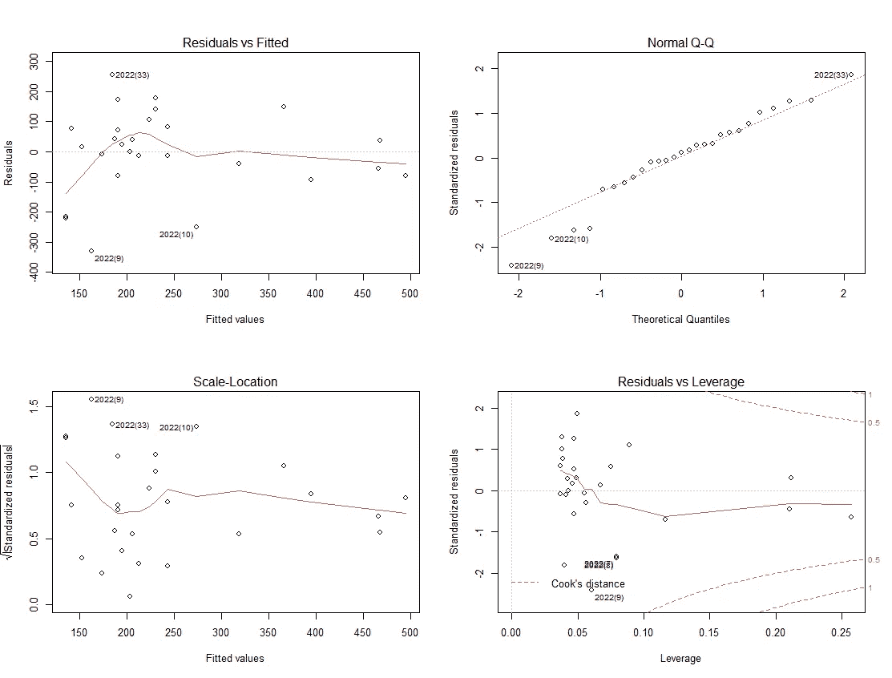

Evaluation of the model shows the same attributes that one might expect from a normal linear regression.

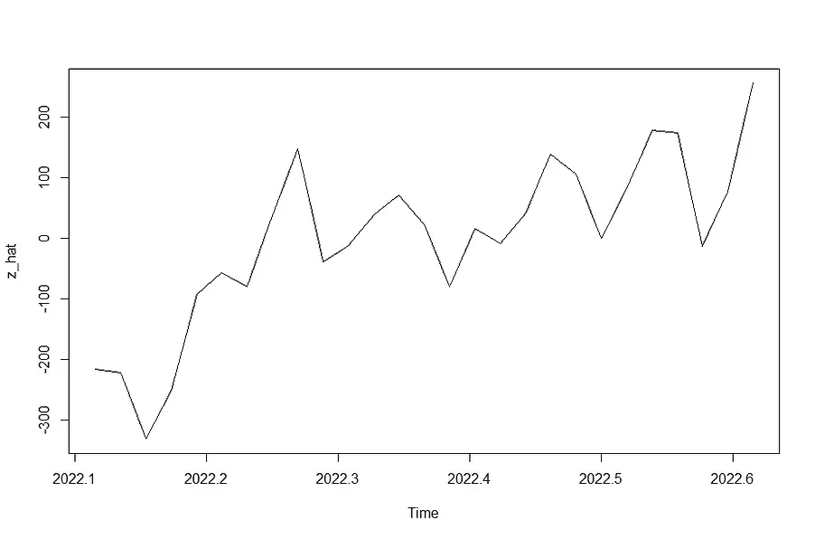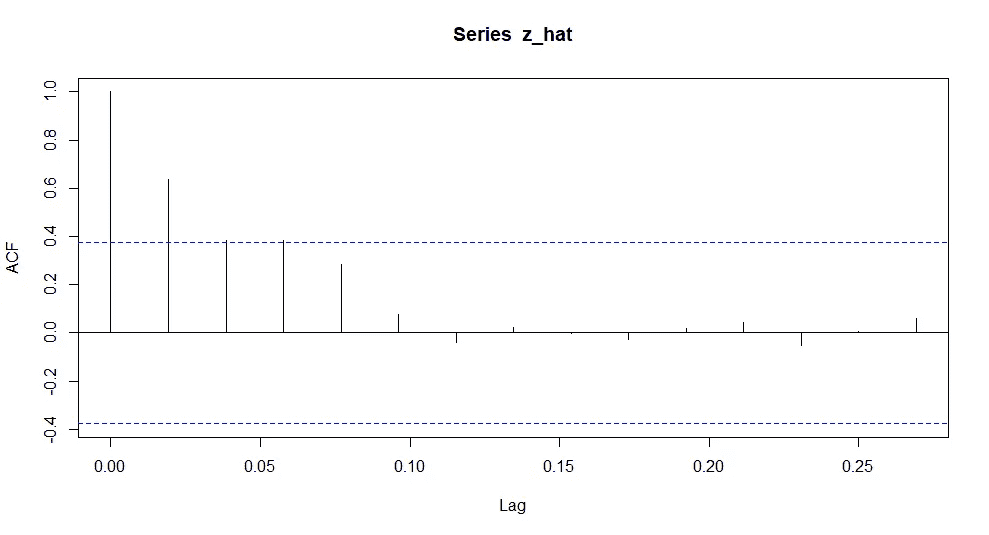

The residuals, plotted.

```
tsm::gts_ur(z_hat)
```


The residuals are only stationary if we include a constant and a trend, else they are not.

从 aTSA 软件包中，我们还可以要求进行一个协整检验，其中进行了 Engle-Granger(或 EG)检验。这里的零假设是两个或两个以上的时间序列，每个都是 I(1)，不协整。因此，为了进行这个测试，我们需要首先通过 *d=1* 对时间序列进行积分，然后查看结果。

```
aTSA::coint.test(Deathts, VAXts, d = 1, nlag = 2, output = TRUE)
```

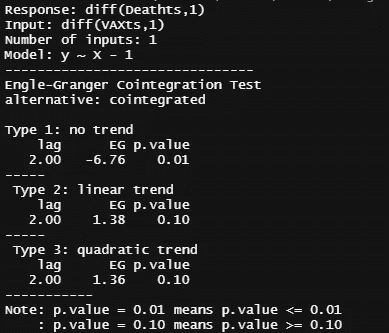

It seems that, at lag 2, the data are cointegrated at the 1% level at no trend.

如果我们想将这些结果与之前的程序进行比较，我们需要通过包含差异和包含滞后来扩充该程序，分别设置为 *d=1* 和 *lag=2* 。为了让 at 更有趣，我们可以用两种方式来做这个分析:

1.  VAX 的死亡回归
2.  回归死亡中的 VAX

当然，第一个是我们最感兴趣的。

```
VECM_EQ1<-dynlm(d(Deathts)~L(d(VAXts),1:2)+L(d(Deathts),1:2)+ L(VECM_ECT))VECM_EQ2<-dynlm(d(VAXts)~L(d(VAXts),1:2)+L(d(Deathts),1:2) + L(VECM_ECT))
```

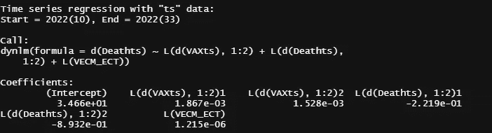

The results for regressing Death on VAX


The results for regressing VAX on Death

现在，这两个模型的主要兴趣是，并将永远是，剩余部分。到目前为止，我们所做的一切每次都集中在错误部分，这就是我们将用[*coeftest*](https://www.rdocumentation.org/packages/lmtest/versions/0.9-40/topics/coeftest)*函数再次做的事情。*

```
*names(VECM_EQ1$coefficients) <- c("Intercept", "D_VAXts_l1", "D_VAXts_l2", "D_Deathts_l1", "D_Deathts_l2", "ect_l1")names(VECM_EQ2$coefficients) <- names(VECM_EQ1$coefficients)coeftest(VECM_EQ1,vcov.=NeweyWest(VECM_EQ1,prewhite=F,adjust=T))
coeftest(VECM_EQ2,vcov.=NeweyWest(VECM_EQ2,prewhite=F,adjust=T))*
```

*从输出中可以看出，VAX 的第一滞后和死亡的第二滞后影响死亡。至少，在第一个模型中。在第二个模型中，我们还可以看到，VAX 的第一和第二个滞后影响了 VAX，死亡几乎影响了 VAX，错误也有影响。从这里看，VAX 和死亡是否结合在一起还不是很清楚，当然 VAX 的变化也不会导致死亡的变化。*

*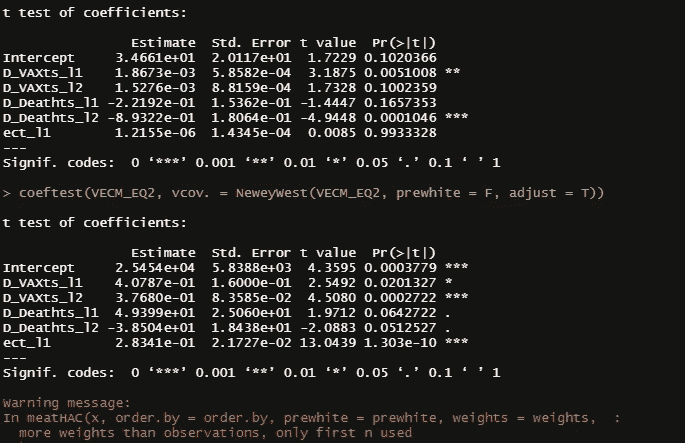*

*In the first model, the error is not significant from zero, but in the second it is. Not sure yet how to best interpret this, besides perhaps that the relationship is not per se of VAX on Death but vice versa. Biologically, that could make sense, as well as sociologically, although that would mean that the death rate as communicated would directly influence the tendency to vaccinate, and the ability to do so.*

*另一个要进行协整评估的是通过[](https://cran.r-project.org/web/packages/car/index.html)****包，其中有一个[](https://www.rdocumentation.org/packages/car/versions/3.1-0/topics/linearHypothesis)**函数。在这种形式中，可以根据 frequentist 统计测试来测试滞后值是否相关。所以，在第一部分，我通过建立一个限制模型并去掉它们，来测试 VAX 的滞后值是否对死亡有影响。在下一个模型中，我们做了同样的事情，但是是关于死亡和 VAX 之间的关系。记住，每次我构建一个受限模型。*******

```
*******car::linearHypothesis(VECM_EQ1, 
                 hypothesis.matrix=c("D_VAXts_l1", 
                 "D_VAXts_l2"),
                 vcov. = sandwich)car::linearHypothesis(VECM_EQ2, 
                      hypothesis.matrix=c("D_Deathts_l1",
                      "D_Deathts_l2"),
                      vcov. = sandwich)*******
```

*******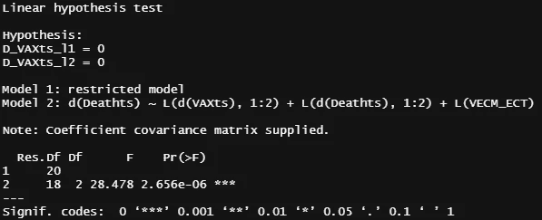*******

*******The restricted model is not better, meaning that the lags of VAX should be included.*******

*******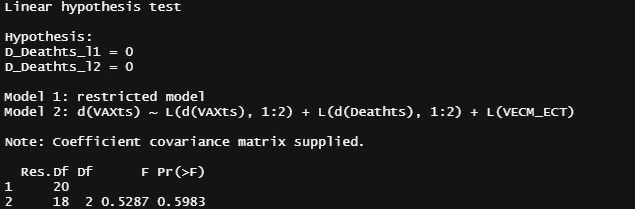*******

*******The restricted model is better, meaning that the lags of Death on VAX do not add much. One could already see that from the previous model summary*******

*******我们也可以测试误差是否为零，但最后一步是 [*格兰杰*](https://www.rdocumentation.org/packages/lmtest/versions/0.9-40/topics/grangertest) 测试，这通常被称为[格兰杰因果关系测试](https://en.wikipedia.org/wiki/Granger_causality)。如果以前在[尝试将锁定措施与重要的 Covid KPI](https://blog.devgenius.io/the-effect-of-covid-measures-on-covid-outcomes-a-vector-autoregressive-moving-average-exogenous-dd7fa6c3774f)连接时使用过该测试。这里，我将加上 lag=2，因为我们一直都是这么做的。*******

```
****grangertest(Deathts~VAXts, order = 2)
grangertest(VAXts~Deathts, order = 2)****
```

******第一个测试试图比较包含和不包含 VAX 滞后的模型。好像型号 2(也就是缩小版的型号)也不是更好。所以，VAX 的滞后对死亡的滞后是有影响的。在第二个测试中，我们再次建立了一个滞后和重复模型，并看到死亡的滞后并没有给 VAX 增加多少。这意味着简化的模型，只包含 VAX 的滞后来预测 VAX 是足够的。这一发现有利于 VAX 水平影响死亡水平。******

******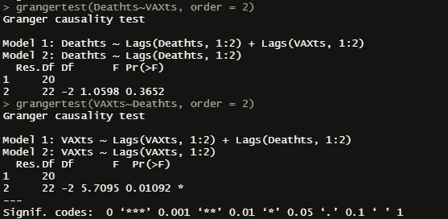******

******You see we have two test, looking at two models each.******

******另一个协整检验是通过 [*ca.jo*](https://www.rdocumentation.org/packages/urca/versions/1.2-9/topics/ca.jo) 对 VAR 的 [Johansen 过程](https://en.wikipedia.org/wiki/Johansen_test)。这不是一个简单的测试，涉及到等级。由于我们只有两个单变量时间序列，我们只能有两个等级: *r=0* 或 *r≤1* 。这意味着要么不存在协整( *r=0* )，要么存在( *R≤1* )。让我们指定这样一个模型，使用和以前一样的滞后数。******

```
****jotest=ca.jo(data.frame(VAXts,Deathts), 
             type="trace", 
             K=2, 
             ecdet="none", 
             spec="longrun")
summary(jotest) 
plot(jotest)****
```

******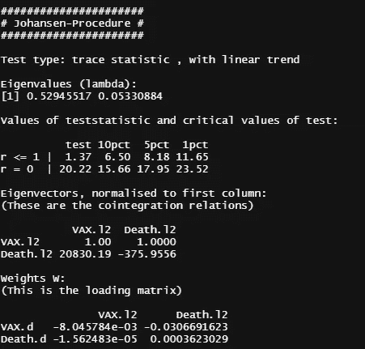******

******The model clearly shows that there is no cointegration present.******

******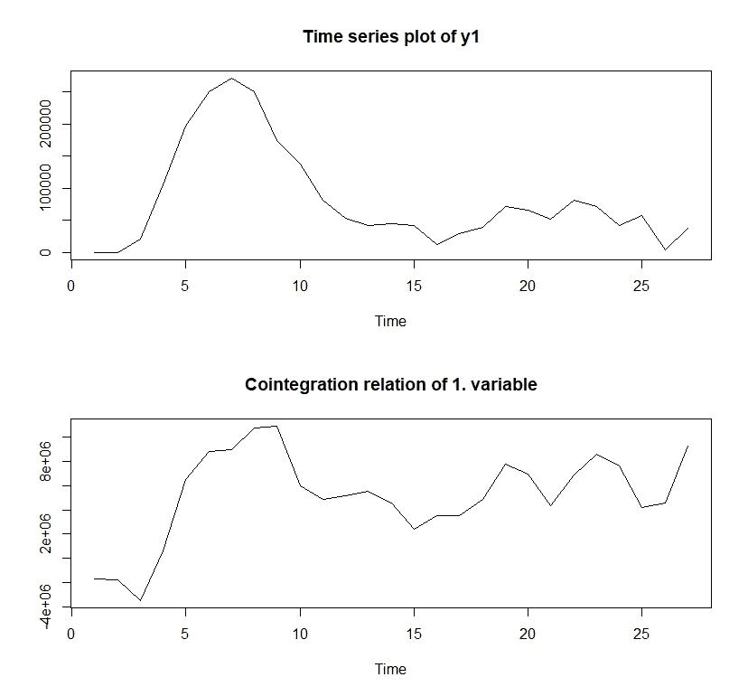************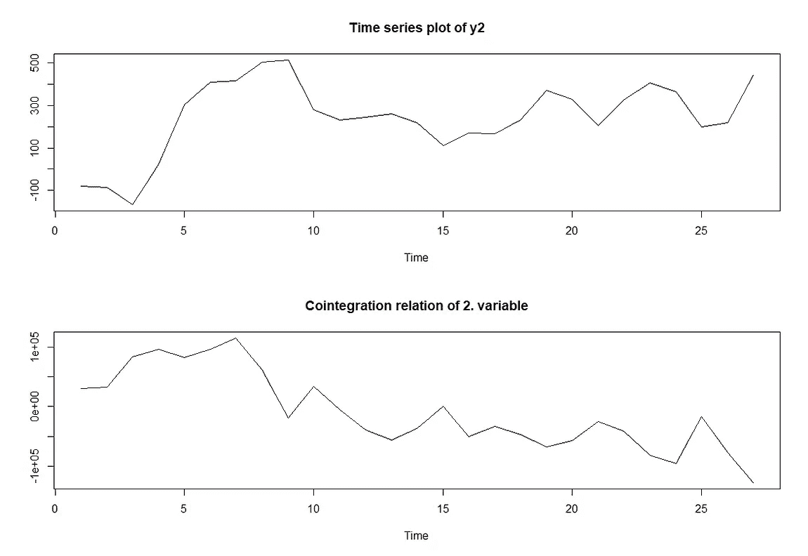******

******最后，同样重要的是，我们可以使用 [*VAR*](https://www.rdocumentation.org/packages/vars/versions/1.5-6/topics/VAR) 函数，构建一个 VAR，或 [**向量自回归模型**](https://www.r-bloggers.com/2021/11/vector-autoregressive-model-var-using-r/#:~:text=For%20a%20vector%20times%20series,model%20and%20error%20correction%20equations.) 。为此，我们需要构建一个多元时间序列对象，对其求差，并在 lag=2 时运行它。VAR 模型没有回归 VAX 死亡或 VAX 死亡的偏好。不，它是同时进行的，您将在接下来的总结中看到。******

```
****combined<-ts.union(diff(VAXts), diff(Deathts))
plot(combined)
VAR_est <- VAR(y = combined, p = 2)
summary(VAR_est)****
```

******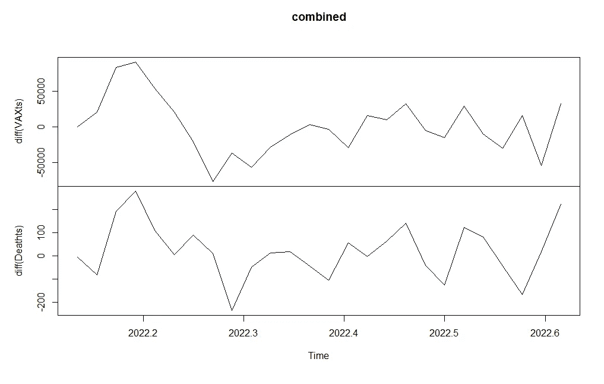******

******The multivariate ts object created.******

******和 VAR 模型的总结，把 VAX 的死亡和 VAX 的死亡放在一起看，它们是包含双重滞后的不同时间序列。VAX 模型没有提供太多，但是死亡模型提供了，其中 VAX 的第一个滞后再次是显著的，但是强度非常小。当然，时间序列有不同的数量级，但与常数相比，外生变量的影响很小。实际上，最大的影响来自于常数，因此也来自于死亡本身。******

******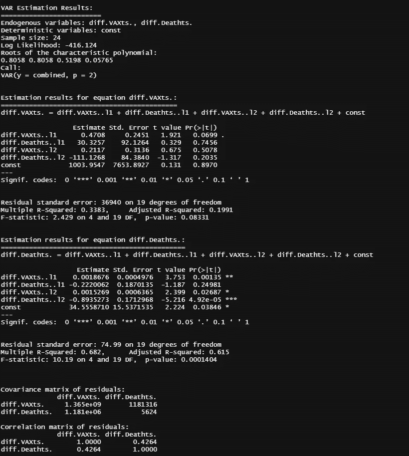******

******好了，博客到此结束。现在，主要的目的并不是一定要把 VAX 和死亡联系起来，而是要表明协整分析是多么困难。我们使用了多种方法，我找不到一个稳定的协整模式，这意味着两个序列的差异显示了一个稳定的形式。此外，应用的许多指标和矢量建模并没有显示出有吸引力的联系，这一点从一开始看图表时就非常清楚。第一条曲线很奇怪，但其余的逐渐消失。******

******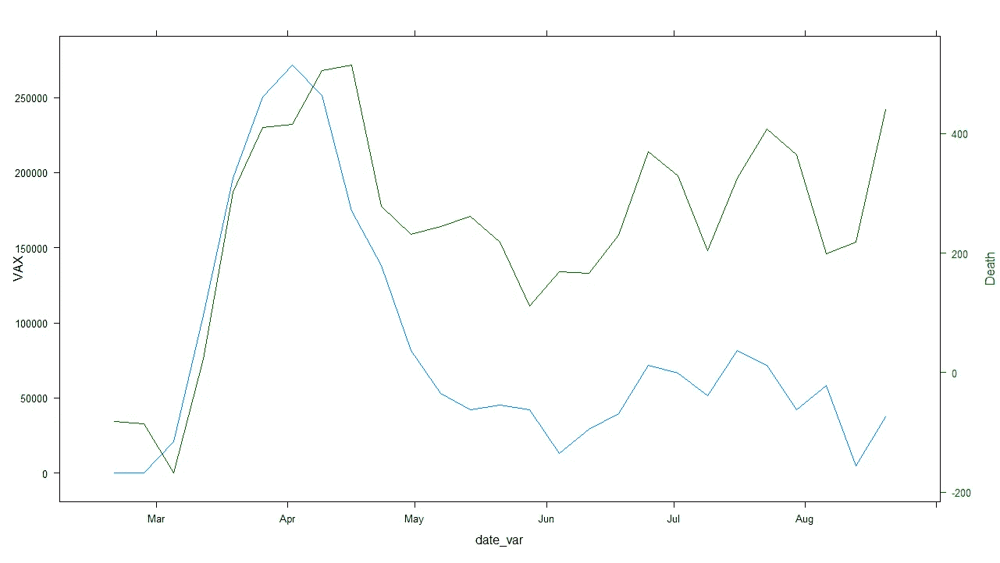******

******如果真的有联系，下一轮的疫苗应该会导致另一次冲击。******

******希望你喜欢这篇文章，如果有什么不对的地方，请告诉我！******

******[](/mlearning-ai/mlearning-ai-submission-suggestions-b51e2b130bfb) [## Mlearning.ai 提交建议

### 如何成为 Mlearning.ai 上的作家

medium.com](/mlearning-ai/mlearning-ai-submission-suggestions-b51e2b130bfb)******