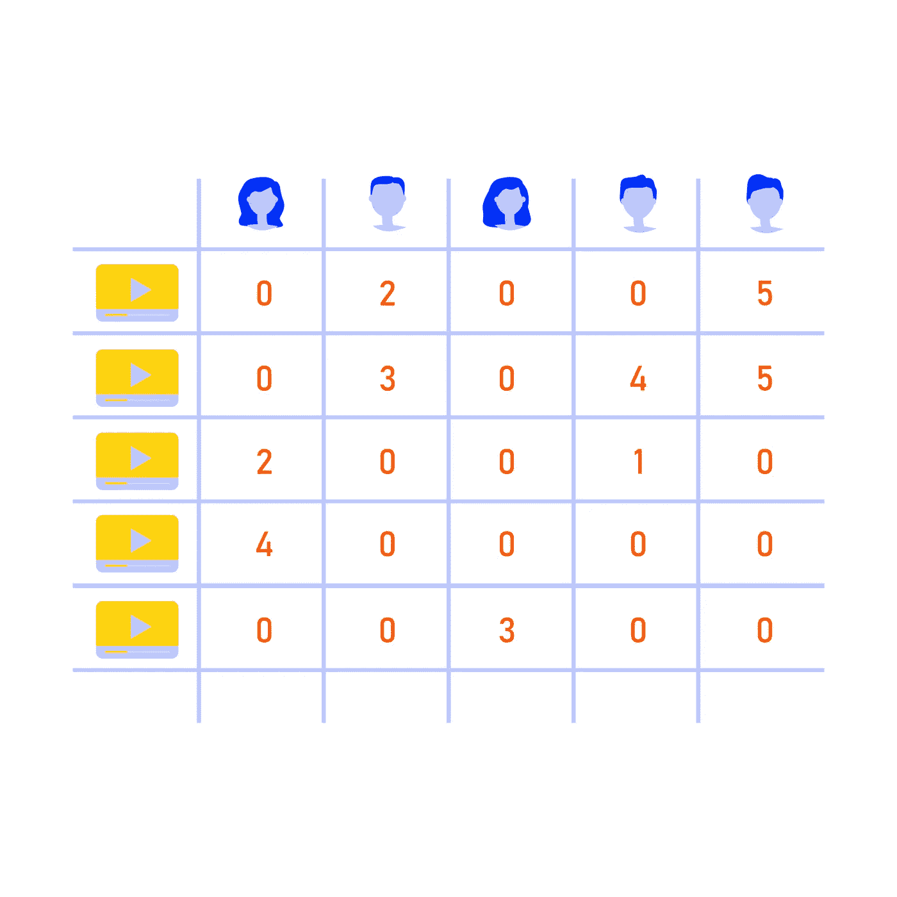
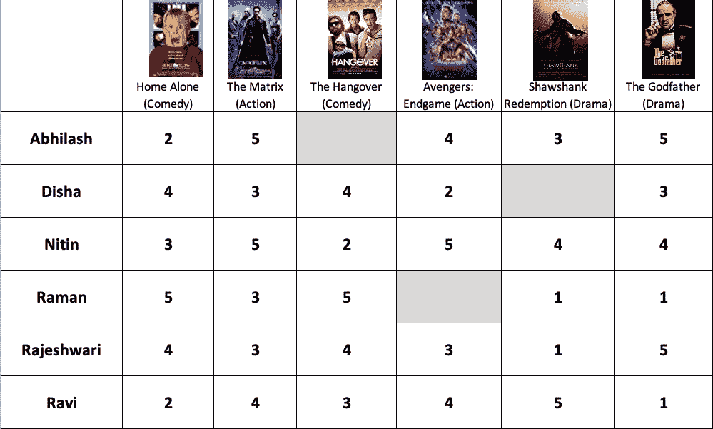
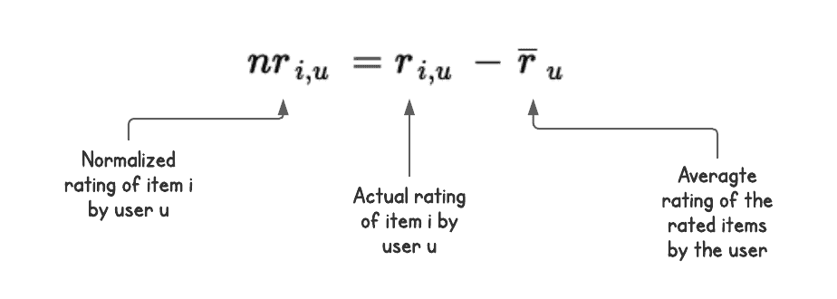
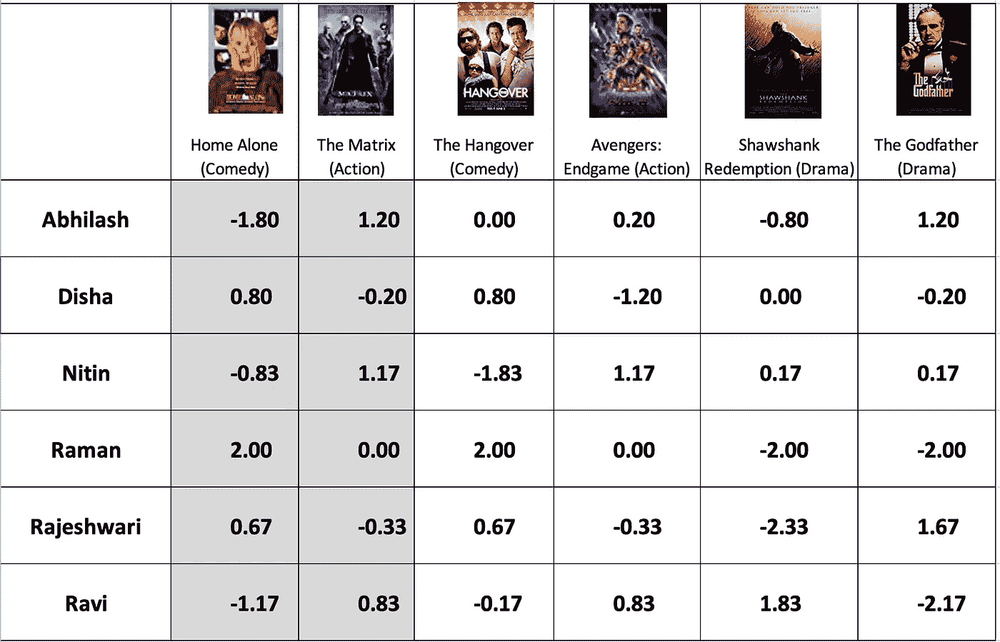
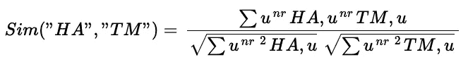
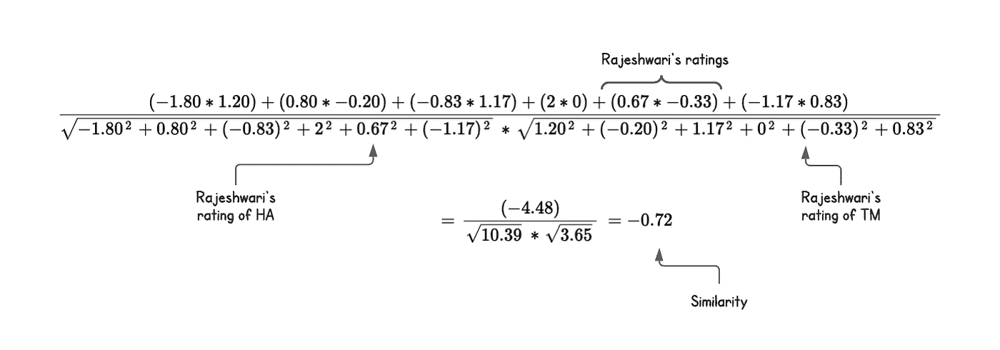
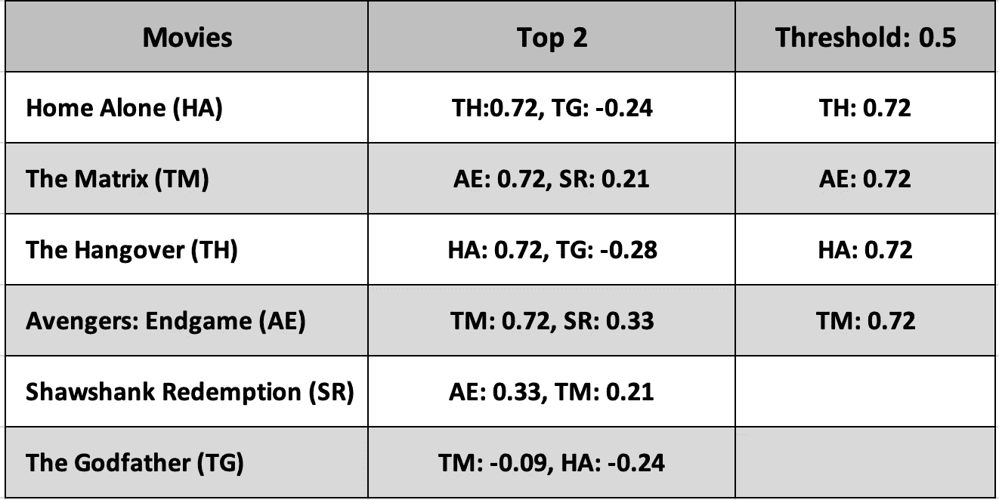
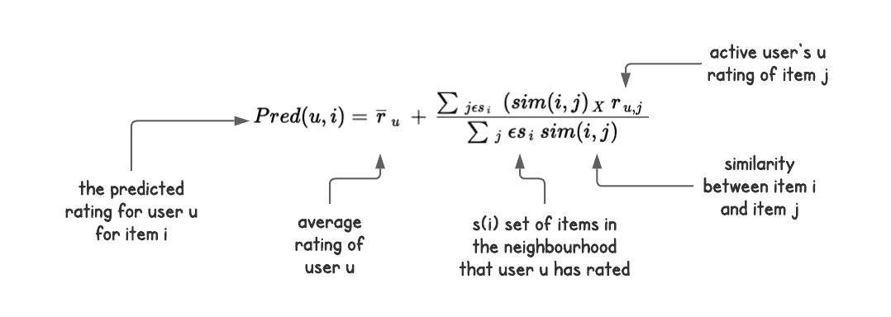
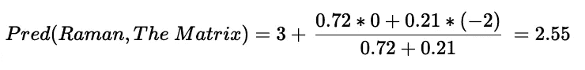

# 协同过滤相似度计算

> 原文：<https://medium.com/mlearning-ai/collaborative-filtering-similarity-calculations-a974ae4650?source=collection_archive---------0----------------------->



image of a matrix with user ratings

在[的上一篇文章](https://nagendranukala.medium.com/collaborative-filtering-fundamentals-d2d845e1de75)中，我们回顾了构成项目-项目协同过滤流程的所有组件的高级概述。在这篇文章中，我们将通过一个电影分级的例子来回顾相似性计算的数学过程。这些计算是今天复杂的推荐系统中发生的事情的简化版本，但是它确实给读者一个在开发一个协同过滤推荐系统中涉及的基础数学的概念。

推荐系统由多个过程组成，它们被连接在一起共同工作，因此我们将整个系统称为一个管道，下面是我们将在管道版本中涉及的主要步骤:

1.  对于属于评级矩阵一部分的活动用户，计算要预测的项目与所有其他项目之间的相似性。
2.  根据相似性对项目进行排序。
3.  选择邻居。
4.  计算预测评级。

这里我们需要做的第一件事是选择一个相似性方法。记住，我们已经在 T2 的文章中讨论过不同种类的这些。对于这个计算，我们将使用余弦相似度方法。

分级矩阵示例，1 为电影的最低分级，5 为最高分级:



Movie rating matrix for 6 users rating 6 movies

**相似度计算:**所有用户都给 Home Alone (HA)评分，所以我们会依次查看每个用户。用户是 Abhilash，他也给《黑客帝国》( Matrix)、《复仇者联盟 4：终局之战》、《肖申克的救赎》( Shawshank Redemption)和《教父》( Godfather)评分。我们会把他的评分加入到有 Home only(HA)的物品列表中，所以我们有:HA: [TM，AE，SR，TG]。接下来是迪莎，她对以上榜单中的电影加上《宿醉》(TH)进行了评分。一个项目只能添加一次。我们会一行一行的去，把用户评价过的电影放在一起。让我们一起计算所有电影的评分列表，如下所示:

*   HA: [TM，TH，AE，SR，TG]
*   TM: [HA，TH，AE，SR，TG]
*   TH: [HA，TM，AE，SR，TG]
*   SR: [HA，TM，TH，AE，TG]
*   甲状腺激素:[HA，TM，TH，AE，SR]

有了这些列表，我们就可以计算出每个项目与另一个项目的相似性。我们将使用调整后的余弦相似度函数来计算这一点。为了准备这种方法，我们必须根据用户的平均评分来标准化项目评分。该公式定义为:



formula for normalizing the user rating

下面是按平均用户评分标准化评分后的评分矩阵:



如上表中突出显示的用于计算两部电影(Ha，TM)之间的相似性的公式如下:



让我们用一些数字来表示这个等式，并根据上面的评级得出这两部电影之间的相似性:



calculation for the similarity rating between two items

余弦相似度给出-1 和 1 之间的值。

下面是根据我们对一双鞋的计算得出的完整评分矩阵。


similarity matrix for the rating array, negative correlation has been marked progressively red and positive has been marked green

*   **接近 1** :如果两个项目非常相似，那么值往往更接近 1，例如 TH 和 HA，它们彼此之间非常相关，与图表上的任何其他项目都没有相关性。
*   **接近-1:** 如果它们非常不相似，则值趋向于接近-1，例如 HA 和 TM 彼此非常不相似
*   **接近 0:** 如果没有太大的相关性，那么数值就趋于 0 左右。有趣的是，TM 和 TG 似乎没有任何关联，即使是在故事方面，它们似乎是截然相反的，但都是我最喜欢的:-)

根据我们对评分所做的计算，我们确实看到 HA 和 TM 之间有很大的不同，我非常同意这一点，但我们需要记住，这些相似性计算仅基于评分，这是一个显式值，我们根据用户所说的进行。当我们有较少的重叠评级或较少的用户评级时，计算是不确定的，这被称为冷启动问题。在上面的矩阵中，我们将空值替换为 0，通常有更科学的插补方法用于处理缺失值，这本身就可以是一个完整的博客系列。

这里是我用来计算列的余弦相似性的 python 代码片段，请随意尝试。

```
import numpy as npfrom sklearn.metrics.pairwise import cosine_similarityfrom scipy import sparseA = np.array([[-1.80, 1.20, 0, 0.20, -0.80, 1.20],[0.80, -0.20, 0.80, -1.20, 0, -0.20],[-0.83, 1.17, -1.83, 1.17, 0.17, 0.17],[2, 0, 2, 0, -2, -2],[0.67, -0.33, 0.67, -0.33, -2.33, 1.67],[-1.17, 0.83, -0.17, 0.83, 1.83, -2.17]])A_sparse = sparse.csr_matrix(A)similarities = cosine_similarity(A_sparse.transpose())print('pairwise dense output:\n {}\n'.format(similarities))
```

**寻找邻居:**现在我们有了相似度矩阵，我们将进入推荐流程的下一步，寻找邻居。主要有两种类型，Top N 和 threshold，关于它的详细内容在我的[早前的文章](https://nagendranukala.medium.com/collaborative-filtering-fundamentals-d2d845e1de75)中。为简单起见，我们将使用 top 2 和 0.5 作为阈值，这样我们就可以看到在这两种方法中邻居是如何排列的:



neighbour calculation using Top 2 in Top-N and 0.5 as threshold

根据建议解决方案将解决的使用案例选择正确的方法非常重要，因为您可以看到基于阈值的邻居显示出更强的相似性，但结果较少。Top N 型保证了产量，但是质量低，关系弱，因为我们也出现了一些负相关。

**计算预测:**有几种方法可以运行预测计算，其中两种是我们之前讨论过的回归和分类方法。在我之前的文章中有更多关于这些的细节。这里我们用回归方法进行预测计算，公式如下:



prediction score calculation formula and explanation of terms

让我们用公式来计算拉曼对矩阵的评级(TM)。对于这个计算，我们将使用邻域中的电影，我们从上面的邻域表中知道 TM: AE: 0.72，SR:0.21。让我们在上面的函数中使用这些数字:



calculation of user’s prediction for a movie by plugging values from the formula above

我们非常接近实际评级，拉曼将 TM 评级为 3。现在我们有了预测，很容易生成推荐，我们对许多类似的项目重复这个计算，并将 top N 返回给请求推荐的客户端，瞧！建议小部件中填充了相关项目。

当然，当建议被大规模执行时，有许多操作需要完成，这就是 ML ops 世界被引入的地方。我们需要评估这种计算密集型计算有多少可以离线完成，如何使数据符合训练和测试的要求，设置输入数据和模型输出的连续验证，模型漂移和数据漂移计算，以及触发模型再训练管道的因素。所有这些项目本身就是一个完整的世界，但现在，让我们高兴的是，我们知道了推荐引擎背后的基本数学。

如果你对阅读推荐系统感兴趣，下面提到的这本书绝对是必读的，我在这篇文章中写的大部分内容是这本书的一个章节的总结。

*   《实用推荐系统》——作者 Kim Falk——可在 o'reilly online 上找到。
*   Badrul Sarwar 等人的“基于项目的协同过滤推荐算法”——【http://files.grouplens.org/papers/www10_sarwar.pdf】T3[T5](http://files.grouplens.org/papers/www10_sarwar.pdf)

*PS:我写这篇文章的时候很开心，部分原因是因为这个话题对我来说很重要，但更重要的是因为评分矩阵中提到的人是我非常亲密的朋友，所以这篇文章让我回到了我的学生时代，让我想起了我们所有人的美好时光。此外，人民是真实的，评级不是他们的，所以请不要用上面的评级来判断他们的选择；——)*

[](/mlearning-ai/mlearning-ai-submission-suggestions-b51e2b130bfb) [## Mlearning.ai 提交建议

### 如何成为 Mlearning.ai 上的作家

medium.com](/mlearning-ai/mlearning-ai-submission-suggestions-b51e2b130bfb)