# 使用 Cloud Pak 中的 IBM Watson Studio 收集和提炼来自纽约时报的数据

> 原文：<https://medium.com/mlearning-ai/collecting-and-refining-data-from-the-new-york-times-using-ibm-watson-studio-in-cloud-pak-for-data-5b319495a2f1?source=collection_archive---------1----------------------->

Photo by [cottonbro](https://www.pexels.com/@cottonbro?utm_content=attributionCopyText&utm_medium=referral&utm_source=pexels) from [Pexels](https://www.pexels.com/photo/white-printer-paper-on-white-table-3944454/?utm_content=attributionCopyText&utm_medium=referral&utm_source=pexels)

从报纸上抓取新闻以洞察受众的想法是社会听众和研究人员的主要要求之一。

《纽约时报》开发了一个 API(应用编程接口)来从其档案中收集数据库。该 API 可供对探索这些信息感兴趣的开发人员和数据科学家使用。

出于自动化的目的，让我们对这个过程有一个概述。

**NYT 开发商**

收集过程的第一步是[登录](https://developer.nytimes.com/get-started)并从以下图库中为特定项目注册一个 API:

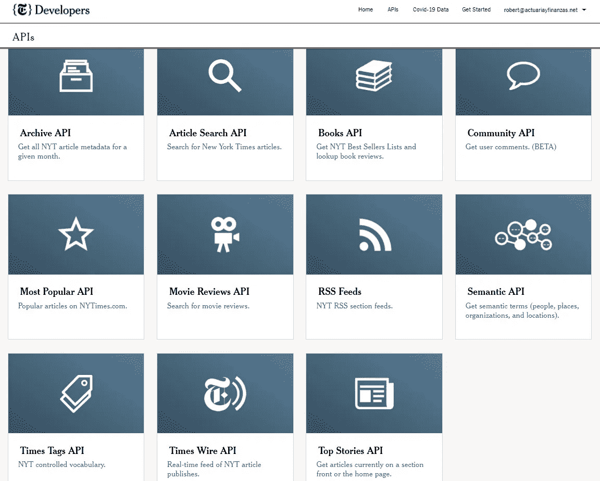

NYT API’s gallery

例如，收集文章数据库、检索标题、摘要和相关多媒体的链接。

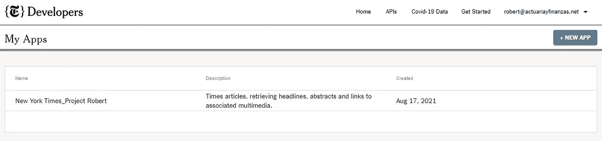

My Apps screenshot

一旦创建了应用程序，根据 [NYT 开发者网站](https://developer.nytimes.com/docs/archive-product/1/overview)继续配置搜索:

存档 API 返回从 1851 年开始的给定月份的 NYT 文章的数组。它的响应字段与文章搜索 API 相同。如果你想建立你自己的 NYT 文章元数据数据库，存档 API 是非常有用的。您只需将年份和月份传递给 API，它就会返回一个 JSON 对象，其中包含该月的所有文章。响应大小可能很大(~20mb)。”

**创建一个 IBM Watson 项目**

现在是在 Watson 项目中运行 Python 笔记本的时候了。你可以[在 IBM Cloud 注册一个免费账户](https://cloud.ibm.com/login)。

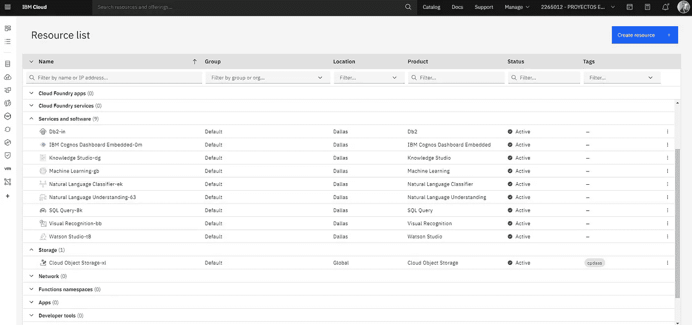

Resource list screenshot

虽然目录中有许多分析工具，但大多数都与 Cloud Pak 中的 Watson Studio 有关，用于存储桶所在的数据。这样，每个项目都有一个存储桶来保存您的资源和项目输出。

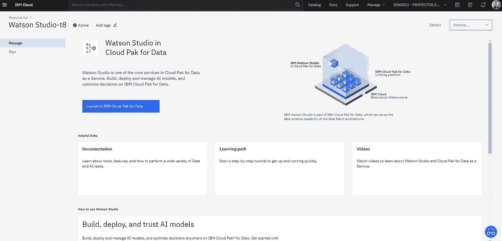

Watson Studio launch screenshot

Cloud Pak for Data 的一些优势是将所有模型放在同一个地方。我必须说这个平台有很好的文档记录，支持中心非常有用，而且总是很方便。感谢所有 AI/认知支持工程师团队。

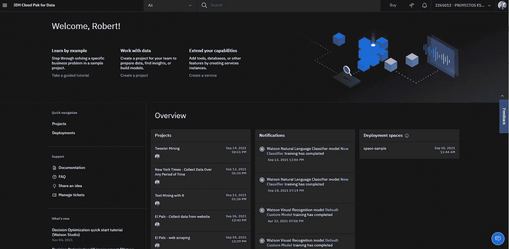

Welcome IBM Cloud Pak for Data screenshot

**Jupyter 笔记本**

该项目的资产之一是笔记本，在本例中是一个由 IBM 项目令牌访问的 Python 程序。对于这个例子，笔记本被命名为“NYT 网页抓取”。

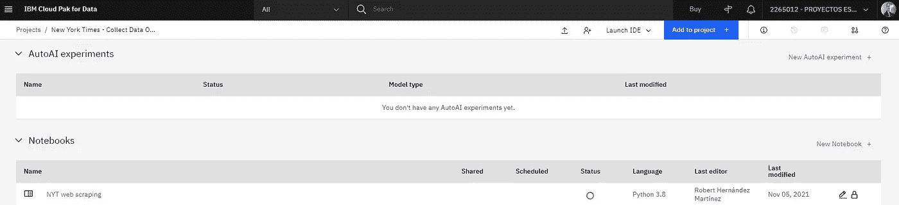

Jupyter Notebook asset

令牌访问以代码和所需的库为标题，比如 pandas 和 Beautiful Soup 等等。接下来，设置要通过 API 收集的 CSV 文件的开始和结束日期。

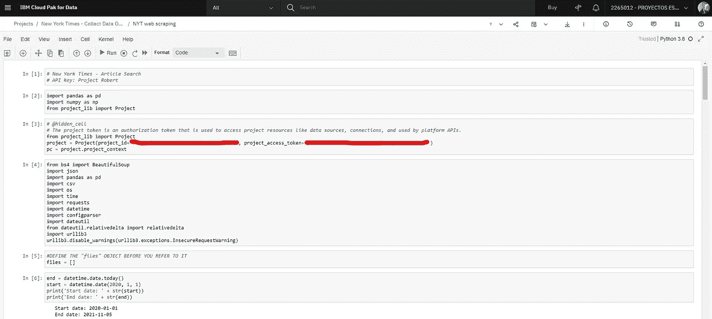

Project access token into Python code

注意根据 URL 调用编码中的纽约时报 API 键。

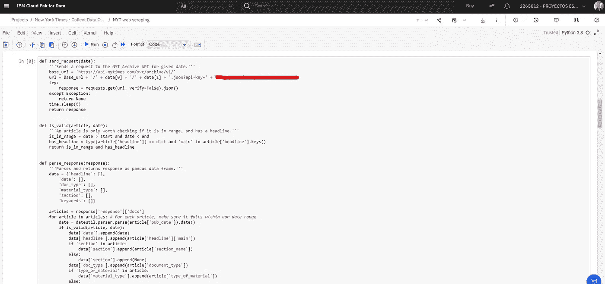

NYT API key into Python code

接下来，API 将开始收集所需月份的 CSV 文件，在本例中是从 2020 年 1 月到 2021 年 11 月，即 23 个 CSV 文件。

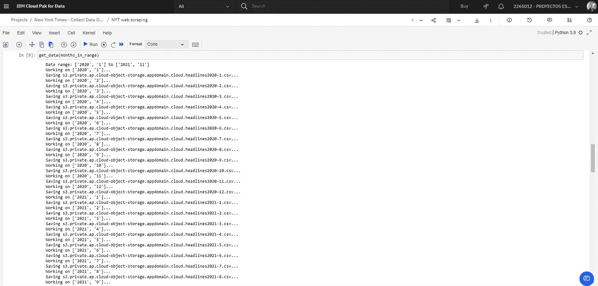

Getting data screenshot

以下是 2021 年 10 月数据库的屏幕截图，包含标题、日期、文档类型、材料类型和关键字:

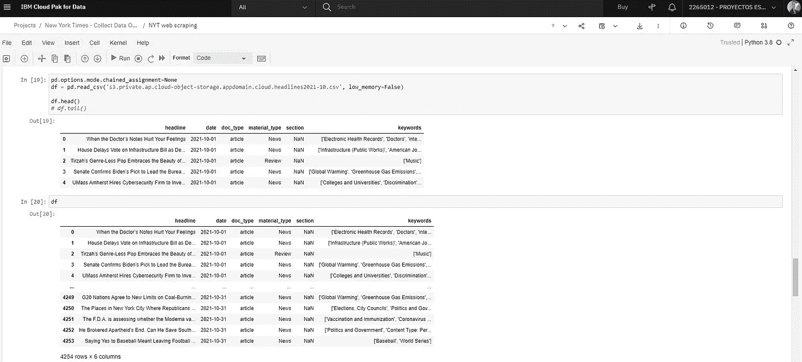

October 2021 data frame

一旦文件被收集并保存到 IBM Cloud storage 中，CSV 就是项目资产的一部分，并准备好进行细化。

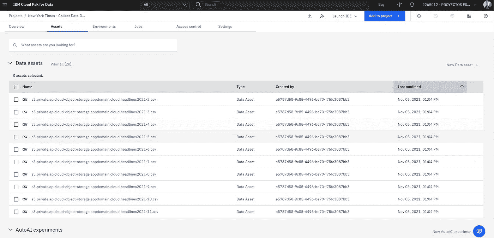

Data assets in Watson project

**使用数据提炼工具提炼和可视化数据**

优化数据意味着用图形流程编辑器准备和可视化表格数据。IBM 将此定义为*“通过从广泛的操作中进行选择，净化、塑造和丰富您的数据。您可以执行数据集级别的操作，也可以缩小范围来执行列和行级别的操作。当您细化数据时，Data Refinery 会跟踪您应用的操作。”*

让我们快速浏览一下 2021 年 10 月的文件:

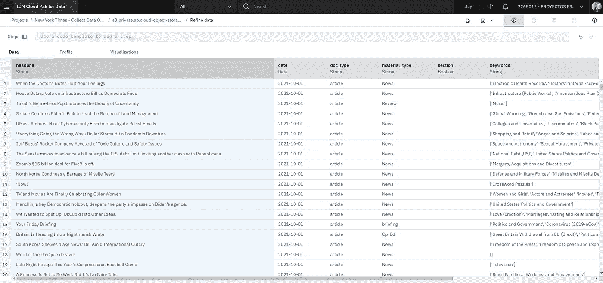

October 2021 data screenshot

与数据视图中的 Excel 电子表格非常相似，配置文件选项提供了数据集每个字段的统计信息；通过这种方式，很容易看到顶级文章来自“拼字比赛论坛”和“冠状病毒简介:今天发生了什么”。

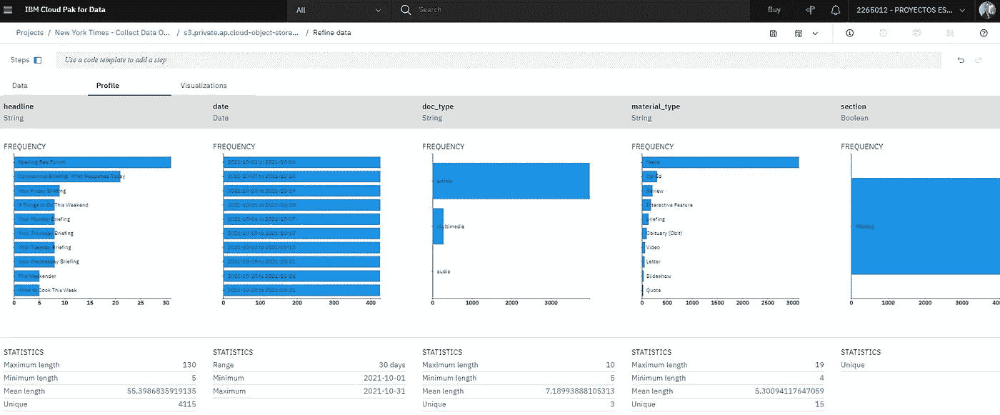

October 2021 profile statistics

可视化选项可以让您更深入地了解出现标题的材料类型的频率，如新闻、论坛版、评论、互动专题和其他来源。

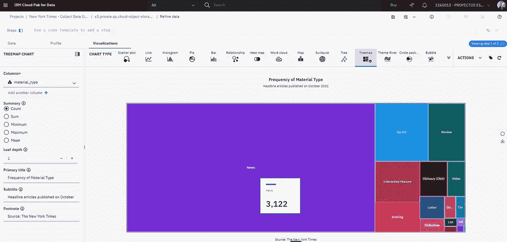

Frequency of Material Type screenshot

**自然语言**

我喜欢的特性之一是自然语言解析，它根据形式语法的规则分析一串符号。

因此，很容易移除所选列中的停用词(英语的常用词);例如，“标题”和标记化(将短语、句子、段落或整个文本文档分割成更小的单元，如单个单词或术语)。最终的可视化是一个单词云图。

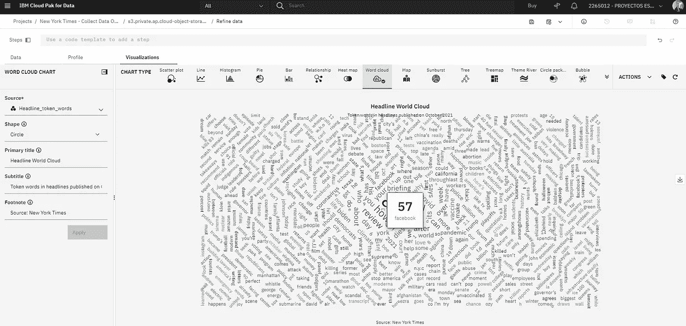

Headline Word Cloud screenshot

**最终想法**

IBM Watson Analytics 是从纽约时报档案中收集和提炼数据的一个很好的工具，API 开发者允许几乎无限的调用，因此可以为所需的抓取安排一个作业。

细化输出文件并创建数据可视化以供利益相关者和决策者共享，这为随时提供自动化报告提供了一个很好的机会。

继续分享。😊