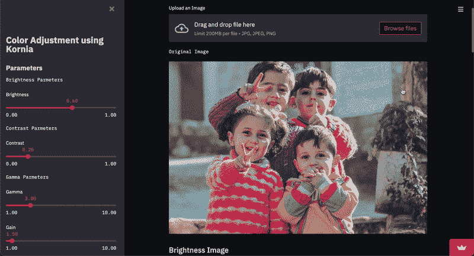
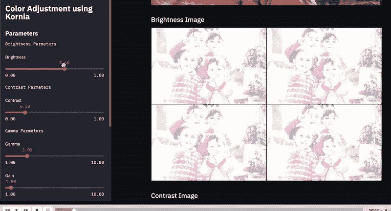

# 使用 Kornia & Streamlit 的色彩调整应用程序

> 原文：<https://medium.com/mlearning-ai/colour-adjustment-application-using-kornia-streamlit-ef3572f934f6?source=collection_archive---------3----------------------->



我一直在开发 Kornia，它是一个非常酷的库，有一些非常酷的应用程序，你可以用它来安装

```
pip install --upgrade kornia
```

你可以从这里查看它的文档。

今天我们将使用 **Kornia** 和 **Streamlit** 创建一个**颜色调整应用程序**

## 导入库

让我们导入所需的库，如 Kornia、Streamlit 和 Torch。

## 添加标题

让我们为 streamlit 应用程序添加标题，我们将使用 *st.file_uploader()* 函数来动态上传图像

## 显示并正常化图像

现在我们将创建一个显示图像的函数，并且我们将对它进行规范化

在上面的代码片段中，我们首先创建了一个 **imshow()** 函数，它将一个数组/张量作为输入，并将其转换为一个图像，我们还使用 **st.image()** 函数显示了我们的原始图像。

然后，我们将 NumPy 数组转换为 torch 张量，并对其进行归一化。

## 使图像变亮

我们可以使用**kornia . adjust _ brightness**或**kornia . enhance . adjust _ brightness 来增加图像的亮度。**我们使用滑块来改变亮度值



同样，我们可以使用 **Kornia.enhance** 方法更改对比度、伽马值和饱和度值。

在上面的代码片段中，我们使用 Kornia 调整了图像的色调、饱和度、灰度系数和对比度，并使用了 streamlit 中的滑块，使这些值更具动态性和交互性

你可以从这里在网上玩这个应用程序:[https://share . streamlit . io/pavankunchala/color _ adjustment _ kornia _ application/main/color _ adust _ app . py](https://share.streamlit.io/pavankunchala/color_adjustment_kornia_application/main/color_adust_app.py)

## 关于作者:

你可以从 [**这里**](https://github.com/cceyda/kornia-demo/blob/main/kornia_aug.py) 找到博客的代码

**PS** :如有疑问可以邮件我[这里](http://pavankunchalapk@gmail.com/) (pavankunchalapk@gmail.com)，

你可以在我的 **LinkedIn** 上从 [**这里**](https://www.linkedin.com/in/pavan-kumar-reddy-kunchala/) 联系我，你也可以在我的 **Github** 上从 [**这里**](https://github.com/Pavankunchala) 查看我的其他代码(它真的很酷)

我也在寻找**自由职业**机会和**深度学习**和**计算机视觉**领域的合作**如果你愿意合作，请发邮件给我([pavankunchalapk@gmail.com](mailto:pavankunchalapk@gmail.com)**

祝你有美好的一天！