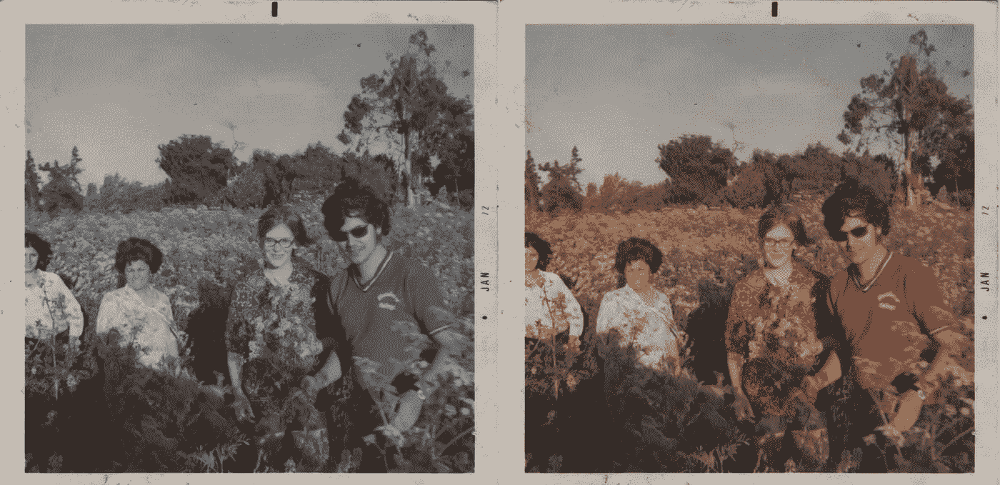
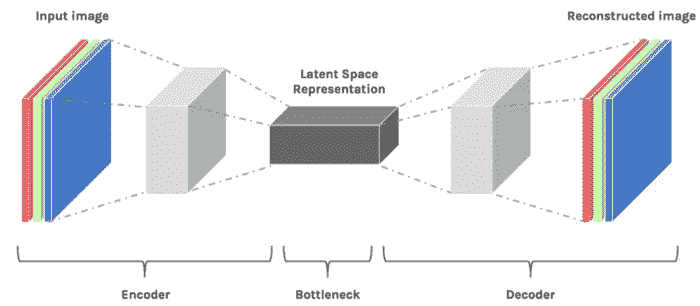
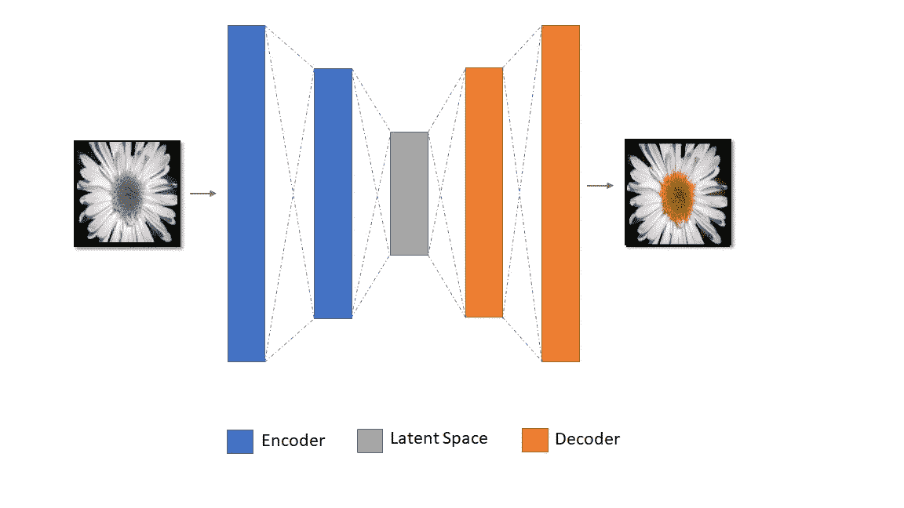
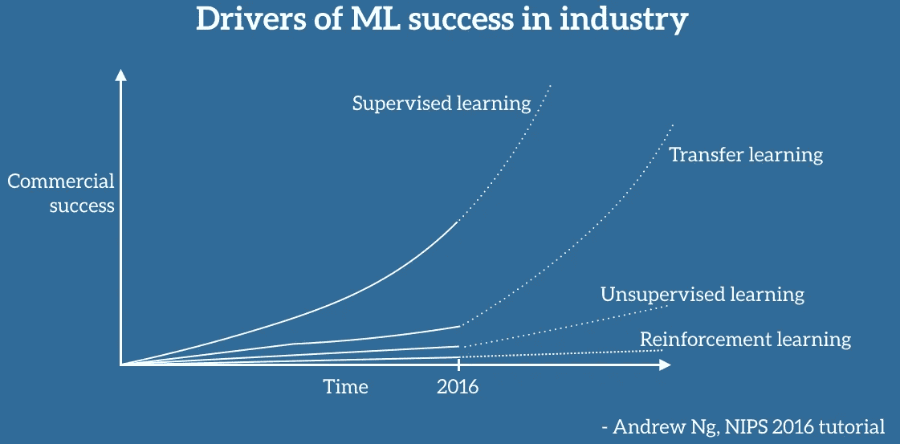
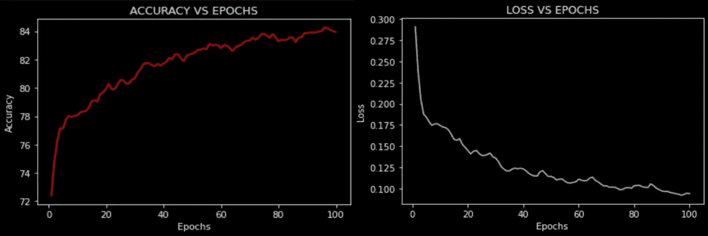
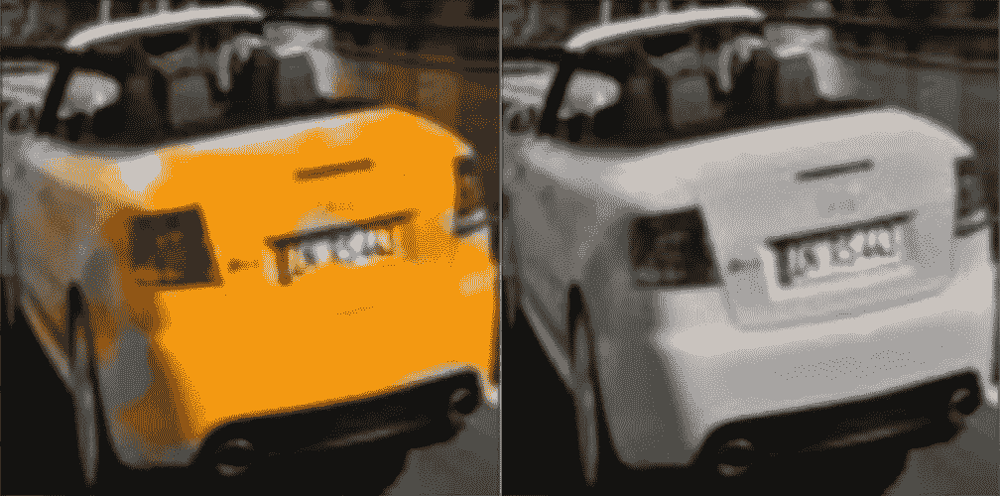
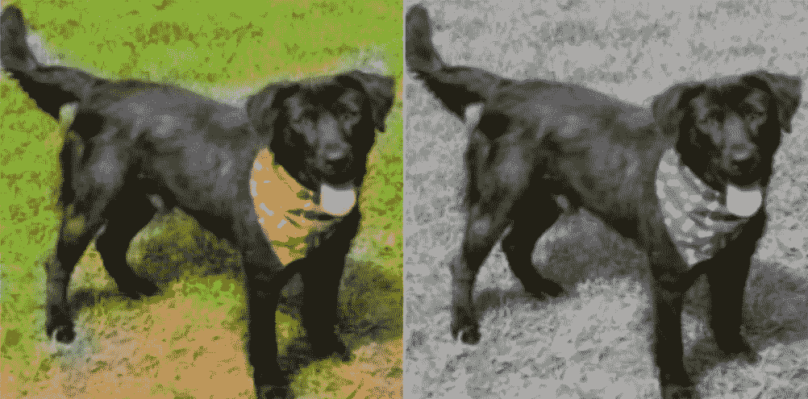
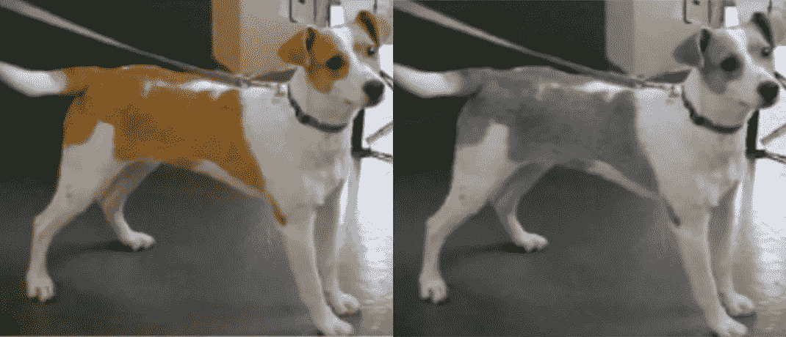
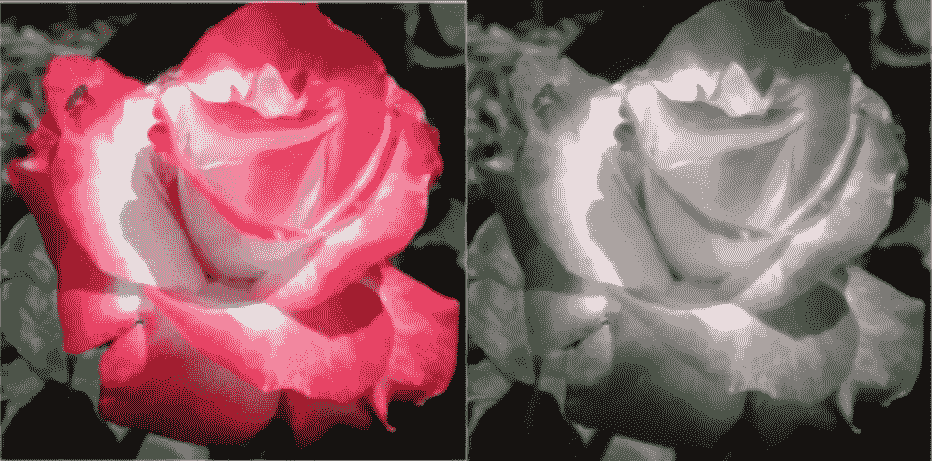
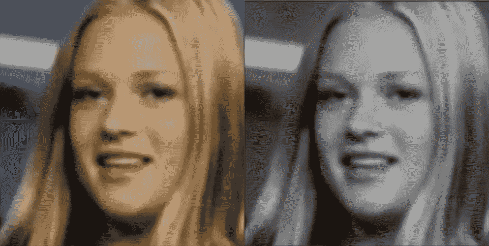

# 用人工智能给世界上色

> 原文：<https://medium.com/mlearning-ai/colourizing-the-world-with-ai-828214d67f3b?source=collection_archive---------6----------------------->

> 我相信生物大脑所能达到的和计算机所能达到的并没有很深的区别。因此，从理论上讲，计算机可以模仿人类的智力，甚至超越人类的智力

确实！斯蒂芬·霍金的上述引用非常准确。训练机器学习模型完成一项任务类似于教一个孩子做同样的工作。起初，该模型表现很差，但随着时间的推移和更多的实践(看到更多的数据)，它会逐渐改善。在这篇文章中，我将解释我们如何利用自动编码器的概念来训练一个给任何灰度图像着色的模型。

这个模型的应用可能是无穷无尽的。该模型可用于将旧的灰度照片恢复成彩色 RGB 图像。该模型还可以被调整，用于将旧的单色电影转换成高分辨率的彩色电影。我在下面展示了一个例子，这个模型被用来将灰度图像(左图)转换成高分辨率的彩色图像(右图)

在我开始解释这个模型之前，我们需要理解自动编码器的概念。

## 自动编码器

自动编码器是一种人工神经网络。一个自动编码器主要由三部分组成，**、**、**、**和**解码器。”**

编码器块由一个输入层和许多隐藏层组成，主要是卷积层、汇集层和下降层的组合。在编码器模块中，自动编码器尝试学习输入图像的表示。它将这种表示存储在与输入图像相比维度非常少的潜在空间中。

解码器模块由输出层和一些隐藏层组成，输出层给出重建图像，隐藏层通常是卷积转置层和上采样层的组合。在解码器块中，自动编码器从先前学习的潜在空间中学习原始图像的重建。下图显示了一个简单的自动编码器网络，由所有三部分组成。

Simple Autoencoder Network

## 直觉

现在，随着对自动编码器的理解，我们可以调整神经网络，在训练时，我们输入灰度图像，并将输出设置为相应的彩色图像。这样，自动编码器层将学习如何将灰度图像的潜在空间表示转换成彩色图像。下面的神经网络可以形象化上述直觉:

## 迁移学习

> 迁移学习将是 ML 成功的下一个驱动力— **吴恩达** **(NIPS 2016 教程)**

迁移学习是人类天生的。人类有一种内在的跨任务传递知识的能力。当学习一项任务时，我们可以无缝地利用我们获得的知识来解决相关的任务。任务越相似，我们就越容易将现有的知识转移到新的任务中。

举个例子，

1.  如果我们学习如何用一种编程语言编写代码，比如 C++，那么学习一种新的编程语言，比如 Python，就会容易得多。
2.  如果我们学会骑自行车，我们就更容易学会骑汽车。

迁移学习是一种机器学习方法，其中为一项任务开发的模型被重新用作第二项任务模型的起点。

这是深度学习中的一种流行方法，其中预先训练的模型被用作计算机视觉和自然语言处理任务的起点，因为开发这些问题的神经网络模型需要大量的计算和时间资源，并且它们在相关问题上提供了巨大的技能飞跃。

## 创建模型

**编码器:**对于我们的自动编码器的嵌入部分，我们可以使用预训练的卷积神经网络来将图像中的信息嵌入到潜在空间中。因此，对于编码器，我选择了在 ImageNet 数据集上训练的预训练 VGG16 模型来分类 1000 个类。下图所示为所用 VGG16 型号的架构。

因为我们只需要从隐藏的卷积层中获得嵌入的信息，所以我们可以从 VGG16 架构中移除最终的输出分类层。使用预训练 VGG16 模型的代码如下所示:

**解码器:**对于自动编码器的解码器部分，我们需要将潜在表示上采样到原始图像的大小。对于这个过程，我们可以使用上采样层。使用具有 Keras 后端的 TensorFlow 框架，解码器的代码可以很容易地写成:

## 训练模型:

为了训练模型，只训练解码器网络；编码器网络没有被训练，因为预训练的 VGG16 模型已经被用于从输入图像中提取特征。我们用于训练模型的数据集极其重要。假设如果我们的主要目标是恢复人的旧照片，那么使用包含人的图像的训练数据集将是明智的。同样，如果我们对给花着色感兴趣，那么我们必须选择一个包含大量花图像的数据集。

该模型最终在 **NVIDIA Tesla K80 GPU** 和上训练了 **100 个周期**，给出了如下图所示的优异结果:

## **结果:**

下面显示了来自上述训练模型的一些结果。

左侧图像:模型输出(彩色图像)

右侧图像:模型输入(灰度图像)

 [## Mlearning.ai 提交建议

### 如何成为 Mlearning.ai 上的作家

medium.com](/mlearning-ai/mlearning-ai-submission-suggestions-b51e2b130bfb)