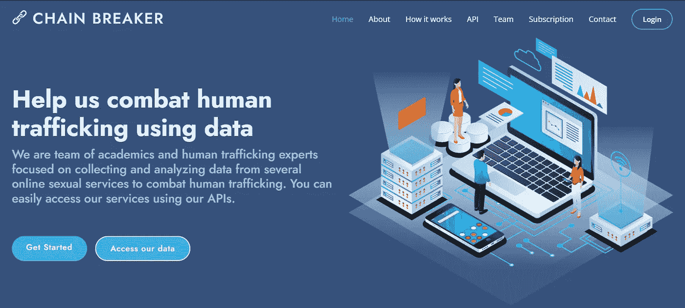

# 使用机器学习打击人口贩运:第 1 部分。

> 原文：<https://medium.com/mlearning-ai/combating-human-trafficking-using-data-part-1-103e4682e488?source=collection_archive---------2----------------------->


Photo from [Canva](https://www.canva.com/). License terms can be found [here](https://www.canva.com/help/article/licenses-copyright-legal-commercial-use/).

嘿！欢迎阅读我在 medium 的第一篇文章。在这一系列的文章中，我总结了我在一个加拿大伴游网站中识别人口贩卖网络的项目中的部分进展。在这第一篇文章中，我介绍了人口贩卖的概念，然后提出了打击这种犯罪的开放的基于数据的解决方案。

开始吧！

## 但是，什么是人口贩卖？

T 《联合国人口贩运议定书》将人口贩运定义为:

> "以剥削为目的，通过威胁或使用武力或其他形式的胁迫、诱拐、欺诈、欺骗、滥用权力或脆弱境况，或通过给予或接受报酬或利益以取得对另一人有控制权的人的同意，招募、运送、转移、窝藏或接收人员"(2000 年《联合国贩运人口议定书》第 3 (a)条)。

至少有九种贩卖人口的形式是可能的，但是，我只关注其中的一种:性剥削。性剥削被定义为强迫、欺骗或胁迫一个人参与性活动。当这种形式的剥削涉及儿童时，它被称为对儿童的性剥削。根据《联合国全球人口贩运报告》( 2020 年),对妇女和女童的性剥削仍然是世界范围内**最常见的人口贩运形式**。这个问题是执法面临的挑战之一，因为很难识别受害者和打击贩运者。此外，这是全世界增长最快的犯罪行业之一，也是当今最严重的侵犯人权行为之一。

由于全球互联网技术的日益普及和新冠肺炎病导致的疫情等重要因素，

> “贩运者还调整了他们在网络空间的作案手法，利用数字平台做广告，招募和剥削受害者。通过互联网，贩运者很容易获得越来越多的顾客，特别是性购买者。在某些情况下，贩运者将剥削性服务隐藏在合法活动的背后，以避免被执法部门发现，同时瞄准他们的客户群[……]精心制作的带有编码关键词和图片的语言被用来吸引潜在客户”(UNODC，2020 年)。

《全球人口贩运报告》(UNODC，2020 年)包括一个数据集，从中可以找到几个与分类广告网页相关的人口贩运真实案例。最受欢迎的案例之一是上市网站 **Backpage** ，这是一个美国分类网站，于 2018 年 4 月被美国联邦调查局确定规模。虽然 Backpage 和许多其他类似的网站近年来已经被不同的执法机构关闭，但仍然有许多在线上市网站。

## 新兴网站

Backpage 关闭后，许多其他网站成为人口贩运的目的地。2019 年，**一个新的加拿大网站**引起了加拿大警方的注意，因为担心其一些用户可能会为这一犯罪提供便利。事实上，根据多伦多警察局的说法，

> 现在，我们看到越来越多的[人口贩运]受害者在该网站上做广告，在我看来……它实际上是从 Backpage 接管的，是皮条客用来宣传他们强迫进入性交易的受害者的性服务的头号网站(CBC，2019 年 2 月 8 日)

不幸的是，关闭这些列表网站可能不是处理这个问题的最佳方法，因为它会鼓励人们从事更秘密的活动来提供这种服务。此外，由于大部分数据也将被删除，这往往使执法部门开展调查更具挑战性。

## 那么，主要有哪些问题呢？

1.  **列表网站上的人口贩运:**人贩子正在利用网络空间做广告，招募和剥削受害者。关闭这些网站是不可行的，因为人贩子会转向一个新的网站或开始提供更多的秘密服务。
2.  **手工操作:**如今，许多检察官经常关注这些列表网站，以便发现潜在的人口贩运案件。然而，这项工作非常耗时，并且通常很难看到全局，即，很难理解所有这些广告如何(可能)与相同的犯罪组织相关联。
3.  **洗钱:**毒贩利用多家金融机构的服务接收和发送资金。目前处理这一问题的方法是基于对异常交易的识别，然而，现在贩运者越来越狡猾地隐藏他们的活动。

那么… **我们能做些什么呢？**

## 断链者——利用数据帮助我们打击人口贩运



Chain Breaker Site — Help us combat human trafficking using data ([https://chainbreaker.community/](https://chainbreaker.community/))

chain Breaker([https://chain Breaker . community/](https://chainbreaker.community/))是一个**基于云的工具**，它自动搜索、提取、存储和分析来自提供**性服务**的网站的信息，以识别潜在的性剥削受害者、涉嫌犯罪的人口贩运网络和涉嫌隐瞒剥削活动的性产业。

它使用**网络抓取**来收集电话号码、电子邮件、姓名、位置和图片，并通过自然语言理解来提取广告的语言特征，这些特征与特定的犯罪网络或涉嫌隐藏剥削活动的性行业相关联。

该工具旨在**向反人口贩运组织、执法机构、金融机构和公司提供高质量的结构化数据**，以支持分析师和调查人员识别与潜在性剥削活动相关的在线动态。

## 数据接收和预处理

在这一系列帖子中，我们使用了从加拿大**最大的列表网站之一**的*类别中提取的数据，并使用这些信息构建**知识图**和**来描述其新兴社区**的特征，以便根据在该领域工作的检察官的标准来检测可疑集群。因此，Chain Breaker 从每个广告中提取以下字段，即:*

```
*- Link (advertisement URL)
- ID Page (unigue advertisement identifier)
- Title
- Text
- Category
- Publication date
- Phone number
- Email
- Region
- City 
- Place (specific address within a city)
- Latitude & Longitude
- External website (some advertisements include an URL to another website where they also promote their services, this might include websites such as Twitter, Only Fans, Facebook, private webistes, among others)
- Ethnicity (asian, caucassian, black, mixed, etc)*
```

*一旦获得数据，只有**地区**和**城市**变量被格式化，因此任何重音符号都被移除，然后为了标准化，它们被小写，并且**标题**和**文本**变量以它们的原始格式保存。所有这些信息都被上传到 **MySQL** 和 **Neo4j** (一个图形数据库)，以便利用**电话号码**、**电子邮件**和**外部网站**变量来挖掘数据中的新兴关系(然而，我们将在接下来的帖子中这样做！).*

## ***访问数据(Kaggle 数据集！)***

*我希望 Chain Breaker 成为一个由数据科学家组成的社区，共同努力打击人口贩卖。这就是为什么从现在起，任何人都可以访问 Chain Breaker 提取的信息，并将定期在 Kaggle 上发布。*

*这个[数据集](https://www.kaggle.com/datasets/juanchobanano/canadian-sexual-advertisements)包含 3463 个广告，然而，最初的 1924 个广告既不包含**种族也不包含**年龄变量。此外，从数据集中移除了**链接**、 **id 页面**，并且出于安全目的使用 SHA256 算法对**电话号码、电子邮件和外部网站**进行了加密，然而，这并不影响在数据中可以找到的新兴连接。可以使用下面的[链接](https://www.kaggle.com/datasets/juanchobanano/canadian-sexual-advertisements)在 Kaggle 中访问数据集。*

## *下一步是什么？*

*在下一篇[文章](/@juanchobanano/combating-human-trafficking-using-data-part-2-f745a421a485)中，我将展示我们基于之前关于该主题的研究文献试图从数据集中提取的特征。此外，我还展示了我们如何将数据集表示为图形，并激发它的重要性。*

## *参考*

*   *CBC(2019 年 2 月 8 日)在 Backpage 关闭后，多伦多警方表示，LeoList 正在成为人口贩运的目的地。[链接](https://www.cbc.ca/radio/day6/episode-428-bissonnette-s-sentence-art-forgery-k-pop-at-the-grammys-leolist-human-trafficking-and-more-1.5009885/after-backpage-shutdown-toronto-police-say-leolist-is-emerging-as-a-destination-for-human-trafficking-1.5009917)*
*   *《全球人口贩运报告》(2020 年)。[链接](https://www.unodc.org/unodc/data-and-analysis/glotip.html)*

*[](/mlearning-ai/mlearning-ai-submission-suggestions-b51e2b130bfb) [## Mlearning.ai 提交建议

### 如何成为 Mlearning.ai 上的作家

medium.com](/mlearning-ai/mlearning-ai-submission-suggestions-b51e2b130bfb)*