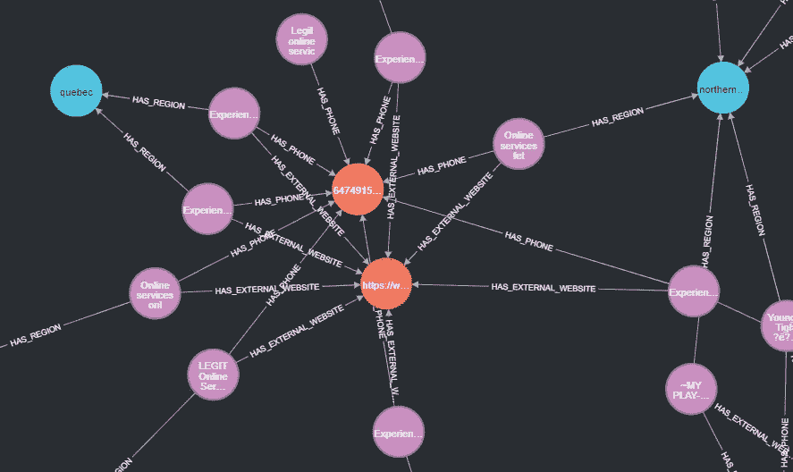

# 使用机器学习打击人口贩运:第 2 部分。

> 原文：<https://medium.com/mlearning-ai/combating-human-trafficking-using-data-part-2-f745a421a485?source=collection_archive---------6----------------------->


Photo from [Canva](https://www.canva.com/). License terms can be found [here](https://www.canva.com/help/article/licenses-copyright-legal-commercial-use/).

嘿！欢迎来到本系列的第二部分，如果你还没有阅读第一篇文章，你可以在这里阅读。正如我在上一篇文章中提到的，在这篇文章中，我展示了我们试图从我们的数据集中提取的特征，这些特征基于以前关于这个主题的研究文献。此外，我还展示了我们如何将数据集表示为图形，并激发它的重要性。

我们开始吧！

## 但是…我们在找什么？

首先，我们必须了解执法部门和非政府组织在这类广告中寻找的风险因素。关于**人口贩运**的[](https://www.unodc.org/unodc/data-and-analysis/glotip.html#:~:text=The%202020%20UNODC%20Global%20Report,to%20Combat%20Trafficking%20in%20Persons.)**报告和 [**Giommoni，L. & Lkwu，R. (2021)**](https://link.springer.com/article/10.1007/s12117-021-09431-0#:~:text=This%20study%20identified%20the%20presence,least%20one%20other%20sex%20worker.) 报告提供了一份此类在线广告中常见的人口贩运模式清单，为理解这一点提供了一个很好的基线和起点。**

**两份参考文献中提出的指标都试图找到与以下证据相关的模式:受他人控制的人群、对受害者支付金额或避孕套使用缺乏控制、受害者的原籍(国家或城市)、感兴趣的关键词、提供服务的地点(电话/电话)以及提供的性服务类型。**

**2021 年 12 月，在 funda ción Pasos Libres[](https://fundacionpasoslibres.org/)**的帮助下，我得以与在该国人口贩运办公室工作的两名秘鲁检察官进行了两次会面。在他们的帮助下，我们能够证实两个参考文献中提出的这些人口贩运模式，并确定 Chain Breaker 试图在这些广告中找到的初步特征列表，现在我向您展示:****

1.  ******有证据表明，一群群的人都在别人的控制之下。******

*   ****广告使用第三或第一人称复数代词****
*   ****同一电话号码出现在不同人的多个广告中****
*   ****性工作者广告之间高度相似****
*   ****性工作者提供危险或暴力的性服务****
*   ****同一广告中的多人****
*   ****参考网站或水疗按摩网站****
*   ****避孕套的使用(受害者可能无法要求使用避孕套)****
*   ****受害者有纹身或标记(一些犯罪组织将纹身作为“财产”信号)****
*   ****受害者的脸是隐藏的(犯罪组织隐藏受害者的脸，因此执法部门更难识别失踪人员)****

******2。** **收到很少或没有报酬。******

*   ****广告宣传廉价的性服务****

******3。显示他们的行动受到他人控制或行动受到限制的迹象******

*   ****仅提供电话服务的性工作者****
*   ****性工作者和其他性工作者一起转移到不同的地方****
*   ****性工作者经常在几个地方流动****

******4。有证据表明可能存在未成年性工作者的案例******

*   ****广告使用有趣的词语暗示性工作者的年轻特征。****
*   ****说明未成年女性的典型服装尺寸****
*   ****个人体重****

******5。有证据表明，可能存在向移民等高危人群贩运人口的案件。******

*   ****感兴趣的国家****
*   ****感兴趣的种族****
*   ****广告使用了暗示性工作者的出身或种族的有趣词语。****

****根据提取广告的网站，计算建议的特征可能或多或少有些麻烦(例如，一些网站包括用于被推广的人的种族的特定字段)。然而，大多数时候我们需要智能的正则表达式模式或者好的自然语言理解算法来计算它们。****

****此外，还有一些人口贩运模式需要一种方法来分析广告中包含的**图像**，例如识别纹身或标记、识别隐藏的面孔以及有时识别同一广告中宣传的多个人(除非我们可以使用广告文本来确定这一点)。不幸的是，现在 Chain Breaker 不提取图像数据，因为我没有办法存储这种信息。****

****此外，您可能会注意到，所提出的这些特征中的一些可以使用单个实例来计算(例如，我们可以仅使用其文本来确定广告是否是以第三人称书写的)，而其他特征需要使用数据的底层网络结构(例如，如果我们想要确定同一电话号码是否在几个广告中使用)。****

## ****利用网络****

********

****Figure 1\. Image by the author. Example community of advertisements extracted from Canadian listing website. Blue dots are regions, purple dots are advertisements, orange dots are phone numbers and red dots are external website (this graph was generated by Neo4j Chain Breaker database).****

****大部分对列表网站人口贩卖的研究都忽略了数据的底层图结构，所以他们只专注于对单个广告的学习和预测。在我看来，这种方法相当麻烦，因为执法部门和非政府组织通常会寻找可疑广告的网络，而不是单个实例。此外，数据的图形结构在很大程度上说明了犯罪组织是如何运作的，因此更容易识别他们的活动。****

****在本系列的第一篇 [**文章**](/@jecepedab/combating-human-trafficking-using-data-part-1-103e4682e488) 中我提到过 [**断链器**](https://chainbreaker.community/) 将信息存储在两个数据库中: **MySQL** (关系数据库)和 [**Neo4j**](https://neo4j.com/) (图形数据库)。前者侧重于存储数据表各列之间的**关系，而后者侧重于存储各个数据点**之间的**关系。因此，为了存储从加拿大列表网站提取的广告，我考虑了以下实体和关系(图 1 显示了在我们的数据中识别的广告社区的示例图):******

```
****# Entities**
- Ad
- Phone Number
- Region
- Email
- External website (some advertisements include URLs to other sites such as Only Fans, Twitter, Instagram accounts or private websites).**# Relationships**
- HAS_PHONE (link between Ad and Phone)
- HAS_REGION (link between Ad and Region)
- HAS_EMAIL (link between Ad and Email)
- HAS_EXTERNAL_WEBSITE (link between Ad and External website)**
```

****因此，使用数据的图形信息，我的方法将集中于对危险社区的**识别**而不是对危险广告的识别。然而，这并不意味着我们必须忽略每个广告所能提供的信息(恰恰相反！).事实上，我将使用这些信息，根据每个广告的个体风险，从规模和总风险方面来描述已确定的社区。****

## ****下一步是什么？****

****在下一篇[帖子](/@juanchobanano/combating-human-trafficking-using-graphs-part-3-ce103a252170)中，我们将使用数据的图形结构以及单个广告数据，深入探讨加拿大伴游广告数据集的特征工程和转换问题。****

## ****参考****

*   ****Giommoni，L & Ikwu，R. (2021 年)。识别英国在线性市场的人口贩卖指标。[链接](https://link.springer.com/article/10.1007/s12117-021-09431-0#:~:text=This%20study%20identified%20the%20presence,least%20one%20other%20sex%20worker.)****
*   ****《全球人口贩运报告》(2020 年)。[链接](https://www.unodc.org/unodc/data-and-analysis/glotip.html)****

****[](/mlearning-ai/mlearning-ai-submission-suggestions-b51e2b130bfb) [## Mlearning.ai 提交建议

### 如何成为 Mlearning.ai 上的作家

medium.com](/mlearning-ai/mlearning-ai-submission-suggestions-b51e2b130bfb)****