# 将自然语言处理功能与 3D 网络可视化相结合:权力的游戏分析

> 原文：<https://medium.com/mlearning-ai/combining-nlp-features-with-3d-network-visualisations-a-game-of-thrones-analysis-9f6a3105eba6?source=collection_archive---------2----------------------->

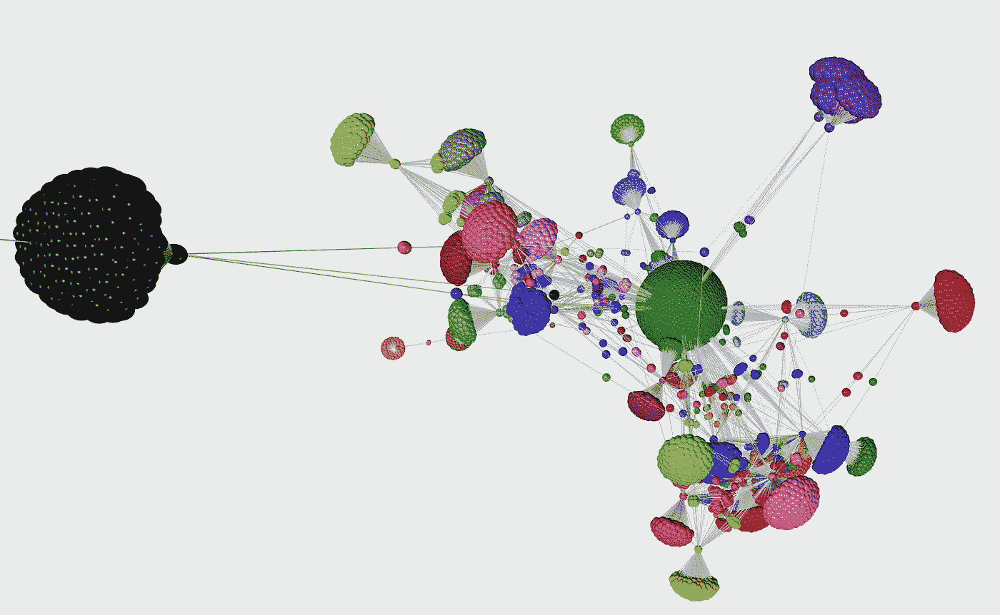

Graphia Visualisation. Source: [QAnon SNA Twitter Report](https://boorism.github.io/assets/documents/Report_on_Visualisations_final.pdf)

# 社会网络分析(SNA)

Twitter 和其他社交媒体平台作为“新闻渠道”的使用是有据可查的，68%的美国人使用它们来了解时事。在健康和科学、大规模和快速发生的事件中是如此，在最近的 pandemic⁴.新冠肺炎事件中更是如此不幸的是，随着公众争先恐后地在网上表达他们的观点，这也带来了许多错误信息的来源，其意图各不相同。

错误信息的检测主要分为两类:内容和词汇分析，或网络 investigations⁵.将社交媒体交互正式化为图，可以应用和利用不同的图论概念。诸如捕捉信息 flow⁶模式的中心性、程度和中间性测量，基于 node-degrees⁷或其他更复杂的主题网络 segmentations⁸.对有影响力的用户进行排名

显然，在监测和掌握公众对不同主题的反应方面，SNA 是一个有用的工具。由于人脑更善于在视觉 manner⁹中获取信息，因此拥有可视化这些大规模网络的方法将会很方便。

这正是我们将在本文中重点讨论的内容。我们将在公共 Twitter 数据集上执行情感分析和主题建模，以提取感兴趣的 NLP 特征，然后使用一款名为 [Graphia](https://graphia.app) 的出色软件在 3D 网络中可视化它们！希望网络和形式化将帮助我们发现我们数据的一些有趣的方面…

你可以在下面的 [Github 库](https://github.com/boorism/3d-networks)中找到所有必要的代码，本文将集中讨论最重要的部分。

# 数据集和预处理

让我们从选择这个任务的数据集开始。像往常一样，我们转向奇妙的 Kaggle 及其广泛的选择。Twitter 数据自然适合这个问题。它以回复和转发的形式包含用户之间的提及(关系)，同时也有挑战性的数据(简短、稀疏的文本)要处理。用户和他们的推文可以是我们网络中的节点，而他们之间的关系将被表示为边(图 1)。

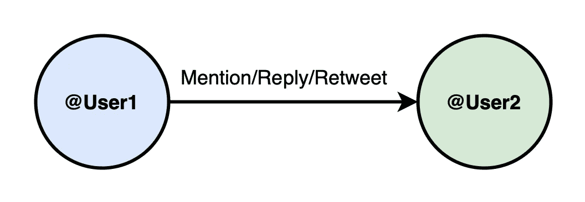

Figure 1: Graph representation of relational Twitter data

在收集了与《权力的游戏》最后一季相关的推特之后，我们将确定[。由于本赛季的争议，数据可能会包含一些对比鲜明和有趣的话题！](https://www.kaggle.com/monogenea/game-of-thrones-twitter)

就预处理而言，我们首先只保留我们可能感兴趣的列，并从提及列中删除任何 NA 行。主要的预处理是为文本做准备，为主题建模做准备。根据经验，短文本的主题建模不是一项简单的任务，为了“帮助”我们的方法，我们需要采取一些额外的步骤。

除了删除提及(\@的)、标签(#)、表情符号、标点符号、停用词和对文本的词条分类，我们还只保留开放类的词类。这实质上意味着去掉连词、介词、限定词等等。通常，虽然这些单词对句子的句法和结构很重要，但它们不会带来太多的意义，尤其是在查看单个单词时。幸运的是，我们的数据都是英文的，我们可以使用 NLTK 库。

最后的准备工作是修改我们的数据，以便每一行都有一个源用户和目标用户。换句话说，把它分成单个关系，而不是在一个条目中多次提及。这也是为我们的推文计算一些情感分数的适当时间，我们可以在以后的可视化中使用。

# VADER 情绪得分

情感分析是捕捉文本背后的情感和感觉的有用工具。通常，这些是以基于规则的词典查找方式或使用机器学习模型来完成的。在这篇文章中，我们将探索[价感知词典和情感推理器(VADER)工具](https://github.com/cjhutto/vaderSentiment)。

VADER 是一个基于规则的分析计分器，它特别适应社交媒体上表达的情绪。它处理典型的和简约的否定，增加标点符号的强度("！！！!")、俚语、表情符号等等。对于我们的 tweet 数据来说，这似乎是一个易于使用且非常合适的工具。VADER 提供了几种分数类型，其中**复合词**是“给定句子的单一一维情感衡量”的最佳选择。

当然我们不应该盲目使用它。让我们看看它给不同句子打分的一些例子:

*   @Blaze_PyroXZ《权力的游戏》可能是我最喜欢的电视剧了。至少是前 3" ( **分:0.5859** )
*   *“@ zaisser《权力的游戏》里有龙？”* ( **得分:0.0** )
*   " *@SInow F**k 权力的游戏* " ( **评分:-0.5423** )
*   “*我认为在《杰克骑士》中的这一刻，他将虐待他的母亲的死与他曾经看过的一部剧相提并论，真正总结了许多铁杆粉丝对《权力的游戏》在虚假的希望和失望方面的感受*”(**评分:-0.8591** )

虽然这些例子显然是正确的，但与深度学习方法相比，该方法并不完美，并且对更复杂的句子不太鲁棒。因此，分数只能被解释为一种指示，而不是“基本事实”。

# 短文本主题建模:SeaNMF

谈到主题建模，很难找到不以 LDA 为主要方法的文献。虽然 LDA 有着良好的记录，但它在应用于较短的文本(如推文)时却很吃力。这可能是因为它假设一段文字是由几个主题⁰组成的，这违背了推特的本质。

相反，我们转向一种我认为更值得关注的方法:语义辅助的非负矩阵分解(SeaNMF)。这篇论文也值得一读，它提供了该领域的一个很好的概述，并与以前的方法进行了比较。让模型在您自己的数据上运行需要一些最小的修补。您可以从他们的[存储库](https://github.com/tshi04/SeaNMF)下载所有必要的文件，将您的数据转换成文本文件，其中每个句子都在新的一行开始，并使用 **data_process.py** 文件创建运行模型所需的矩阵和词汇文件。

训练模型需要设置一些超参数。对于 Twitter 数据， *⍺* 值(分解单词语义相关矩阵的权重)设置为 1 时会产生最佳结果，而选择主题数量是一个相当耗时的过程。其余的超参数可以保持原样，除非您没有耐心，并且希望减少迭代之间所需的最小误差。

这个想法是为不同数量的主题运行这个模型，并使用四个度量来评估产生的单词簇。这些是**平均点态互信息(APMI)** 和**归一化 PMI(NPI)**，它们指示每个主题中的单词彼此相关的程度，以及**主题多样性(TD)** 和**等级偏置重叠(RBO)** 分数，它们测量主题的多样性。APMI 已经内置了来自 SeaNMF 的用于可视化主题的 **vis_topic.py** 文件，并且可以添加下面截取的代码以应用其余的措施。

表 1 显示了不同主题号的实验结果。这可能是整个流程中最耗时的一步。对于较大的主题数量，该方法可能需要几个小时才能收敛。虽然不能对改进的结果定价…

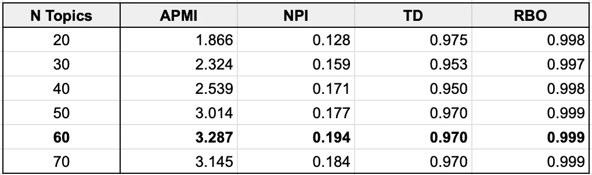

Table 1: Topic modeling evaluation for different topic numbers

在大多数情况下，TD 和 RBO 得分都非常高，查看 NPI，我们看到数据似乎“喜欢”被分成 60 个主题。所以我们暂时先这样吧。

# 标记和分配主题名称

现在，我们的管道中出现了一个有趣但也非常主观的部分。对于 60 个结果主题，我们需要给它们一些描述性的标签，即主题名称。这是一个重要的属性，我们将把它整合到我们的网络可视化中。在某些情况下，标注很容易，因为主题词显然是指某些东西。然而，其他主题可能非常模糊，以至于我们将其命名为 MISC(杂项)。还有一点要补充的是，有些题目是分组在一起的。例如，如果我们有涉及“足球”或“篮球”的话题，我们就把它们放在一起作为“运动”。

所有主题单词和标签的完整表格可以在文件 **topic_word_lists.csv** 中找到。表 2 展示了一些精选的例子，让我们了解标签过程是如何完成的，以及 SeaNMF 提出了什么。这些数据似乎相当嘈杂，我比平时更难给一些主题起一个独特的名字。然而，我们确实有一些有趣的发现，直到我用谷歌搜索确认了这些词，我才意识到这些发现的存在。鼓励献血的“#bleedforthethrone”活动，将白行者与我们正在进行的气候问题进行比较，或者臭名昭著的星巴克杯子被“意外”留在其中一个场景中。

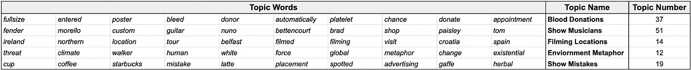

Table 2: Examples of interesting topic words and the given topic label

这个过程的最后一步是找出一条给定的 tweet 对应的主题。这是 SeaNMF 目前在功能上缺乏的地方，所以我们需要添加我们自己的方法来计算每条 tweet/text 的最可能主题。

下面的代码就是这么做的，是我自己对 SeaNMF 的扩展。使用词汇表和生成的模型矩阵(W ),我们为每条 tweet 分配主题编号，并将该编号映射到主题标签。我们还定义了一个我们想要过滤掉的主题列表。这些往往是过于笼统的话题，会主导我们的标签(“杂项”、“电视服务”等)。在这种情况下，我们选择下一个不在过滤列表中的主题。

# 创建 GraphML 文件

好了，现在我们有了一个数据框架，其中包含了我们想要添加到图表中的所有信息。Graphia 接受不同的文件格式，但是我发现将我们的图形转换成一个**。graphml** 扩展往往工作得最好。

为了实现这一点，我们使用了令人敬畏的 [**networkx**](https://networkx.org) Python 包。它的可能性是无限的。人们可以很容易地分配节点和边，以及每个节点的属性。在我们的例子中，这些是像主题名称，极性分数，追随者计数等等。您可以用不同的图度量来修剪您的网络，或者过滤掉低度节点。为了简单起见，我们将把探索限制在选择最高连通分量上。所有这些都是通过几行代码实现的:

# 图形可视化

经过这一切，我们终于准备好开始在 Graphia 中可视化我们的网络。第一次打开 Graphia 时，通读提供的教程，并花些时间通读他们的[网站](https://graphia.app)上的文档是个好主意。你可能还会发现它运行得非常慢，我的笔记本电脑甚至很难处理一些节点和边。要解决这个问题，请确保为 Mac 用户设置“以低分辨率打开”(图 2)。我不确定在 Windows 中解决这个问题的方法是什么，但是 Graphia 的人非常乐于回答你关于他们软件的任何问题，所以不要害怕去问他们！

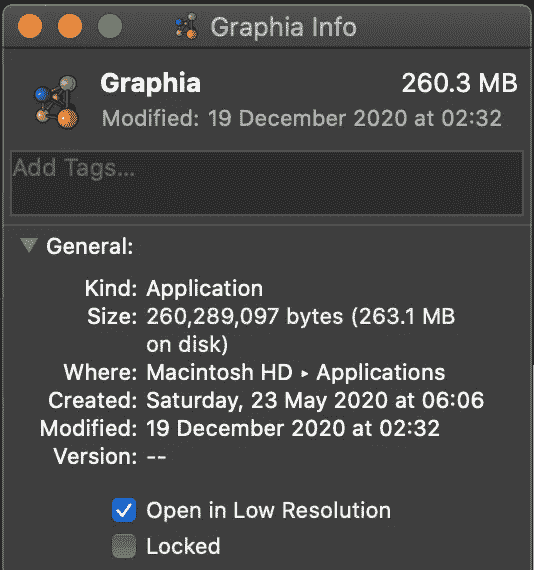

Figure 2: Make sure you “Open in Low Resolution”

接下来，加载。graphml 文件放入程序中，观察结构的展开。Graphia 使用力导向算法来平衡图形的全局和局部结构，以形成这些巨大的网络。乍一看，这似乎是一个大混乱，数以千计的节点遍布各地，以不可追踪的方式相互连接。

令人欣慰的是，Graphia 最大的优点是可以应用大量的“转换”和“可视化”。当该图稳定下来(或者您可以在满意后暂停它)，我们可以应用 MCL 聚类来形成强互连节点组(图 3)。

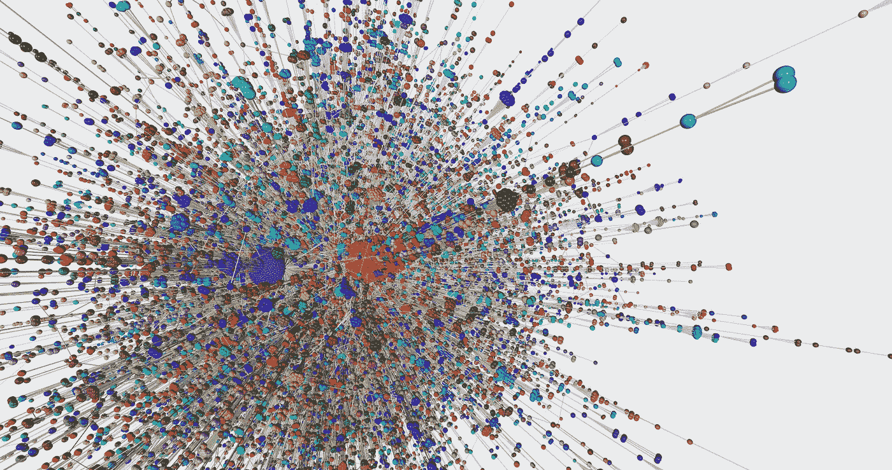

Figure 3: MCL Clustering Visualisation applied on the full graph

虽然仍然忙碌，但我们开始在我们的网络深处看到更清晰定义的集群。这些网站的中心可能是极具影响力和受欢迎的用户，他们传播各种信息。Graphia 还允许我们关注单个 MCL 集群，并分别查看这些集群中的所有用户。例如，图 4、5、6 与前 3 个发现的集群相关。对每个最有影响力的用户(度最高的节点)分别是 *@GameOfTrones* 、 *@realDonaldTrump* 和 *@YouTube。不知何故，唐纳德也溜进了这个房间。为了更容易地定位这些集群，我们只保留节点度大于 2 的节点，并过滤掉小于 15 个成员的组件。*

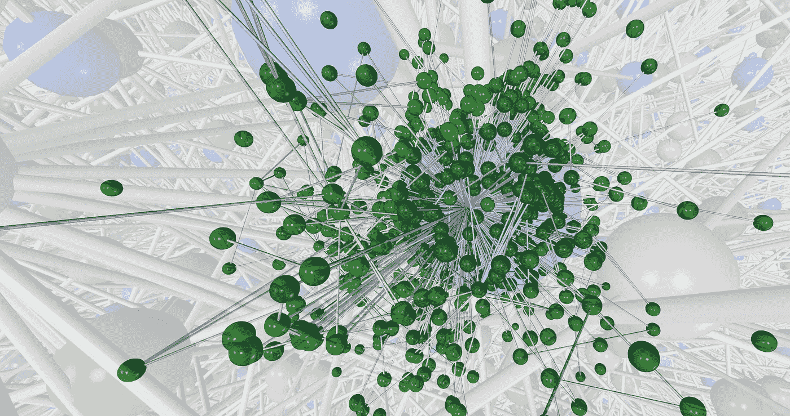

Figure 4: MCL Cluster 1, ***@GameOfThrones*** user account

Figure 5: MCL Cluster 2: **@realDonaldTrump** user account

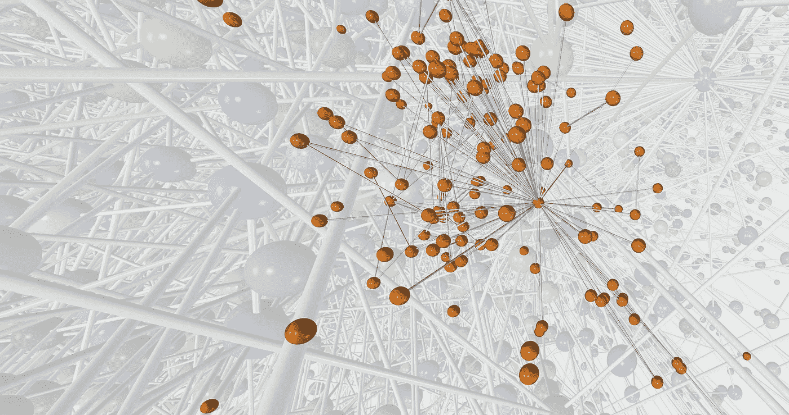

Figure 6: MCL Cluster 3: **@YouTube** user account

虽然这些可视化很好，看起来很酷，但它们本身并没有携带太多的信息。幸运的是，Graphia 为我们提供了所有选中节点的一个很好的摘要，以及我们已经拥有的关于它们的所有信息(图 7)。虽然在我们的主集群中看到 *@GameOfThones* 并不奇怪，但其他不太受欢迎但有影响力的账户开始出现。还可以将此表导出为 CSV 格式，以便进一步分析。虽然这在电视节目中可能不太有用，但在查看错误信息的传播时，识别有影响力的帐户可能是一个方便的工具。

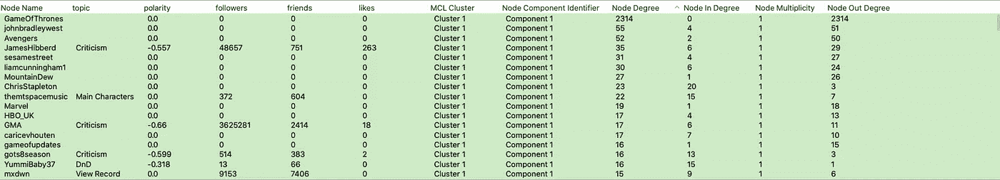

Figure 7: Summary of selected nodes for MCL Cluster 1

## **按主题签约**

对于我们最后的可视化，我们可以尝试利用我们花了这么长时间计算的主题名称。在 Graphia 中，我们可以根据某个属性折叠节点，在本例中是“主题名”。我们还可以根据节点的极性分数用自定义的标度给节点着色。比方说，红色表示积极的情绪，蓝色表示消极和中立的立场，可以是白色。这样做的结果可以在图 8 中看到。这里节点的大小与它们的“多重性”分数有关，或者换句话说，有多少节点被“折叠”在一起。边的大小与两个节点之间连接的“强度”有关，或者与它们在网络中相互提及的频率有关。

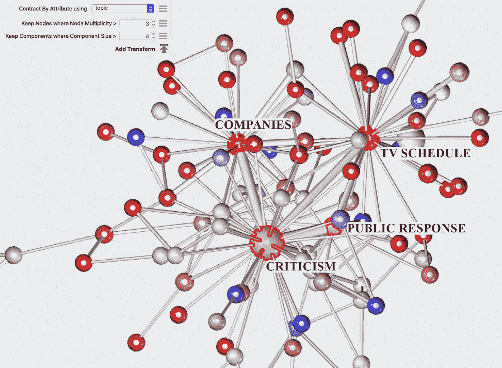

Figure 8: Main “topic hubs” in the network, coloured based on polarity

在我们的网络中，似乎最大、最中心的节点是“批评”、“公众反应”、“公司”和“电视时间表”。极性得分也和我的预测有些一致。公司对电视节目持积极态度，因为他们试图利用它来推广他们的产品，电视时间表公告也是如此，它们试图宣布剧集并增加观众人数。

“批评”和“公众反应”都更接近于中立。围绕最后一季的意见高度混杂，这很好地反映在我们的网络上！我们可以仔细看看，让 Graphia 按主题突出显示节点。图 9 和图 10 与我们主题网络中的所有“批评”和“结局”节点相关。对于两者，尤其是批评，我们看到了更多的负面和中性的节点，概括了公众对这个赛季的总体感受。

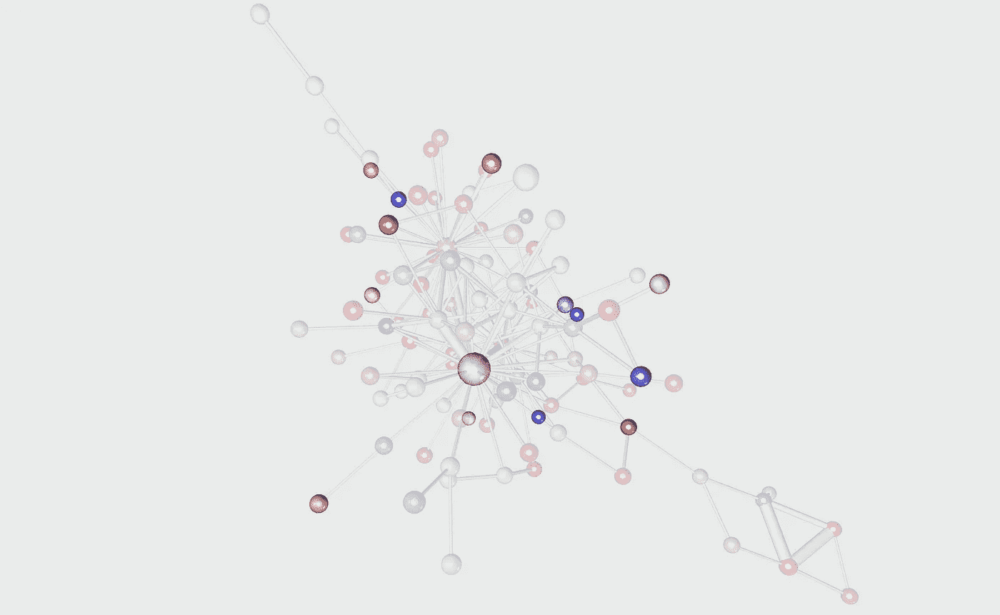

Figure 9: Highlighted “Criticism” topic nodes

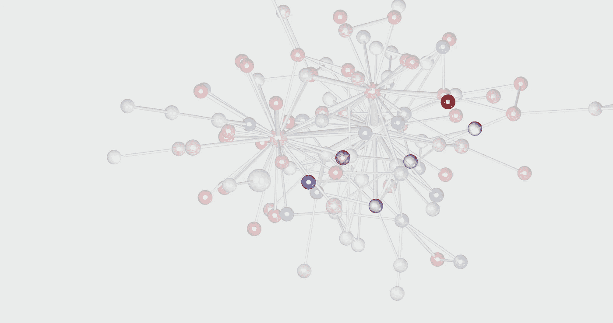

Figure 10: Highlighted “Finale” topic nodes

# 结束语和未来的改进

这是我第二次做这样的事情，看起来对话的话语在最终的观想中起了很大的作用。虽然我们最终的主题可视化在一定程度上反映了我们的预期，但我发现与在 *QAnon* Twitter 数据上执行相同的 [SNA 相比，它们信息量更少，也更“多样化”。这可能部分是由于当前数据集中缺乏转发。转发极大地增加了网络中信息的传播，这极大地提高了视觉效果。](https://boorism.github.io/assets/documents/Report_on_Visualisations_final.pdf)

尽管如此，总的管道仍然是一样的，当试图分析大规模关系数据库时，Graphia 是一个有前途的、非常有趣的工具。如前所述，数据环境的“严重性”越高，这个工具就越有用。能够识别传播错误信息的有影响力的用户，并了解这些信息是如何在您的网络中传播的，这对于尝试打击这些信息并设计限制其传播的方法非常有用。

## **可能的改进**

我可以不假思索地想到这条管道的许多发展方向。首先，在本文中，我们着重于获取两个主要属性:主题名称和极性得分。你也可以看看地点、语言或无数的其他属性，这些都可以为你的需求和目标提供信息。另一个选择可以是增加基于追随者或类似计数的可视化。

虽然我是 SeaNMF 及其主题清晰性的大力支持者，但这是一种缓慢且昂贵的使用方法，尤其是在确定最佳主题数量时。从那以后，新的也适用于短文本的方法被开发出来，比如 [Top2Vec](https://github.com/ddangelov/Top2Vec) 。这种方法的一个优点是，它可以自动确定主题的最佳数量，同时还具有更多的功能和额外的实现。

我希望你喜欢我的第二篇文章，像往常一样，我非常欢迎反馈、想法和(积极的)批评。同样，所有代码都可以在 [GitHub repo](https://github.com/boorism/3d-networks) 中找到。其中包括了一些文件，但大多数违反了 GitHub 文件大小限制，所以我为您留下了一些空白。祝你好运，将 Graphia 应用到你自己的数据中，这是一个如此棒的工具，有如此多的探索的创造性自由！

# 参考

[1] Matsa，K. E .，& Shearer，E. (2018)。2018 年跨社交媒体平台的新闻使用。*皮尤研究中心*、 *10* 。

[2]希特林和奥姆斯特德(2019 年)。人们在社交媒体上看到的科学。皮尤研究中心。

[3]a . r .多顿和 M. J .保罗(2019 年)。识别推特上的保护性健康行为:旅行建议和寨卡病毒的观察研究。*医学互联网研究杂志*， *21* (5)，e13090。

[4] Ordun，c .，Purushotham，s .，和 Raff，E. (2020 年)。使用主题建模、umap 和有向图对新冠肺炎推文进行探索性分析。 *arXiv 预印本 arXiv:2005.03082* 。

[5]郭，王，丁，杨，姚，李，梁，于，张(2019).错误信息检测的未来:新的观点和趋势。 *arXiv 预印本 arXiv:1909.03654* 。

[6] Borgatti，S. P. (2005 年)。中心性和网络流。*社交网络*， *27* (1)，55–71。

[7] Ediger，d .、Jiang，k .、Riedy，j .、Bader，D. A .、Corley，c .、Farber，r .、和 Reynolds，W. N. (2010 年 9 月)。大规模社会网络分析:挖掘 twitter 的社会公益。在 *2010 年第 39 届国际并行处理会议上*(第 583–593 页)。IEEE。

[8]希姆博伊姆、史密斯、硕士、水烟凉、施奈德曼、b .和埃斯皮纳、C. (2017 年)。使用社会网络分析对 Twitter 主题网络进行分类。*社交媒体+社会*， *3* (1)，2056305117691545。

[9]博贝克和特沃斯基(2016 年)。创建可视化解释有助于学习。*认知研究:原则与含义*， *1* (1)，1–14。

[10]布莱博士，Ng，A. Y .，，乔丹博士(2003 年)。潜在狄利克雷分配。*机器学习研究杂志*， *3* ，993–1022。

[11]施，t .，康，k .，周，j .，，雷迪，C. K. (2018 年 4 月)。基于非负矩阵分解的短文本主题建模。在*2018 年环球网大会议事录*(第 1105–1114 页)。

[12]f .比安奇、s .特拉尼和 d .霍维(2020 年)。预训练是一个热门话题:语境化的文档嵌入提高了主题的连贯性。arXiv 预印本 arXiv:2004.03974