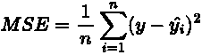
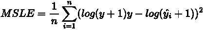
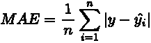
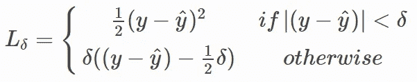
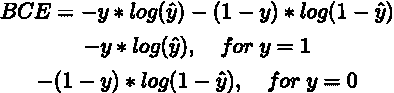
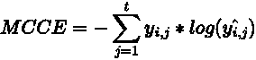
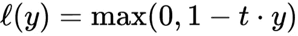

# 深度学习中常见的损失函数

> 原文：<https://medium.com/mlearning-ai/common-loss-functions-in-deep-learning-6ef47d0c3230?source=collection_archive---------3----------------------->

Photo by [Chris Ried](https://unsplash.com/@cdr6934?utm_source=medium&utm_medium=referral) on [Unsplash](https://unsplash.com?utm_source=medium&utm_medium=referral)

机器学习通过计算实际值和预测值之间的差异(误差)来学习，并旨在最小化这种计算。如果我们模型的预测偏离实际值太多，它往往会产生一个很大的数字。这个大的结果被优化函数迭代地最小化。然而，在这个故事中，我们将覆盖损失函数，而不是优化函数。

计算实际值和预测值之间差异的方法是使用损失函数。术语“**损失函数**”，也称为“**成本函数**”或“**误差函数**”，试图评估我们的算法处理数据的好坏。有各种类型的损失函数。一般我们会根据正在处理的问题进行分类，分别是**分类**和**回归**问题。

# **回归**

## -均方误差

Mean Squared Error

均方误差是回归问题中常用的损失函数。它被定义为预测值和实际值之间的**平方差**的平均值。该值将产生正值，因为该公式取减法的平方。通过这些事情(平方)，与偏差较小的预测相比，远离实际值的预测会受到严重惩罚。

**优点:**

*   以一个*二次方程*的形式，这意味着没有局部极小值，我们只得到一个全局极小值。
*   惩罚犯大错误的模型，因为我们平方它们。

**缺点:**

*   对异常值敏感或不稳健。这是由 MSE 惩罚大误差预测造成的，而异常值往往具有非常大或非常小的值。

由于 MSE 具有这一缺点，所以当处理相当大且范围广泛数据时，它将受到影响。在这种情况下，我们可以使用**均方对数误差(MSLE)** 。

Mean Squared Logarithmic Error

顾名思义，这样会先计算实际值和预测值的对数，再计算均方误差。

## -平均绝对误差

另一方面，MSE 通过对数字求平方来产生正值，而平均绝对误差(MAE)通过对其求绝对值来产生正数。MAE 计算预测值和实际值之间绝对差值的平均和。

Mean Absolute Error

**优点:**

*   与 MSE 相比，MAE 对异常值更稳健。

**缺点:**

*   计算成本高，因为它比平方误差更复杂。
*   可能存在局部最小值，因为它不是二次型。

## -胡伯损失

Huber 损失是 MSE 和 MAE 的某种组合。它先取一个二次方程，然后把它变成一个线性方程。

Huber Loss

delta 值相当于一个参数，用于考虑是使用二次方程还是线性方程。如果绝对值小于δ，将使用二次方程。否则，它将使用线性方程。换句话说，如果有异常值，绝对值将很可能大于 delta，它将使用线性方程(MAE)。使用 Hubber Loss 的关键点是选择正确的 delta 值，因为它有助于确定异常值标准。

**优点:**

*   对异常值稳健
*   如果我们设置正确的增量值，就不会有局部最优

**缺点:**

*   需要优化增量值，这是一个迭代过程

# 分类

## -交叉熵

交叉熵是分类问题中最常用的损失函数。该值随着预测概率偏离实际标签而增加。换句话说，它测量两个概率分布之间的差异。

对于**二元分类问题**，我们可以使用**二元交叉熵**。将预测的概率与实际标签(0 或 1)进行比较。当实际标签为 0 时，我们可以使用等式的后半部分，反之亦然。这种交叉熵损失基于与期望值的差异来惩罚概率。简单来说，有信心但错误的预测会受到惩罚。

Binary Cross Entropy

对于**多类分类问题**，我们可以使用**多类交叉熵**损失，也称为**分类交叉熵**。我们需要确保标签是一个热编码的，这意味着真正的标签将表示为 1，其余的表示为 0。例如，如果我们有 3 类分类问题，其中第一个实例属于 1 类，第二个实例属于 2 类，第三个实例属于 3 类，实际目标(y)可以表示为 *y=[[1，0，0]，[0，1，0]，[0，0，1]]。*

Multi-Class Cross Entropy

另一种处理多类分类问题的方法是使用**稀疏多类交叉熵**。该公式与多类交叉熵的公式相同，但是我们使用单个整数单元来表示标签，而不是一个热编码。从上一段的例子来看，实际目标(y)可以表示为*y =【1，2，3】*。

与 MCCE 相比，的优势在于计算效率更高，因为它不像热编码那样包含很多零。

**的缺点**是它不能表示一个**多标签分类**，其中每个实例可能属于不止一个类。对于这种情况，多类交叉熵将是首选。

## -铰链损耗

二进制分类的另一个损失函数，即**铰链损失**主要与 SVM 的软余量相关。该损失函数将分类边界的余量或距离合并到成本计算中。即使新的观察值被正确分类，如果决策边界的余量不够大，它们也会招致惩罚。铰链损耗增加。

Hinge loss

注意，这个损失函数使用(-1，1)标签。如果我们有一个(0，1)标签，我们可以在使用这个损失函数之前改变它。如果实际值和预测值有差异，我们将会损失惨重。

# 摘要

我们已经介绍了深度学习中一些常用的损失函数。对于回归问题，MSE 是常用的，但它遭受离群值。另一方面，与 MSE 相比，MAE 对异常值更鲁棒，但是它的计算开销更大。Huber loss 提供了一个可以处理这两个问题的解决方案，因为它是 MSE 和 MAE 的组合。

对于二叉分类问题，通常使用二叉交叉熵损失。对于多类分类问题，可以使用多类交叉熵损失。但是，如果我们为了计算成本而避免许多零值，我们可以使用稀疏多类交叉熵，它采用整数而不是一个热编码值。然而，如果我们有一个多标签分类问题，我们可以使用多类交叉熵，因为稀疏多类交叉熵不能处理它们。

参考资料:

*   [https://heart beat . comet . ml/5-regression-loss-functions-all-machine-learners-should-know-4fb 140 e 9 D4 b 0](https://heartbeat.comet.ml/5-regression-loss-functions-all-machine-learners-should-know-4fb140e9d4b0)
*   [https://ml-cheat sheet . readthedocs . io/en/latest/loss _ functions . html #交叉熵](https://ml-cheatsheet.readthedocs.io/en/latest/loss_functions.html#cross-entropy)
*   [https://www.tensorflow.org/api_docs/python/tf/keras/losses](https://www.tensorflow.org/api_docs/python/tf/keras/losses)

感谢阅读！

 [## Mlearning.ai 提交建议

### 如何成为 Mlearning.ai 上的作家

medium.com](/mlearning-ai/mlearning-ai-submission-suggestions-b51e2b130bfb)