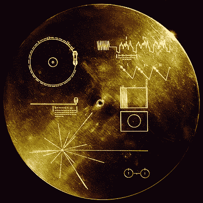

# 与数据交流:数据科学的写作艺术

> 原文：<https://medium.com/mlearning-ai/communicating-with-data-the-art-of-writing-for-data-science-dfff50d8c985?source=collection_archive---------5----------------------->

## 黛博拉·诺兰和萨拉·斯托特的新书

The Voyager Golden Record (Wikipedia)

这是两位伯克利同事主动热情推荐的新书。数据科学也许在以下意义上是独一无二的。物理学家写技术论文给其他物理学家阅读，化学家、数学家或者……相比之下，数据科学家需要将特定领域的分析结果传达给熟悉该领域但缺乏数据科学技术和局限性的详细知识的读者。
因此，有效的“与数据沟通”在数据科学中比在其他学科中更重要，也更具挑战性。

你可能担心一本 300 页的“技术写作”教科书会相当枯燥无味。但是没有！它提供了广泛的范围，从组织的概念概述，到图形和伪代码的呈现，到个别句子和单词的详细分析。一个反复出现的主题是，一个人应该通过批判性地阅读别人写的东西来学习如何写作。这本书提供了如何做到这一点的明确指导，并附有许多例子。

一个值得注意的章节说明了从故事板开始的方法——“一个通知正式书面大纲的视觉大纲”。他们写道

> 视觉大纲的主要目标是识别叙述。存在什么问题？我们做了什么来解决这个问题？为什么我们解决了这个问题很重要？在我们确定了故事并尝试了细节的顺序之后。通过重新安排情节和文本摘要，我们可以建立一个正式的大纲来讲述我们已经确定的故事。

他们的一些“句子和单词”的例子是

使用一致的术语:

> 我们通常使用“大约”这个词来指代那些以整体单位自然测量的不精确的量，而我们保留“近似”这个词用于以分数给出的测量。

不要过度使用陈词滥调，比如

> 我们通过分位数-分位数图来拟合分布。

不要错配单词，比如

> 受访者的自我选择增强了偏见。

虽然主要集中在为技术期刊写作，但有一章讨论了为“更广泛的公众”——博客或新闻稿——写作
，媒体读者会发现将这本书的建议与媒体本身的建议进行比较很有趣。

任何从事技术写作的数据科学人员都将受益于这本书。