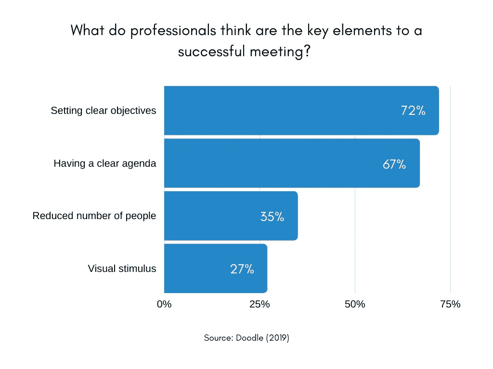
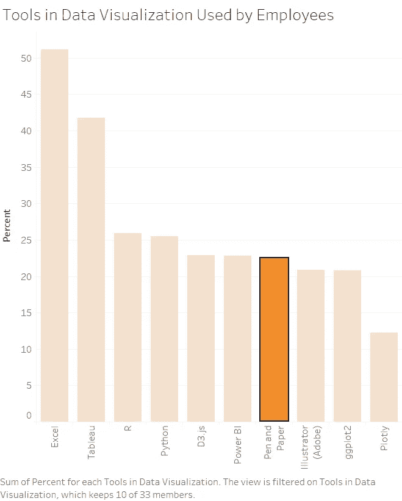
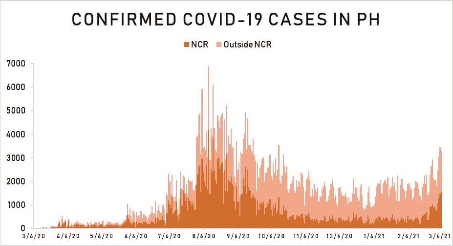

# 公司和数据可视化

> 原文：<https://medium.com/mlearning-ai/companies-and-data-visualization-2fc98ccedb70?source=collection_archive---------7----------------------->

—公司是否应该考虑数据可视化？

**数据可视化**是以图形、图表或其他可视化格式表示数据或信息，用于推动行动、提供信息，最重要的是用于说服。

公司应该追求数据可视化吗？让我们讨论一下数据可视化的好处，我希望它能帮助您决定是否考虑数据可视化。

# 1.更少的会议时间消耗

**会议**是公司里那些**双刃剑**可以是资产也可以是负债。根据去年 2020 年 6 月 17 日发表的文章，题为[会议记录(浪费):50 个令人震惊的会议统计](https://www.booqed.com/blog/minutes-wasted-of-meeting-50-shocking-meeting-statistics)，一个会议将持续 **90 分钟**，每周进行 **17 次**。

**时间**就是**金钱。浪费在不必要和没有成效的会议上的时间等同于浪费金钱。**

在数据可视化中，考虑时间是因为它将**强调**最重要的数据，并且将仅限于决策所需的信息。没有数据可视化的会议的问题在于，大部分时间都浪费在对演示意图的澄清、不充分的图表、超载的不必要信息以及所要求的行动与所提供信息的关系上。

**数据可视化**是针对特定受众的，保持简洁明了，以便于理解要传达的信息。当然，当应用数据可视化时，会议可以更快地结束。

# 2.新见解的识别

**数据可视化**可能也需要探索性的数据分析，只有通过可视化，我们才能了解数据之间的关系。

例如，您的公司正计划从传统管理过渡到完全无纸化管理。数据显示，贵公司超过 50%的员工使用 MS Excel 进行数据可视化。

Sample Made using Tableau

但是你注意到超过 20%的员工使用笔和纸作为数据可视化的工具。公司可能会考虑到这一点，因为这可能会影响员工的生产力。

# 3.有助于规划和报告

由于数据可视化通常提供新的有趣的见解，它非常有用，尤其是在商业计划和报告方面。拥有可靠的资源来支持你的报告和提议在任何行业都是非常有用的。

举个例子，2021 年 3 月 11 日，数据分析师 Edson C. Guido 先生在他的 Twitter 账户上发布了菲律宾确诊的新冠肺炎病例数。如下图所示:

最初，您会确定出现大量新冠肺炎病例的日期。此外，你还应该担心 2021 年 2 月 6 日至 2021 年 3 月 6 日的趋势。了解了这一点，你就可以提前计划该地区新冠肺炎病例增加的可能影响。也许重新安排你去 NCR 的行程。

同样的事情在办公室里，如果你实施了**数据可视化**并且你有 it 专家，你可以提前计划预防措施和突发事件。

# 4.营销

是的，市场营销。如前所述，**数据可视化**用于**说服**或说服你的观众。

例如，菲律宾电视台播放的一个电视广告使用数据可视化说服菲律宾人购买他们的产品，如下所示:

Philippine TV Commercial

更重要的是，在营销中使用数据可视化时，见解要真实、准确，要有参考或依据。

# 评论

今天的时代已经过渡到快速交易，每个人的时间都非常重要。做出正确和准确的决策意味着公司更大的潜在利润和更低的潜在费用。我希望这将有助于您考虑在您的公司中实现数据可视化。

如有任何问题，请留言。谢谢你。