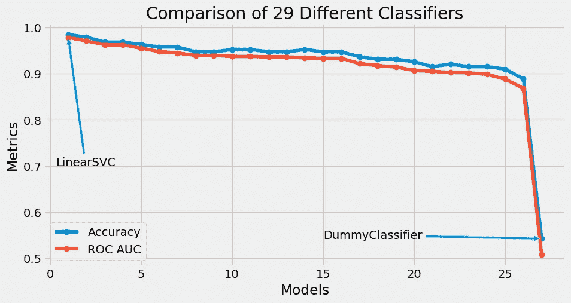
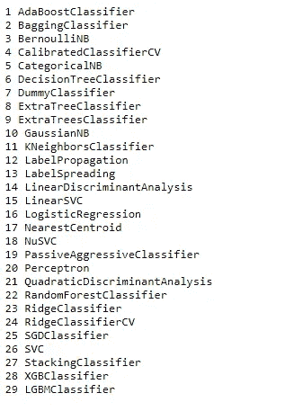
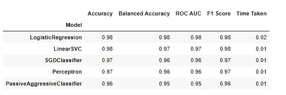

# 用一行代码比较 29 个不同的 ML 分类器— Lazypredict

> 原文：<https://medium.com/mlearning-ai/compare-29-different-ml-classifiers-with-a-single-line-of-code-lazypredict-53b7a7a1a036?source=collection_archive---------2----------------------->

> 比较来自 29 个不同 ML 分类器的不同分类度量的快速方法



# 介绍

在这篇博客中，我们将用一行代码评估 29 个不同的 ML 数据分类器的分类度量。我们将使用 Lazypredict python 库来完成这项任务，稍后将可视化我们的结果。

# 导入库

我们将首先在我们的环境中安装 Lazypredict 库。这可以在 pip 包安装程序的帮助下完成。

```
pip install lazypredict 
```

接下来，我们将导入数据处理和可视化所需的库。

```
import lazypredict 
from lazypredict import Supervised 
from lazypredict.Supervised import LazyClassifier
import matplotlib.pyplot as plt 
from sklearn.model_selection import train_test_splitplt.style.use('fivethirtyeight')
plt.rcParams["figure.figsize"] = (10,5)
```

# 资料组

我们将使用 sklearn.datasets 库中的乳腺癌分类数据集。数据集有 2 个分类标签，分别为恶性、良性癌症的 1 和 0。然后，我们将把数据分成测试集和训练集。

```
from sklearn.datasets import load_breast_cancer
data = load_breast_cancer()X = data.data
y = data.targetX_train, X_valid, y_train, y_valid = train_test_split(X, y,test_size=.5,random_state =12)
```

# **列出所有可用的分类器**

现在，我们将列出 lazypredict 库中所有可用的分类器。

```
for i in range(29):
    print(i+1, lazypredict.Supervised.CLASSIFIERS[i][0])
```

我们得到以下 29 个分类器:



List of available classifiers

# 训练和拟合模型

现在，我们将创建之前导入的 LazyClassifier 模型，并将我们的训练和验证数据放入该模型中

```
clf = LazyClassifier(verbose=0,
                     ignore_warnings=True,
                     custom_metric=None,
                     random_state=12,
                     classifiers='all',
                    )
models,predictions = clf.fit(X_train, X_valid, y_train, y_valid)
```

训练在 1.78 秒内完成，所有指标都存储在*模型*数据框架中。数据框架包含模型的名称、各种分类指标，如准确度、平衡准确度、ROC AUC 分数、F1 分数和训练所用的时间。

# 前 5 名分类器

我们现在将看到前 5 个分类器和所有分类指标。对于数据帧的前 5 行，我们将调用 models.head(5)



Top 5 Classifiers

# 可视化结果

现在，我们将绘制一个图表，用于可视化所有模型的准确性和 ROC AUC 得分。

```
idx = [i for i in range(1,28)]
plt.plot(idx, models["Accuracy"]  ,marker='o' , label = "Accuracy" )
plt.plot(idx , models["ROC AUC"] , marker ='o' , label = "ROC AUC")plt.annotate(models.index[1] , 
             (1,models["Accuracy"][1]) , 
             xytext  =(0.3, 00.7),
             arrowprops = dict(
                               arrowstyle = "simple"
                              ))
plt.annotate(models.index[26] , 
             (27 , models["Accuracy"][26]) , 
             xytext  =(15, models["Accuracy"][26]),
             arrowprops = dict(
                               arrowstyle = "simple"
                              ))
plt.xlabel("Models")
plt.ylabel("Metrics")
plt.title("Comparison of 29 Different Classifiers")
plt.legend()
plt.show()
```

我们得到下面的图表:


Accuracy / ROC AUC score vs Classifiers

# 结论

我们已经用一行代码成功地评估了 29 个不同的分类器。所选模型的超参数调整可以进一步改善结果。

我希望你喜欢它。

这个博客的代码和训练模型可以在这里获得——[https://github . com/sanskar-hasi ja/lazy predict/blob/main/Classification/lazy predict % 20 Classification . ipynb](https://github.com/sanskar-hasija/lazypredict/blob/main/Classification/LazyPredict%20Classification.ipynb)