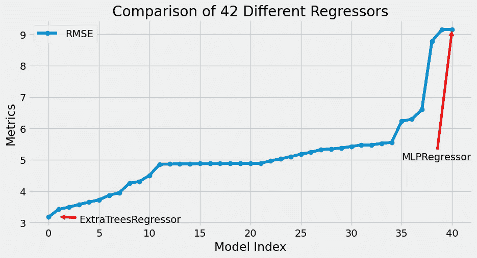
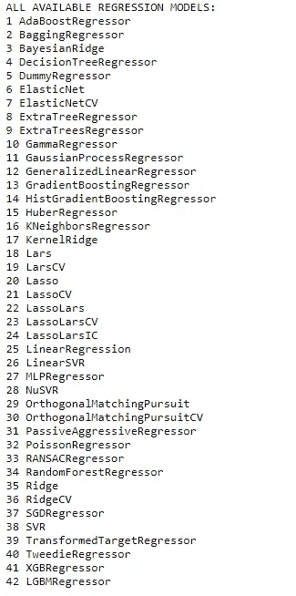
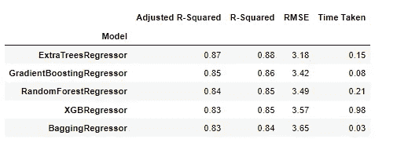
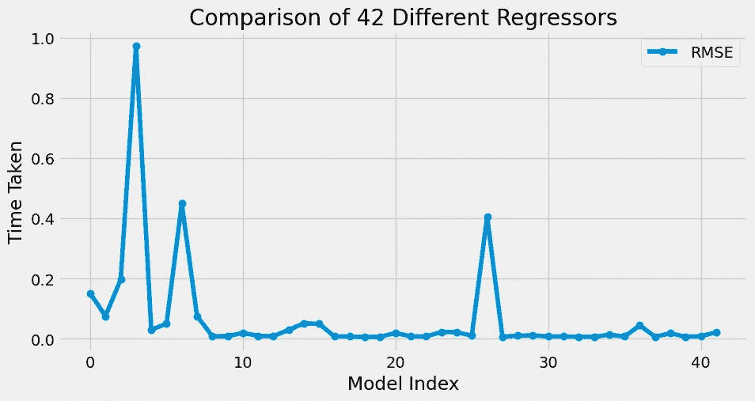

# 用一行代码— Lazypredict 比较 42 个不同的 ML 回归变量

> 原文：<https://medium.com/mlearning-ai/compare-42-different-ml-regressors-with-a-single-line-of-code-lazypredict-533f93f21eea?source=collection_archive---------0----------------------->

> *比较来自 42 个不同 ML 回归元的不同回归指标的快速方法*



# 介绍

在我的上一篇[博客](/mlearning-ai/compare-29-different-ml-classifiers-with-a-single-line-of-code-lazypredict-53b7a7a1a036)中，我讨论了用一行代码在 29 个不同的 ML 分类器上评估分类度量。

在这篇博客中，我们将用一行代码评估 42 个不同的 ML 回归变量的回归度量。我们将使用 Lazypredict python 库来完成这项任务，稍后将可视化我们的结果。我们将使用 Lazypredict python 库来完成这项任务，稍后将可视化我们的结果。

# 导入库

我们将首先在我们的环境中安装 Lazypredict 库。这可以在 pip 包安装程序的帮助下完成。

```
pip install lazypredict
```

接下来，我们将导入数据处理和可视化所需的库。

```
import lazypredict 
from lazypredict import Supervised 
from lazypredict.Supervised import LazyRegressor
import numpy as np
import matplotlib.pyplot as plt
from sklearn.datasets import load_boston
from sklearn import datasets
from sklearn.model_selection import train_test_splitplt.style.use('fivethirtyeight')
plt.rcParams["figure.figsize"] = (10,5)
```

# 资料组

我们将使用 sklearn.datasets 库附带的波士顿房价检测数据集。数据集有一个用于价格预测的输出标签。然后，我们将把数据分成测试集和训练集。

```
data = load_boston()X = data.data
y = data.targetX_train, X_valid, y_train, y_valid = train_test_split(X, y,test_size=.33,random_state =12)
```

# 列出所有可用的回归变量

现在，我们将列出 lazypredict 库中所有可用的回归变量。

```
print("ALL AVAILABLE REGRESSION MODELS:")
for i in range(42):
    print(i+1, lazypredict.Supervised.REGRESSORS[i][0])
```

我们得到以下 42 个回归量:



List of available regressors.

# 训练和拟合模型

现在，我们将创建之前导入的 LazyRegressor 模型，并将我们的训练和验证数据放入该模型中

```
reg = LazyRegressor(verbose=0,
                     ignore_warnings=True,
                     custom_metric=None,
                     random_state=12,
                     regressors='all',
                    )
models,predictions = reg.fit(X_train, X_valid, y_train, y_valid)
```

训练在 2.93 秒内完成，所有指标都存储在*模型*数据框架中。数据框架包含模型的名称、各种回归指标，如调整后的 R 平方、R 平方、RMSE 和耗时。

# 前 5 个回归变量

我们现在将看到前 5 个回归变量及其所有回归指标。对于数据帧的前 5 行，我们将调用 models.head(5)



Top 5 Regressors

# 可视化结果

现在，我们将使用两个不同的曲线图来分别显示所有模型的 RMSE(均方根误差)和时间。


RMSE vs Model Index



Time taken vs Model Index

# 结论

我们已经用一行代码成功地评估了 42 个不同的回归变量。所选模型的超参数调整可以进一步改善结果。

我希望你喜欢它。

这篇博客的代码和训练模型可以在这里获得—[https://github . com/sanskar-hasi ja/lazy predict/blob/main/Regression/lazy predict % 20 Regression . ipynb](https://github.com/sanskar-hasija/lazypredict/blob/main/Regression/LazyPredict%20Regression.ipynb)