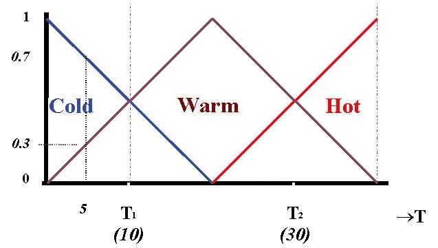

# 将新的分类方法与现有的方法进行比较。

> 原文：<https://medium.com/mlearning-ai/compare-a-new-method-of-classification-with-methods-that-already-exist-3109f4f27150?source=collection_archive---------3----------------------->

我在卡山大学的学士论文，导师是 Vahidipour 博士，是关于分类和预测的新算法。本项目主要比较不同分类方法的能力和准确性。它将它们与用遗传算法和模糊逻辑开发的方法进行比较。我们在这个项目中使用 python 和它的一些框架。对于 instense，pandas，matplotlib，sklearn。这些框架是这个领域中最好的一些框架。希望你觉得这个项目有用。

我还要感谢内金·马苏德·阿拉维博士和卡山医科大学，感谢他们给了我们这些非常有价值的数据集。

# 我们也使用这些方法

# 1.逻辑回归:

定义:逻辑回归是一种用于分类的机器学习算法。在该算法中，描述单次试验可能结果的概率使用逻辑函数建模。

优点:逻辑回归就是为此目的而设计的(分类)，对于理解几个自变量对单个结果变量的影响最有用。

缺点:仅当预测变量为二元时有效，假设所有预测变量相互独立，并假设数据没有缺失值。

# 2.高斯朴素贝叶斯:

定义:朴素贝叶斯算法基于贝叶斯定理，假设每对特征之间是独立的。朴素贝叶斯分类器在许多现实情况下工作良好，例如文档分类和垃圾邮件过滤。

优点:这种算法需要少量的训练数据来估计必要的参数。与更复杂的方法相比，朴素贝叶斯分类器非常快。

缺点:众所周知，朴素贝叶斯是一个糟糕的估计量。

# 3.随机梯度下降；

定义:随机梯度下降是拟合线性模型的一种简单且非常有效的方法。当样本数量非常大时，这尤其有用。它支持不同的损失函数和分类惩罚。

优点:高效且易于实施。

缺点:需要多个超参数，并且对特征缩放很敏感。

# 4.k-最近邻:

定义:基于邻居的分类是一种懒惰学习，因为它不试图构建一般的内部模型，而是简单地存储训练数据的实例。根据每个点的 k 个最近邻的简单多数投票来计算分类。

优点:该算法实现简单，对噪声训练数据具有鲁棒性，在训练数据量较大的情况下有效。

缺点:需要确定 K 的值，并且计算成本高，因为它需要计算每个实例到所有训练样本的距离。

# 5.决策树分类器:

定义:给定一个数据的属性及其类别，决策树产生一系列的规则，可以用来对数据进行分类。

优点:决策树易于理解和可视化，需要很少的数据准备，可以处理数值和分类数据。

缺点:决策树可以创建复杂的树，不能很好地概括，并且决策树可能不稳定，因为数据的微小变化可能导致生成完全不同的树。

# 6.随机森林分类器:

定义:随机森林分类器是一种元估计器，它在数据集的各种子样本上拟合多个决策树，并使用平均值来提高模型的预测准确性并控制过度拟合。子样本大小始终与原始输入样本大小相同，但样本是替换绘制的。

优点:在大多数情况下，减少过拟合和随机森林分类器比决策树更准确。

缺点:实时预测慢，难以实现，算法复杂。

# 7.支持向量机:

定义:支持向量机是将训练数据表示为空间中的点，这些点被尽可能宽的清晰间隙分成多个类别。然后，新的例子被映射到相同的空间，并根据它们落在差距的哪一边来预测属于哪个类别。

优点:在高维空间中有效，并在决策函数中使用训练点的子集，因此它也是内存高效的。

缺点:该算法不直接提供概率估计，这些是使用昂贵的五重交叉验证计算的。

更多信息请点击此链接:
[https://analyticsindiamag . com/7-types-classification-algorithms/](https://analyticsindiamag.com/7-types-classification-algorithms/)
我还要提一下，我是从这个网站上摘下每种方法的解释的。