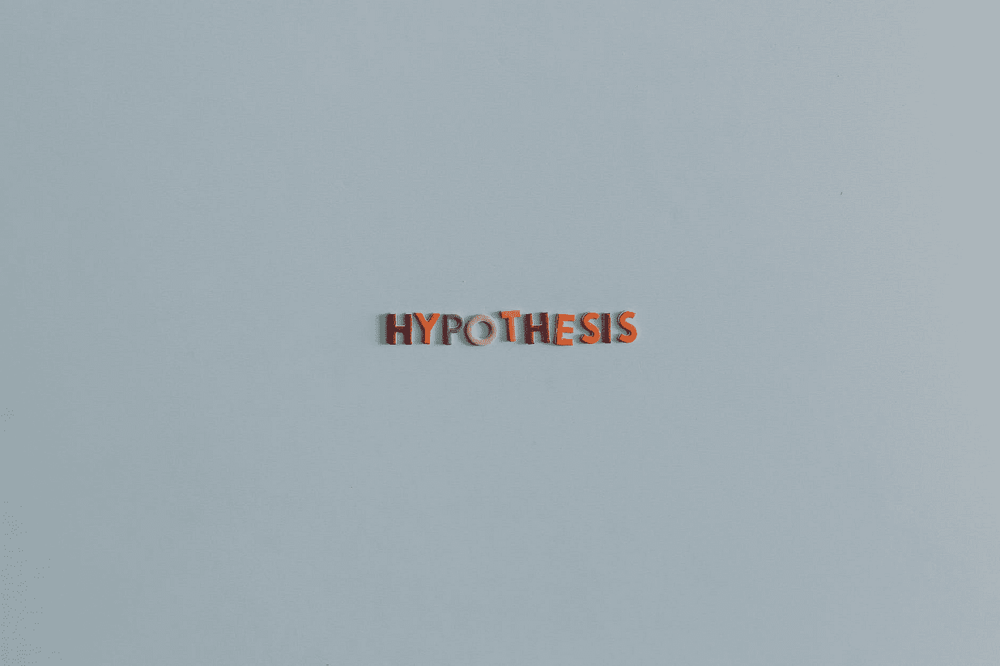
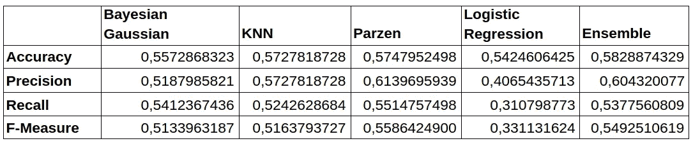
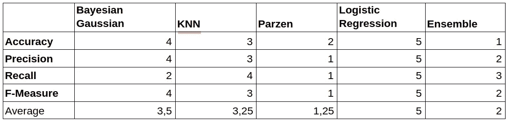
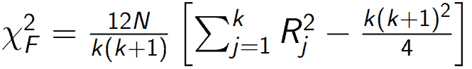
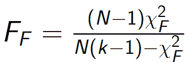
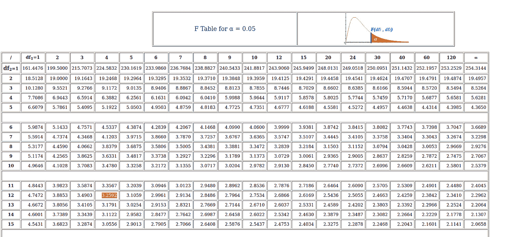
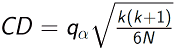
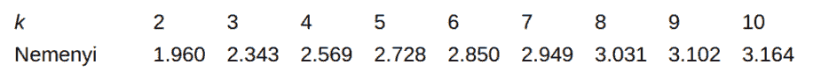

# 比较分类器(Friedman 和 Nemenyi 检验)

> 原文：<https://medium.com/mlearning-ai/comparing-classifiers-friedman-and-nemenyi-tests-32294103ee12?source=collection_archive---------0----------------------->

当我们在处理我们打算使用机器学习来解决的问题时，我们需要处理分类器。有时很容易知道一个分类器如何优于另一个分类器，例如，如果我们有两个分类器，其中一个有 80%的准确率，另一个有 50%，因此我们很容易看出第一个分类器是最好的(考虑到准确率)。然而，如果我们有许多分类器，并且它们之间的差异小于 1%，我们如何进行可靠的分析来检查它们中是否真的有一个比其他的好，或者它们是否根本没有区别？

本文的目标是一步一步地展示如何检查一个分类器是否真的比另一个好。我们将使用基本的统计数据和真实的数据集。您可以有不同的上下文，这里我们考虑五个分类器和四个指标，我们比较这些指标来进行分析。您还可以看到这样的情况，我们只有一个指标评估，但有许多[数据集](https://www.jmlr.org/papers/volume7/demsar06a/demsar06a.pdf)。

统计学的主要目的之一是检验假设。在统计推断中，我们有一个过程，从总体中抽取一个样本，并评估这个样本如何代表总体。在假设检验中，我们制定一个假设，在样本中对其进行评估，并检查该假设是否正确。

我们需要根据我们的问题(比较分类器)创建一个零假设(H₀)和一个替代假设(H₁)。两种假设都必须是简洁的陈述，是事实的两种版本。这些版本是相互排斥和详尽的(它们涵盖了所有的可能性)。在我们的案例中:

> H₀::量词是平等的。
> 
> H₁::量词是不同的。

# **比较量词**

我们的比较使用了两个测试:Friedman 和 Nemenyi。Friedman 是第一个测试，如果 H₀被拒绝(H₁被接受)，我们将使用 Nemenyi 来知道最佳分类器。这里我们有五个分类器，贝叶斯高斯、KNN、Parzen、逻辑回归和后四个分类器的集成(多数投票)。使用的数据集是[酵母数据集](https://archive.ics.uci.edu/ml/datasets/Yeast)。

# **弗里德曼试验**

为了进行弗里德曼测试，我们选择了 4 个评估指标作为我们的参考。这两个表分别显示了每个指标和排名的平均值。

Mean values of the 4 metrics (we applied Stratified K fold Validation with K = 5)

Ranking

一旦我们有了排名表，我们计算卡方，如下面的表达式:

在我们的例子中，N = 4(行数)e k = 5(分类器数)。R 是平均排名，你可以在排名表的“平均”一行看到。

一旦我们有了卡方，现在我们计算 FF:

用 FF 值，我们与评论家 f·ₖ-₁,(ₖ-₁)(ₙ-₁).值进行比较如果 FF 大于临界值，H₀必须被拒绝，在这种情况下，我们可以说我们的分类器之间有显著差异。

我们得到卡方= 13，4，FF 值为 15，46。现在我们用一个 F 表来得到评论值。注意，我们有 4 个和 12 个自由度，α为 0，05。

从上表可以看出，临界值是 32592。该值低于 FF，因此 H₀被拒绝，我们需要进行下一个测试(Nemenyi)。

# **内梅尼测试**

在 Nemenyi 测试中，我们需要获得所有分类器(比较分类器对)之间的平均排名(排名表的平均行)的差异。如果这种差异大于或等于 CD(临界距离)，我们可以说这两个分类器彼此显著不同。CD 的计算公式为:

qα项由(α = 0，05)获得:

我们的 k 是 5，所以 qα是 2728。

对于我们的分类器，只有 Parzen 和 Logistic 回归获得了高于 CD 的差异，所以我们可以说它们是显著不同的，Parzen 优于 Logistic 回归。

谢谢大家！