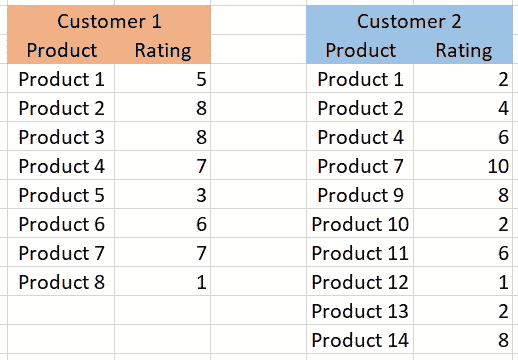
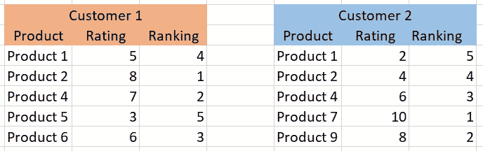
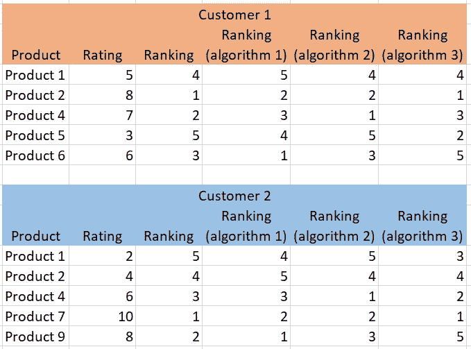
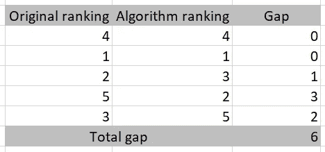
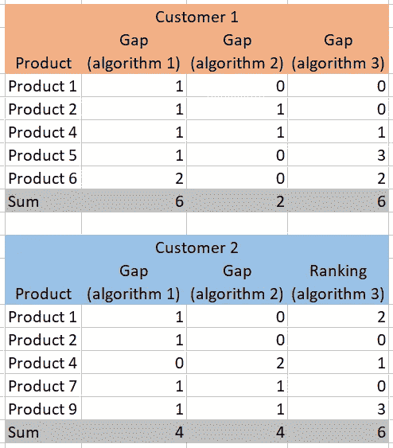
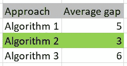

# 在单个数字尺度上比较不同类型的前 N 名推荐引擎

> 原文：<https://medium.com/mlearning-ai/comparing-different-types-of-top-n-recommendation-engines-on-a-single-numerical-scale-a0c883ae1f0a?source=collection_archive---------1----------------------->

# 介绍

***推荐引擎*** 多年来一直是一个被大量研究的话题。大量的文献综述表明，可以使用许多方法来得出前 N 条建议。从用户-用户相似性(人口统计过滤、协作过滤)来寻找相似的客户，到项目-项目相似性(基于内容、基于文本、基于评级)来寻找与客户喜爱的项目相似的项目， ***每种方法都使用不同的度量标准*** 以不同的尺度对顶级产品进行排名。

现在，每个算法都有自己的评估 KPI，它通常基于它试图估计/优化的内容。但是，如果我们想要 ***比较非常不同的方法*** 的结果，比如关联规则挖掘和矩阵分解，该怎么办呢？我们肯定可以在真实场景中测试它们，但有时 ***A/B 测试一切是不可行的*** 。在本文中，我们将探索一种简单的 ***理论方法来比较不同推荐算法的*** (基于不同的 KPI)。

# 概念演示

任何为每个客户给出产品排名的 ***逻辑都有可能成为推荐引擎*** 。即使中间的步骤不够好，最终的排名才是最重要的。在协同过滤的情况下， ***即使预测的评分不准确，只要这些能够对产品进行合适的排名*** (它们的相对位置准确)我们就是好的。这个想法构成了进一步论证的逻辑的基础。

假设我们有一些 ***客户，他们每个人都在 1 到 10*** 的范围内对一定数量的产品进行了评分。产品的数量可能因客户而异，但让我们假设他们每个人都给出了最低数量的评级 ***。下图显示了几个客户的评级示例，他们对一些常见产品和一些不同产品进行了评级。***

Sample ratings of products by two customers

现在，对于每个客户，我们将从 ***中挑选固定数量的产品，用于测试*** ，并将它们分开。假设我们每个人拿五个，但是这些因顾客而异。然后，我们 ***按照每位客户*** 的评分降序排列。为了让我们 ***能够对它们进行排名，我们应该确保选择不同评级的产品*** 。下图显示了同样的两个客户，所选产品附有排名。实际上，通过 python 这样的编程语言来实现这一点要方便得多。

Original ranking of products by the two customers

现在，我们运行我们的推荐算法。大多数 ***算法会对每个产品*** 附加某种评分，用于对它们进行优先排序，并挑选出前几个。基于这个分数，我们可以为每个客户的每个产品附加一个 ***相对排名*** 。然后，可以将该算法的排名与实际评级的原始排名进行比较。让我们假设下面的图像显示了来自相同的两个客户的 3 种不同算法的排名。

Hypothetical rankings of products for each customer from three algorithms

现在，来自算法的产品的 ***排名应该尽可能地类似于使用产品的实际评级的产品的原始排名*** 。对于每个算法，我们可以计算每个客户的排名差距，如下所示。

Gap calculation for customer 1, algorithm 3

现在，我们可以为每个算法 计算 ***跨客户的平均总差距。这个最终值 ***可以针对任何 SKU 优先级算法进行计算，而不考虑其使用的度量*** ，作为我们的比较 KPI。 ***数值越低，算法越好*** 。如果我们仅基于这两个客户做出决策，下面的两幅图展示了 KPI 对于每个算法的表现。***

Total gaps in rankings, for each customer, for each algorithm

Average gap (final KPI) for each algorithm

我们可以看到 ***算法 2 的差距*** 平均值最小。因此，按照我们的方法，这是最好的算法。在实际问题中，这一平均值将适用于更多的客户。

# 结论

比较基于不同算法的推荐引擎就像 ***比较苹果和橘子。*** 每种算法都有自己的度量标准，并且总是棘手地试探性地猜测哪种更好。但是在市场上测试每一种也是不可行的。因此，在本文中，我们通过一种简单的方法得出了一个 ***KPI，该 KPI 可以通过任何提供产品排名*** 的统计或启发式方法来计算。由于这个 KPI 是 ***与任何一个 top N 推荐引擎的最终结果*** 直接相关，所以可以用它来把所有算法带到一个共同的尺度上，最终选出最好的一个。