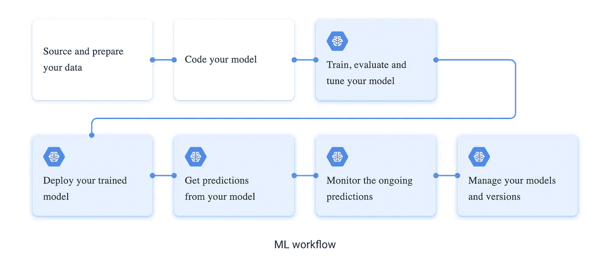
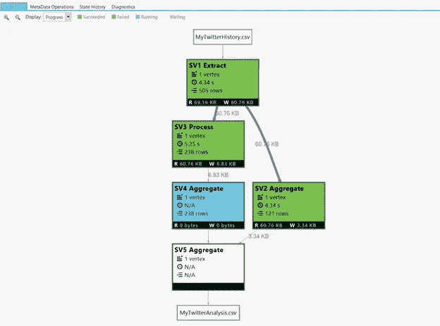
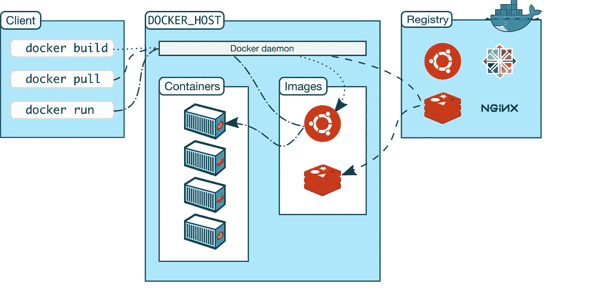

# 比较初创公司和大型科技公司的 ML 基础设施

> 原文：<https://medium.com/mlearning-ai/comparing-ml-infrastructure-at-a-startup-versus-big-tech-fde6b2d28511?source=collection_archive---------1----------------------->

在大型科技公司和初创公司工作了几年后，我想研究机器学习工程师和数据科学家在处理 ML 问题时的一些差异。在高层次上，大多数人工智能从业者都熟悉 ML 生命周期的一些变体。

[Google’s version](https://cloud.google.com/ai-platform/docs/ml-solutions-overview) of the ML workflow

这通常包括构建和管理数据集、训练和测试模型，以及在某处部署和管理模型。然而，虽然高层次的过程是普遍同意的，但在什么是最好的行动过程是实际部署你的模型并预测野外的东西上有巨大的差异。

## 大型公司的数据基础架构

最大的公司通常已经创建了巨大的内部[令人尴尬的并行](https://en.wikipedia.org/wiki/Embarrassingly_parallel)系统，这些系统能够抓取、吸收和处理整个领域的数据——想想维基百科、Quora、Reddit。为创建一个模型而处理数 Pb 的数据并不少见。使用 GPU 是一种必然，你的团队能够为你的用例采购多少 GPU 实际上取决于你的团队的谈判能力。ML 科学家/工程师正在解决的问题类型通常涉及进一步优化这个构建良好的基础设施，并致力于模型的增量但有意义的精度。

An example of a U-SQL job, which can process petabytes of data extremely fast. Pulled from [U-SQL docs](https://devblogs.microsoft.com/visualstudio/introducing-u-sql-a-language-that-makes-big-data-processing-easy/)

最大的公司经常开发他们自己的语言，专门用来优化他们系统令人尴尬的并行性。熟悉基础设施意味着掌握一些公司内部语言或学习一些你可能已经熟悉的语言的真正独特的模块。当我在微软的时候，我学习了两种独特的语言，叫做 [U-SQL 和 SC](https://docs.microsoft.com/en-us/u-sql/) OPE，它们与 C#集成在一起。使用这些语言，我可以构建一些真正高效的工作流来提取和接收数据。

为了给这些数据贴标签，通常会有数据贴标机团队和内部构建的应用程序来对这些贴标机的标签质量进行监控。除了标签，还有复杂的模型来提取关键特征以丰富数据质量。人们非常重视质量，因为当你是微软或谷歌这样的公司时，错误预测的商业成本会高得多。为了维护数据集，通常有非常好的内部工具可以跟踪数据和模型版本、超参数和指标。

在大型科技公司工作的美妙之处在于，你可以问的问题是无限的。如果你想建立自己的问答模型，你有能力在所有 Quora 的基础上创建嵌入，用 Reddit 做同样的事情，并比较你的结果。如何获取数据、标记数据以及使用什么工具来验证数据，这些挑战都由现有的流程和工具来解决。最后一点，如果没有大公司向开源世界发布他们的模型，创业公司将没有机会，整个行业的创新步伐将会大大降低。

## 初创企业的数据基础设施

与此同时，在许多初创公司，获取几千行高质量的数据需要大量的手动工作。通常，您必须给自己的数据贴上标签，并且在被要求推出 2-3 项新功能的同时，匆忙构建某种流程。在我目前工作的初创公司[祖马](https://www.getzuma.com/),[拥抱脸](https://huggingface.co/)已经成为我最好的朋友。如果你试图解决一个问题，你首先要找到最接近的预训练模型，然后创造性地尝试使它适合你的用例。

一旦你的产品、公司和团队达到一定的水平，一个过程就会开始被创建。在初创公司，更常见的是找到一个已经完成了你可能需要的工作的现有工具，而不是从头开始构建内部语言或基础设施。例如， [MLFlow](https://mlflow.org/) 和 [DVC](https://dvc.org/) 是测试、跟踪和评估你的模型的好工具。不要从头开始构建这些东西。

像构建一个主动的学习框架来改善你的反馈循环，使用业界最喜欢的工具如 Docker 和 Kubernetes，以及用 python 编写你的大部分代码都是常见的事情。通常，最好从寻找特定问题的开源解决方案开始。

Learn about Docker and containerization — ML Engineers!

在初创公司，数据积累和维护通常是一个巨大的挑战。数据科学家和 ML 工程师经常使用数据模拟技术来扩展他们的数据集。在今天的世界中，由于这个慷慨的 ML 社区，有很棒的 python 包来扩展和扰乱你的数据，包括 [*清单*](https://github.com/marcotcr/checklist) 和 [*nlpaug*](https://nlpaug.readthedocs.io/en/latest/) 。此外，您必须投入资源亲自验证您的数据质量。你有不平衡的班级吗？在基于意图的分类模型中，你的意图是否过于相似？不断验证您的数据应该是您和您的团队的首要任务。

在计算能力方面，可以从 AWS(或 Azure 或 GCP)租用 GPU。还有谷歌协作，在那里你可以免费运行一些更高级的计算实验。然而，除非你是一个专门面向 GPU 的初创公司，否则 ML 团队通常会找到创造性的方法来训练他们的模型，而不需要太多的高计算。

如果我们将这个话题与[马斯洛的需求层次](https://en.wikipedia.org/wiki/Maslow%27s_hierarchy_of_needs)联系起来，你通常会在初创公司解决低得多的问题。在初创公司工作的美妙之处在于，你可以更多地了解行业中正在使用的东西，当你没有数据或计算能力时，你可以从深层次理解构建系统的挑战。虽然你不能解决真正高难度的计算问题，但在初创公司，你有机会开发更贴近业务的有效解决方案。

 [## Mlearning.ai 提交建议

### 如何成为 Mlearning.ai 上的作家

medium.com](/mlearning-ai/mlearning-ai-submission-suggestions-b51e2b130bfb)