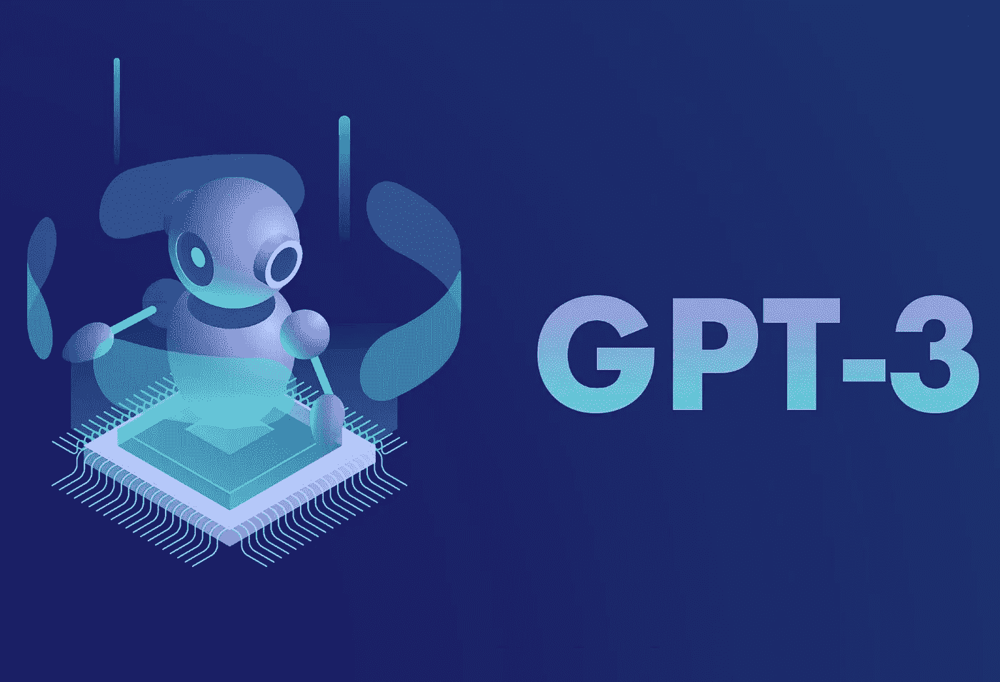

# 使用 GPT、变形金刚、快速 API 和 GCP 作为 REST API 的 ML 星座生成管道(第 1 部分)

> 原文：<https://medium.com/mlearning-ai/complete-horoscope-generation-pipeline-as-a-rest-api-using-gpt-neo-transformers-fast-api-and-gcp-1f3869cdf072?source=collection_archive---------0----------------------->

这个项目实现了一个完整的云托管的 NLP 管道，使用 Python 3 为机器学习、数据处理和 API 服务生成(希望)写得很好的星座。它使用了各种开源库，如 [Huggingface 的变形金刚](https://huggingface.co/)、 [PyTorch](https://pytorch.org/) 和 [FastAPI](https://fastapi.tiangolo.com/) 。它还有一个[小型演示网站](http://kamen.be/horoscope_codepen.html) …