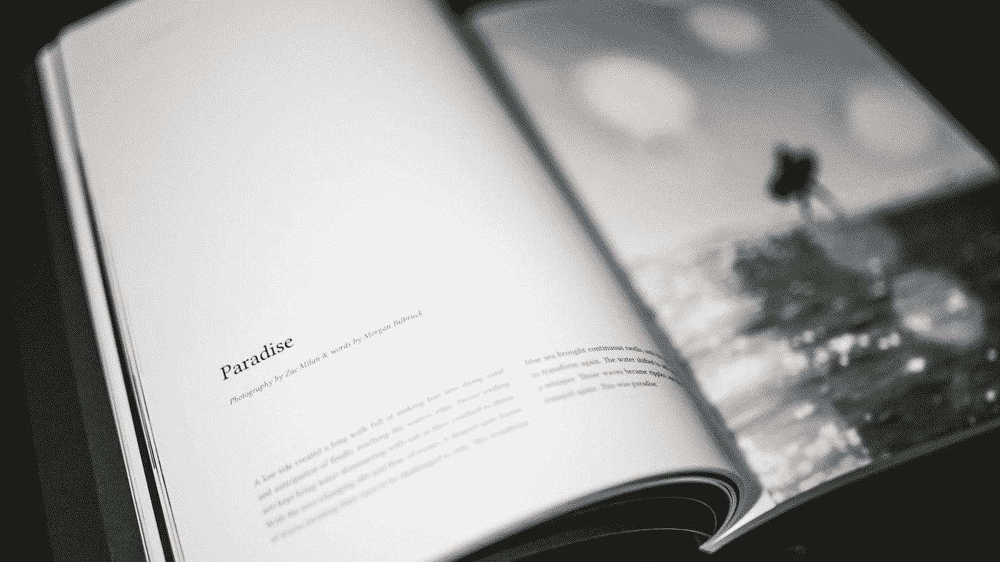

# 用这个谷歌人工智能创作一首受经典美国诗人启发的诗歌

> 原文：<https://medium.com/mlearning-ai/compose-a-poem-inspired-by-classic-american-poets-with-this-google-ai-914e9f8d4c6d?source=collection_archive---------7----------------------->

Photo by [Redd](https://unsplash.com/ja/@reddalec?utm_source=medium&utm_medium=referral) on [Unsplash](https://unsplash.com?utm_source=medium&utm_medium=referral)

我们都去过那里。你正试着写一首诗，但你似乎无法流畅地表达出来。你开始觉得你只是在用头撞墙。

你被困住了，想寻求帮助。

嗯，有一个人工智能工具可能正是你所需要的。