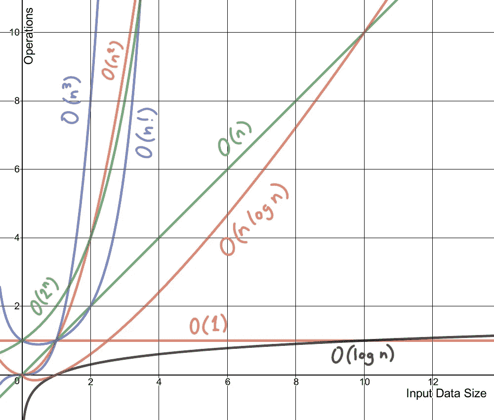

# 机器学习算法的计算复杂性

> 原文：<https://medium.com/mlearning-ai/computational-complexity-of-machine-learning-algorithms-254c275de84?source=collection_archive---------3----------------------->

人们应该问的第一个问题是什么是计算复杂性？[大英百科全书](https://www.britannica.com/)将[的计算复杂度](https://www.britannica.com/topic/computational-complexity)定义为:

> 计算复杂度是特定算法运行时消耗的计算资源(时间和空间)量的度量。

计算复杂性进一步分为两种类型的复杂性:

## **时间复杂度**

时间复杂性不是衡量一个算法或一段引入机器依赖性的代码所花费的时间，而是被创造出来的。时间复杂度是输入的函数，它消除了对机器的依赖性，并允许我们在不运行不同算法的情况下对它们进行比较。例如，具有 O(n)的算法将总是比 O(n)执行得更好，因为它的增长率小于 O(n)的增长率。

Growth rates of different time complexities.

## **空间复杂度**

如同时间复杂度是输入的函数一样，空间复杂度也是输入的函数。从概念上讲，它和时间复杂性是一样的，你只需要用空间代替时间。[维基百科](https://en.wikipedia.org/wiki/Main_Page)将[空间复杂度](https://en.wikipedia.org/wiki/Space_complexity#:~:text=The%20space%20complexity%20of%20an,algorithm%20until%20it%20executes%20completely.)定义为:

> 算法或计算机程序的空间复杂度是解决作为输入特征的函数的计算问题实例所需的存储空间量。

让我们检查不同机器学习算法的计算复杂性。边界是在算法的标题内定义的。

# 线性回归:

n=训练样本数
f=特征数

**训练时间复杂度:** O(f n+f )
**预测时间复杂度:** O(f)
**运行时间空间复杂度:** O(f)

# 逻辑回归:

n=训练样本数
f=特征数

**训练时间复杂度:** O(f*n)
**预测时间复杂度:** O(f)
**运行时间空间复杂度:** O(f)

# 支持向量机:

n=训练样本数
f=特征数
s=支持向量数

**训练时间复杂度:** O(n)到 O(n )
不同的核，训练时间复杂度不同。
**预测时间复杂度:** O(f)到 O(s*f)
对于线性核是 O(f)，对于 RBF 和多项式是 O(s*f)
**运行时空间复杂度:** O(s)

# 朴素贝叶斯:

n=训练样本数
f=特征数
c=类别数

**训练时间复杂度:** O(n*f*c)
**预测时间复杂度:** O(c*f)
**运行时间空间复杂度:** O(c*f)

# 决策树:

n=训练样本数
f=特征数
d=树的深度
p=节点数

**训练时间复杂度:** O(n*log(n)*f)
**预测时间复杂度:** O(d)
**运行时间空间复杂度:** O(p)

# 随机森林:

n=训练样本的数量
f=特征的数量
k=树的数量
p =树中节点的数量
d=树的深度

**训练时间复杂度:** O(n*log(n)*f*k)
**预测时间复杂度:** O(d*k)
**运行时间空间复杂度:** O(p*k)

# k-最近邻:

n=训练样本数
f=特征数
k= k 个最近邻

## 蛮力:

**训练时间复杂度:** O(1)
**预测时间复杂度:** O(n*f+k*f)
**运行时间空间复杂度:** O(n*f)

## kd 树:

**训练时间复杂度:** O(f*n*log(n))
**预测时间复杂度:** O(k*log(n))
**运行时间空间复杂度:** O(n*f)

# k 均值聚类

n=训练样本数
f=特征数
k=聚类数
i=迭代次数

**训练时间复杂度:** O(n*f*k*i)
**运行时间空间复杂度:** O(n*f+k*f)

 [## Mlearning.ai 提交建议

### 如何成为 Mlearning.ai 上的作家

medium.com](/mlearning-ai/mlearning-ai-submission-suggestions-b51e2b130bfb)