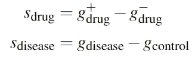
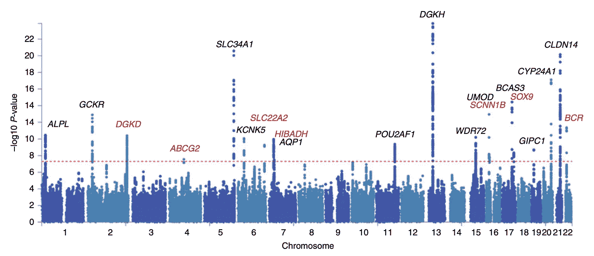
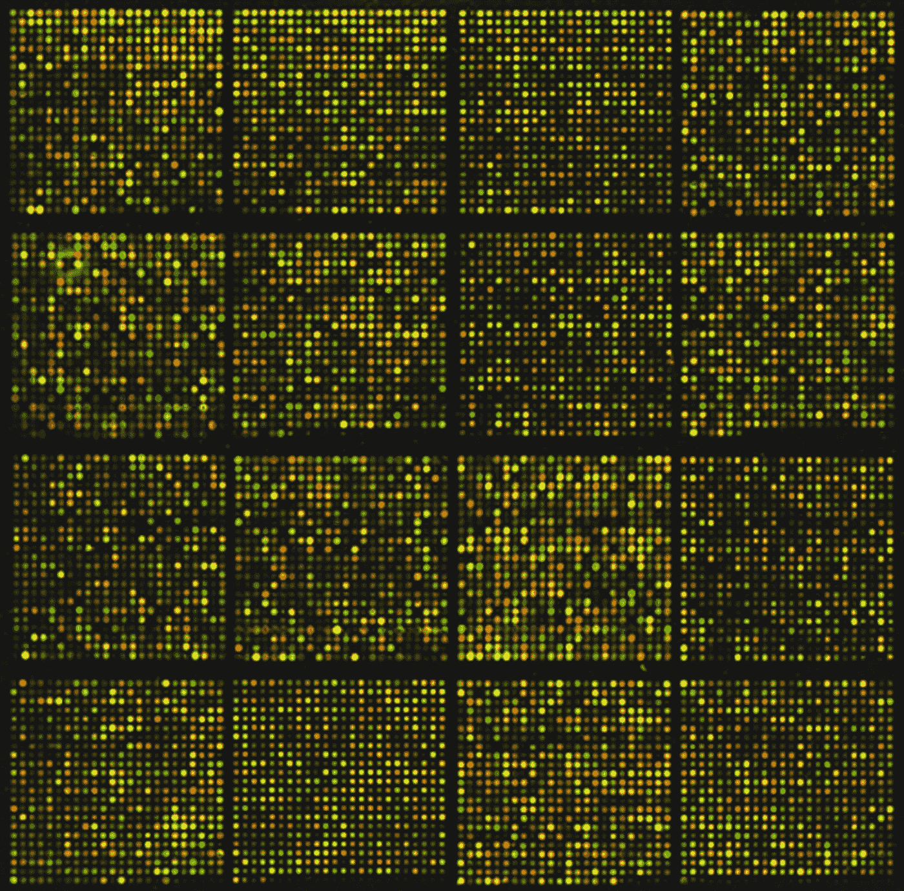
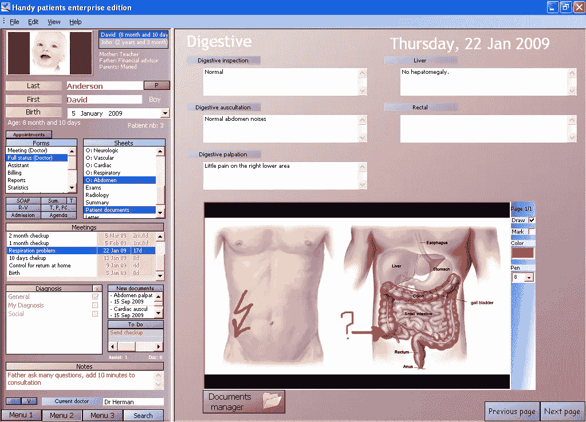

# 计算药物再利用

> 原文：<https://medium.com/mlearning-ai/computational-drug-repurposing-9a5b9235ad70?source=collection_archive---------4----------------------->

## 如何通过数据驱动的方法将旧药物重新用于新疾病

Photo by [Towfiqu barbhuiya](https://unsplash.com/@towfiqu999999?utm_source=unsplash&utm_medium=referral&utm_content=creditCopyText) on [Unsplash](https://unsplash.com/s/photos/drug?utm_source=unsplash&utm_medium=referral&utm_content=creditCopyText)

开发一种新药是一个耗时且耗资巨大的过程，可能需要长达 10~12 年的时间，平均花费 T2 20 ~ 30 亿美元。这一成本的很大一部分来源于测试化学实体的安全性和有效性，这些测试产生了宝贵的数据，而这些数据往往没有得到充分的研究。药物再利用旨在挖掘和利用先前试验的现有数据，为这些化合物寻找新的潜力。这种方法的一个优点是，由于化合物已经过测试(例如在临床试验中)，它们通常需要较少的安全性甚至功效试验，从而为制造商节省了大量的时间和金钱(平均减少到估计 **5~7 年**和**3 亿美元**)，并更快地到达有需要的患者。

一个最突出的例子是辉瑞公司将最初作为抗高血压药物开发的西地那非重新用于治疗勃起功能障碍(ed)的伟哥。这一成功体现在其 2012 年占 ed 药物市场 47%的市场份额，其全球销售额总计 20.5 亿美元。

为了推断旧药物的新用途，通常学习药物的直接表示或间接的成对距离。熟悉的数据来源包括**组学**(转录组学、蛋白质组学或代谢组学，分别记录 RNA 转录物、蛋白质和代谢物)**化学机制和电子健康记录(EHR)** 。这些可以单独或组合起来定义感兴趣实体的“**签名**”(或 ML 术语中的矢量/张量)，包括**药物**、**疾病、**，以及在某些情况下，如果疾病没有被很好地定义(例如阿尔茨海默氏病)、**症状**(或表型)。一旦学习了这些量的有效特征，我们就可以在其中找到**匹配**:药物-药物匹配将告诉我们药物之间的相似性和差异，而药物-疾病或药物-症状匹配可以告诉我们药物对特定疾病或症状的潜在影响。

在本文中，我们将研究一些数据驱动的方法，这些方法已被应用于解决药物再利用的问题。

Photo by [National Cancer Institute](https://unsplash.com/@nci?utm_source=unsplash&utm_medium=referral&utm_content=creditCopyText) on [Unsplash](https://unsplash.com/s/photos/gene?utm_source=unsplash&utm_medium=referral&utm_content=creditCopyText)

# 组学

组学通常是指使用以-组学后缀结尾的技术收集的数据(来源)，例如 RNA 转录物的转录组学、基因变体的基因组学、蛋白质的蛋白质组学。我们将讨论文献中使用的一些启发法，这些启发法是由他们研究领域的领域知识提供的。

## 签名回复原则

指示受试者中每个基因的激活水平的基因表达谱可以从生物材料(例如细胞、组织)的组学数据中获得。我们可以比较用药前后的情况。这将评估药物对差异基因表达水平的治疗效果。类似地，我们还可以获得健康对照**和患有感兴趣疾病**的患者 **之间的基因表达水平，这将为我们提供另一个差异基因表达谱。如果治疗效果模式被认为抵消了疾病效果曲线(等式 1 中的`s_drug + s_disease = 0`)，则认为该药物可能能够逆转疾病。这也被称为**签名反转原则。****

Equation 1: The signature of the drug is calculated as the difference between the gene profiles before (-) and after (+) the application of the drug. Similarly, the signature of the disease is calculated as the difference between the differential gene profiles between the disease group and the healthy control group. (Image by author)

尽管简单，SRP 已经在人类结肠直肠 cancer⁴、心血管 diseases⁵、骨骼肌 atrophy⁶等方面显示出有希望的实验成功。

将同样的直觉应用于**药物-药物**签名匹配用例，可以识别共享的治疗应用，而不管其化学结构的相似性或不相似性。这一原则，也被称为⁷关联罪，被用于寻找类似的药物，其结果有助于找到现有药物的替代靶点和潜在的脱靶效应。在寻找 autophagy⁸的新增强剂和确定囊性 fibrosis⁹.蛋白沉积信号网络的目标方面已经取得了成功

## 全基因组关联研究

By Sarah A. Howles, Akira Wiberg, Michelle Goldsworthy, Asha L. Bayliss, Anna K. Gluck, Michael Ng, Emily Grout, Chizu Tanikawa, Yoichiro Kamatani, Chikashi Terao, Atsushi Takahashi, Michiaki Kubo, Koichi Matsuda, Rajesh V. Thakker, Benjamin W. Turney &amp; Dominic Furniss — Genetic variants of calcium and vitamin D metabolism in kidney stone disease. Nature Communications 10, 5175 (2019). [https://doi.org/10.1038/s41467-019-13145-x](https://doi.org/10.1038/s41467-019-13145-x), CC BY 4.0, [https://commons.wikimedia.org/w/index.php?curid=110859268](https://commons.wikimedia.org/w/index.php?curid=110859268)

GWAS 是研究遗传数据集的另一种常见方法，它分析整个基因组中不同个体的[遗传变异](https://en.wikipedia.org/wiki/Single-nucleotide_polymorphism)(例如[单核苷酸多态性](https://en.wikipedia.org/wiki/Single-nucleotide_polymorphism))，以确定与感兴趣的性状(例如疾病)的关联。([维基百科](https://en.wikipedia.org/wiki/Genome-wide_association_study))

已经开展了一项研究，利用 GWAS 结果寻找**不同疾病**之间**匹配的遗传变异**,以确定⁴.现有基因疗法的新治疗目标该研究发现了肿瘤坏死因子配体超家族成员 11 基因(TNFSF11)的一种疾病变体(rs2062305)，这种疾病变体存在于患有[骨质疏松症](https://www.nhs.uk/conditions/osteoporosis/)的绝经后妇女中，以及患有[克罗恩病](https://www.mayoclinic.org/diseases-conditions/crohns-disease/symptoms-causes/syc-20353304)骨质减少和骨质疏松症的患者中。这种共同性促使研究人员研究用于治疗骨质疏松性骨折高风险的 denosumab 对克罗恩病的影响，这导致了积极的实验结果。

Photo by [National Cancer Institute](https://unsplash.com/@nci?utm_source=unsplash&utm_medium=referral&utm_content=creditCopyText) on [Unsplash](https://unsplash.com/s/photos/gene?utm_source=unsplash&utm_medium=referral&utm_content=creditCopyText)

## 网络分析

遗传数据分析的另一种一般方法是将途径或网络分析应用于个体基因水平数据。这有效地将基因聚集成组，由于聚集效应，这些组与感兴趣的性状更好地相关。

标准算法包括加权基因共表达网络分析(WGCNA) ⁵，它计算每对感兴趣的基因的距离度量，并在基因图上应用层次聚类。其度量和聚类算法的选择主要是特定的，但可以用任何其他选项来替换，如 K-Means。非负矩阵分解⁶也被应用于确定基因谱的低维表示，因此提出了“特征基因”。

这些方法可以扩展前面提到的任何方法，降低维数，并集中于更小的目标集。

Photo by [Terry Vlisidis](https://unsplash.com/@vlisidis?utm_source=unsplash&utm_medium=referral&utm_content=creditCopyText) on [Unsplash](https://unsplash.com/s/photos/chemistry?utm_source=unsplash&utm_medium=referral&utm_content=creditCopyText)

# 化学

各种方法可以描述药物的化学结构，并推断药物-药物或药物-疾病的相互作用。

## 相似集成方法

[相似性集成方法](https://sea.bkslab.org/) (SEA)根据配体之间的化学相似性将蛋白质联系起来，评估每种药物与每个靶标配体组的结构相似性。MDL 药物数据报告(MDDR)的一项研究表明，在确定 23 种新的药物靶点组合方面取得了令人鼓舞的结果，并表明美沙酮、依米丁和洛哌丁胺(伊莫定)可能分别拮抗毒蕈碱 M3、α2 肾上腺素能和神经激肽 NK2 受体。这些建议随后得到了实验的证实。⁰

Photo by [Victor](https://unsplash.com/@victor_g?utm_source=unsplash&utm_medium=referral&utm_content=creditCopyText) on [Unsplash](https://unsplash.com/s/photos/docking?utm_source=unsplash&utm_medium=referral&utm_content=creditCopyText)

## 分子对接

这是指基于结构的模拟，预测配体(如药物)和靶标(如受体)之间结合位点的互补性。更具体地说，配体和靶标被迭代，并且对于每一对，对接被模拟以测试相互作用是否能够发生。然而，该方法的一个限制是，模拟运行的化学机制没有被很好地理解。因此，不同的软件实现会产生不同的结果。

然而，这种方法已被证明在发现抗寄生虫药物甲苯咪唑对血管内皮生长因子受体 2(血管生成的介质)的抑制作用方面是有效的。此外，随着蛋白质结构理解(例如 [AlphaFold](https://alphafold.ebi.ac.uk/) )和生物化学的发展，这类方法有可能变得更加强大。

By Oguntoye patients electronic medical record (free open source version), GPL, [https://commons.wikimedia.org/w/index.php?curid=8894074](https://commons.wikimedia.org/w/index.php?curid=8894074).

# 电子健康记录

**电子健康记录** ( **EHR** )被[维基百科](https://en.wikipedia.org/wiki/Electronic_health_record)定义为关于患者和人群的健康信息的数字集合，可以使用已建立的网络和交换在相关和合规的各方之间共享。数据类型各不相同，从个人统计数据、病史、[放射学](https://en.wikipedia.org/wiki/Radiology)图像到人口统计数据等。

这种数据格式在目标端提供了另一种丰富的信息，可以与其他数据类型结合来推断目标药物的特征。例如，我们将研究 EHR 的一个具体来源。

## 不良事件

不良事件(AE)是指患者或服用药品的临床研究受试者出现的任何不良医疗事件，与本次治疗没有必然的因果关系。([维基百科](https://en.wikipedia.org/wiki/Adverse_event#:~:text=An%20adverse%20event%20(AE)%20is,causal%20relationship%20with%20this%20treatment.))不良事件的特征匹配基于一种假设，即导致**相同不良反应**的两种药物可能作用于**共同的靶点或蛋白质或相同的途径**。这也适用于药物的不良事件与疾病具有相同表型的情况，这表明药物可能与疾病具有相同的生理学。

从经验上看，这种信息来源缺乏明确的标准，这意味着相同的不良事件在不同的报告中可能会有不同的编码。此外，它通常依赖于其他方来评估他们所经历的负面影响，这导致了评分者的显著差异。因此，在使用这种数据源时，可能需要标准化、自然语言处理的应用、带噪声标签的学习。

Photo by [Roberto Sorin](https://unsplash.com/@roberto_sorin?utm_source=unsplash&utm_medium=referral&utm_content=creditCopyText) on [Unsplash](https://unsplash.com/s/photos/drug?utm_source=unsplash&utm_medium=referral&utm_content=creditCopyText)

# 结论

我们已经对计算药物再利用领域的现有工作进行了高水平的概述。下一步，我们将关注该领域更多的数据驱动和方法方面，以了解机器学习在该领域的应用和未来机会。

[1]尼古拉·诺桑戈。“老药换新招。”*性质*534.7607(2016):314–6。

[2]菲利普斯博士说:“辉瑞公司即将到期的伟哥专利也对其他制药商产生了不利影响。”*来自:福布斯。com* (2013)。

[3]普什帕科姆、苏迪普等，“药物再利用:进展、挑战和建议”*自然评论药物发现*18.1(2019):41–58。

[4] Hsieh，Yao-Yu 等，“将细胞周期蛋白依赖激酶抑制剂 GW8510 重新定位为核糖核苷酸还原酶 M2 抑制剂以治疗人类结直肠癌”*细胞死亡发现*2.1(2016):1–8。

[5]黄，钱红，等.“识别血管平滑肌细胞应激诱导基因引起的心血管疾病的潜在药物” *PeerJ* 4 (2016): e2478。

[6] Kunkel，Steven D .等人，“人类骨骼肌萎缩的 mRNA 表达特征确定了一种增加肌肉质量的天然化合物。”*细胞代谢*13.6(2011):627–638。

[7]蒋、安妮 p .和阿图尔 j .布特。"系统评价药物与疾病的关系，以确定新药应用的先导."*临床药理学&治疗学*86.5(2009):507–510。

[8] Iorio，Francesco，等，“从药物网络分析中识别增强自噬功能的小分子。”*自噬*6.8(2010):1204–1205。

[9] Hegde，Ramanath Narayana，等，“解开控制 F508del-CFTR 蛋白沉积的药物信号网络” *Elife* 4 (2015): e10365。

[10] Keiser，Michael J .等人，“预测已知药物的新分子靶点”*性质*462.7270(2009):175–181。

[11]达德利、乔尔·t、塔兰吉尼·德什潘德和阿图尔·j·布特。"利用药物-疾病关系进行计算药物重新定位."生物信息学简报 12.4(2011):303–311。

[12] Kitchen，Douglas B .等人，“药物发现虚拟筛选中的对接和评分:方法和应用”《自然评论药物发现》3.11(2004):935–949。

[13] Dakshanamurthy，Sivanesan 等人，“使用蛋白化学计量方法预测已批准药物的新适应症。”*药物化学杂志*55.15(2012):6832–6848。

[14] Sanseau，Philippe 等，“利用全基因组关联研究进行药物重新定位。”*自然生物技术*30.4(2012):317–320。

[15]张、宾和史蒂夫·霍瓦特。“加权基因共表达网络分析的一般框架。”*遗传学和分子生物学中的统计应用* 4.1 (2005)。

[16]吴，司琪，等.“稳定性驱动的非负矩阵分解解释空间基因表达和构建局部基因网络”*美国国家科学院院刊*113.16(2016):4290–4295。

 [## Mlearning.ai 提交建议

### 如何成为 Mlearning.ai 上的作家

medium.com](/mlearning-ai/mlearning-ai-submission-suggestions-b51e2b130bfb)